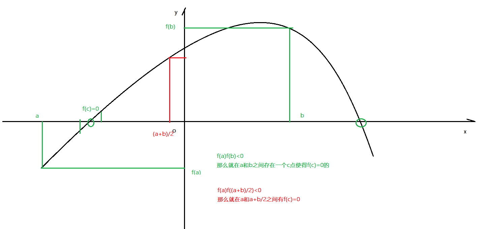

# SparkMllib的基础

## 1-回顾

* 需要明确：需要有**机器学习的理论基础**(机器学习-统计学习方法)才能具备SparkMllib的学习能力
* 理解为什么要学习机器学习，机器学习或人工智能和大数据有什么区别和联系
* 数据、大数据、数据分析、数据挖掘、模式识别
* 机器学习和人工智能有什么关系？

## 2-重难点知识

* 1-机器学习和大数据的区别和联系？
* 2-机器学习在大数据架构中的位置(大数据项目)
* 3-人工智能的发展史
* 4-人工智能应用场景
* 5-什么是机器学习
* **6-机器学习数据集概述(必须掌握)**
* 7-机器学习分类
* 8-如何构建机器学习模型？
* 9-如何评价模型？
* 10-成熟的机器学习库(**SparkMllib**)

## 1-机器学习和大数据的区别和联系？

* 面试中CTO面试过程中经常询问你对大数据时代理解，数据重要性理解，不同行业数据分析理解

* 究竟什么是大数据？
  * 大数据4V特征
  * **数据量大**：数据呈现指数级别增长(KB-MB-GB-TB-PB-ZB=1024倍=2**10)
    * 数据存储：
      * MySQL(传统的数据因为数据量增加纵向增加内存或磁盘)
      * 大数据存储和计算：HDFS和MR
        * 实质是根据数据量的增长和计算需求，横向的拓展，通过网络将若干台PC机连接在一起构建分布式存储和分布式计算
        * 计算：MR(第一代)----Hive(MR)-----Spark（DAG）----Flink(批流统一)
  * **数据种类多**
    * 结构化：MySQL，Oracle
    * 半结构化：JSon、XML、HTML
    * 非结构化：文本，视频，音频
    * 处理数据的思路就是要将非结构化和半结构化数据转为结构化在利用大数据分析
    * 存储：HDFS中
    * 计算：MR(第一代)----Hive(MR)-----Spark（DAG）----Flink(批流统一)**数据种类多**
  * **速度快**
    * 数据增长速度快：数据呈现指数级别增长
    * 数据处理速度快：数据从离线--近实时-实时
    * 大数据也能劫夺
  * **价值密度低**--机器学习
    * 有价值的数据变多了
    * 有价值的数据的密度=有价值的数据/全量的数据
    * 分母的变换一定比分子的变换速度要快
    * 需要利用**机器学习或数据挖掘**从大量的数据中发现或挖局出有价值的信息
* 大数据处理的是大量数据的存储和计算统计，但是如果要从大量的数据中发现或挖掘出有价值的信息，需要依靠机器学习构建机器学习模型，通过机器学习模型对现实事件作出预测和分析。

## 2-机器学习在大数据架构中的位置(大数据项目)

* 以项目为主展开-----电信日志分析系统
* **项目名称：**电信日志分析系统
* **项目描述：**以电信用户上网所产生的的数据，包括上网日志数据和安全日志数据(**数据来源)**，通过Hadoop技术栈完成日志数据的入库、处理、分析、查询、实时查询等场景(**技术栈**)，达到了异常IP的检测，违规违法用户处理、关键词过滤等业务(**业务场景**)，整个项目的数据量在1T-20T不等的(**数据量**)，集群规划是在10台到100台不等( **集群规划**)。
* **项目职责：**
* 项目架构：
  * 一个大数据项目应该具备哪些架构---注重的是数据的流向
  * **1-数据采集**：ftp方式
  * **2-数据存储**：HDFS
  * **3-ETL**：MR
  * **4-分析**：Hive-Impala-Hbase-Spark
  * 机器学习或人工智能
  * **5-可视化**-Echarts(SSM)
* 
* 项目困难：
  * 数据分析的困难？
  * 以一条业务线展开
* 项目优化：
  * 业务不变的情况下，技术是可以迭代更新的
* 数据如何计算：
* 1-选择一个网站
* 2-如何计算？
  * 1-梳理出大概有多少PV----100万
  * 2-一条日志数据有多大----假设1K
  * 3-1K的数据大概字段在60-80个之间，每个字段大概有10-20汉字
  * 4-如上得到的数据量1G
* 3-通过https://alexa.chinaz.com/查看PV量

## 3-人工智能的发展史

* 
* 1956年AI
* 第一次人工智能浪潮：跳棋
* 第二次人工智能浪潮：国际象棋
* 第三次人工智能浪潮：围棋(19*19列，3**361状态，状态数目比宇宙中的原子数目都会大)、
  * alphago解决围棋的问题
* 

## 4-人工智能应用场景

* 
* 机器学习&人工智能&深度学习有什么区别和联系？
  * 
  * 机器学习是人工智能的一个分支，除了这个分支还有数据挖掘，，模式识别分支
  * 深度学习是实现机器学习的一种方法，深度学习是为了解决机器学习在图像或语音等方面不足而提出的
* 数据？数据分析？数据挖掘？模式识别？
  * 数据：观测值或测量值(身高，体重)
  * 信息：身高搞，身高低
  * 数据分析：从数据到信息的数据处理、加工的过程称之为数据分析
  * 数据价值化：从信息中提取有价值的信息
  * 数据挖掘：提取有价值数据的过程
  * 数据挖掘是一件事情，而机器学习是一种方法，利用机器学习这种方法解决数据挖掘这件事情
  * 模式识别也是一件事情，就是图像识别或语音识别，利用机器学习解决模式识别这件事情
* 完整
* 
* 各技术点的区别和联系
* 

## 5-什么是机器学习

* 人类学习--大脑--听说读写---经验---根据经验判断
* 机器学习--Cpu&Gpu(Gpu的处理速度是Cpu的十倍及以上)----数据-----算法-----模型---预测
* 什么是机器学习？
  * 机器学习是致力于通过Cpu或Gpu的计算，结合数据通过机器学习算法构建机器学习模型，通过机器学习模型实现预测分析
  * 机器学习=数据+算法
  * 扫盲：算法有什么了解？
    * 数据结构算法：基础算法，排序，查找，树，图---------每一个从事编程行业的人都得会
      * 在面试的时候，让手撕一个冒泡排序(背下来)
    * 人工智能或机器学习算法：这是预测算法，预测算法-----做算法工程师才会
    * 通常意义上的算法工程师指的是人工智能算法工程师
* 误区：机器学习能解决所有的问题吗？
  * 什么问题不是机器学习？？
    * 统计问题
    * 确定的问题
    * 数值计算问题
  * 什么问题是机器学习？
    * 机器学习从数据中学习模型(经验)，通过模型进行判断和分析的过程
  * 
* 问题？在没有机器学习之前，如何学习？
* **基于规则的学习**
  * 给你一个垃圾邮件分类问题？通过规则匹配，if else 
  * 
  * 问题：不能避免因为规则带来的影响
* **基于模型的学习**
  * 
  * 训练数据：用于训练模型的数据称之为训练数据
  * 测试数据：用于测试模型性能就称之为测试数据
  * 模型：就是y=kx+b就是模型
  * 机器学习学习的究竟是什么？
    * 机器学习学习的是模型
    * 机器学习学习的是模型中的k和b，将k和b称之为参数
* 房价预测：
  * 
  * 房价预测分析

## **6-机器学习数据集概述(必须掌握)**

* 
* 

## 7-机器学习分类

* **监督学习**（掌握）
* **非监督学习**（掌握）
* 半监督学习
* 强化学习
* **迁移学习**
* **深度学习**
* **深度强化迁移学习**

* 
* 

## 8-如何构建机器学习模型？(必须掌握)

* 机器学习三要素
* way01：机器学习=数据+算法+策略
* way02：机器学习=算法+模型+策略
  * 算法：如何求解**损失函数(误差函数，目标函数)**的解
    * 
    * 解方程：同类项系数化为1，ax**2+bx+c=0，直接利用求根公式写代码
    * 计算如何求解方程的解：
      * 二分法--零点定理--求解零点位置
      * 
    * 机器学习中利用**牛顿法和梯度下降法**求解最优解(泰勒展开)
  * 模型：
    * 决策函数---直接输出结果
    * 条件概率分布函数----不仅输出结果还能输出结果概率
    * 
    * 
  * 策略：损失函数(误差函数，目标函数)
    * 01损失-----适合分类
    * 绝对值损失-----适合分类和回归
    * 平方损失---适合于回归任务
* 构建机器学习模型
  * 
  * 关键点：
    * 1-特征工程-对特征处理，特征选择，特征降维等都是特征工程
    * 2-理解参数和超参数
      * 参数：用于训练模型的数值就是参数，如y=kx+b中的k和b
      * 超参数：模型训练之前事先指定的参数

## 9-如何评价模型？(必须掌握)

* 以多项式为例
* 模型泛化能力
  * 欠拟合：模型在训练集和测试集效果都很差
  * 过拟合：模型在训练集效果好在测试集效果很差
  * 高考：300分，580分/610分，310分
  * 平时考试：600分，600分，300分
  * 过拟合：严重过拟合，轻微过拟合/拟合效果不错，严重欠拟合
* 防火防盗**防过拟合**
* 
* 过拟合：
  * 出现场景：模型太过于复杂，数据不纯，数据量太小
  * 出现时间：模型训练的中后期
  * 解决办法：
    * **增加正则罚项，可以降低模型复杂度**
    * 重新清洗数据
    * 重新采样数据
* 欠拟合
  * 出现场景：模型太过于简单
  * 出现时间：模型训练的初期
  * 解决办法：
    * 增加多项式的项
    * 增加多项式的项的次数
    * **减少正则罚项**
* 吻合一个原则：**奥卡姆剃刀原则**
  * 在具备相同泛化误差的情况下，优先选择较为简单的模型
  * 因为简单的模型可以防止模型过拟合

## 11-经验风险和结构风险(了解了解)

* 大家做模型的时候是不是希望模型的损失函数越小越好
* 如何定义损失函数
* 
* 

## 12-正则化(了解了解)

* L1正则：增加一次项
* L2正则：增加二次项

* 
* 通过L1正则可以稀疏化特征达到降低模型过拟合风险

## 13-交叉验证

* 简单交叉验证：
  * 训练集：测试集：8:2，7:3,6:4
  * 将数据集简单的划分为训练集和测试集就是简单交叉验证
  * **适合于模型的训练**
* K则交叉验证
  * 适合于超参数的选择
    * **什么是超参数：在模型训练之前事先制定的参数**
  * 
* 留一验证(很少用)
  * 当上面的K则交叉验证中K=1，也就是每次只有一个样本做测试，其余均为训练数据

## 14-成熟的机器学习库(**SparkMllib**)

* Python的Sklearn，Tensorflow，Pytorch
* 
* Scala的SparkMllib
* 
* Go：GoLearn
* R:SparkR
* Flink:FlinkML（pass）,Alink（合并到flink主分支，FLinkMl）

## 总结

* 1-机器学习和大数据的区别和联系？
  *  大数据做是基础的统计和存储，如果要从大量的额数据中发现或挖掘出有价值的信息需要借助于机器学习构建机器学习模型，通过机器学习模型实现对事件的预测
* 2-机器学习在大数据架构中的位置(大数据项目)
  * 位于数据分析和Bi之间层
* 3-人工智能的发展史
  * 跳棋
  * 国际象棋
  * 围棋
* 4-人工智能应用场景
  * 图像识别
  * 无人驾驶
  * 智能翻译
  * 语音识别
  * 智能医疗诊断
  * 数据挖掘
* 5-什么是机器学习
  * 机器学习=算法+数据
  * 并不是所有的问题都是机器学习问题
* **6-机器学习数据集概述(必须掌握)**
  * 样本
  * 特征
  * 特征空间
  * 特征向量
  * 训练集
  * 测试集
  * 模型
  * 误差
* 7-机器学习分类
  * 监督学习
  * 非监督学习
  * 半监督学习
  * 强化学习
  * 迁移学习
  * 深度学习--------解决特征提取，如图像或语音
* 8-如何构建机器学习模型？
  * 准备数据集
  * 拆分为训练集和测试集
  * 训练集训练模型
  * 测试集测试模型
  * 模型校验
  * 模型保存
* 9-如何评价模型？
  * 泛化能力较好模型
    * 欠拟合：模型在训练集和测试集效果都很差
    * 过拟合：模型在训练集上效果好，在测试集上效果差
* 10-成熟的机器学习库(**SparkMllib**)
  * SparkMllib