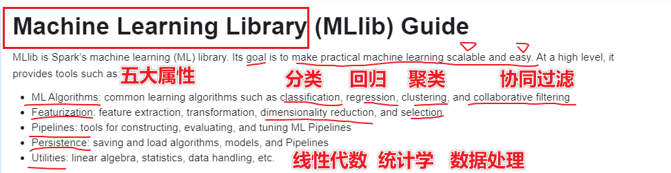

# SparkMllib基础和特征工程

## 1-回顾

* Xmind思维导图
* SparkMllib**支持的机器学习基础**

## 2-重难点知识点

* 1-引入SparkMllib
* 2-SparkMllib架构
* 2-SparkMllib数据结构
* 3-SparkMllib数据类型
* 4-SparkMllib统计特性
* 5-SparkMllib特征工程-特征抽取(了解)
* 6-SparkMllib特征工程-特征转化(掌握)
* 7-SparkMllib特征工程-特征选择(部分掌握)

## 1-引入SparkMllib

* SparkMllib是大规模机器学习库

* 
* SparkMllib五大特性
  * 1-ML算法：分类、回归、聚类、协同过滤
  * 2-特征化：特征抽取，特征转换，特征降维，特征选择
  * 3-管道：将流程通过管道串联起来
  * 4-持久化：都保存和读取模型和管道
  * 5-工具：线性代数，统计学和数据处理
* 
* 完毕

## 2-SparkMllib架构

* 
* SparkMllib基于矩阵的向量基础上构建算法
* SParkMllib提供了基于Netlib-java之上Breeze的库
* 
* 面试的时候问到SparkMllib架构？
  * 基于Neiib-Java之上的Breeze库实现的Vector的向量接口
  * 基于向量接口实现的矩阵的接口
  * 基于矩阵的接口完成机器学习算法的实现以及算法的指标分析

## 2-SparkMllib数据结构

* 
* 数据结构
* SparkCOre----RDD
* SparkSQL------DataSet和DataFrame
* SparkStreaming----DStream
* SparkMllib中--DataFrame和RDD
* SparkGrpahx--RDPG(弹性分布式属性图)
* SparkMllib的两种数据结构位于哪个包下？
  * RDD的api-spark.mllib
  * DataFrame--spark.ml
* 为什么需要选择基于DataFrame的API？
  * SparkSQL提供了多种数据源、SQL查询、优化器等优势
  * SparkSQL提供了多语言统一的API
  * SparkSQL可以使用Ml管道操作，而RDD不可以(**优势**)
* 基于RDD的API是否会被废弃？
  * 因为很多的老的项目基于RDD的API维护

## 3-SparkMllib数据类型

* 

* **本地向量LocalVector**

* **标签向量LabeledPoint**

* 本地矩阵

* 分布式矩阵

* 构建Maven的

* ```xml
          <dependency>
              <groupId>org.apache.spark</groupId>
              <artifactId>spark-mllib_2.11</artifactId>
              <version>${spark.version}</version>
          </dependency>
  ```

* 本地向量代码

* ```scala
  package cn.itcast.mldatatype
  
  import org.apache.spark.mllib.linalg
  import org.apache.spark.mllib.linalg.Vectors
  
  /**
   * DESC:描述本地向量构建思路
   */
  object _01SparkMllibLocalVector {
    def main(args: Array[String]): Unit = {
      val vector1: linalg.Vector = Vectors.dense(Array(1.0, 2.0, 3.0))
      val vector2: linalg.Vector = Vectors.dense(0.0, 0.0, 3.0)
      println(vector1)
      println("=" * 10)
      println(vector2)
      //稀疏向量仅仅存储非0值的下标和非0只对应的值，也就是说0值的下标和值都不做存储的，能节省很大的空间
      val vector3: linalg.Vector = Vectors.sparse(3, Array(2), Array(3.0))
      println("=" * 10)
      println(vector3) //(3个数值,[2]下标为2的index,[3.0]下标为2对应的数值为3.0)
      val vector4: linalg.Vector = Vectors.sparse(3, Array(0, 2), Array(1.0, 3.0))
      println(vector4(1)) //0
      //向量定义变体
      val vector5: linalg.Vector = Vectors.sparse(3, Seq((0, 1.0), (2, 3.0)))
      println("=" * 10)
      println(vector5(1)) //0
  
    }
  }
  ```

* 标签向量开发

* ```scala
  package cn.itcast.mldatatype
  
  import org.apache.spark.mllib.linalg
  import org.apache.spark.mllib.linalg.Vectors
  import org.apache.spark.mllib.regression.LabeledPoint
  
  /**
   * DESC:描述本地向量构建思路
   */
  object _02SparkMllibLabeledPoint {
    def main(args: Array[String]): Unit = {
      val vector1: linalg.Vector = Vectors.dense(Array(1.0, 2.0, 3.0))
      val vector2: linalg.Vector = Vectors.dense(0.0, 0.0, 3.0)
      println(vector1)
      println("print vector value is:")
      val point: LabeledPoint = LabeledPoint(1.0, vector1)
      println(point.label) //1.0
      println(point.features) //[1.0,2.0,3.0]
      //libsvm的格式数据
    }
  }
  ```

* libsvm的格式仅存储非0值和下标，label index:value index:Value index:value

* ```
  label index1:value1 index2:value2 index3:value3 
  1 1:-0.555556 2:0.25 3:-0.864407 4:-0.916667 
  1 1:-0.666667 2:-0.166667 3:-0.864407 4:-0.916667 
  1 1:-0.777778 3:-0.898305 4:-0.916667 
  1 1:-0.833333 2:-0.0833334 3:-0.830508 4:-0.916667 
  1 1:-0.611111 2:0.333333 3:-0.864407 4:-0.916667 
  1 1:-0.388889 2:0.583333 3:-0.762712 4:-0.75 
  1 1:-0.833333 2:0.166667 3:-0.864407 4:-0.833333 
  1 1:-0.611111 2:0.166667 3:-0.830508 4:-0.916667 
  ```

* 读取libsvm数据

* SparkCore方式读取

* ```scala
  package cn.itcast.mldatatype
  
  import org.apache.spark.mllib.regression.LabeledPoint
  import org.apache.spark.{SparkConf, SparkContext}
  import org.apache.spark.mllib.util.MLUtils
  import org.apache.spark.rdd.RDD
  
  /**
   * DESC:使用SParkCOre读取libsvm数据集
   */
  object _03SparkMlliblibSvmLoader {
    def main(args: Array[String]): Unit = {
      val conf: SparkConf = new SparkConf().setMaster("local[*]").setAppName("_03SparkMlliblibSvmLoader")
      val sc = new SparkContext(conf)
      sc.setLogLevel("WARN")
      val data: RDD[LabeledPoint] = MLUtils.loadLibSVMFile(sc, "D:\\BigData\\Workspace\\spark_learaning_2.11\\spark-study-gz-day01_2.11\\src\\main\\resources\\iris.txt")
      data.foreach(println(_))
      // label标签，(4个特征或属性，非0值的下标，非0值对应的值)
      // (1.0,(4,[0,1,2,3],[-0.555556,0.25,-0.864407,-0.916667]))
      sc.stop()
    }
  }
  ```

* 

* SparkSQL方式读取

* ```scala
  package cn.itcast.mldatatype
  
  import org.apache.spark.mllib.regression.LabeledPoint
  import org.apache.spark.mllib.util.MLUtils
  import org.apache.spark.rdd.RDD
  import org.apache.spark.sql.{DataFrame, SparkSession}
  import org.apache.spark.{SparkConf, SparkContext}
  
  /**
   * DESC:使用SParkCOre读取libsvm数据集
   */
  object _04SparkMllibSQLlibSvmLoader {
    def main(args: Array[String]): Unit = {
      val conf: SparkConf = new SparkConf().setMaster("local[*]").setAppName("_04SparkMllibSQLlibSvmLoader")
      val spark: SparkSession = SparkSession.builder().config(conf).getOrCreate()
      spark.sparkContext.setLogLevel("WARN")
      //SparkSQL读取数据
      val df: DataFrame = spark.read.format("libsvm").load("D:\\BigData\\Workspace\\spark_learaning_2.11\\spark-study-gz-day01_2.11\\src\\main\\resources\\iris.txt")
      // label标签，(4个特征或属性，非0值的下标，非0值对应的值)
      df.printSchema()
      //    root
      //    |-- label: double (nullable = true)
      //    |-- features: vector (nullable = true)
      df.show(truncate = false) //是否以截断的方式显示数据，默认显示20个字符以内，如果设置为false全部显示
      // |1.0  |(4,[0,1,2,3],[-0.555556,0.25,-0.864407,-0.916667])  
      spark.stop()
    }
  }
  ```

* 本地矩阵--local matrix

* ```scala
  package cn.itcast.mldatatype
  
  import org.apache.spark.mllib.linalg
  import org.apache.spark.mllib.linalg.{Matrices, Matrix}
  
  /**
   * DESC:描述本地向量构建思路
   */
  object _05SparkMllibLocalmatrix {
    def main(args: Array[String]): Unit = {
      //稠密性的矩阵
      val matrix: Matrix = Matrices.dense(3, 2, Array(1.0, 3.0, 5.0, 2.0, 4.0, 6.0))
      println(matrix)
      println(matrix(0,1))
  
    }
  }
  ```

* 分布式矩阵

* 在本地矩阵的基础上增加了分布式特性

  * 分布式行矩阵---在原来的矩阵上增加分布式特性

  * ```scala
    package cn.itcast.mldatatype
    
    import org.apache.spark.mllib.linalg
    import org.apache.spark.mllib.linalg.distributed.RowMatrix
    import org.apache.spark.{SparkConf, SparkContext}
    import org.apache.spark.mllib.linalg.{Matrices, Matrix, Vectors}
    import org.apache.spark.rdd.RDD
    
    /**
     * DESC:描述本地向量构建思路
     */
    object _06SparkMllibRowMatrix {
      def main(args: Array[String]): Unit = {
    
        val conf: SparkConf = new SparkConf().setMaster("local[*]").setAppName("_03SparkMlliblibSvmLoader")
        val sc = new SparkContext(conf)
        sc.setLogLevel("WARN")
        //分布式行索引矩阵
        val data: RDD[String] = sc.textFile("D:\\BigData\\Workspace\\spark_learaning_2.11\\spark-study-gz-day01_2.11\\src\\main\\resources\\distributeMatrix.txt")
        val dataValue: RDD[linalg.Vector] = data.map(_.split(" ").map(_.toDouble)).map(x => Vectors.dense(x))
        val rowMatrix = new RowMatrix(dataValue)
        println(rowMatrix.numCols())
        println(rowMatrix.numRows())
    
      }
    }
    ```

  * 分布式行索引矩----增加行索引
  * 三元组矩阵---增加列索引
  * 分块矩阵

* 

## 4-SparkMllib统计特性

* 统计特征：

  * 均值，方差，非0值的个数....

  * ```scala
    package cn.itcast.mldatatype
    
    import org.apache.spark.mllib.linalg
    import org.apache.spark.mllib.linalg.Vectors
    import org.apache.spark.rdd.RDD
    import org.apache.spark.{SparkConf, SparkContext}
    import org.apache.spark.mllib.stat.{MultivariateStatisticalSummary, Statistics}
    
    /**
     * DESC:描述本地向量构建思路
     */
    object _07SparkMllibVectorSummary {
      def main(args: Array[String]): Unit = {
    
        val conf: SparkConf = new SparkConf().setMaster("local[*]").setAppName("_07SparkMllibVectorSummary")
        val sc = new SparkContext(conf)
        sc.setLogLevel("WARN")
    
        val data: RDD[String] = sc.textFile("D:\\BigData\\Workspace\\spark_learaning_2.11\\spark-study-gz-day01_2.11\\src\\main\\resources\\VectorData.txt")
        val vectorData: RDD[linalg.Vector] = data.map(_.toDouble).map(x => Vectors.dense(x))
        val summary: MultivariateStatisticalSummary = Statistics.colStats(vectorData)
    
        println("min value is:", summary.min)
        println("max value is:", summary.max)
        println("variance value is:", summary.variance)
        println("numNonZeors is:", summary.numNonzeros)
        println("mean value is:", summary.mean)
        println("count value is:", summary.count)
    
      }
    }
    ```

* 统计相关系数

  * cos余弦相似度

  * Pearson皮尔逊相关系数是在cos余弦相似度的基础上做了标准化的操作

  * 

  * ```scala
    package cn.itcast.mldatatype
    
    import org.apache.spark.mllib.linalg
    import org.apache.spark.mllib.linalg.{Matrix, Vectors}
    import org.apache.spark.rdd.RDD
    import org.apache.spark.{SparkConf, SparkContext}
    import org.apache.spark.mllib.stat.{MultivariateStatisticalSummary, Statistics}
    
    /**
     * DESC:描述本地向量构建思路
     */
    object _07SparkMllibVectorSummary {
      def main(args: Array[String]): Unit = {
    
        val conf: SparkConf = new SparkConf().setMaster("local[*]").setAppName("_07SparkMllibVectorSummary")
        val sc = new SparkContext(conf)
        sc.setLogLevel("WARN")
    
        val data: RDD[String] = sc.textFile("D:\\BigData\\Workspace\\spark_learaning_2.11\\spark-study-gz-day01_2.11\\src\\main\\resources\\VectorData.txt")
        val vectorData: RDD[linalg.Vector] = data.map(_.toDouble).map(x => Vectors.dense(x))
        val summary: MultivariateStatisticalSummary = Statistics.colStats(vectorData)
    
        println("min value is:", summary.min)
        println("max value is:", summary.max)
        println("variance value is:", summary.variance)
        println("numNonZeors is:", summary.numNonzeros)
        println("mean value is:", summary.mean)
        println("count value is:", summary.count)
    
        //定义一组DOuble类型的RDD-----1-sc.textfile 2-sc.makerdd paralleise 3-rdd的转换
        val data1: RDD[Double] = sc.parallelize(Seq(1.0, 2.0, 3.0, 4.0))
        val data2: RDD[Double] = sc.parallelize(Seq(2.0, 4.0, 6.0, 8.0))
        val corr1: Double = Statistics.corr(data1, data2)
        println(corr1)
    
        //在工作更多的是构建相关系数矩阵
        val fatData: RDD[String] = sc.textFile("D:\\BigData\\Workspace\\spark_learaning_2.11\\spark-study-gz-day01_2.11\\src\\main\\resources\\age_fat_height.txt")
        val fatRDD: RDD[linalg.Vector] = fatData.map(_.split(" ").map(_.toDouble)).map(x => (Vectors.dense(x)))
        val matrix: Matrix = Statistics.corr(fatRDD, method = "pearson")
        println("matrix value is:\n",matrix)
    
      }
    }
    ```

* 随机数

  * 什么时候用随机数？

    * 1-随机数可以用于随机生成制定分布方式的数据
    * 2-随机数可以用于训练集合测试集的拆分

  * ```scala
    package cn.itcast.mldatatype
    
    import org.apache.spark.mllib.linalg
    import org.apache.spark.mllib.linalg.{Matrix, Vectors}
    import org.apache.spark.rdd.RDD
    import org.apache.spark.{SparkConf, SparkContext}
    import org.apache.spark.mllib.stat.{MultivariateStatisticalSummary, Statistics}
    import org.apache.spark.mllib.random.RandomRDDs._
    
    /**
     * DESC:描述本地向量构建思路
     */
    object _07SparkMllibVectorSummary {
      def main(args: Array[String]): Unit = {
    
        val conf: SparkConf = new SparkConf().setMaster("local[*]").setAppName("_07SparkMllibVectorSummary")
        val sc = new SparkContext(conf)
        sc.setLogLevel("WARN")
    
        val data: RDD[String] = sc.textFile("D:\\BigData\\Workspace\\spark_learaning_2.11\\spark-study-gz-day01_2.11\\src\\main\\resources\\VectorData.txt")
        val vectorData: RDD[linalg.Vector] = data.map(_.toDouble).map(x => Vectors.dense(x))
        val summary: MultivariateStatisticalSummary = Statistics.colStats(vectorData)
    
        println("min value is:", summary.min)
        println("max value is:", summary.max)
        println("variance value is:", summary.variance)
        println("numNonZeors is:", summary.numNonzeros)
        println("mean value is:", summary.mean)
        println("count value is:", summary.count)
    
        //定义一组DOuble类型的RDD-----1-sc.textfile 2-sc.makerdd paralleise 3-rdd的转换
        val data1: RDD[Double] = sc.parallelize(Seq(1.0, 2.0, 3.0, 4.0))
        val data2: RDD[Double] = sc.parallelize(Seq(2.0, 4.0, 6.0, 8.0))
        val corr1: Double = Statistics.corr(data1, data2)
        println(corr1)
    
        //在工作更多的是构建相关系数矩阵
        val fatData: RDD[String] = sc.textFile("D:\\BigData\\Workspace\\spark_learaning_2.11\\spark-study-gz-day01_2.11\\src\\main\\resources\\age_fat_height.txt")
        val fatRDD: RDD[linalg.Vector] = fatData.map(_.split(" ").map(_.toDouble)).map(x => (Vectors.dense(x)))
        val matrix: Matrix = Statistics.corr(fatRDD, method = "pearson")
        println("matrix value is:\n", matrix)
        /*   sc: SparkContext,
           size: Long,
           numPartitions: Int = 0,
           seed: Long*/
        //seed随机数种子，保证随机选择数据的可重复性
        val rddData: RDD[Double] = normalRDD(sc, 100L, 1, 2223L)
        rddData.foreach(println(_))
        //数据的随机拆分
        val array: Array[RDD[linalg.Vector]] = vectorData.randomSplit(Array(0.8, 0.2), seed = 123L)
        val trainingSet: RDD[linalg.Vector] = array(0)
        val testSet: RDD[linalg.Vector] = array(1)
        trainingSet.foreach(println(_))
        println("="*100)
        testSet.foreach(println(_))
      }
    }
    ```

* 问题能否基于DataFrame完成API操作

  * ```scala
    package cn.itcast.Summary
    
    import org.apache.spark.ml.linalg.Vectors
    import org.apache.spark.ml.stat.Correlation
    import org.apache.spark.sql.{DataFrame, SparkSession}
    import org.apache.spark.{SparkConf, SparkContext}
    
    /**
     * DESC:这里就是描述如何通过DataFrame完成相关系数统计
     */
    object _08SparkMlStatisticSummary {
      def main(args: Array[String]): Unit = {
        val conf: SparkConf = new SparkConf().setMaster("local[*]").setAppName("_08SparkMlStatisticSummary")
        val spark: SparkSession = SparkSession.builder().config(conf).getOrCreate()
        spark.sparkContext.setLogLevel("WARN")
        import spark.implicits._
        val data = Seq(
          Vectors.sparse(4, Seq((0, 1.0), (3, -2.0))),
          Vectors.dense(4.0, 5.0, 0.0, 3.0),
          Vectors.dense(6.0, 7.0, 0.0, 8.0),
          Vectors.sparse(4, Seq((0, 9.0), (3, 1.0)))
        )
        val df = data.map(Tuple1.apply).toDF("features")
        val dfDF: DataFrame = Correlation.corr(df, "features")
        dfDF.show(truncate = false)
    
        spark.stop()
      }
    }
    ```

* 整个特征工程需要做什么
  
  * 

## 5-SparkMllib特征工程-特征抽取(了解)

* 目前无需完成
* 后续的项目数据已经结构化到MySQL中
* 特征抽取针对文本数据、图像数据、视频数据才需要结构化数据的抽取

## 6-SparkMllib特征工程-特征转化(掌握)

* **类别性数据的数值化**(**必须掌握**)

  * labelencoder标签编码-----Spark中StringIndexer实现

    * 男 女
    * 0   1

  * onehotencoder独热编码---Spark中使用OneHotEncoder实现

    * 男 女
    * 0   1
    * 1  0

  * 什么时候用Labelencoder什么时候用onehotencoder

    * 在原始数据有顺序的情况下使用标签编码
    * 如果原始数据没有顺序，直接使用独热编码

  * 案例

  * 

  * ```scala
    package cn.itcast.FeatureEngineer
    
    import org.apache.spark.SparkConf
    import org.apache.spark.ml.feature.{IndexToString, OneHotEncoder, StringIndexer, StringIndexerModel}
    import org.apache.spark.ml.linalg.Vectors
    import org.apache.spark.ml.stat.Correlation
    import org.apache.spark.sql.{DataFrame, SparkSession}
    
    /**
     * DESC:这里就是描述如何通过DataFrame完成相关系数统计
     */
    object _09SparkMlStringIndexer {
      def main(args: Array[String]): Unit = {
        val conf: SparkConf = new SparkConf().setMaster("local[*]").setAppName("_09SparkMlStringIndexer")
        val spark: SparkSession = SparkSession.builder().config(conf).getOrCreate()
        spark.sparkContext.setLogLevel("WARN")
        val df = spark.createDataFrame(
          Seq((0, "a"), (1, "b"), (2, "c"), (3, "a"), (4, "a"), (5, "c"))
        ).toDF("id", "category")
        //使用STringIndexer将类别性数据转化为数值型数据
        //.setInputCol() 输入列-----来源于数据集的schema
        // .setOutputCol() 输出列-----用户自定义
        val indexer: StringIndexer = new StringIndexer().setInputCol("category").setOutputCol("categoryIndex")
        //fit--------在特征工程中需要fit形成model在使用tranforam进行转化
        val indexerModel: StringIndexerModel = indexer.fit(df) //这里就保存了映射关系
        val stringIndexerResult: DataFrame = indexerModel.transform(df)
        stringIndexerResult.show()
        //| id|category|categoryIndex|
        //+---+--------+-------------+
        //|  0|       a|          0.0|
        //|  1|       b|          2.0|
        //|  2|       c|          1.0|
        //|  3|       a|          0.0|
        //|  4|       a|          0.0|
        //|  5|       c|          1.0|
        //+---+--------+-------------+
        //新的需求，能都将index转化为业务含义的字段，如：预测为好西瓜-0和怀西瓜-1，经过算法构建模型得到预测值也是0或1，0--好西瓜，1-化细化
        //.setInputCol() 输入列-----来源于数据集的schema
        // .setOutputCol() 输出列-----用户自定义
        //.setLabels() 映射关系
        val indexToString: IndexToString = new IndexToString().setInputCol("categoryIndex").setOutputCol("beforeIndex").setLabels(indexerModel.labels)
        val result: DataFrame = indexToString.transform(stringIndexerResult)
        result.show()
        //独热编码
        val encoder: OneHotEncoder = new OneHotEncoder().setInputCol("categoryIndex").setOutputCol("oheIndex").setDropLast(false)
        val oheResult: DataFrame = encoder.transform(stringIndexerResult)
        oheResult.show(false)
        spark.stop()
      }
    }
    ```

  * 

  * 

* **数值型数据的归一化和标准化**(了解)

* 归一化

  * 为什么要做归一化？
  * 答案是因为在具备不同量纲的前提下，很难能够让模型达到较好的效果，比如KMeans算法中，能够通过归一化能够将所有的数据归一化到0-1或-1到1的区间，能够降低因为量纲对模型带来的影响
  * MinMAxScaler：（当前的值-最小值）/（最大值-最小值）=可以将数据归一化到[最小值，最大值]=[0，1]
  * 
  * MaxAbsScler：(当前的值)/max(abs(这一列的取值))，可以归一化到[-1,1]区间
  * 

* 标准化

  * 为什么要做标准化？
  * 因为某些算法需要数据呈现的标准正太分布，需要做标准化
  * StandSclaer：当前的值减去均值./方差，适合于在正态分布转化为标准正态分布的数据

* 代码

* ```scala
  package cn.itcast.FeatureEngineer
  
  import org.apache.spark.SparkConf
  import org.apache.spark.ml.feature.{MaxAbsScaler, MinMaxScaler, StandardScaler, VectorAssembler}
  import org.apache.spark.ml.linalg.Vectors
  import org.apache.spark.sql.{DataFrame, SparkSession}
  
  /**
   * DESC:这里就是描述如何通过DataFrame完成相关系数统计
   */
  object _13SparkMlMinMaxscler {
    def main(args: Array[String]): Unit = {
      val conf: SparkConf = new SparkConf().setMaster("local[*]").setAppName("_13SparkMlMinMaxscler")
      val spark: SparkSession = SparkSession.builder().config(conf).getOrCreate()
      spark.sparkContext.setLogLevel("WARN")
      //准备的数据
      val dataFrame = spark.createDataFrame(Seq(
        (0, Vectors.dense(1.0, 0.5, -1.0)),
        (1, Vectors.dense(2.0, 1.0, 1.0)),
        (2, Vectors.dense(4.0, 10.0, 2.0))
      )).toDF("id", "features")
  
      //MinMaxScler
      val maxScaler: MinMaxScaler = new MinMaxScaler().setInputCol("features").setOutputCol("minmaxfeatures").setMin(0).setMax(1)
      val minMaxDF: DataFrame = maxScaler.fit(dataFrame).transform(dataFrame)
      minMaxDF.show(false)
  
      //maxabsScler
      val maxAbsScaler: MaxAbsScaler = new MaxAbsScaler().setInputCol("features").setOutputCol("maxabsfeatures")
      val maxabsSclaerDF: DataFrame = maxAbsScaler.fit(dataFrame).transform(dataFrame)
      maxabsSclaerDF.show()
  
      val standardScaler: StandardScaler = new StandardScaler().setInputCol("features").setOutputCol("standfeatures")
      val standDF: DataFrame = standardScaler.fit(dataFrame).transform(dataFrame)
      standDF.show()
  
      spark.stop()
    }
  }
  ```

* 连续值数据的离散化

  * 为什么要做离散化？---因为连续性数据是不符合某些算法的要求的，比如决策树
    
  * Age年龄---青年+中年+老年
    
  * 怎么做离散化？

    * 对于年龄使用Banizer二分

    * ```scala
      package cn.itcast.FeatureEngineer
      
      import org.apache.spark.SparkConf
      import org.apache.spark.ml.feature.{Binarizer, IndexToString, OneHotEncoder, StringIndexer, StringIndexerModel}
      import org.apache.spark.sql.{DataFrame, SparkSession}
      
      /**
       * DESC:这里就是描述如何通过DataFrame完成相关系数统计
       */
      object _10SparkMlBinarizer {
        def main(args: Array[String]): Unit = {
          val conf: SparkConf = new SparkConf().setMaster("local[*]").setAppName("_10SparkMlBinarizer")
          val spark: SparkSession = SparkSession.builder().config(conf).getOrCreate()
          spark.sparkContext.setLogLevel("WARN")
          val data = Array((0, 0.1), (1, 0.8), (2, 0.2))
          val dataFrame = spark.createDataFrame(data).toDF("label", "feature")
          val binarizer: Binarizer = new Binarizer().setInputCol("feature").setOutputCol("feature_binarizer").setThreshold(0.5)
          val binarizerDF: DataFrame = binarizer.transform(dataFrame)
          binarizerDF.show()
          spark.stop()
        }
      }
      ```

    * 对于年龄按照指定方式分割，Buckerizer分箱的操作

    * ```scala
      package cn.itcast.FeatureEngineer
      
      import org.apache.spark.SparkConf
      import org.apache.spark.ml.feature.{Binarizer, Bucketizer}
      import org.apache.spark.sql.{DataFrame, SparkSession}
      
      /**
       * DESC:这里就是描述如何通过DataFrame完成相关系数统计
       */
      object _11SparkMlBucketrizer {
        def main(args: Array[String]): Unit = {
          val conf: SparkConf = new SparkConf().setMaster("local[*]").setAppName("_10SparkMlBinarizer")
          val spark: SparkSession = SparkSession.builder().config(conf).getOrCreate()
          spark.sparkContext.setLogLevel("WARN")
          //需要切分的数据
          val splits: Array[Double] = Array(Double.NegativeInfinity, -5, 0, 5, Double.PositiveInfinity)
          //准备的数据
          val data = Array(-10, -5, -0.5, -0.3, 0.0, 0.2, 2, 50)
          val dataFrame = spark.createDataFrame(data.map(Tuple1.apply)).toDF("features")
          //分箱操作
          val bucketizer: Bucketizer = new Bucketizer().setInputCol("features").setOutputCol("features_bucket").setSplits(splits)
          val result: DataFrame = bucketizer.transform(dataFrame)
          result.show()
          spark.stop()
        }
      }
      ```

* 特征组合(必须得会)

  * 

  * ```scala
    package cn.itcast.FeatureEngineer
    
    import org.apache.spark.SparkConf
    import org.apache.spark.ml.feature.{Bucketizer, VectorAssembler}
    import org.apache.spark.ml.linalg.Vectors
    import org.apache.spark.sql.{DataFrame, SparkSession}
    
    /**
     * DESC:这里就是描述如何通过DataFrame完成相关系数统计
     */
    object _12SparkMlVectorAssemble {
      def main(args: Array[String]): Unit = {
        val conf: SparkConf = new SparkConf().setMaster("local[*]").setAppName("_10SparkMlBinarizer")
        val spark: SparkSession = SparkSession.builder().config(conf).getOrCreate()
        spark.sparkContext.setLogLevel("WARN")
        //准备的数据
        val dataset = spark.createDataFrame(
          Seq((0, 18, 1.0, Vectors.dense(0.0, 10.0, 0.5), 1.0))
        ).toDF("id", "hour", "mobile", "userFeatures", "clicked")
        //特征组合操作
        val assembler: VectorAssembler = new VectorAssembler().setInputCols(Array("hour", "mobile", "userFeatures")).setOutputCol("features")
        val result: DataFrame = assembler.transform(dataset)
        result.show()
        result.printSchema() //features: vector (nullable = true)
    
        spark.stop()
      }
    }
    ```

## 7-SparkMllib特征工程-特征选择(部分掌握)

* SparkSQL的DF直接选择

* 根据卡方验证选择和标签列最相关的特征是什么

* 

* 

* 代码

* ```scala
  package cn.itcast.FeatureEngineer
  
  import org.apache.spark.SparkConf
  import org.apache.spark.ml.feature.{ChiSqSelector, MaxAbsScaler, MinMaxScaler, StandardScaler}
  import org.apache.spark.ml.linalg.Vectors
  import org.apache.spark.sql.{DataFrame, SparkSession}
  
  /**
   * DESC:这里就是描述如何通过DataFrame完成相关系数统计
   */
  object _14SparkMlCHiSqutest {
    def main(args: Array[String]): Unit = {
      val conf: SparkConf = new SparkConf().setMaster("local[*]").setAppName("_13SparkMlMinMaxscler")
      val spark: SparkSession = SparkSession.builder().config(conf).getOrCreate()
      spark.sparkContext.setLogLevel("WARN")
      import spark.implicits._
      //准备的数据
      val data = Seq(
        (7, Vectors.dense(0.0, 0.0, 18.0, 1.0), 1.0),
        (8, Vectors.dense(0.0, 1.0, 12.0, 0.0), 0.0),
        (9, Vectors.dense(1.0, 0.0, 15.0, 0.1), 0.0)
      )
      //转换数据
      val df = spark.createDataset(data).toDF("id", "features", "clicked")
      val chiSqSelector: ChiSqSelector = new ChiSqSelector()
        .setFeaturesCol("features")
        .setLabelCol("clicked")
        .setOutputCol("chisquareFeatures")
        .setNumTopFeatures(2)
      //卡方验证
      val result: DataFrame = chiSqSelector.fit(df).transform(df)
      //结果展示
      result.show()
  
      spark.stop()
    }
  }
  ```

## 8-总结

* 案例部分1-选择的是单独的一列数据

* ```scala
  package cn.itcast.UseCase
  
  import org.apache.spark.mllib.stat.{MultivariateStatisticalSummary, Statistics}
  import org.apache.spark.mllib.linalg
  import org.apache.spark.mllib.linalg.Vectors
  import org.apache.spark.rdd.RDD
  import org.apache.spark.{SparkConf, SparkContext}
  import org.apache.spark.sql.SparkSession
  
  /**
   * DESC:
   */
  object _01SeptalLengthSummary {
    def main(args: Array[String]): Unit = {
      val conf: SparkConf = new SparkConf().setMaster("local[*]").setAppName("_08SparkMlStatisticSummary")
      val spark: SparkSession = SparkSession.builder().config(conf).getOrCreate()
      val sc: SparkContext = spark.sparkContext
      sc.setLogLevel("WARN")
      import spark.implicits._
      val path = "D:\\BigData\\Workspace\\spark_learaning_2.11\\spark-study-gz-day01_2.11\\src\\main\\resources\\data\\xxx.csv"
      val dataRDD: RDD[linalg.Vector] = sc.textFile(path).map(_.toDouble).map(x => Vectors.dense(x))
      val summary: MultivariateStatisticalSummary = Statistics.colStats(dataRDD)
      println("summary count is:",summary.count)
      println("summary max is:",summary.max)
      println("summary min is:",summary.min)
      println("summary variance is:",summary.variance)
      println("summary numNonzeros is:",summary.numNonzeros)
    }
  }
  ```

* 案例分析2：不可能像刚才那样手动选择列，应该程序控制

* ```scala
  package cn.itcast.UseCase
  
  import org.apache.spark.ml.feature.VectorAssembler
  import org.apache.spark.rdd.RDD
  import org.apache.spark.ml.stat.Correlation
  import org.apache.spark.sql.types.{DataTypes, StructType}
  import org.apache.spark.sql.{DataFrame, Row, SparkSession}
  import org.apache.spark.{SparkConf, SparkContext}
  
  /**
   * DESC:
   */
  case class IrisFlower(sepal_length: Double, sepal_width: Double, petal_length: Double, petal_width: Double, classlabel: String)
  
  object _03IrisSparkSQL {
    def main(args: Array[String]): Unit = {
      val conf: SparkConf = new SparkConf().setMaster("local[*]").setAppName("_02IrisSeptalLengthSummary")
      val spark: SparkSession = SparkSession.builder().config(conf).getOrCreate()
      val sc: SparkContext = spark.sparkContext
      sc.setLogLevel("WARN")
      import spark.implicits._
      val path = "D:\\BigData\\Workspace\\spark_learaning_2.11\\spark-study-gz-day01_2.11\\src\\main\\resources\\data\\iris.data"
      //1-该方法用的较多，case class的样例类方法，反射机制加载类
      val dataRDD: RDD[IrisFlower] = sc.textFile(path).map(_.split(",")).map(filed => IrisFlower(filed(0).toDouble, filed(1).toDouble, filed(2).toDouble, filed(3).toDouble, filed(4)))
      dataRDD.toDF()
      //2-使用ROw方法
      val dataRDD1: RDD[Row] = sc.textFile(path).map(_.split(",")).map(filed => Row(filed(0).toDouble, filed(1).toDouble, filed(2).toDouble, filed(3).toDouble, filed(4)))
      val schema = new StructType()
        .add("sepal_length", "double", true)
        .add("sepal_width", DataTypes.DoubleType, true)
        .add("petal_length", DataTypes.DoubleType, true)
        .add("petal_width", DataTypes.DoubleType, true)
        .add("classlabel", "string", true)
      val df2: DataFrame = spark.createDataFrame(dataRDD1, schema)
      df2.printSchema()
      df2.show()
      //3-统计DataFrame的corr相关系数
      //Compute the Pearson correlation matrix for the input Dataset of Vectors.
      //在SParkMllib如何能够让数据成为vectors
      val assembler: VectorAssembler = new VectorAssembler().setInputCols(Array("sepal_length", "sepal_width", "petal_length", "petal_width")).setOutputCol("features")
      val vecDF: DataFrame = assembler.transform(df2)
      val dfResult: DataFrame = Correlation.corr(vecDF, "features", "pearson")
      dfResult.show(false)
      //+-----------------------------------------------------------------------------------------------------------------------------------------------------------------------------------------------------------------------------------------------------------------------------------------------------------------------------------------------------------+
      //|pearson(features)                                                                                                                                                                                                                                                                                                                                          |
      //  +-----------------------------------------------------------------------------------------------------------------------------------------------------------------------------------------------------------------------------------------------------------------------------------------------------------------------------------------------------------+
      //|1.0                   -0.10936924995064387  0.8717541573048727   0.8179536333691672
      //-0.10936924995064387  1.0                   -0.4205160964011671  -0.3565440896138163
      //0.8717541573048727    -0.4205160964011671   1.0                  0.9627570970509661
      //0.8179536333691672    -0.3565440896138163   0.9627570970509661   1.0                  |
      //  +------------------------------------------------------------------------------------------
      spark.stop()
    }
  }
  ```

* 1-引入SparkMllib
  * 五大属性
    * 1-ML算法
    * 2-特征化
    * 3-持久化
    * 4-管道
    * 5-工具类
  * SparkMllib两种数据皆
    * spark.ml dataframe
    * spark.mllib rdd
  * 为什么会选择df作为主要api
    * 1-dataframe的api继承spark的多种数据源，sql查询以及sql优化器
    * 2-dataframe继承了多种语言统一API
    * 3-datafrane管道
* 2-SparkMllib架构
  * 基于Neilib-java之上有bereeze库
  * 算法
  * 指标
* 2-SparkMllib数据结构
  * DataFrame
  * RDD
* 3-SparkMllib数据类型、
  * **本地向量**
  * 本地矩阵
  * **标签向量**
  * 分布式矩阵
* 4-SparkMllib统计特性
  * Summary-最大值
  * COrr相关系数矩阵或相关系数
* 5-SparkMllib特征工程-特征抽取(了解)
  * 文本，图像，等需要抽取
* 6-SparkMllib特征工程-特征转化(掌握)
  * 数值型数据的归一化和标准化
  * 类别指数型的数值化
  * 连续纸属性的离散化
  * 特征组合VectorAssemble
* 7-SparkMllib特征工程-特征选择(部分掌握)
  * 卡方验证
  * 选择最相关的特征作为最终特征

