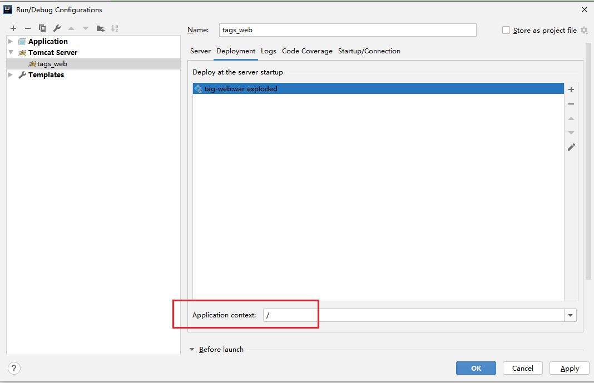
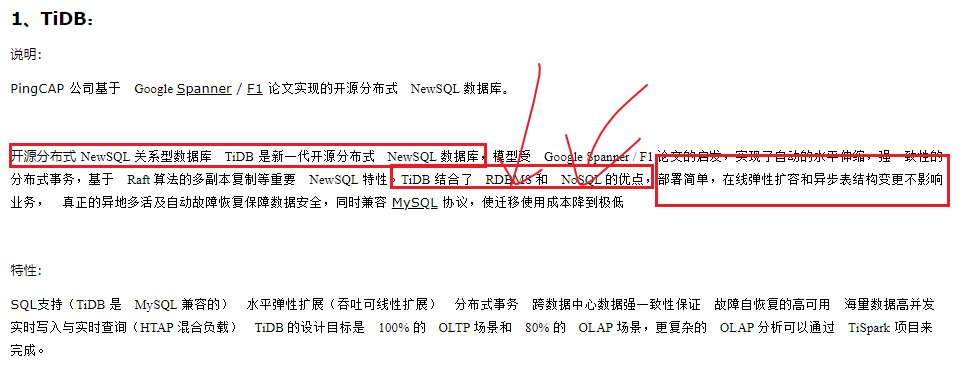

# SparkMllib&画像业务基础

## 1-回顾

## 2-重难点知识

## 2-SparkMllib案例剖析

* 利用Iris鸢尾花案例完成数据集特征工程

* ```scala
  package cn.itcast.UseCase
  
  import org.apache.spark.ml.feature.{ChiSqSelector, ChiSqSelectorModel, MinMaxScaler, MinMaxScalerModel, PCA, PCAModel, StringIndexer, StringIndexerModel, VectorAssembler}
  import org.apache.spark.sql.{DataFrame, SparkSession}
  import org.apache.spark.sql.functions._
  
  /**
   * DESC:带有header的schema如何直接读取schema
   * 1-准备环境
   * 2-准备数据，读取数据
   * 3-数据基本信息的查看
   * 4-特征工程
   * 5-......
   */
  object _04IrisHeaderSparkSQL {
    def main(args: Array[String]): Unit = {
      //1-准备环境
      val spark: SparkSession = SparkSession.builder().appName("_04IrisHeaderSparkSQL").master("local[*]").getOrCreate()
      spark.sparkContext.setLogLevel("WARN")
      import spark.implicits._
      //2-准备数据，读取数据
      val path = "D:\\BigData\\Workspace\\spark_learaning_2.11\\spark-study-gz-day01_2.11\\src\\main\\resources\\data\\iris.csv"
      val irisData: DataFrame = spark.read.format("csv").option("header", true).option("sep", ",").load(path)
      //.option("inferschema", true)
      //3-数据基本信息的查看
      irisData.printSchema()
      val featuresAndLabel: DataFrame = irisData.select($"sepal_length".cast("double"),
        col("sepal_width").cast("double"),
        column("petal_length").cast("double"),
        'petal_width.cast("double"),
        $"class")
      featuresAndLabel.printSchema()
      //4-特征工程
      //1-对于irisData数据需要使用StringIndexer方式进行转换
      val stringIndexer: StringIndexer = new StringIndexer().setInputCol("class").setOutputCol("classlabel")
      val stringIndexerModel: StringIndexerModel = stringIndexer.fit(featuresAndLabel)
      val strIndexDF: DataFrame = stringIndexerModel.transform(featuresAndLabel)
      //strIndexDF
      strIndexDF.show()
      /* +------------+-----------+------------+-----------+-----------+----------+
       |sepal_length|sepal_width|petal_length|petal_width|      class|classlabel|
       +------------+-----------+------------+-----------+-----------+----------+
       |         5.1|        3.5|         1.4|        0.2|Iris-setosa|       0.0|
       |         4.9|        3.0|         1.4|        0.2|Iris-setosa|       0.0|
       |         4.7|        3.2|         1.3|        0.2|Iris-setosa|       0.0|*/
      //2-实现对四个特征组合为特征向量
      val assembler: VectorAssembler = new VectorAssembler().setInputCols(Array("sepal_length", "sepal_width", "petal_length", "petal_width")).setOutputCol("features")
      val vecDF: DataFrame = assembler.transform(strIndexDF)
      vecDF.show()
      /* +------------+-----------+------------+-----------+-----------+----------+-----------------+
       |sepal_length|sepal_width|petal_length|petal_width|      class|classlabel|         features|
       +------------+-----------+------------+-----------+-----------+----------+-----------------+
       |         5.1|        3.5|         1.4|        0.2|Iris-setosa|       0.0|[5.1,3.5,1.4,0.2]|
       |         4.9|        3.0|         1.4|        0.2|Iris-setosa|       0.0|[4.9,3.0,1.4,0.2]|
       |         4.7|        3.2|         1.3|        0.2|Iris-setosa|       0.0|[4.7,3.2,1.3,0.2]|*/
      //3-特征降维--pca主成分分析法，利用特征值和特征向量选择具有较高特征值对应的特征向量进行降维
      val pca: PCA = new PCA().setInputCol("features").setOutputCol("pcaFeatures").setK(3)
      val pCAModel: PCAModel = pca.fit(vecDF)
      val pcaDF: DataFrame = pCAModel.transform(vecDF)
      pcaDF.show(false)
      //4-MinMacScaler
      val scaler: MinMaxScaler = new MinMaxScaler().setInputCol("pcaFeatures").setOutputCol("minmaxFeatures")
      val scalerModel: MinMaxScalerModel = scaler.fit(pcaDF)
      val minMaxDF: DataFrame = scalerModel.transform(pcaDF)
      minMaxDF.show(false)
      /* -----------------------------------------------------------+-------------------------------------------------------------+
       pcaFeatures                                                |minmaxFeatures                                               |
        -----------------------------------------------------------+-------------------------------------------------------------+
        [-2.827135972679027,-5.641331045573321,0.6642769315107171] |[0.9229341871921222,0.39647185024348364,0.5377622482950929]  |
        [-2.7959524821488437,-5.145166883252896,0.8462865195142029]|[0.9273763511705858,0.5849113296219819,0.663251464483809]    |
        [-2.6215235581650584,-5.177378121203909,0.6180558535097703]|[0.9522241751232295,0.5726777396721583,0.5058944389485587]   |
        [-2.7649059004742402,-5.003599415056946,0.605093119223434] |[0.9317990121499864,0.6386776070552742,0.49695708909189185]  |*/
      val chiSqSelector: ChiSqSelector = new ChiSqSelector().setLabelCol("classlabel").setFeaturesCol("minmaxFeatures").setNumTopFeatures(2)
      val chiSqSelectorModel: ChiSqSelectorModel = chiSqSelector.fit(minMaxDF)
      val chiSqDF: DataFrame = chiSqSelectorModel.transform(minMaxDF)
      chiSqDF.show(false)
      //5-......
      spark.stop()
    }
  }
  ```

* 这里有两个需要解决的问题？

  * 1-什么时候用fit或Transformer？

    * 如果一个特征操作继承自Estimator就需要实现fit在实现tranform方法
    * 如果一个特征操作继承自Transform就需要实现tranform方法，无需fit

  * 一般情况下尝试fit，没有fit在transform

  * 2-能不能简化上面的API的操作？

    * 讲解管道

  * ```scala
    package cn.itcast.UseCase
    
    import org.apache.spark.ml.{Pipeline, PipelineModel}
    import org.apache.spark.ml.feature._
    import org.apache.spark.sql.functions._
    import org.apache.spark.sql.{DataFrame, SparkSession}
    
    /**
     * DESC:带有header的schema如何直接读取schema
     * 1-准备环境
     * 2-准备数据，读取数据
     * 3-数据基本信息的查看
     * 4-特征工程
     * 5-......
     */
    object _05IrisHeaderSparkSQLPipeline {
      def main(args: Array[String]): Unit = {
        //1-准备环境
        val spark: SparkSession = SparkSession.builder().appName("_05IrisHeaderSparkSQLPipeline").master("local[*]").getOrCreate()
        spark.sparkContext.setLogLevel("WARN")
        import spark.implicits._
        //2-准备数据，读取数据
        val path = "D:\\BigData\\Workspace\\spark_learaning_2.11\\spark-study-gz-day01_2.11\\src\\main\\resources\\data\\iris.csv"
        val irisData: DataFrame = spark.read.format("csv").option("header", true).option("sep", ",").load(path)
        //.option("inferschema", true)
        //3-数据基本信息的查看
        irisData.printSchema()
        val featuresAndLabel: DataFrame = irisData.select($"sepal_length".cast("double"),
          col("sepal_width").cast("double"),
          column("petal_length").cast("double"),
          'petal_width.cast("double"),
          $"class")
        featuresAndLabel.printSchema()
        //4-特征工程
        //1-对于irisData数据需要使用StringIndexer方式进行转换
        val stringIndexer: StringIndexer = new StringIndexer().setInputCol("class").setOutputCol("classlabel")
        //2-实现对四个特征组合为特征向量
        val assembler: VectorAssembler = new VectorAssembler().setInputCols(Array("sepal_length", "sepal_width", "petal_length", "petal_width")).setOutputCol("features")
        //3-特征降维--pca主成分分析法，利用特征值和特征向量选择具有较高特征值对应的特征向量进行降维
        val pca: PCA = new PCA().setInputCol("features").setOutputCol("pcaFeatures").setK(3)
        //4-MinMacScaler
        val scaler: MinMaxScaler = new MinMaxScaler().setInputCol("pcaFeatures").setOutputCol("minmaxFeatures")
        //5-chiSqSelector
        val chiSqSelector: ChiSqSelector = new ChiSqSelector().setLabelCol("classlabel").setFeaturesCol("minmaxFeatures").setNumTopFeatures(2).setOutputCol("chiSqSelectorFeatures")
        val pipeline: Pipeline = new Pipeline().setStages(Array(stringIndexer, assembler, pca, scaler, chiSqSelector))
        val pipelineModel: PipelineModel = pipeline.fit(featuresAndLabel)
        val pipelineDF: DataFrame = pipelineModel.transform(featuresAndLabel)
        pipelineDF.show()
        //5-......
        spark.stop()
      }
    }
    ```

## 3-SparkMllib的管道的操作[掌握]

* 管道的Pipeline的五大属性

  * 1-DataFrame，只有在该数据集上才可以实现管道的操作
  * 2-Estimate，需要通过先fit形成model在transform的方法
  * 3-Tansformer，需要通过tranform的方法直接转换
  * 4-Pipeline管道，讲过数据各个流程串联起来
  * 5-param超参数，机器学习学习参数之前需要制定超参数
  * 
  * 
  * 

* 文本处理内容

  * ```scala
    package cn.itcast.UseCase
    
    import org.apache.spark.ml.{Pipeline, PipelineModel}
    import org.apache.spark.ml.classification.{LogisticRegression, LogisticRegressionModel}
    import org.apache.spark.ml.feature._
    import org.apache.spark.sql.{DataFrame, SparkSession}
    
    /**
     * DESC:
     * 1-准备环境
     * 2-准备数据，读取数据
     * 3-数据基本信息的查看
     * 4-特征工程
     * 5-......
     */
    object _07DocumentProcessPipeline {
      def main(args: Array[String]): Unit = {
        //1-准备环境
        val spark: SparkSession = SparkSession.builder().appName("_06DocumentProcessPipeline").master("local[*]").getOrCreate()
        spark.sparkContext.setLogLevel("WARN")
        //2-准备数据，读取数据
        val training = spark.createDataFrame(Seq(
          (0L, "a b c d e spark", 1.0),
          (1L, "b d", 0.0),
          (2L, "spark f g h", 1.0),
          (3L, "hadoop mapreduce", 0.0),
          (4L, "b spark who", 1.0),
          (5L, "g d a y", 0.0),
          (6L, "spark fly", 1.0),
          (7L, "was mapreduce", 0.0),
          (8L, "e spark program", 1.0),
          (9L, "a e c l", 0.0),
          (10L, "spark compile", 1.0),
          (11L, "hadoop software", 0.0)
        )).toDF("id", "text", "label")
        //3-数据基本信息的查看
        //    training.show()
        //    training.printSchema()
        /*  root
            |-- id: long (nullable = false)
            |-- text: string (nullable = true)
            |-- label: double (nullable = false)*/
        //Tokenizer默认分割使用空格
        val tokenizer: Tokenizer = new Tokenizer().setInputCol("text").setOutputCol("tokentext")
        //词频可以作为重要特征出现
        val hashTF: HashingTF = new HashingTF().setInputCol("tokentext").setOutputCol("hashFeatures")
        //执行算法的操作
        val logisticRegression: LogisticRegression = new LogisticRegression()
          .setLabelCol("label")
          .setFeaturesCol("hashFeatures")
          .setPredictionCol("predictCol")
        //pipeline
        val pipeline: Pipeline = new Pipeline().setStages(Array(tokenizer, hashTF, logisticRegression))
        val pipelineModel: PipelineModel = pipeline.fit(training)
        val showResult: DataFrame = pipelineModel.transform(training)
        showResult.show()
        //上述的过程中已经训练好模型直接做预测即可
        val test = spark.createDataFrame(Seq(
          (4L, "spark i j k"),
          (5L, "l m n"),
          (6L, "mapreduce spark"),
          (7L, "apache hadoop")
        )).toDF("id", "text")
        val testResullt: DataFrame = pipelineModel.transform(test)//没有fit就不需要进行训练
        testResullt.show()
        //5-......
        spark.stop()
      }
    }
    ```

* 改进下irs案例

  * ```scala
    package cn.itcast.UseCase
    
    import org.apache.spark.ml.feature._
    import org.apache.spark.ml.{Pipeline, PipelineModel}
    import org.apache.spark.sql.functions._
    import org.apache.spark.sql.{DataFrame, Dataset, Row, SparkSession}
    
    /**
     * DESC:带有header的schema如何直接读取schema
     * 1-准备环境
     * 2-准备数据，读取数据
     * 3-数据基本信息的查看
     * 4-特征工程
     * 5-......
     */
    object _08IrisHeaderSparkSQLPipeline {
      def main(args: Array[String]): Unit = {
        //1-准备环境
        val spark: SparkSession = SparkSession.builder().appName("_05IrisHeaderSparkSQLPipeline").master("local[*]").getOrCreate()
        spark.sparkContext.setLogLevel("WARN")
        import spark.implicits._
        //2-准备数据，读取数据
        val path = "D:\\BigData\\Workspace\\spark_learaning_2.11\\spark-study-gz-day01_2.11\\src\\main\\resources\\data\\iris.csv"
        val irisData: DataFrame = spark.read.format("csv").option("header", true).option("sep", ",").load(path)
        //.option("inferschema", true)
        //3-数据基本信息的查看
        irisData.printSchema()
        val featuresAndLabel: DataFrame = irisData.select($"sepal_length".cast("double"),
          col("sepal_width").cast("double"),
          column("petal_length").cast("double"),
          'petal_width.cast("double"),
          $"class")
        featuresAndLabel.printSchema()
        //训练集和测试集的划分
        val array: Array[Dataset[Row]] = featuresAndLabel.randomSplit(Array(0.8, 0.2), seed = 123L)
        val trainingSet: Dataset[Row] = array(0)
        val testSet: Dataset[Row] = array(1)
        //4-特征工程
        //1-对于irisData数据需要使用StringIndexer方式进行转换
        val stringIndexer: StringIndexer = new StringIndexer().setInputCol("class").setOutputCol("classlabel")
        //2-实现对四个特征组合为特征向量
        val assembler: VectorAssembler = new VectorAssembler().setInputCols(Array("sepal_length", "sepal_width", "petal_length", "petal_width")).setOutputCol("features")
        //3-特征降维--pca主成分分析法，利用特征值和特征向量选择具有较高特征值对应的特征向量进行降维
        val pca: PCA = new PCA().setInputCol("features").setOutputCol("pcaFeatures").setK(3)
        //4-MinMacScaler
        val scaler: MinMaxScaler = new MinMaxScaler().setInputCol("pcaFeatures").setOutputCol("minmaxFeatures")
        //5-chiSqSelector
        val chiSqSelector: ChiSqSelector = new ChiSqSelector().setLabelCol("classlabel").setFeaturesCol("minmaxFeatures").setNumTopFeatures(2).setOutputCol("chiSqSelectorFeatures")
        val pipeline: Pipeline = new Pipeline().setStages(Array(stringIndexer, assembler, pca, scaler, chiSqSelector))
        val pipelineModel: PipelineModel = pipeline.fit(trainingSet)
        val pipelineDF: DataFrame = pipelineModel.transform(trainingSet)
        pipelineDF.show()
        //对于测试集进行直接使用pipeline进行测试---分析testDF是否可以被转换
        val testDF: DataFrame = pipelineModel.transform(testSet)
        testDF.show()
        //5-......
        spark.stop()
      }
    }
    ```

## 4-网格搜索和交叉验证的高阶内容[了解]

* 该分部就是解决超参数的选择问题
  * 参数:模型训练的数值
  * 超参数：模型训练之前事先指定的参数，如迭代次数

* 交叉验证

  * 简单交叉验证：将数据集拆分为训练集和测试集
    * **用于训练模型**
  * K则交叉验证：将数据集平均随机切分为k等分，拿其中一份数据作为训练集一份数据作为测试集，得到最佳模型
    * **用于超参数选择**
  * 留一验证

* 交叉验证

  * ```scala
    package cn.itcast.UseCase
    
    import org.apache.spark.ml.classification.LogisticRegression
    import org.apache.spark.ml.evaluation.MulticlassClassificationEvaluator
    import org.apache.spark.ml.feature._
    import org.apache.spark.ml.param.ParamMap
    import org.apache.spark.ml.tuning.{CrossValidator, CrossValidatorModel, ParamGridBuilder}
    import org.apache.spark.ml.{Pipeline, PipelineModel}
    import org.apache.spark.sql.{DataFrame, SparkSession}
    
    /**
     * DESC:
     * 1-准备环境
     * 2-准备数据，读取数据
     * 3-数据基本信息的查看
     * 4-特征工程
     * 5-......
     */
    object _09DocumentProcessPipelineCrossValidation {
      def main(args: Array[String]): Unit = {
        //1-准备环境
        val spark: SparkSession = SparkSession.builder().appName("_06DocumentProcessPipeline").master("local[*]").getOrCreate()
        spark.sparkContext.setLogLevel("WARN")
        //2-准备数据，读取数据
        val training = spark.createDataFrame(Seq(
          (0L, "a b c d e spark", 1.0),
          (1L, "b d", 0.0),
          (2L, "spark f g h", 1.0),
          (3L, "hadoop mapreduce", 0.0),
          (4L, "b spark who", 1.0),
          (5L, "g d a y", 0.0),
          (6L, "spark fly", 1.0),
          (7L, "was mapreduce", 0.0),
          (8L, "e spark program", 1.0),
          (9L, "a e c l", 0.0),
          (10L, "spark compile", 1.0),
          (11L, "hadoop software", 0.0)
        )).toDF("id", "text", "label")
        //3-数据基本信息的查看
        //    training.show()
        //    training.printSchema()
        /*  root
            |-- id: long (nullable = false)
            |-- text: string (nullable = true)
            |-- label: double (nullable = false)*/
        //Tokenizer默认分割使用空格
        val tokenizer: Tokenizer = new Tokenizer().setInputCol("text").setOutputCol("tokentext")
        //词频可以作为重要特征出现
        val hashTF: HashingTF = new HashingTF().setInputCol("tokentext").setOutputCol("hashFeatures")
        //执行算法的操作
        //    * Set the ElasticNet mixing parameter.
        //    * For alpha = 0, the penalty is an L2 penalty.
        //    * For alpha = 1, it is an L1 penalty.
        //      * For alpha in (0,1), the penalty is a combination of L1 and L2. Elasticnet
        //      * Default is 0.0 which is an L2 penalty.
        val logisticRegression: LogisticRegression = new LogisticRegression()
          .setLabelCol("label")
          .setFeaturesCol("hashFeatures")
          .setPredictionCol("predictCol")
        //设置超参数的方法1
        logisticRegression.setMaxIter(20)
        //pipeline
        val pipeline: Pipeline = new Pipeline().setStages(Array(tokenizer, hashTF, logisticRegression))
        //分类问题的准确率就是标准
        val evaluator: MulticlassClassificationEvaluator = new MulticlassClassificationEvaluator()
          .setLabelCol("label")
          .setPredictionCol("predictCol")
          .setMetricName("accuracy")
    
        //5-......交叉验证和网格搜索
        //网格搜索提供参数
        val paramMaps: Array[ParamMap] = new ParamGridBuilder()
          //这个参数的值一般都是根据经验设置，一般设置在默认值的左右两侧
          .addGrid(logisticRegression.maxIter, Array(4, 5, 6))
          .addGrid(logisticRegression.regParam, Array(0.01, 0.1))
          .build()
        //交叉验证
        val crossValidator: CrossValidator = new CrossValidator()
          .setNumFolds(3) //K则交叉验证
          .setEstimator(pipeline) //m模型是什么
          .setEstimatorParamMaps(paramMaps) //需要搜索的参数是什么
          .setEvaluator(evaluator) //校验器 做交叉验证也是为了能验证那个参数号，需要使用标准验证，标准就是accuracy
        val model: CrossValidatorModel = crossValidator.fit(training)
        model.transform(training).show()
        //如何获取regparam,iter获取最佳参数
        println(model.bestModel.asInstanceOf[PipelineModel].stages(2).extractParamMap())
        /* {
           logreg_51541bb314a9-aggregationDepth: 2,
           logreg_51541bb314a9-elasticNetParam: 0.0,
           logreg_51541bb314a9-family: auto,
           logreg_51541bb314a9-featuresCol: hashFeatures,
           logreg_51541bb314a9-fitIntercept: true,
           logreg_51541bb314a9-labelCol: label,
           logreg_51541bb314a9-maxIter: 4,
           logreg_51541bb314a9-predictionCol: predictCol,
           logreg_51541bb314a9-probabilityCol: probability,
           logreg_51541bb314a9-rawPredictionCol: rawPrediction,
           logreg_51541bb314a9-regParam: 0.01,
           logreg_51541bb314a9-standardization: true,
           logreg_51541bb314a9-threshold: 0.5,
           logreg_51541bb314a9-tol: 1.0E-6
         }*/
        spark.stop()
      }
    }
    ```

* 训练集合验证集的超参数选择

  * ```scala
    package cn.itcast.UseCase
    
    import org.apache.spark.ml.classification.LogisticRegression
    import org.apache.spark.ml.evaluation.MulticlassClassificationEvaluator
    import org.apache.spark.ml.feature._
    import org.apache.spark.ml.param.ParamMap
    import org.apache.spark.ml.tuning.{CrossValidator, CrossValidatorModel, ParamGridBuilder, TrainValidationSplit, TrainValidationSplitModel}
    import org.apache.spark.ml.{Pipeline, PipelineModel}
    import org.apache.spark.sql.SparkSession
    
    /**
     * DESC:
     * 1-准备环境
     * 2-准备数据，读取数据
     * 3-数据基本信息的查看
     * 4-特征工程
     * 5-......
     */
    object _10DocumentProcessPipelineTranValidationSplit {
      def main(args: Array[String]): Unit = {
        //1-准备环境
        val spark: SparkSession = SparkSession.builder().appName("_10DocumentProcessPipelineTranValidationSplit").master("local[*]").getOrCreate()
        spark.sparkContext.setLogLevel("WARN")
        //2-准备数据，读取数据
        val training = spark.createDataFrame(Seq(
          (0L, "a b c d e spark", 1.0),
          (1L, "b d", 0.0),
          (2L, "spark f g h", 1.0),
          (3L, "hadoop mapreduce", 0.0),
          (4L, "b spark who", 1.0),
          (5L, "g d a y", 0.0),
          (6L, "spark fly", 1.0),
          (7L, "was mapreduce", 0.0),
          (8L, "e spark program", 1.0),
          (9L, "a e c l", 0.0),
          (10L, "spark compile", 1.0),
          (11L, "hadoop software", 0.0)
        )).toDF("id", "text", "label")
        //3-数据基本信息的查看
        //    training.show()
        //    training.printSchema()
        /*  root
            |-- id: long (nullable = false)
            |-- text: string (nullable = true)
            |-- label: double (nullable = false)*/
        //Tokenizer默认分割使用空格
        val tokenizer: Tokenizer = new Tokenizer().setInputCol("text").setOutputCol("tokentext")
        //词频可以作为重要特征出现
        val hashTF: HashingTF = new HashingTF().setInputCol("tokentext").setOutputCol("hashFeatures")
        //执行算法的操作
        //    * Set the ElasticNet mixing parameter.
        //    * For alpha = 0, the penalty is an L2 penalty.
        //    * For alpha = 1, it is an L1 penalty.
        //      * For alpha in (0,1), the penalty is a combination of L1 and L2. Elasticnet
        //      * Default is 0.0 which is an L2 penalty.
        val logisticRegression: LogisticRegression = new LogisticRegression()
          .setLabelCol("label")
          .setFeaturesCol("hashFeatures")
          .setPredictionCol("predictCol")
        //设置超参数的方法1
        logisticRegression.setMaxIter(20)
        //pipeline
        val pipeline: Pipeline = new Pipeline().setStages(Array(tokenizer, hashTF, logisticRegression))
        //分类问题的准确率就是标准
        val evaluator: MulticlassClassificationEvaluator = new MulticlassClassificationEvaluator()
          .setLabelCol("label")
          .setPredictionCol("predictCol")
          .setMetricName("accuracy")
    
        //5-......交叉验证和网格搜索
        //网格搜索提供参数
        val paramMaps: Array[ParamMap] = new ParamGridBuilder()
          //这个参数的值一般都是根据经验设置，一般设置在默认值的左右两侧
          .addGrid(logisticRegression.maxIter, Array(4, 5, 6))
          .addGrid(logisticRegression.regParam, Array(0.01, 0.1))
          .build()
        //交叉验证---训练集+测试集+验证集(用于验证超参数的)
        val crossValidator = new TrainValidationSplit()
          .setTrainRatio(0.8) //K则交叉验证
          .setEstimator(pipeline) //m模型是什么
          .setEstimatorParamMaps(paramMaps) //需要搜索的参数是什么
          .setEvaluator(evaluator) //校验器 做交叉验证也是为了能验证那个参数号，需要使用标准验证，标准就是accuracy
        val model: TrainValidationSplitModel = crossValidator.fit(training)
        model.transform(training).show()
        //如何获取regparam,iter获取最佳参数
        println(model.bestModel.asInstanceOf[PipelineModel].stages(2).extractParamMap())
        /* {
           logreg_51541bb314a9-aggregationDepth: 2,
           logreg_51541bb314a9-elasticNetParam: 0.0,
           logreg_51541bb314a9-family: auto,
           logreg_51541bb314a9-featuresCol: hashFeatures,
           logreg_51541bb314a9-fitIntercept: true,
           logreg_51541bb314a9-labelCol: label,
           logreg_51541bb314a9-maxIter: 4,
           logreg_51541bb314a9-predictionCol: predictCol,
           logreg_51541bb314a9-probabilityCol: probability,
           logreg_51541bb314a9-rawPredictionCol: rawPrediction,
           logreg_51541bb314a9-regParam: 0.01,
           logreg_51541bb314a9-standardization: true,
           logreg_51541bb314a9-threshold: 0.5,
           logreg_51541bb314a9-tol: 1.0E-6
         }*/
        spark.stop()
      }
    }
    ```

* 提问：
  * 搜索的超参数的过程中是通过网格搜索+交叉验证/训练集验证集拆分
  * 超参数的选择应该放在那个位置，答案放在训练模型之前
  * 训练模型之前将该超参数拿到后在模型训练和预测
  * SparkMllib可以获取最佳模型
  * model.bestModel.asInstanceOf[PipelineModel].stages(2)

* 模型保存

  * ```scala
    //5-模型保存
    //首先判断当前模型是否存在，如果存在的直接load，如果不存在在本地创建
    val path = "D:\\BigData\\Workspace\\spark_learaning_2.11\\spark-study-gz-day01_2.11\\src\\main\\resources\\SaveModel\\"
    pipelineModel.save(path)
    //6-使用PipelineModel进行Load读取保存的模型直接预测
    PipelineModel.load(path).transform(test).show()
    spark.stop()
    ```

* 补充
  * 现在已经完成SparkMllib的特征工程操作
  * 缺少的是SparkMllib算法没有学习
    * 后续学习：决策树算法+KMeans聚类算法
    * 改进算法：随机森林算法+层次KMeans算法

## 5-用户画像业务分析

* 企业中**数据仓库+用户画像+推荐系统**
* 数据仓库：加快数据的分析和查询
  * 数据仓库分层：ODS层(映射HDFS的数据)---DW(数据仓库层)--APP(层)---BI(层)
  * DW:DWD明细数据层(数据的清洗和转换)，DWM(轻度聚合层)，DWS(高度聚合)，APP(层)，DIM(层)
  * 数据集市：更贴近于业务的数据仓库
  * 数据湖：不仅仅可以处理结构化的数据，还可以处理非结构化和半结构化数据
* 用户画像：为用户提供标签系统，更进一步了解用户需求
  * 本质上用户画像就给用户打标签---高富帅(组合标签)
* 推荐系统或广告系统：
  * 根据用户画像的结果进一步推荐合适用户的商品

## 6-项目背景

* 项目中：•
  * **了解用户画像是什么？能做什么？如何做？**
  * 用户画像就是给用户打标签的系统
  * 结合用户的数据
    * **用户的基本数据(属性数据，人口统计学属性数据)**，数据导入
    * 用户的行为数据(动态数据，日志数据)数据采集
    * 商品信息(商品属性的信息，基础信息)
  * 用户画像能够做什么
    * 基础类标签------这里就是将源数据的字段作为基础类标签
    * 规则匹配类标签------近7日活跃用户(规则：活跃次数<10次高度活跃，[5,10]中度活跃)
    * 统计类标签------统计男性或女性比例
    * 挖掘类标签------根据用户的行为判断用户消费能力(超低，低，中度，高，超高)
    * 组合标签----高富帅(身高1.8以上，年薪80W，帅系数0.8以上)
  * 如何做？
    * HIveSQL完成---有一定限制----定时shell
    * **SparkSQL完成**----SparkSQL(DSL)+SparkMllib------整合Oozie完成调度
  * 用户画像项目来源
    * 海尔家电的电商行业+金融公司+教育公司(全行业通用的用户画像项目)
    * 将该用户画像项目做成了一个通用型的==全行业的产品级的用户画像解决方案==
    * 核心：用户打标签**（重视标签是如何计算的--SparkSQL+SparkMllib+Hbase）**
      * 非核心：SpringBoot做了标签管理Web平台
      * 非核心：任务的调度Oozie，会用能看得懂
  * 如何通过神策寻找一些业务
  * 
  * 
  * 根据自己的业务来使用上课的技术贴合在一起
  * https://www.sensorsdata.cn/auto

## 7-什么是用户画像

* 学习业务的时候，未来面试的时候
  * 技术角度：使用什么技术实现的用户画像项目，达到了什么样效果
  * 业务角度：你的画像项目有哪些业务支撑？画像项目的周期是多长时间？
  * 机器学习算法角度：有没有使用机器学习算法完成挖掘类标签?

### 7-1用户画像的基础概念

* 用户画像就是联系用户，勾画出用户的基本信息的全貌的过程
* 用户画像本质上就是给用户打标签
* 

### 7-2用户画像应用场景

* 用户画像应用场景：
  * 数字化运营：从以前老板决策到现在基于**数据决策业务**，科学决策
  * 
  * 
* 推荐系统
  * 
  * 
* 风控领域
  * 
* 总结：
  * 用户画像无论在什么领域中都是给用户打标签
  * 
  * 一个用户有那些标签，可以使用逗号分隔

### 7-3用户画像来源

* 用户画像数据来源
  * 业务系统：(MySQL)
    * 用户基本信息
    * 产品基本信息
    * 订单基本信息
    * 客户基本信息
  * 外部系统:(Flume数据采集)
    * 访问日志数据
    * 社交网站数据
    * 营销日志数据
* 
* 

### 7-4用户画像主要模块及标签类型

* 模块1：用户画像技术
  * 用户画像是什么？给用户打标签
  * 标签类型：基础、规则、统计、挖掘、组合
  * 数据架构：数据是如何流转？---------数据采集-数据存储-数据分析-用户画像-数据展示
  * 开发流程：需求分析，设计架构，代码迭代开发，测试，上线，维护
  * 常用表结构设计：
    * 数据仓库中表结构不同层次也不同的
    * 用户画像标签存储的表结构设计(**Hbase中**)
      * User，1,2,3,4,5
* 模块2：数据指标体系
  * 用户基本属性
  * 用户动态属性
  * 用户消费属性
  * 风险控制
  * 基础、规则、统计、挖掘、组合
* 模块3：标签存储
* 模块4：标签开发
  * 基础、规则、统计、挖掘、组合
  * 标签权重：
    * 淘宝天猫购买了一个鞋子=0.81
      * 天猫0.9
      * 买：0.9
    * 淘宝普通店铺浏览了一个衣服=0.36
      * 普通店铺0.6
      * 浏览：0.6
* 模块5：开发优化
  * 数据倾斜优化
  * spark读取小文件
  * 减少shuffle类算子
* 模块6：作业调度
  * Azkaban
  * Oozie
  * Shell
  * DS
* 模块7：标签管理：
  * 标签查询
  * 标签删除和增加
  * 标签的定义

## 8-如何给用户打上画像

* 标签的存储形式
* 
  *  能够对当前的标签进行分层，更好的梳理标签体系
  *  一个用户可以用多个标签的定义
* 标签开发的方式
  * Hive
    * Hiive的方式纯SQL的方式完成用户画像指标构建
    * Hive很慢，Hive使用case when结构SQL可读性比较差
  * Spark
    * Hive开发画像指标比较复杂，
    * 采用的是使用spark的job的方式
    * 每一个 Job 计算一个指标, 最终合并进一张画像表
  * 技术选型：
    * 使用Spark完成指标计算，每个指标一个Job，合并画像表
* 标签调度
  * 选择的是Oozie
  * Spark的job提交给Oozie调度
* 标签的Web管理界面
  * 管理标签
  * 管理任务调度
* 总结：
  * 1-用户画像就是给用户打标签的系统
  * 2-用户画像系统开发的方式可以使用Hive或Spark，采用的是Spark
  * 3-用户画像的任务调度选择的是Oozie(技术选型)
  * 4-用户画像的标签和任务管理需要Web界面

## 9-项目演示

* 最原始的时候是Java版本开发，转化为教学版本的scala版本开发

### 9-1启动项目

* **如何启动项目？**

* 1-准备虚拟机？

  * Spark+Hbase+oozie+MySQL+Hadoop+ZK
  * 1-拷贝虚拟机
  * 
  * 2-开启的时候会问到是否移动或复制虚拟机？
    * 这里一定要选择移动，因为选择复制的化会根据当前的ip变更
    * 
    * 
    * 
    * bd001的用户名和密码：root 123456
    * mysql用户名和密码：root 123456
    * 

  * 3-使用IDEA导入项目的Java版本的代码查看Web效果
    * 
    * 
    * 
    * 这里如果选择本地的maven仓库，需要下载依赖包，也可以拷贝老师的依赖包
    * 
    * 
    * 查看代码结构：
    * 
    * 使用本地tomcat部署
    * 
    * 
    * 
    * 
    * 
    * 
    * 

### 9-2分析具体模块

* 五级标签定义
* 
* 
* 组合标签
* 
* 微观画像
* 
* 管理界面
* 
* 标签任务管理
* 
* 用户管理
* 

* 如何创建标签
* 
* 
* 

* 总结

* 通过上面的演示分析,我们发现一个现象:

  l 123级标签可以直接创建,很简单---后续使用scala模块创建

  l 4级标签创建的时候需要填写很多的东西,如**调度周期,什么时候开始计算,到什么时候介绍,每隔多久计算一次**

  l 还需要填写程序入口,jar包位置等信息,有点像配置一个大数据计算任务

  l 5级标签就是**该用户画像标签的具体值,也很简单,直接创建即可**

  那么我们可以通过上面的标签创建推测运行的过程:

  ==根据我们配置的好的4级标签的规**则,从指定的位置获取数据并按照配置的调度周期定期执行指定的程序**==

  ==计算用户的4级标签对应的5级标签的值,如给用户打上是80后还是90后

* 知识重点:

  * 

## 10-项目架构

* 技术架构选型
  * **用什么做Web平台**
    * 前端+JavaWeb(Spring+SpringMVC+MyBatis或者**SpringBoot+SpringDataJPA**)
      * SpringBoot（Spring+SpringMVC）
      * SpringDataJPA（MyBatis）
  * **用什么存储**
    * HDFS
    * Hive
    * Hbase：NoSQL
      * 用HBase存储用户相关的数据(为了能够解耦),以及存储用户最终的画像信息(标签信息)
      * user 标签id1，标签id2，标签id3
    * NewSQL
      * Tidb
      * 
  * **用什么计算**
    * 可以使用HiveSQL去做---简单的可以,但是复杂的,如算法挖掘型的做不了!
    * 可以使用Spark/Flink去做---Spark可以做离线实时,可以用SparkMLlib做机器学习, Flink也可以做离线实时,但是对于机器学习的支持不是太成熟,所以选用Spark
  * **用什么调度**
    * Oozie使用XML的方式进行任务的调度，可以支持很好的扩展
    * Oozie在使用cdh+cm的环境下直接通过界面操作
    * 
    * 注意: 没有绝对正确的技术架构, 只有较为合适的技术架构
* 五级标签的更具体解析
  * 
  * 
  * 
  * 具体的数据
  * 
* 架构部分

## 11-用户画像项目架构技术选型

## 12-强化标签开发流程

## 13-性能需求及人员配置

## 14-总结

* SparkMllib高阶知识
  * Pipeline：
    * **DataFrame**
    * **Transform**
    * **Estimate**
    * **Pipeline**
    * **Param**
  * 交叉验证和网格搜索
    * 目的：选择超参数
* 用户画像业务场景
  * 项目背景：
    * 外包公司给甲方电商公司做的全行业通用的用户画像业务
    * 用户画像在数据仓库之上标签构建
  * 用户画像具备哪些模块
    * 标签管理模块
    * 任务调度模块
    * 任务计算模块
  * 项目中设计架构选型
    * 标签管理模块
      * SpringBoot+Vue
    * 任务调度模块
      * Oozie
    * 任务计算模块
      * Spark
    * 画像存模块
      * Hbase中

