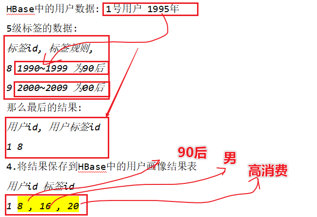
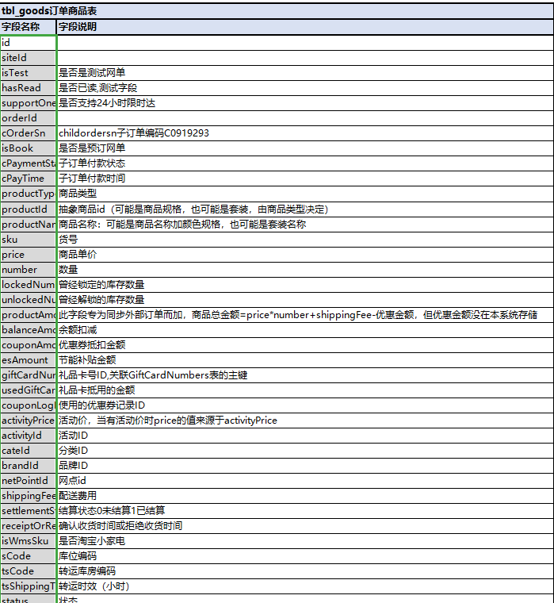
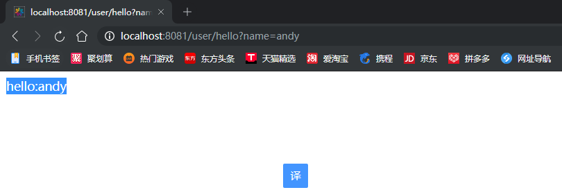
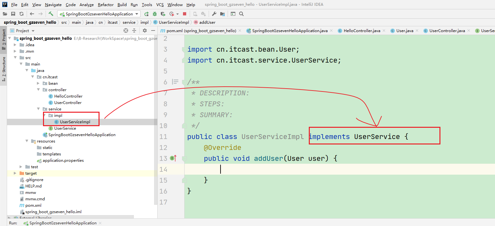
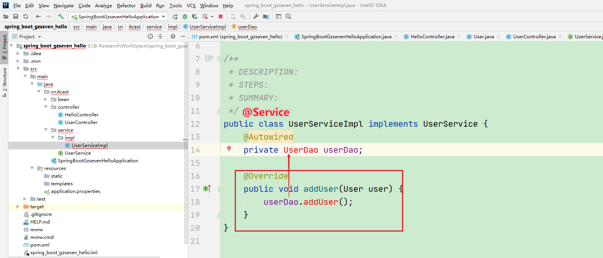

# 用户画像架构及标签管理

## 1-回顾

* 参考Xmind

## 2-重难点

* 理解用户画像架构
* 理解用户画像的技术选型
* 如何利用Web标签管理页面管理标签
* 了解SpringBoot的基本创建及使用
* 了解SpringBoot+springDataJpa使用

## 3-架构

* 
* 
* 
* 整体架构
* 

## 4-加深对指标理解

* 四级标签
  * 
* 更进一步理解
  * 
* Spark的整体任务的计算
  * 
  * 涉及到标签命名需要理解如何能够更好完成命名？
    * 男/男生/男神/man/........ 字符串表达很多
    * 90后，小鲜肉......
* Spark的标签计算的额方式
  * 1-加载MySQL中的1-4及标签和五级标签数据
  * 2-根据4级标签内容查询Hbase的用户相关数据
  * 3-根据标签规则结合Hbase中的用户的数据打上五级标签
  * 
  * 这里就是将用户和标签id存储在Hbase中，标签id会维护一张映射表自动关联五级标签

* 注意一下：
  * 每一个五级标签都应该有对应四级标签
    * 1级标签没有父id，设置父id=-1
    * 性别(4级标签)---pid
    * 男性和女性(5级标签)---pid(性别标签)
  * 
  * 完毕：

## 5-项目的人员配置及数据量

* 管理平台：SpringBoot+SpringJPA+Vue实现一套完整Web界面---Web工程师
* 标签调度：SpringBoot+Oozie方式调度(Java+大数据)-----大数据工程师
* 标签计算：Hbase+Spark-----大数据工程师
  * 基础标签：大数据工程师
  * 挖掘标签：数据挖局工程师，大数据算法工程师

* 周期

  * 人员:开发人员共计20余人.其中前端人员3,其余都是大数据开发工程师.大数据工程师都是来做标签开发的

    开发周期**:整个项目从立项到全部完工大约用了1年零3个月**.前端用时3个月.标签总共开发150个左右.

  * 大数据工程师

    * 大数据数据采集
    * 大数据数据数仓构建
    * 大数据分析
    * 大数据实时数据处理
    * 大数据用户画像标签系统

  * 建议大家可以写4-5名大数据开发工程师，2个同时做数据的ETL和数仓构建，3个同事做用户画像标签开发，匹配性和统计类型我们基本在1周完成2-3个标签，以为这里会涉及到跟用户沟通交流业务功能的确认，也是需要一定时间的

  * 外包公司：

    * 驻场外包-----外包到甲方
      * 面试：甲方需要参与面试(乙方初步面试，甲方面试)-
    * 外包公司内部开发-----项目外包
      * 面试：直接乙方面试即可
    * 外包公司拿到的数据都是测试数据，多的化在1-2T，几十万的用户数据
    * 在做项目的时候每天都会沟通，可能会知道甲方数据量到底是多大

* 数据量

  * 
  * 当前用户画像项目整体上是由静态数据和动态数据组成
    * 动态数据就是tbl_logs表---11个字段组成的
    * 
    * 用户静态的信息表---38个字段组成
    * 
    * 订单表--112个字段
      * 
    * 商品表---96个字段
      * 

* 在面试中询问你的关于数据量的问题都是问在你的数据仓中的数据量的计算
  * 如果询问到画像项目使用的数据量
    * 从一共从数据仓中获取了多少张表
    * 每个表抽取了那些字段
    * 可以举例说明一些字段的含义
  * 整个项目数据量包含两部分，一部分是增量数据采集，每天250G增量，每天5000万PV，每条数据在5K左右量级，另外一部分是历史全量的数据，目前有200PB。
  * 在用户画像项目中主要针对画像中所关系的指标从DWS层进行数据的抽取，一共抽取了四个表的数据分别是商品表，订单表，用户表和日志表，抽取的数据来源于最近1年的数仓中的数据迁移到Hbase中进行存储
  * 另外注意：如果遇到挖掘类标签面试官问到你关于数据量的问题，是应该按照
    * 训练一个USG模型，使用订单表和商品表数据，一共训练数据量100w样本，20个特征用于模型的训练，通过交叉验证和网格搜索得到最佳超参数，在得到模型
  * 数据量根据业务多大都可以，但是自己一定要能够算出来

* 总结：
  * 在实际业务场景中，需要自己明确数据量，一定要清楚数据仓库中有多少张表一共数据量多大，这里用户画像系统有多少张表，数据量多大，做了多少标签等

## 6-使用SpringBoot初体验

* 目标1：能够使用基础的SpringBoot完成demo体验
* 目标2：能够看懂SpringBoot的代码即可(这不是大数据开发的重点)

### 6-1步骤分析

* 注意：使用SpringBoot不需要配置tomcat，内置tomcat

* 创建Maven工程
* 需要选择Spring，Web及SQL的内容
* 需要加载配置文件---读取MySQL的URL等，用户名和密码
* 完成controller层的打印hello world

### 6-2根据步骤做

* 创建一个SPringBoot项目

* 
* 
* 
* 
* 
* 
* 接下来实现SpringBoot的helloWorld程序代码
* 
* 
* 
* 结果分析：
* 
* 
* 总结：
  * 通过SpringBoot+SPringJPA完成上述的简单任务
  * 在主类中会加载所有的spring的包及spring的相关注解类


## 7-整合SpringDataJPA完成查询操作

* SpringBoot整合SpringDataJPA方式完成查询
* SpringDataJPA是Spring推出的用来简化数据库操作的模块,底层默认使用的是Hibernae
* 整个流程：访问Controller--Service--Dao--Bean

### 7-1User

* 代码

* 

* 

* 

* 代码部分：

* ```java
  package cn.itcast.bean;
  
  import com.fasterxml.jackson.annotation.JsonIgnoreProperties;
  import lombok.Data;
  
  import javax.persistence.*;
  
  /**
   * DESCRIPTION:使用SPringBoot实现JavaBean的实体类
   * STEPS:使用Data的注解代替生成大量的get和set方法
   * SUMMARY:需要完成
   */
  @Data //对应的是自动生成get和set方法
  @Entity //使用Entity表名当前的类是实体类
  @JsonIgnoreProperties({"hibernateLazyInitializer", "handler"})
  public class User {
      @Id //当前字段对应于数据库中的ID
      @GeneratedValue(strategy = GenerationType.IDENTITY)//按照数据库自己的自增方式进行自增
      public Long id;
      @Column(name = "username")//表示该字段和数据库中的指定列相对应,如果名称一样可以省略
      public String username;
      public String password;
      public String nickname;
  }
  ```

### 7-2需求

* 需求的部分：

* 完成增加和查询的功能

*   //需求1:接收post请求并保存数据到MySQL

    //url: localhost:8081/user/add

    //post请求的参数可以在方法体中

    //username=jack

    //password=888

    //nickname=jackma

  //需求2:查询所有用户并返回findAll

   //需求:查询一个用户并返回findByOne

  //需求3:根据username和password查询

  [http://localhost:8081/user/findByUsernameAndPassword/jack/888](http://localhost:8081/user/findByUsernameAndPassword/jack/888888)

  //需求4:根据username和password查询,并执行指定的sql

  [http://localhost:8081/user/findBySQL/jack/8](http://localhost:8081/user/findBySQL/andy/66666)88

### 7-2需求1：增加用户

* 
* 
* 
* 
* 
* 
* 测试：
* 
* 
* 

* MySQL中结果
* 
* 完毕

### 7-3需求2：查询所有的用户

* 类似的写法

* 


### 7-4需求3：查询某一个用户-id

* 类似写法
* 

* 完毕

### 7-4需求4：根据用户名和密码进行查询

* 根据用户名和密码查询用户
* 

### 7-5需求5：根据SQL查询对应的用户名和密码

* 根据SQL完成查询
* 

* 完毕
* 注意：这部分代码切记因为findByUsernameAndPassword等出错导致Userbin无法注入

## 8-总结

* 理解用户画像架构
  * 
  * 关键步骤：标签计算
* 理解用户画像的技术选型
  * Web管理方面：SpringBoot和SpringJPA完成Web管理
  * 任务管理方面：oozie（结合SpringBoot完成任务调度）
    * 提交一个Spark的job给到Oozie去进行计算
    * SpringBoot整合Oozie完成界面上的人任务操作
  * 任务计算方面：SparkSQL方式计算-形成Job
    * SparkSQL整合Mysql，整合Hbase完成数据的读取和计算
  * 标签存储方面：Hbase方式，方便存储和查询
    * userid，tags
    * userid，tagsId(多个标签方式)
* 如何利用Web标签管理页面管理标签
  * SpringBoot和SpringJPA
* 了解SpringBoot的基本创建及使用
  * 参考课件简单跑一下[有时间]
* 了解SpringBoot+springDataJpa使用
  * 理解增加用户和查询用户