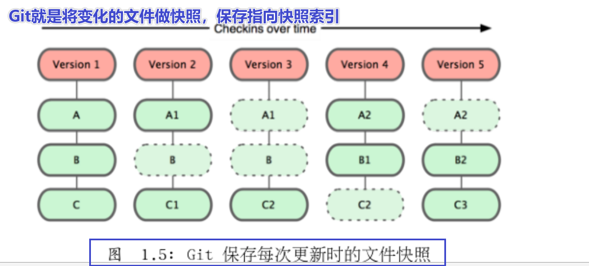
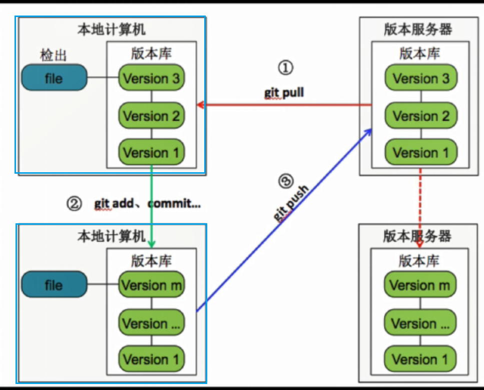
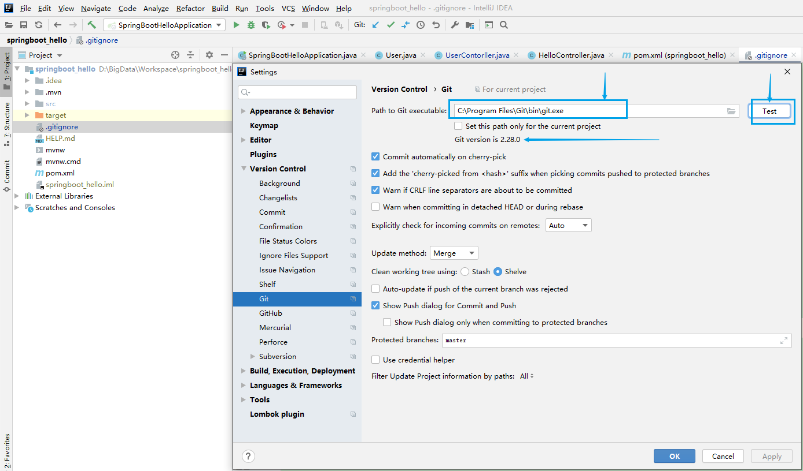
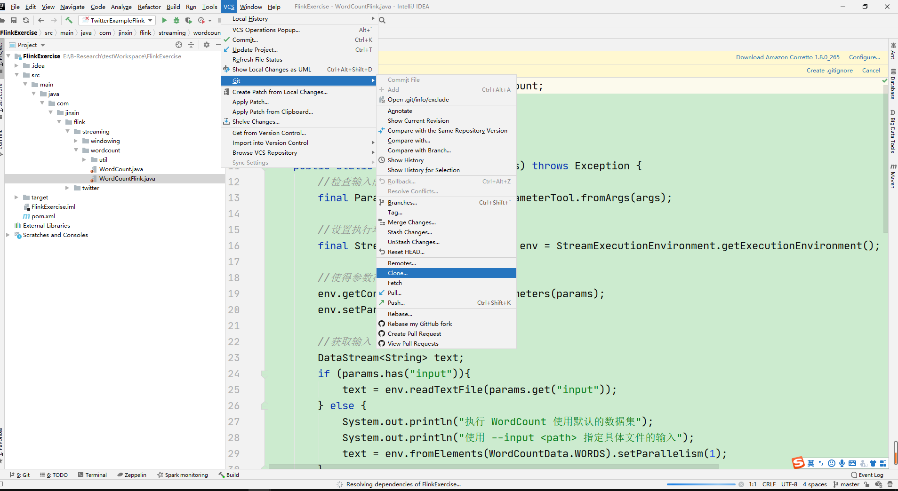
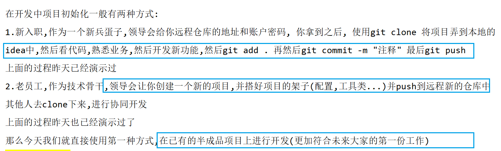
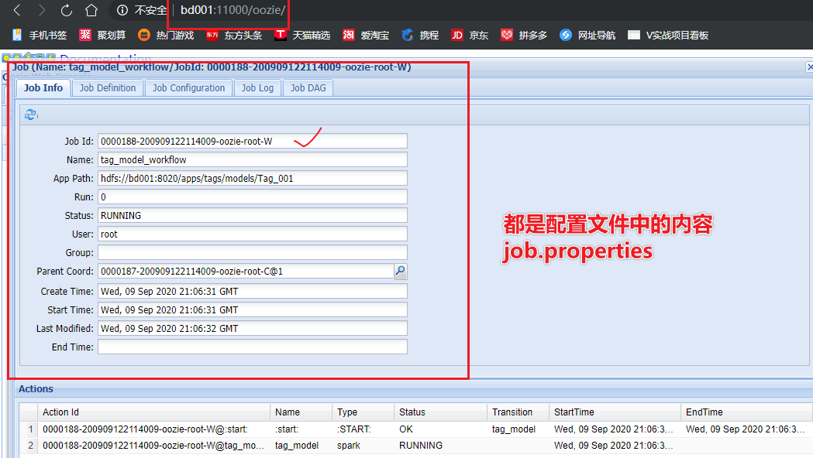
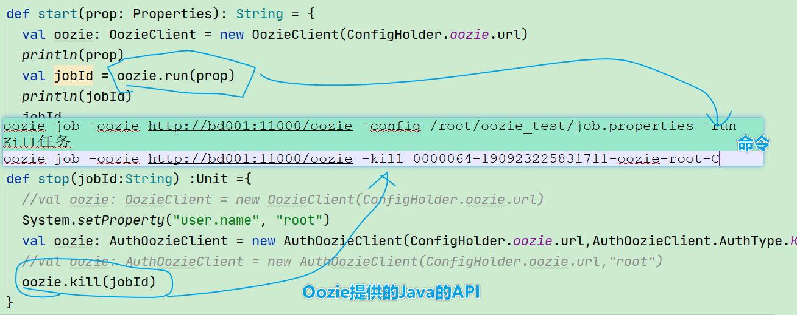
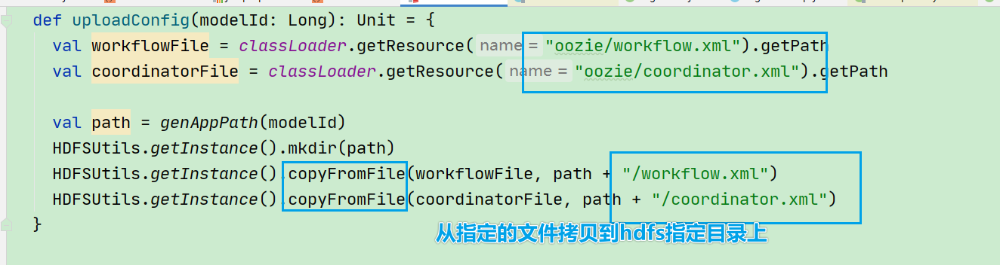
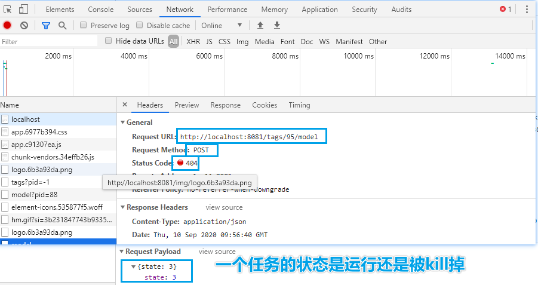

#  Git及用户画像标签和任务管理

## 1-回顾

* 参考Xmind

## 2-重难点知识

* Git的基础知识
* Git如何实现版本控制
* Git+Github+码云工具(受限于网络)
* Oozie**的基础回顾**
* Oozie的命令调度
* SpringBoot整合Oozie

## 3-Git的基础知识

* git代码版本工具

* 日常开发中常见的问题：

  * 备份
  * 代码还原
  * 协同修改
  * 多版本的项目管理
  * ***\*追溯问题代码的编写人和编写时间\****！
  * 权限控制
  * 解决方案：通过版本控制工具git

* 什么是版本控制工具及如何分类

  * 就是帮助完成开发常见的等问题
  * 本地版本控制：本地文件系统中建立不同文件版本，不方便多人协作
  * 集中 版本控制：使用一台集中的服务器，所有人拉取服务器上的版本的数据，代表SVN
  * 分布式版本控制工具：每个协作的人都会拿到当前的版本的快照，方便协同开发

* Git的原理

  * 

* Git如何保证版本的完整性

  * 

* Git的工作区域

  * 工作目录：写代码的地方

  * 暂存区域：.git下的index目录

  * 本地仓库：.Git目录下对应object

  * 

  * 基本的Git工作流程如下：

    ​	1、在工作目录中修改文件。***\*写代码\****

    ​	2、暂存文件，将文件的快照放入暂存区域。***\*add\**** 

    ​	3、提交文件，找到暂存区域的文件，将快照永久性存储到Git仓库目录。***\*Commit\****

* github远程仓库

* 码云远程仓库

## 4-Git如何实现版本控制

### 4-1Git安装

* 安装包
  * 
* 直接依次下一步只到结束
  * 
* 验证安装成功
  * 

### 4-2Git命令

* Git的基本配置
  * 学会使用增加用户名和邮箱等基本操作，使用git config
* Git的初始化仓库
  * git init
* Git命令
  * git add  *
  * git commit -m “” a.txt
  * git checkout
  * git reset sha1
* Git分支
  * 需求：希望在开发当前任务的同时也能够完成其他bug修复
  * 
  * 完成：
  * 
  * 提供多人协作开发效率

## 5-Git+Github+码云工具(受限于网络)

* 

* 

* **Github**

  * 如果去到公司后一般都是使用gitlab搭建的git服务器
  * 这里使用github和码云演示

* ```
  git config --global user.name "jack"
  git config --global user.email "jac@163.com"
  git config --list
  git init
  有新文件后
  git reset --hard 1809a6f0bfb6e8d74428385ba037bcb851fab156 返回到上一次提交状态
  git clone git的ssh地址
  ```

* IDEA整合

* 

* 编辑gitingore文件

  * 可以自己编辑也可以在plugins中安装
    * (具体内容可以参考文档中文件gitignore)
  * 可以在配置文件中说明那些文件不放入上传到远程仓库的内容

* 连接Git

  * 

* 连接Github

  * 

* 通过VCS上传代码

  * 

* 提交文件更改

  * 
  * 
  * 

* 处理分支

* clone代码

  * 
  * 在根据版本进行maven的配置加载jar等

* 需要注意的是：

  * 

## 6-项目搭建

* 
* 
* 

### 6-2项目启动

* 1-准备bd001虚拟机，内部已经安装好了各个大数据组件

* cd ~

* bd.sh start 开启大数据应用进程

* bd.sh stop 关闭大数据应用进程

* 2-准备IDEA的项目

* userprofile_bak--用户画像项目

* 3-模块划分为三大块

* （1）platForm

* （2）common

* （3）**model**

* 4-启动Web部分，创建标签

* 

* 

* 

* 

* 

* 4级标签还对应一个Spark计算任务,所以在另一张表中,还有会有一个记录

* 总结：

* 新建12345级标签操作的是数据库的**tbl_basic_tag**表,表中存储了标签的详细信息,如**标签名,标签规则,标签父id**

  新建4级标签的时候还会操作**tbl_model**表,表中存储了**该标签/模型/Spark计算任务的任务详情,什么时候开始,结束,jar在哪.**...

  注意:tbl_basic_tag表中存储的4级标签信息包括如下的信息,**因为4级标签对应一个Spark计算任务,4级标签中就记录了该任务需要的数据从哪来**

### 6-2了解标签Web界面

* 以1-3级标签为例大家需要看得懂就行了

* 整个**SpringBoot+SPringDataJPA**方式构建1-5级标签的增删改查和文件上传

* 从controller层出发，到Serive，到repo层(dao层)，Po层

* #### 增加1-3级标签

* （1）增加1-3级标签，使用对应url查询

* 

* （2）在service中interface和serviceImpl实现类

* 

* （3）具体的ServiceImpl的实现类

  * 和tagPo进行交互将对应的id设置

* 

* （4）和数据库交互的tagPo类

* 

* ### 四级标签

* （1）使用postMapping增加四级标签

* 

* （2）调用addTagModel方法传入tag和model

* 

* （3）这里ModelDto是和Web交互的类

* 

* （4）通过convert方法将tagDto转化为Po

* 

* ### 1-3级显示

* （1）标签是否显示的操作

* 

* 

* 

* ### 文件上传

* 使用的是hdfs的工具类完成上传的操作

* 

* 完毕

## 6-Oozie**的基础回顾**

* 对比Oozie和Azkaban

* 
* 记忆：
  * 1-Oozie是通过XML配置，Azkban通过peroperties定义
  * 2-Oozie支持RestAPI，JavaAPI等操作，Azkaban仅仅支持Web界面
  * 3-Oozie指定的是DAG有向无环图，有一定失败重试机制
* Oozie的结构
  * 
    * workflow是对要进行的**顺序化工作**的抽象
    * coordinator是对要进行的**顺序化的workflow**的抽象
    * bundle是对一堆coordiantor的抽象
  * Oozie提交的就是一个MR的Job任务，底层跑的就是MR
* Oozie的Job组成
  * 一个oozie 的 job 一般由以下文件组成：
    * job.properties ：记录了job的属性
    * 
    * workflow.xml ：使用hPDL 定义任务的流程和分支
      * 里面封装的是mapper类和reducer类以及输入类类型和输出类类型
    * lib目录：用来执行具体的任务
      * 在workflow工作流定义的同级目录下，需要有一个lib目录，在lib目录中存在java节点MapReduce使用的jar包。
* 总结：
  * 对于Oozie特点：
    * Oozie是管理Hadoop任务的而工作流，Oozie调度基于Hadoop
    * Workflow是基于DAG的有向无环图
    * Oozie Coordinator jobs 是可以被时间-频率-可用时间触发
    * Oozie可以和其他的系统集成，如项目中使用的是RestAPI
  * Oozie原理：
    * workflow是对要进行的**顺序化工作**的抽象
    * coordinator是对要进行的**顺序化的workflow**的抽象
    * bundle是对一堆coordiantor的抽象
    * 一个Job需要依赖三个文件
      * 1-job.properties ：记录了job的属性
      * 2-workflow.xml ：使用hPDL 定义任务的流程和分支
      * 3-lib目录
    * 
    * 

## 7-Oozie的命令调度[掌握]

* job.properties

* 

* workflow.xml

* 

* coordinator.xml

* 

* 时间的crontab的表示是：0/10 * * * *

* 

* ### 测试

* 首先明确，需要按照oozie的要求

  * 一个job的调度需要

    * 1-job.properties ：记录了job的属性
    * 2-workflow.xml ：使用hPDL 定义任务的流程和分支
    * 3-lib目录
      * 将jar包(当前的一个任务已经做好的任务)

  * 准备部分

  * ```
    在HDFS上建立如下文件夹
    hdfs dfs -mkdir -p /apps/tags/models/Tag_001/lib
    将案例中的文件上传到HDFS
    hdfs dfs -put job.properties /apps/tags/models/Tag_001/
    hdfs dfs -put coordinator.xml /apps/tags/models/Tag_001/
    hdfs dfs -put workflow.xml /apps/tags/models/Tag_001/
    hdfs dfs -put model29.jar /apps/tags/models/Tag_001/lib
    ```

  * 测试

  * Ooziei的各种命令

  * 查看所有普通任务

  * oozie  jobs -oozie http://bd001:11000/oozie

    * 

  * oozie jobs -jobtype coordinator -oozie http://bd001:11000/oozie

    * 

  * oozie job -oozie http://bd001:11000/oozie -config /root/oozie_test/job.properties -run

    * 

  * oozie job -oozie http://bd001:11000/oozie -config /root/oozie_test/job.properties -run

    * 

  * oozie job -oozie http://bd001:11000/oozie -kill 0000064-190923225831711-oozie-root-C

    * 

* 思考：上述通过命令调度，在项目中整合oozieAPI整合SpringBoot完成调度
  * 在这里会发现通过命令行调度是不符合当前的项目需求
  * 需要整合SpringBoot和oozie

## 8-SpringBoot整合Oozie[理解]

* 需求：根据架构图需要整合SpringBoot和oozie完成任务的自动化管理
* 
* Oozie工具类
* 
* 
* 

* 根据需求完成SpringBoot整合Oozie
* 
* 
* 

* 
* 测试
* 
  * 当开启任务的时候数据的model_name和state都会改变
* 数据库
* 
* 总结
  * 在简历上写了
    * **能够基于SPringBoot整合Oozie完成Spark的任务的定时调度**
    * 过程：
    * 1-公司选型选择的是Oozie，有一套关于Oozie和Hadoop的API的工具类
    * 2-使用SpringBoot封装Controller层代码，调用tagService层代码
    * 3-实现tagService层的实现类，完成从前端界面获取id封装成ModelDto类，会根据前端的web界面的状态如果是3就是当前的状态是Ennable，如果是4相当于stop了，最终使用ModelDto保存状态信息
    * 4-关于执行Oozie的Job的启动是通过EngineImpl实现类完成Oozie的配置文件生成、Ooziie的配置文件上传到HDFS中，因为Oozie的运行需要特定格式，从而调用工具类的start方法返回Jobid
  * Oozie的运行需要特定格式
    * job.properties
    * workflow.xml
    * coordonate.xml
    * lib目录/运行任务的jar包

## 9-总结

* Git的基础知识
  * git init初始化仓库
  * git add 。加入暂存区
  * git commit -m “” 提交代码到本地仓库
  * git push origin master
* Git如何实现版本控制
  * Git如何保证版本的一致性---SHA-1算法
* Git+Github+码云工具(受限于网络)
  * 远程仓库
* Oozie**的基础回顾**
* Oozie的命令调度
* SpringBoot整合Oozie