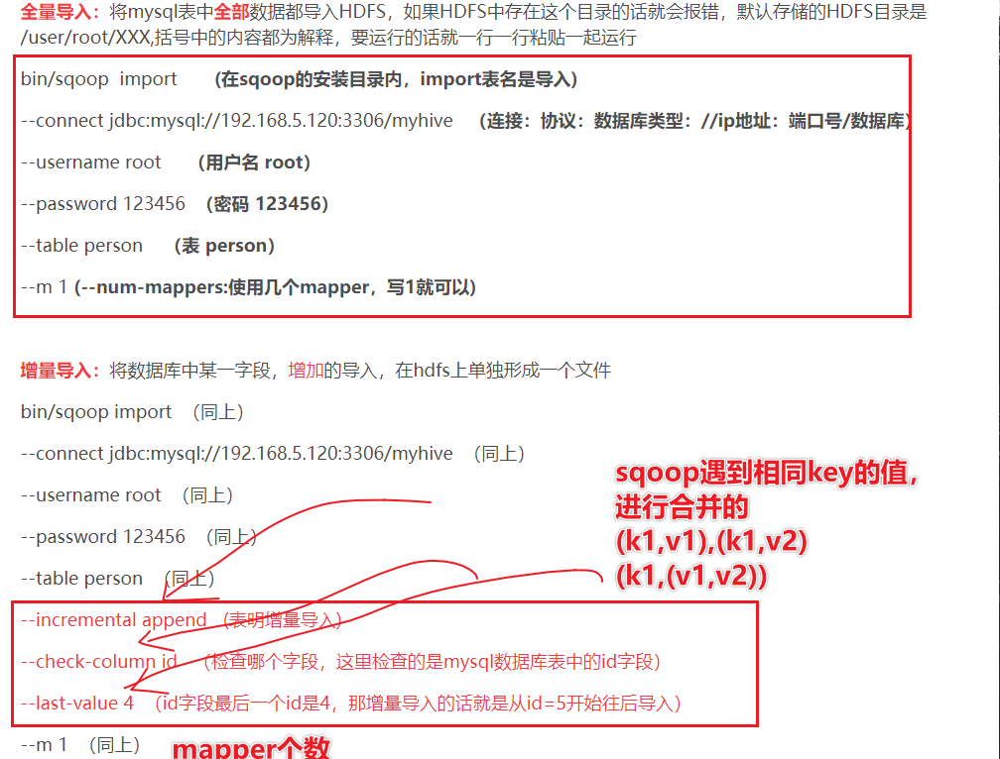
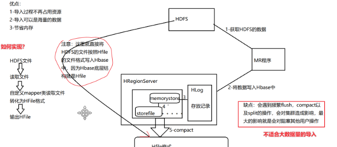
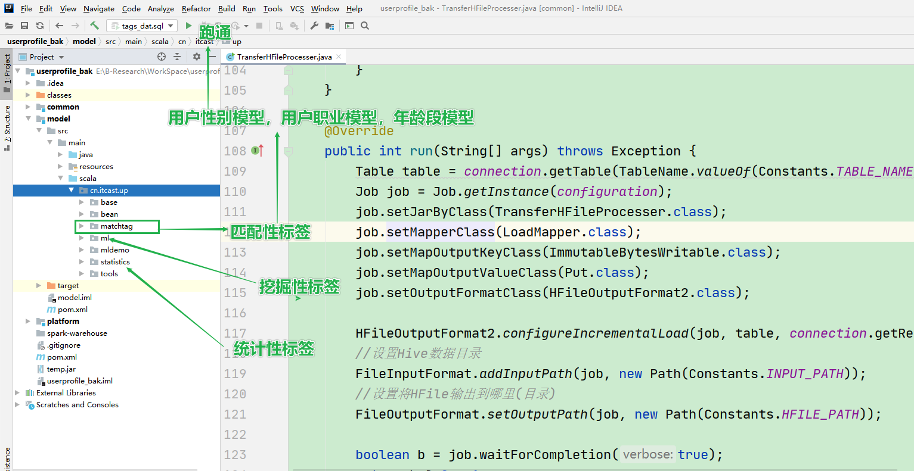

# 数据接入及画像基础标签流程

## 1-回顾

## 2-重点知识点

* 理解业务数据的流转(结合架构图)
* 理解数据的接入的流程(MySQL-Hive-Hbase)
* 理解标签的具体的业务含义(用户性别标签-规则匹配)
* 掌握用户性别标签的流程
* 理解Oozie结合用户性别标签如何打通流程

## 3-理解业务数据的流转(结合架构图)

* 

* 分析数据的流向：

  * 1-原始Flume数据来源---tbl_logs

    * (1)埋点格式11个字段使用Json返回
      {id,log_id,remote_ip,site_global_session,loc_url，log_time}
      (2)将埋点日志落到本地的文件夹
      (3)flume配置source-sink-channel完成数据采集到Kafka和HDFS(Hive)

    * Flume部分

      * http://flume.apache.org/releases/content/1.9.0/FlumeDeveloperGuide.html#sink

      * 

      * Flume的事务

      * 

      * Flume的自定义sink

      * 

      * Flume自定义source

      * 

      * Flume的配置文件

      * ```
        flume配置文件
        ## 组件定义
        a1.sources=r1 r2
        a1.channels=c1 c2
        a1.sinks=k1 k2
        ## source1
        #用户画像来源于采集的本地文件系统的文件的更新
        ## kafka start 主题源数据
        a1.sources.r1.type = org.apache.flume.source.kafka.KafkaSource
        a1.sources.r1.batchSize = 5000
        a1.sources.r1.batchDurationMillis = 2000
        a1.sources.r1.kafka.bootstrap.servers = elk-01:9092,elk-02:9092,elk-03:9092
        a1.sources.r1.kafka.zookeeperConnect = elk-01:2181,elk-02:2181,elk-03:2181
        a1.sources.r1.kafka.topics=topic_start
        ## source2
        ## kafka event 主题源数据
        ## channel1
        a1.channels.c1.type=memory
        a1.channels.c1.capacity=100000
        a1.channels.c1.transactionCapacity=10000
        ## channel2
        a1.channels.c2.type=memory
        a1.channels.c2.capacity=100000
        a1.channels.c2.transactionCapacity=10000
        ## sink1
        ## 主题 start 数据输出到 hdfs 的路径
        a1.sinks.k1.type = hdfs
        a1.sinks.k1.hdfs.path = /origin_data/gmall/log/topic_start/%Y-%m-%d
        a1.sinks.k1.hdfs.filePrefix = logstart￾a1.sinks.k1.hdfs.round = true
        a1.sinks.k1.hdfs.roundValue = 30
        a1.sinks.k1.hdfs.roundUnit = second
        ##sink2
        ## 主题 event 数据输出到 kafka 的路径
        
        ```

      * 完成

    * 原始业务数据的Sqoop的数据导入:tbl_users,tbl_goods,tbl_orders

      * Sqooq在结构化和非结构化数据之间完成数据的导入和导出
      * Sqoop的导入方式有几种？
        * 全量导入：直接到Hive中
        * 增量导入：需要制定hive的warehouse的地址
      * Sqoop的参数说明
      * 
      * Sqoop的全量和增量导入区别
        * 注意：需要指定inceremental append 增量导入
        * 注意：--last-value指定导入的阈值，从该阈值之后的值顺次导入
      * 
      * 项目中Sqoop导入的文本
        * 全量导入
        * 
        * 注意：业务数据以周为单位需要定时更新数据

  * 2-到Hive

    * 实验-采用的是CDH平台Hadoop集群

      * CM-----------管理CDH的监控和状态的BS的管理平台
      * CDH---------稳定的大数据技术框架发行版
      * CDH版本-大数据框架版本**(hadoop2.6.0-cdh5.14.0)**

    * 了解CM+CDH优势

      * 可以避免手动配置集群
      * 可以利用Web界面监控优势
      * 可以利用Web界面控制配置

    * 理解CM+CDH架构

      * **CM(集群的管理)+CDH(大数据发行版本)**
      * 核心组件：
      * 0. Server提供统一的UI和API方便用户和集群上的CDH以及其它服务进行交互
      * 1. Agent：安装在每台主机上的代理服务。它负责启动和停止进程，解压缩配置，触发安装和监控主机 
        2. Management Service：执行各种监控、报警和报告功能的一组角色的服务
        3. Database：CM自身使用的数据库，存储配置和监控信息
        4. Cloudera Repository：云端存储库，提供可供Cloudera Manager分配的软件
        5.  用于与服务器进行交互的接口，包含Admin Console和API
      * 

    * 了解CM+CDH搭建

      * 安装CM+CDH分为离线安装和在线安装
      * 企业中都是离线安装
      * CDH包
      * https://archive.cloudera.com/cdh6/6.2.1/parcels/
      * 
      * CM包
      * 

    * 进入界面

      * 
      * 

    * Oozie

      * 
      * 

    * 使用sql脚本从本地导入到集群中的MySQL中

      * 通过脚本sql文件导入集群环境的hadoop01数据
      * 
      * 结果
      * 

    * 使用hue+hive建立数据库

      * 

      * 使用hue+oozie完成mysql数据的导入**(可以使用Sqoop)**

      * 直接执行Sqoop的脚本

      * ```
        #!/bin/sh
        
        sqoop import \
        --hive-import \
        --create-hive-table \
        --hive-table tags_data.tbl_goods \
        --connect "jdbc:mysql://hadoop01:3306/tags_dat" \
        --username root \
        --password 123456 \
        --query "SELECT * FROM tags_dat.tbl_goods WHERE \$CONDITIONS" \
        --split-by id \
        --direct \
        --target-dir /user/admin/data_exchange/tags_data \
        --m 2
        
        sqoop import \
        --hive-import \
        --create-hive-table \
        --hive-table tags_data.tbl_goods_new \
        --connect "jdbc:mysql://hadoop01:3306/tags_dat" \
        --username root \
        --password 123456 \
        --query "SELECT * FROM tags_dat.tbl_goods_new WHERE \$CONDITIONS" \
        --split-by id \
        --direct \
        --target-dir /user/admin/data_exchange/tags_data \
        --m 2
        
        sqoop import \
        --hive-import \
        --create-hive-table \
        --hive-table tags_data.tbl_logs \
        --connect "jdbc:mysql://hadoop01:3306/tags_dat" \
        --username root \
        --password 123456 \
        --query "SELECT * FROM tags_dat.tbl_logs WHERE \$CONDITIONS" \
        --split-by id \
        --direct \
        --target-dir /user/admin/data_exchange/tags_data \
        --m 2
        
        sqoop import \
        --hive-import \
        --create-hive-table \
        --hive-table tags_data.tbl_orders \
        --connect "jdbc:mysql://hadoop01:3306/tags_dat" \
        --username root \
        --password root \
        --query "SELECT * FROM tags_dat.tbl_orders WHERE \$CONDITIONS" \
        --split-by id \
        --direct \
        --target-dir /user/admin/data_exchange/tags_data \
        --m 2
        
        sqoop import \
        --hive-import \
        --create-hive-table \
        --hive-table tags_data.tbl_users \
        --connect "jdbc:mysql://hadoop01:3306/tags_dat" \
        --username root \
        --password 123456 \
        --query "SELECT * FROM tags_dat.tbl_users WHERE \$CONDITIONS" \
        --split-by id \
        --direct \
        --target-dir /user/admin/data_exchange/tags_data \
        --m 2
        ```

      * 完成

      * 该步骤中午测试直接上上传到Hive

      * 问题解决：

      * 

      * 1-在使用Sqoop做数据的导入的时候，hdfs上是不能自己创建文件夹的，Sqoop会自动创建

      * 2-需要在Hive中创建数据库tags_data

      * 

  * 3-Hive到Hbase画像业务数据存储

    * Hbase原理回顾
    * Hbase为什么加载Hive的数据需要使用哪个BulkLoader
    * Hbase使用哪一个工具类可以直接使用

## 4-理解数据的接入的流程(MySQL-Hive-Hbase)

3-Hive到Hbase画像业务数据存储

* Hbase原理回顾

  * 

  * 每个 cell中，不同版本的数据按照时间倒序排序，即最新的数据排在最前面

  * 每个Region Server维护一个Hlog,而不是每个Region一个

  * flush机制触发的两个条件：

    1.（hbase.regionserver.global.memstore.size）默认;堆大小的40%

    regionServer的全局memstore的大小，超过该大小会触发flush到磁盘的操作,默认是堆大小的40%,而且regionserver级别的flush会阻塞客户端读写

    2.（hbase.hregion.memstore.flush.size）默认：128M

    单个region里memstore的缓存大小，超过那么整个HRegion就会flush, 
    
  * compact机制：
  
    *  把小的storeFile文件合并成大的Storefile文件。  
  
  * Split机制
  
    * 当Region达到阈值，会把过大的Region一分为二。
  
      默认一个HFile达到10Gb的时候就会进行切分，两个Region仍然在同一个Server上
  
  * HBase的读写流程
  
    * 
  
  * HFIle数据格式
  
  * 
  
  * 
  
  * H'Base的底层数据结构就是File的方式
  
* Hbase加载数据的方式(外部介质无论是hive还是mysql)

  * 两种加载方式
    * 1-直接一条一条的数据进行put
    * 
    * 2-可以借助于Hfile的指定的BulkLoader方式加载
    * 
    * 
    * 使用mapreduce代码完成数据的导入
      * **HFileOutputFormat2数据的格式类**

* Hbase为什么加载Hive的数据需要使用哪个BulkLoader

  * 

* Hbase使用哪一个工具类可以直接使用

  * 在用户画像项目中使用的是
    * Spark 读取 Hive 的数据
    * 生成 HFile
    * 通过 HBase 的 BulkLoad API 把 HFile 直接交给 RegionServer
    * RegionServer 切分, 直接放入对应的 Region
  * 原版代码中
    * 
  * 利用
  * https://github.com/hortonworks-spark/shc/
  * 
  * 

## 5-理解标签的具体的业务含义(用户性别标签-规则匹配)

* 业务4个表的数据查看

* 
* 架构图
* 
* 什么是标签？
  * 用户画像就是给用户打标签，根据用户的行为数据和用户的业务数据进行标签化
* 有哪些标签？
  * 规则匹配类的标签：1周开发2-3个
  * 统计类的标签：1周开发2-3个
  * 挖掘类表亲：1周开发1个
* 使用那些技术打标签？
  * Spark读取MySQL中规则-4和5级标签 
  * SPark整合Hbase的数据源完成业务数据的读取
  * Spark整合Hbase完成画像结果数据的写入Hhase中
* 标签结果存储在哪里？
  * 存储在Hbase中，Hbase的存储可以是动态方式
  * 可以设置**：列簇：CF：detail userid tagsid**
* 标签的具体含义是什么？
  * 规则匹配类的标签：
    * 就是利用规则对现有的用户数据进行匹配
    * 1998年出生孩子 属于90后 规则：1990-2000年出生的都是90后
    * 给孩子打上90后的标签
  * 统计类的标签：1周开发2-3个
    * 消费能力标签
    * 大于1000元 属于高消费学生
    * 500-1000元 属于中消费标签
    * 小于500 属于低消费人群
  * 挖掘类标签：1周开发1个
    * 通过机器学习的方法构建机器学习模型，对用户进行预测
    * 用户购物性别模型-USG模型
      * 购物性别是男，女
      * 通过机器学习的监督学习建模
        * 需要数据集是有特征(用户的特征+商品特征)有标签列(符合购买比例超过60%用户就是男性或女性)
        * 使用机器学习分类算法构建分类模型实现购物性别的预测
      * 首先在商城中定义很多的
        * 女性用户常购买的商品，如mac，xxx
        * 男性用户常购买的商品，电子产品，mac
* 标签如何调度？
  * 标签调度需要结合oozie调度
* 标签数量
  * 匹配型和统计型占比80%，剩下的是算法挖掘标签
* 项目架构
  * 
  * 开发的代码应该放在model中
  * 
* Hbase和Spark整合的工具类[了解]
  * 首先Spark本身也有Hbase的整合类，不方便使用
  * 自己维护一套Hbase和SparkSQL的工具类
    * Spark如何读取Hbase的数据
    * Spark程序如何将结果写入Hbase中

## 6-掌握用户性别标签的流程

* 

### 6-1新建标签

* 流程：

* 1-新建标签

  * 新建1-3级标签：电商-玛商城-人口属性

  * 新建4级标签：性别，一个4级标签对应的就是一个Spark的Job

    * 

    * 数据库表中

    * ```
      标签名称：性别
      标签分类：电商-某商城-人口属性
      更新周期：
      业务含义：注册会员的性别
      标签规则：
      inType=hbase
      zkHosts=bd001
      zkPort=2181
      hbaseTable=tbl_users
      family=detail
      selectFieldNames=id,gender
      程序入口：
      	cn.itcast.tags.models.rule.GenderModel
      算法名称：
      	MATCH
      算法引擎：
      	tags-model_2.11.jar
      模型参数：
      	--driver-memory 512m --executor-memory 512m --num-executors 1 --executor-cores 1
      ```

    * 

  * 新建5级标签：男，女

    * 

    * ```
      1）、属性值【男】
      	标签名称：男
      	标签含义：注册会员性别男
      	标签规则：1
      2）、属性值【女】
      	标签名称：女
      	标签含义：注册会员性别女
      	标签规则：2
      ```

    * 完成

  * 

* 2-标签的计算流程

  * 1-初始化SPark的环境
  * 2-SPark读取Mysql的数据，获取从哪个数据库那个表哪个字段中获取数据
  * 3-获取四级标签
  * 
  * inType=HBase##zkHosts=192.168.10.20##zkPort=2181##hbaseTable=tbl_users##family=detail##selectFields=id,gender
  * 4-处理规则的数据为Hbase的map结构
  * 
  * 5-SParkSQL整合Hbase读取业务的关键数据
    * hbaseTable=tbl_users##family=detail##selectFields=id,gender
    * 从Hbase中获取用户的id和gender
  * 6-需要读取MySQL的五级标签
  * 
  * 7-将MySQL的五级标签和对应Hbase的用户的业务数据进行整合
  * 
  * 8-给用户打上标签
  * 9-将标签保存起来
    * 保存到Hbase的test表中
    * 

### 6-3代码

* 代码

* ```scala
  package cn.itcast.up.matchtag.gzmatchtag
  
  import java.util
  import java.util.Properties
  
  import cn.itcast.up.bean.HBaseMeta
  import org.apache.spark.SparkConf
  import org.apache.spark.sql.expressions.UserDefinedFunction
  import org.apache.spark.sql.{DataFrame, Dataset, Row, SparkSession}
  
  /**
   * DESC:完成的性别标签的开发
   * 1.准备Spark开发环境
   * 2.读取MySQL数据
   * 3.读取和性别标签相关的4级标签rule并解析
   * 4.根据4级标签加载HBase数据
   * 5.读取和性别标签相关的5级标签(根据4级标签的id作为pid查询)
   * 6.根据HBase数据和5级标签数据进行匹配,得出userId,tagsId
   * 7.将userId,tagsId保存到HBase
   * 8.结果写入HBase
   */
  object GenderModel {
    def main(args: Array[String]): Unit = {
      //1.准备Spark开发环境
      val conf: SparkConf = new SparkConf().setAppName("GenderModel").setMaster("local[*]")
      val spark: SparkSession = SparkSession.builder().config(conf).getOrCreate()
      spark.sparkContext.setLogLevel("WARN")
      import spark.implicits._
      import org.apache.spark.sql.functions._
      //2.读取MySQL数据
      val url: String = "jdbc:mysql://bd001:3306/tags_new?useUnicode=true&characterEncoding=UTF-8&serverTimezone=UTC&user=root&password=123456"
      val tableName: String = "tbl_basic_tag"
      val properties: Properties = new Properties()
      val mysqlDF: DataFrame = spark.read.jdbc(url, tableName, properties)
      println("====================1-MySqlDF===================================")
      //mysqlDF.show(false)
      //mysqlDF.printSchema() //rule: string (nullable = true)
      /*|4  |性别  |null    |inType=HBase##zkHosts=192.168.10.20##zkPort=2181##hbaseTable=tbl_users##family=detail##selectFields=id,gender  |null    |4    |3  |2019-10-26 10:47:32|2019-10-26 10:47:32|null |null  |
        |5  |男   |null    |1                                                                                                              |null    |5    |4  |2019-10-26 10:49:33|2019-10-26 10:49:33|null |null  |
        |6  |女   |null    |2                                                                                                          |null    |5    |4  |2019-10-26 10:49:44|2019-10-26 10:49:44|null |null  |  */
      //3.读取和性别标签相关的4级标签rule并解析
      println("====================2-FiveRule===================================")
      val fourRuleDS: Dataset[Row] = mysqlDF.select("rule").where("id=4")
      //mysqlDF.select("rule").where('id === 4).show()
      //mysqlDF.select("rule").where(col("id") === 4).show()
      //如何将fourRuleDS转化为map结构-Map[String, String]
      //inType=HBase
      // zkHosts=192.168.10.20
      // zkPort=2181
      // hbaseTable=tbl_users
      // family=detail
      // selectFields=id,gender
      //1-首先需要将数据按照map的类型要求转化为[String, String]
      //2-根据##切分字符串形成key-value的类型
      //3-将key-value的数据通过=号进一步切分
      //4-转化为map的类型数据，最终形成fourRuleMap
      val fourArrayDS: Dataset[Array[(String, String)]] = fourRuleDS.map(row => {
        val rowStr: String = row.getAs[String]("rule")
        val rowArray: Array[String] = rowStr.split("##")
        rowArray.map(kvs => {
          val kvStr: Array[String] = kvs.split("=")
          (kvStr(0), kvStr(1))
        })
      })
      //fourArrayDS.show(false)
      //[[inType,HBase], [zkHosts,192.168.10.20], [zkPort,2181], [hbaseTable,tbl_users], [family,detail], [selectFields,id,gender]]
      val fourRuleMap: Map[String, String] = fourArrayDS.collectAsList().get(0).toMap
      /* val fourArrayList: util.List[Array[(String, String)]] = fourArrayDS.collectAsList()
      val fourArrayTuple: Array[(String, String)] = fourArrayList.get(0)
      val fourRuleMap: Map[String, String] = fourArrayTuple.toMap*/
      //fourRuleMap.foreach(println(_))
      //(selectFields,id,gender)
      //(inType,HBase)
      //(zkHosts,192.168.10.20)
      //(zkPort,2181)
      //(hbaseTable,tbl_users)
      //(family,detail)
      //4.根据4级标签加载HBase数据
      println("====================3-hbaseDF===================================")
      val hbaseMeta: HBaseMeta = HBaseMeta(fourRuleMap)
      //使用hbase和spark整合的工具类实现SPark自定义hbase的数据源
      val hbaseDF: DataFrame = spark.read.format("cn.itcast.up.tools.HBaseSource")
        .option(HBaseMeta.INTYPE, hbaseMeta.inType)
        .option(HBaseMeta.ZKHOSTS, hbaseMeta.zkHosts)
        .option(HBaseMeta.ZKPORT, hbaseMeta.zkPort)
        .option(HBaseMeta.HBASETABLE, hbaseMeta.hbaseTable)
        .option(HBaseMeta.FAMILY, hbaseMeta.family)
        .option(HBaseMeta.SELECTFIELDS, hbaseMeta.selectFields)
        .load()
      //hbaseDF.show()
      /*  +---+------+
          | id|gender|
          +---+------+
          |  1|     2|
          | 10|     2|
          |100|     2|
          |101|     1|*/
      //5.读取和性别标签相关的5级标签(根据4级标签的id作为pid查询)
      println("====================4-fiveDF===================================")
      val fiveDF: DataFrame = mysqlDF.select("id", "rule").where('pid === 4)
      val fiveRuleDS: Dataset[(String, Long)] = fiveDF.as[(Long, String)].map(row => {
        (row._2, row._1)
      })
      //fiveRuleDS.show()
      /* +---+---+
       | rule| tagsid|
       +---+---+
       |  1|  5|
       |  2|  6|
       +---+---+*/
      println("====================5-fiveMap===================================")
      val fiveRuleMap: Map[String, Long] = fiveRuleDS.collect().toMap
      val genderToLabel: UserDefinedFunction = spark.udf.register("genderToLabel", (gender: String) => {
        fiveRuleMap(gender)
      })
      //6.根据HBase数据和5级标签数据进行匹配,得出userId,tagsId
      println("====================6-resultDF===================================")
      val resultDF: DataFrame = hbaseDF.select('id.as("userid"), genderToLabel('gender).as("tagsid"))
      // hbaseDF.select('id.as("userid"), callUDF("gender", col("gender")).as("tagsid"))
      resultDF.show()
      /*+------+------+
      |userid|tagsid|
      +------+------+
      |     1|     6|
      |    10|     6|
      |   100|     6|
      |   101|     5|
      |   102|     6|
      |   103|     5|
      |   104|     5|
      |   105|     6|*/
      //7.将userId,tagsId保存到HBase
      resultDF.write.format("cn.itcast.up.tools.HBaseSource")
        .option(HBaseMeta.INTYPE, hbaseMeta.inType)
        .option(HBaseMeta.ZKHOSTS, hbaseMeta.zkHosts)
        .option(HBaseMeta.ZKPORT, hbaseMeta.zkPort)
        .option(HBaseMeta.HBASETABLE, "test")
        .option(HBaseMeta.FAMILY, hbaseMeta.family) //默认的就是detail
        .option(HBaseMeta.SELECTFIELDS, "userid,tagsid")
        .option(HBaseMeta.ROWKEY,"userid")
        .save()
      //8.结果写入HBase
      spark.stop()
    }
  }
  ```

### 6-4流程总结

* 1-从Mysql中读取四级标签
* 2-整合Spark和Hbase的数据源，使用HbaseMeta类
* 3-读取五级标签，转化为map
* 4-使用udf函数，将用户数据通过udf函数打上对应tagid的标签
* 5-使用SPark和Hbase的自定义数据源写入Hbase中

## 7-理解Oozie结合用户性别标签如何打通流程

## 8-总结

* 理解业务数据的流转(结合架构图)
  * 对于架构图一定要理解清楚
* 理解数据的接入的流程(MySQL-Hive-Hbase)
  * CM+CDH--自己动手玩一下
  * 了解数据源到达Hive和Hbase中
  * 对Flume和Sqoop回顾的点总结
* 理解标签的具体的业务含义**(用户性别标签-规则匹配)**
  * 规则匹配，就是使用规则进行对应类型匹配
* 掌握用户性别标签的流程
  * 1.准备Spark开发环境
    2.读取MySQL数据
    3.读取和性别标签相关的4级标签rule并解析
    4.根据4级标签加载HBase数据
    5.读取和性别标签相关的5级标签(根据4级标签的id作为pid查询)
    6.根据HBase数据和5级标签数据进行匹配,得出userId,tagsId
    7.将userId,tagsId保存到HBase
    8.结果写入HBase

