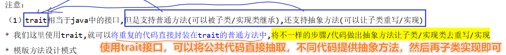

# 规则匹配类标签和统计类标签

## 1-回顾

* 

## 2-重难点知识

* Oozie的调度用户性别标签执行整个流程
* 分析用户职业标签思路
* 完成用户职业标签代码
* 分析用户年龄段标签思路
* 完成用户年龄段标签思路
* 代码模板重构
* 基于代码模板完成用户年龄段标签
* 分析消费周期标签-统计性标签

## 3-Oozie的调度用户性别标签执行整个流程

* Oozie的调度
  * 配置job.properties文件
  * 利用workflow.xml文件和coordinator.xml文件去调度
  * 需要将jar包传到同级的lib目录下
* 需求：将用户的性别模型标签打包执行使用Oozie调度
  * 步骤：
    * 1-需要打包用户性别标签，改变的是master方式注释local方式
    * 2-使用package的maven的打包打成jar包
      * jar包有两个
        * 带有依赖的---使用带有依赖
        * 没有依赖------这里调度缺少依赖------Hadoop的8088的端口查看任务执行
    * 3-需要将jar上传到hdfs中，需要放置在lib目录下
    * 
    * 
    * 
    * 
    * 4-将该jar包的主类cn.itcast.up.xxx需要配置在数据库中
    * 5-测试，通过Hadoop的8088的yarn的端口执行
    * 
* 打通整个Oozie整合用户性别标签模型
  * 1-需要将自己开发的代码打成jar包
    * 1-jar包首先应该common的install
    * 2-在执行model的paakage
      * 注意：遇到一些包下载不下来的问题，首先去仓库中查看是否已经下载
  * 2-Oozie整合标签模型
    * 1-需要制定oozie的调度的时间，调度的周期，调取的jar包，调度jar包的主类
    * 2-首先将jar包通过web界面去上传，生成jar包的hdfs的路径，将路径写入mysql的tgas_model中，在讲jar包主类复制进来
    * 3-注意时间的问题，调度的时间一定是今天的时候，还要注意linux的时间
  * 3-开始调度
  * 
  * 在test中查看数据
  * 
* 这里面需要大家举一反三，后续的标签不在oozie的调度

## 4-分析用户职业标签思路

* 整体的标签打法就是如下
  * 1-从MySQL中读取规则数据
  * 2-从Hbase中读取业务数据
  * 3-使用SparkSQL整合Hbase完成业务数据的标签化
  * 4-将标签结果存储起来
* 用户职业标签----人口属性下面的职业标签
  * 新建4级标签
  * 
  * 新建5及标签
  * 
  * 思路：根据mysql的四级标签读取得到Hbase的业务数据，也就是用户的职业job的数据包含在其中，通过该job的内容结合五级标签rule进行匹配，如果匹配上就是job=老师0，医生1
  * Mysql的标规则
  * 
* 步骤强化
  * 1-准备Spark环境
  * 2-读取Mysql的数据
  * 3-读取MySQL的四级标签数据
  * 4-将四级标签的rule数据转化为HbaseMate需要的Map的结构数据
  * 5-通过HbaseMeta形成Hbase需要字段
  * 6-整合Hbase得到业务日志数据
  * 7-通过MySQL得到五级标签
  * 8-将五级标签转化为Map结构
  * 9-使用UDF函数处理一个job转化为tagsid
  * 10-将标签存储在Hbase中
* 关键步骤
* 
* 思考：
* 

## 5-完成用户职业标签代码

* 使用SQL的形式merge

* ```scala
  package cn.itcast.up.matchtag.gzmatchtag
  
  import java.util.Properties
  
  import cn.itcast.up.bean.HBaseMeta
  import org.apache.commons.lang3.StringUtils
  import org.apache.spark.sql.expressions.UserDefinedFunction
  import org.apache.spark.sql.{DataFrame, Dataset, Row, SparkSession}
  
  /**
   * DESC:用户职业标签
   * 1-准备Spark环境
   * 2-读取Mysql的数据
   * 3-读取MySQL的四级标签数据
   * 4-将四级标签的rule数据转化为HbaseMate需要的Map的结构数据
   * 5-通过HbaseMeta形成Hbase需要字段
   * 6-整合Hbase得到业务日志数据
   * 7-通过MySQL得到五级标签
   * 8-将五级标签转化为Map结构
   * 9-使用UDF函数处理一个job转化为tagsid
   * 10-将标签存储在Hbase中
   */
  object JobModel {
    def main(args: Array[String]): Unit = {
      //1-准备Spark环境
      val spark: SparkSession = SparkSession.builder().appName("JobModel").master("local[*]").getOrCreate()
      spark.sparkContext.setLogLevel("WARN")
      import spark.implicits._
      import org.apache.spark.sql.functions._
      println("=====================1-SparkEnv=====================")
      //2-读取Mysql的数据
      println("=====================2-Load MySQL=====================")
      val url: String = "jdbc:mysql://bd001:3306/tags_new?useUnicode=true&characterEncoding=UTF-8&serverTimezone=UTC&user=root&password=123456"
      val tableName: String = "tbl_basic_tag"
      val properties: Properties = new Properties()
      val mysqlDF: DataFrame = spark.read.jdbc(url, tableName, properties)
      //3-读取MySQL的四级标签数据
      println("=====================3-Load MySQL fourRule=====================")
      val fourRuleDS: Dataset[Row] = mysqlDF.select("rule").where('id === 7)
      //4-将四级标签的rule数据转化为HbaseMate需要的Map的结构数据
      val fourRuleMap: Map[String, String] = fourRuleDS.map(row => {
        val rowStr: String = row.getAs[String]("rule")
        //inType=HBase##zkHosts=192.168.10.20##zkPort=2181##hbaseTable=tbl_users##family=detail##selectFields=id,job
        val rowArr: Array[String] = rowStr.split("##")
        rowArr.map(kvs => {
          val kvStr: Array[String] = kvs.split("=")
          (kvStr(0), kvStr(1))
        })
      }).collectAsList().get(0).toMap
      /*fourRuleMap.foreach(println(_))
      (selectFields,id,job)
      (inType,HBase)
      (zkHosts,192.168.10.20)
      (zkPort,2181)
      (hbaseTable,tbl_users)
      (family,detail)*/
      //5-通过HbaseMeta形成Hbase需要字段
      val hbaseMeta: HBaseMeta = HBaseMeta(fourRuleMap)
      //6-整合Hbase得到业务日志数据
      println("=====================4-Load Hbase Data=====================")
      val hbaseDF: DataFrame = spark.read.format("cn.itcast.up.tools.HBaseSource")
        .option("inType", hbaseMeta.inType)
        .option("zkHosts", hbaseMeta.zkHosts)
        .option("zkPort", hbaseMeta.zkPort)
        .option("hbaseTable", hbaseMeta.hbaseTable)
        .option("family", hbaseMeta.family)
        .option("selectFields", hbaseMeta.selectFields)
        .load()
      //hbaseDF.show()
      //7-通过MySQL得到五级标签
      println("=====================5-Load FiveRule Data=====================")
      val fiveDS: Dataset[Row] = mysqlDF.select("id", "rule").where('pid === 7)
      /*fiveDS.show()
          +---+----+
          | id|rule|
          +---+----+
          |  8|   1|
          |  9|   2|
          | 10|   3|
          | 11|   4|
          | 12|   5|
          | 13|   6|
          +---+----+*/
      println("=====================6-Load FiveRule to Map=====================")
      //8-将五级标签转化为Map结构
      val fiveRuleMap: Map[String, Long] = fiveDS.as[(Long, String)].map(row => {
        (row._2, row._1)
      }).collect().toMap
      //9-使用UDF函数处理一个job转化为tagsid
      println("=====================7-Use UDF FUnctions To Tagsid=====================")
      val jobToRule: UserDefinedFunction = spark.udf.register("jobToRule", (job: String) => {
        fiveRuleMap(job)
      })
      //hbaseDF.select('userid, jobToRule('job).as('tagsid))
      val newDF: DataFrame = hbaseDF.select('id.as("userid"), callUDF("jobToRule", 'job).as('tagsid))
      //newDF.show()
      println("=====================8-Load OldDF=====================")
      //查询oldDF数据'
      val oldDF: DataFrame = spark.read.format("cn.itcast.up.tools.HBaseSource")
        .option("inType", hbaseMeta.inType)
        .option("zkHosts", hbaseMeta.zkHosts)
        .option("zkPort", hbaseMeta.zkPort)
        .option("hbaseTable", "test")
        .option("family", hbaseMeta.family)
        .option("selectFields", "userid,tagsid")
        .load()
      //oldDF.show()
      println("=====================9-NewDF and OldDF Join=====================")
      println("=====================9-1 SQL=====================")
      newDF.createOrReplaceTempView("t_new")
      oldDF.createOrReplaceTempView("t_old")
      spark.udf.register("merge", (newTagId: String, oldTagId: String) => {
        if (StringUtils.isBlank(newTagId)) {
          oldTagId
        } else if (StringUtils.isBlank(oldTagId)) {
          newTagId
        } else {
          //通过++整合两个scala的集合
          (newTagId.split(",")++oldTagId.split(",")).toSet.mkString(",")
        }
      })
      val sql: String =
        """
          |select n.userid,merge(n.tagsid,o.tagsid) as tagsid
          |from t_new n
          |left join t_old o
          |on n.userid=o.userid
          |""".stripMargin
      val SqlResult: DataFrame = spark.sql(sql)
      //SqlResult.show()
      println("=====================9-2 DSL=====================")
      //10-将标签存储在Hbase中
      println("=====================10 写入Hbase=====================")
      HBaseMeta
      SqlResult.write.format("cn.itcast.up.tools.HBaseSource")
        .option("inType", hbaseMeta.inType)
        .option("zkHosts", hbaseMeta.zkHosts)
        .option("zkPort", hbaseMeta.zkPort)
        .option("hbaseTable", "test")
        .option("family", hbaseMeta.family)
        .option("selectFields", "userid,tagsid")
        .option("rowKey","userid")
        .save()
    }
  }
  ```

* DSL的风格合并olddf和newdf

* ```
  package cn.itcast.up.matchtag.gzmatchtag
  
  import java.util.Properties
  
  import cn.itcast.up.bean.HBaseMeta
  import org.apache.commons.lang3.StringUtils
  import org.apache.spark.sql.expressions.UserDefinedFunction
  import org.apache.spark.sql.{DataFrame, Dataset, Row, SparkSession}
  
  /**
   * DESC:用户职业标签
   * 1-准备Spark环境
   * 2-读取Mysql的数据
   * 3-读取MySQL的四级标签数据
   * 4-将四级标签的rule数据转化为HbaseMate需要的Map的结构数据
   * 5-通过HbaseMeta形成Hbase需要字段
   * 6-整合Hbase得到业务日志数据
   * 7-通过MySQL得到五级标签
   * 8-将五级标签转化为Map结构
   * 9-使用UDF函数处理一个job转化为tagsid
   * 10-将标签存储在Hbase中
   */
  object JobModel {
    def main(args: Array[String]): Unit = {
      //1-准备Spark环境
      val spark: SparkSession = SparkSession.builder().appName("JobModel").master("local[*]").getOrCreate()
      spark.sparkContext.setLogLevel("WARN")
      import spark.implicits._
      import org.apache.spark.sql.functions._
      println("=====================1-SparkEnv=====================")
      //2-读取Mysql的数据
      println("=====================2-Load MySQL=====================")
      val url: String = "jdbc:mysql://bd001:3306/tags_new?useUnicode=true&characterEncoding=UTF-8&serverTimezone=UTC&user=root&password=123456"
      val tableName: String = "tbl_basic_tag"
      val properties: Properties = new Properties()
      val mysqlDF: DataFrame = spark.read.jdbc(url, tableName, properties)
      //3-读取MySQL的四级标签数据
      println("=====================3-Load MySQL fourRule=====================")
      val fourRuleDS: Dataset[Row] = mysqlDF.select("rule").where('id === 7)
      //4-将四级标签的rule数据转化为HbaseMate需要的Map的结构数据
      val fourRuleMap: Map[String, String] = fourRuleDS.map(row => {
        val rowStr: String = row.getAs[String]("rule")
        //inType=HBase##zkHosts=192.168.10.20##zkPort=2181##hbaseTable=tbl_users##family=detail##selectFields=id,job
        val rowArr: Array[String] = rowStr.split("##")
        rowArr.map(kvs => {
          val kvStr: Array[String] = kvs.split("=")
          (kvStr(0), kvStr(1))
        })
      }).collectAsList().get(0).toMap
      /*fourRuleMap.foreach(println(_))
      (selectFields,id,job)
      (inType,HBase)
      (zkHosts,192.168.10.20)
      (zkPort,2181)
      (hbaseTable,tbl_users)
      (family,detail)*/
      //5-通过HbaseMeta形成Hbase需要字段
      val hbaseMeta: HBaseMeta = HBaseMeta(fourRuleMap)
      //6-整合Hbase得到业务日志数据
      println("=====================4-Load Hbase Data=====================")
      val hbaseDF: DataFrame = spark.read.format("cn.itcast.up.tools.HBaseSource")
        .option("inType", hbaseMeta.inType)
        .option("zkHosts", hbaseMeta.zkHosts)
        .option("zkPort", hbaseMeta.zkPort)
        .option("hbaseTable", hbaseMeta.hbaseTable)
        .option("family", hbaseMeta.family)
        .option("selectFields", hbaseMeta.selectFields)
        .load()
      //hbaseDF.show()
      //7-通过MySQL得到五级标签
      println("=====================5-Load FiveRule Data=====================")
      val fiveDS: Dataset[Row] = mysqlDF.select("id", "rule").where('pid === 7)
      /*fiveDS.show()
          +---+----+
          | id|rule|
          +---+----+
          |  8|   1|
          |  9|   2|
          | 10|   3|
          | 11|   4|
          | 12|   5|
          | 13|   6|
          +---+----+*/
      println("=====================6-Load FiveRule to Map=====================")
      //8-将五级标签转化为Map结构
      val fiveRuleMap: Map[String, Long] = fiveDS.as[(Long, String)].map(row => {
        (row._2, row._1)
      }).collect().toMap
      //9-使用UDF函数处理一个job转化为tagsid
      println("=====================7-Use UDF FUnctions To Tagsid=====================")
      val jobToRule: UserDefinedFunction = spark.udf.register("jobToRule", (job: String) => {
        fiveRuleMap(job)
      })
      //hbaseDF.select('userid, jobToRule('job).as('tagsid))
      val newDF: DataFrame = hbaseDF.select('id.as("userid"), callUDF("jobToRule", 'job).as('tagsid))
      //newDF.show()
      println("=====================8-Load OldDF=====================")
      //查询oldDF数据'
      val oldDF: DataFrame = spark.read.format("cn.itcast.up.tools.HBaseSource")
        .option("inType", hbaseMeta.inType)
        .option("zkHosts", hbaseMeta.zkHosts)
        .option("zkPort", hbaseMeta.zkPort)
        .option("hbaseTable", "test")
        .option("family", hbaseMeta.family)
        .option("selectFields", "userid,tagsid")
        .load()
      //oldDF.show()
      println("=====================9-NewDF and OldDF Join=====================")
      println("=====================9-1 SQL=====================")
      newDF.createOrReplaceTempView("t_new")
      oldDF.createOrReplaceTempView("t_old")
      spark.udf.register("merge", (newTagId: String, oldTagId: String) => {
        if (StringUtils.isBlank(newTagId)) {
          oldTagId
        } else if (StringUtils.isBlank(oldTagId)) {
          newTagId
        } else {
          //通过++整合两个scala的集合
          (newTagId.split(",") ++ oldTagId.split(",")).toSet.mkString(",")
        }
      })
      val sql: String =
        """
          |select n.userid,merge(n.tagsid,o.tagsid) as tagsid
          |from t_new n
          |left join t_old o
          |on n.userid=o.userid
          |""".stripMargin
      val SqlResult: DataFrame = spark.sql(sql)
      //SqlResult.show()
      println("=====================9-2 DSL=====================")
      //这里关于Hbase的存储的情况，设计的时候有两种情况，第一种按照不同列簇存储不同三级标签，同一个列簇下面的不同列存储四级标签
      //性别/年龄/职业放到人口属性列族下的三个不同的列中
      //第二种方式，利用newDf和oldDF做的leftjoin将标签的数据增加进去----在标签的管理和查询方面需要单独解析
      val DSLResult: DataFrame = newDF.join(oldDF,
        newDF.col("userid") === oldDF.col("userid"),
        "left")
        .select(newDF.col("userid"),
          callUDF("merge", newDF.col("tagsid"), oldDF.col("tagsid")).as("tagsid"))
      //DSLResult.show()
      //+------+------+
      //|userid|tagsid|
      //+------+------+
      //|   296|  13,5| 
      //|   467|  13,6|
      //10-将标签存储在Hbase中
      println("=====================10 写入Hbase=====================")
      SqlResult.write.format("cn.itcast.up.tools.HBaseSource")
        .option("inType", hbaseMeta.inType)
        .option("zkHosts", hbaseMeta.zkHosts)
        .option("zkPort", hbaseMeta.zkPort)
        .option("hbaseTable", "test")
        .option("family", hbaseMeta.family)
        .option("selectFields", "userid,tagsid")
        .option("rowKey", "userid")
        .save()
    }
  }
  ```

* 总结：
* 用户职业标签类型--规则匹配性标签
* 标签创建：1-3级电商 美商城 人口属性 
  * 4级标签：职业 (每一个四级标签都对应一个spark的job)
  * 5级标签：具体的职业属性
* 标签开发：
  * 1-整合Spark的开发环境
  * 2-读取MySQL的数据
  * 3-将MysQL的数据的四级标签读取出来
  * 4-根据HbaseMeta工具类将四级标签转化为Map的结构
  * 5-通过Hbase读取关键业务数据---tbl_users,id和job,detail
  * 6-通过MysQL读取五级标签
  * 7-将五级标签处理(rule,tagsidid)后转化为Map的类型
  * 8-匹配hbaseDF和fiveDS实现标签匹配，使用自定义UDF函数实现
  * 9-根据newDF和oldDF进行标签合并，经过分析得到出的使用left join
  * 10-直接写入Hbase中

## 6-分析用户年龄段标签思路

* 
* 

### 6-1标签创建

* 1-3及标签，如上图
* 4-5级标签
* 
* 四级标签
* 
* 

### 6-2标签分析

* 根据四级标签从tbl_user表中获取userid和birthday，在五级标签中19600101-19691231属于60后，根据当前用户birthday去查询五级标签中处于哪一个starttime开始时间和endtime的结束时间，就可以根据规则打上对应标签
* 1-配置Spark初始环境
* 2-读取MySQL的数据源
* 3-从MySQL的数据源中读取出4级标签
* 4-将四级标签转为Map[(String,String)]类型map结构
* 5-使用HbaseMeta结合四级标签的map结构读取Hbase数据源
* 6-使用MySQL读取五级标签
* **7-五级标签需要将starttime和endtime根据-切分**
* **8结合hbase的birthday数据Join五级标签判断位于哪一个时间段内，判断属于那一个tagid**
* 9-得到newDF
* 10-将newDF和oldDF进行整合
* 11-保存到Hbase中

### 6-3 标签开发

* 关键步骤
* 

* ***\*流程：\****

  //0.准备Spark开发环境

  //1.读取MySQL中的数据

  //2.读取和年龄段标签相关的4级标签rule并解析

  //3.根据解析出来的ruel读取HBase数据

  //4.读取和年龄段标签相关的5级标签(根据4级标签的id作为pid查询)

  //5.根据HBase数据和5级标签数据进行匹配,得出userId,tagsId

  统一格式,将1999-09-09统一为:199909095

  将fiveDS拆分为("tagsId","start","end")

  将hbaseDF2和fiveDS2直接join

  //6.查询HBase中的oldDF

  //7.合并newDF和oldDF

  //8.将最终结果写到HBase

## 7-完成用户年龄段标签代码

* ```scala
  package cn.itcast.up.matchtag.gzmatchtag
  
  import java.util.Properties
  
  import cn.itcast.up.bean.HBaseMeta
  import org.apache.commons.lang3.StringUtils
  import org.apache.spark.sql.expressions.UserDefinedFunction
  import org.apache.spark.sql.{DataFrame, Dataset, Row, SparkSession}
  
  /**
   * DESC:用户职业标签
   * 1-准备Spark环境
   * 2-读取Mysql的数据
   * 3-读取MySQL的四级标签数据
   * 4-将四级标签的rule数据转化为HbaseMate需要的Map的结构数据
   * 5-通过HbaseMeta形成Hbase需要字段
   * 6-整合Hbase得到业务日志数据
   * 7-通过MySQL得到五级标签
   * 8-将五级标签转化为Map结构
   * 9-使用UDF函数处理一个job转化为tagsid
   * 10-将标签存储在Hbase中
   */
  object JobModel {
    def main(args: Array[String]): Unit = {
      //1-准备Spark环境
      val spark: SparkSession = SparkSession.builder().appName("JobModel").master("local[*]").getOrCreate()
      spark.sparkContext.setLogLevel("WARN")
      import spark.implicits._
      import org.apache.spark.sql.functions._
      println("=====================1-SparkEnv=====================")
      //2-读取Mysql的数据
      println("=====================2-Load MySQL=====================")
      val url: String = "jdbc:mysql://bd001:3306/tags_new?useUnicode=true&characterEncoding=UTF-8&serverTimezone=UTC&user=root&password=123456"
      val tableName: String = "tbl_basic_tag"
      val properties: Properties = new Properties()
      val mysqlDF: DataFrame = spark.read.jdbc(url, tableName, properties)
      //3-读取MySQL的四级标签数据
      println("=====================3-Load MySQL fourRule=====================")
      val fourRuleDS: Dataset[Row] = mysqlDF.select("rule").where('id === 7)
      //4-将四级标签的rule数据转化为HbaseMate需要的Map的结构数据
      val fourRuleMap: Map[String, String] = fourRuleDS.map(row => {
        val rowStr: String = row.getAs[String]("rule")
        //inType=HBase##zkHosts=192.168.10.20##zkPort=2181##hbaseTable=tbl_users##family=detail##selectFields=id,job
        val rowArr: Array[String] = rowStr.split("##")
        rowArr.map(kvs => {
          val kvStr: Array[String] = kvs.split("=")
          (kvStr(0), kvStr(1))
        })
      }).collectAsList().get(0).toMap
      /*fourRuleMap.foreach(println(_))
      (selectFields,id,job)
      (inType,HBase)
      (zkHosts,192.168.10.20)
      (zkPort,2181)
      (hbaseTable,tbl_users)
      (family,detail)*/
      //5-通过HbaseMeta形成Hbase需要字段
      val hbaseMeta: HBaseMeta = HBaseMeta(fourRuleMap)
      //6-整合Hbase得到业务日志数据
      println("=====================4-Load Hbase Data=====================")
      val hbaseDF: DataFrame = spark.read.format("cn.itcast.up.tools.HBaseSource")
        .option("inType", hbaseMeta.inType)
        .option("zkHosts", hbaseMeta.zkHosts)
        .option("zkPort", hbaseMeta.zkPort)
        .option("hbaseTable", hbaseMeta.hbaseTable)
        .option("family", hbaseMeta.family)
        .option("selectFields", hbaseMeta.selectFields)
        .load()
      //hbaseDF.show()
      //7-通过MySQL得到五级标签
      println("=====================5-Load FiveRule Data=====================")
      val fiveDS: Dataset[Row] = mysqlDF.select("id", "rule").where('pid === 7)
      /*fiveDS.show()
          +---+----+
          | id|rule|
          +---+----+
          |  8|   1|
          |  9|   2|
          | 10|   3|
          | 11|   4|
          | 12|   5|
          | 13|   6|
          +---+----+*/
      println("=====================6-Load FiveRule to Map=====================")
      //8-将五级标签转化为Map结构
      val fiveRuleMap: Map[String, Long] = fiveDS.as[(Long, String)].map(row => {
        (row._2, row._1)
      }).collect().toMap
      //9-使用UDF函数处理一个job转化为tagsid
      println("=====================7-Use UDF FUnctions To Tagsid=====================")
      val jobToRule: UserDefinedFunction = spark.udf.register("jobToRule", (job: String) => {
        fiveRuleMap(job)
      })
      //hbaseDF.select('userid, jobToRule('job).as('tagsid))
      val newDF: DataFrame = hbaseDF.select('id.as("userid"), callUDF("jobToRule", 'job).as('tagsid))
      //newDF.show()
      println("=====================8-Load OldDF=====================")
      //查询oldDF数据'
      val oldDF: DataFrame = spark.read.format("cn.itcast.up.tools.HBaseSource")
        .option("inType", hbaseMeta.inType)
        .option("zkHosts", hbaseMeta.zkHosts)
        .option("zkPort", hbaseMeta.zkPort)
        .option("hbaseTable", "test")
        .option("family", hbaseMeta.family)
        .option("selectFields", "userid,tagsid")
        .load()
      //oldDF.show()
      println("=====================9-NewDF and OldDF Join=====================")
      println("=====================9-1 SQL=====================")
      newDF.createOrReplaceTempView("t_new")
      oldDF.createOrReplaceTempView("t_old")
      spark.udf.register("merge", (newTagId: String, oldTagId: String) => {
        if (StringUtils.isBlank(newTagId)) {
          oldTagId
        } else if (StringUtils.isBlank(oldTagId)) {
          newTagId
        } else {
          //通过++整合两个scala的集合
          (newTagId.split(",") ++ oldTagId.split(",")).toSet.mkString(",")
        }
      })
      val sql: String =
        """
          |select n.userid,merge(n.tagsid,o.tagsid) as tagsid
          |from t_new n
          |left join t_old o
          |on n.userid=o.userid
          |""".stripMargin
      val SqlResult: DataFrame = spark.sql(sql)
      //SqlResult.show()
      println("=====================9-2 DSL=====================")
      //这里关于Hbase的存储的情况，设计的时候有两种情况，第一种按照不同列簇存储不同三级标签，同一个列簇下面的不同列存储四级标签
      //性别/年龄/职业放到人口属性列族下的三个不同的列中
      //第二种方式，利用newDf和oldDF做的leftjoin将标签的数据增加进去----在标签的管理和查询方面需要单独解析
      val DSLResult: DataFrame = newDF.join(oldDF,
        newDF.col("userid") === oldDF.col("userid"),
        "left")
        .select(newDF.col("userid"),
          callUDF("merge", newDF.col("tagsid"), oldDF.col("tagsid")).as("tagsid"))
      //DSLResult.show()
      //+------+------+
      //|userid|tagsid|
      //+------+------+
      //|   296|  13,5|
      //|   467|  13,6|
      //10-将标签存储在Hbase中
      println("=====================10 写入Hbase=====================")
      SqlResult.write.format("cn.itcast.up.tools.HBaseSource")
        .option("inType", hbaseMeta.inType)
        .option("zkHosts", hbaseMeta.zkHosts)
        .option("zkPort", hbaseMeta.zkPort)
        .option("hbaseTable", "test")
        .option("family", hbaseMeta.family)
        .option("selectFields", "userid,tagsid")
        .option("rowKey", "userid")
        .save()
    }
  }
  ```

* 完毕

## 8-代码模板重构

* jobMode---7

* ```
  1-准备Spark环境 
  2-读取Mysql的数据 
  3-读取MySQL的四级标签数据 
  4-将四级标签的rule数据转化为HbaseMate需要的Map的结构数据 
  5-通过HbaseMeta形成Hbase需要字段 
  6-整合Hbase得到业务日志数据 
  7-通过MySQL得到五级标签
  8-将五级标签转化为Map结构------------------------
  9-使用UDF函数处理一个job转化为tagsid------------------------
  10-将标签存储在Hbase中
  ```

* ageModel----14

* ```
  1-配置Spark初始环境
  2-读取MySQL的数据源
  3-从MySQL的数据源中读取出4级标签
  4-将四级标签转为Map[(String,String)]类型map结构
  5-使用HbaseMeta结合四级标签的map结构读取Hbase数据源
  6-使用MySQL读取五级标签
  7-五级标签需要将starttime和endtime根据-切分----------------------
  8结合hbase的birthday数据Join五级标签判断位于哪一个时间段内，判断属于那一个tagid-------
  9-得到newDF
  10-将newDF和oldDF进行整合
  11-保存到Hbase中
  ```

* 这里可以使用代码模板方法，可以将共同的方法抽象成抽象类，子类实现抽象实现其中的方法

* 不同的方法：

  * 1-五级标签的处理
  * 2-HbaseDF业务数据和fiveRuleDs的整合不同标签是不同
  * 每次传递的id和pid也是不是一样的

* 相同的地方

  * 1-配置Spark初始环境
    2-读取MySQL的数据源
    3-从MySQL的数据源中读取出4级标签
    4-将四级标签转为Map[(String,String)]类型map结构
    5-使用HbaseMeta结合四级标签的map结构读取Hbase数据源
    6-使用MySQL读取五级标签
    9-得到newDF
    10-将newDF和oldDF进行整合
    11-保存到Hbase中

* 重构思路：

  1.项目启动前对会用到的工具类/公共模块进行抽取封装

  2.在开发时,时刻注意代码的优雅简洁.....特别需要注意对重复功能进行抽取封装

  那么现在对于我们项目目前的情况,就是需要对标签开发的重复代码进行抽取封装

* 解决方法：

  * 所以后续的代码重构只需要***\*将同样的部分封装抽取到基础类中\****(父类/父接口),***\*不一样的部分在子类/实现类中单独写即可\****
  * 
  * 

* 代码抽取：

* ```scala
  package cn.itcast.up.base
  
  import java.util.Properties
  
  import cn.itcast.up.bean.HBaseMeta
  import org.apache.commons.lang3.StringUtils
  import org.apache.spark.SparkConf
  import org.apache.spark.sql.expressions.UserDefinedFunction
  import org.apache.spark.sql.{DataFrame, Dataset, Row, SparkSession}
  
  trait BaseModelPo7 {
    //0.准备Spark开发环境
    val conf: SparkConf = new SparkConf().setAppName(this.getClass.getSimpleName.stripPrefix("$")).setMaster("local[*]")
    val spark: SparkSession = SparkSession.builder().config(conf).getOrCreate()
    spark.sparkContext.setLogLevel("WARN")
  
    import spark.implicits._
    import org.apache.spark.sql.functions._
  
    //抽象方法
    def getId(): Long //这里提供抽象的方法需要在子类中实现
    def compute(hbaseDF: DataFrame, fiveRuleDS: Dataset[Row]): DataFrame //这里提供抽象的方法需要在子类中实现
  
  
    /**
     * @return 读取Mysql的mysqlDF
     */
    def getMySQLData(): DataFrame = {
      val url: String = "jdbc:mysql://bd001:3306/tags_new?useUnicode=true&characterEncoding=UTF-8&serverTimezone=UTC&user=root&password=123456"
      val tableName: String = "tbl_basic_tag"
      val properties: Properties = new Properties()
      spark.read.jdbc(url, tableName, properties)
    }
  
    /**
     * @param mysqlDF :mysql数据
     * @param id      ：四级标签id
     * @return
     */
    def getFourRuleMap(mysqlDF: DataFrame, id: Long): HBaseMeta = {
      val fourRuleDS: Dataset[Row] = mysqlDF.select("rule").where('id === id)
      val fourRuleMap: Map[String, String] = fourRuleDS.map(row => {
        val rowStr: String = row.getAs[String]("rule")
        //inType=HBase##zkHosts=192.168.10.20##zkPort=2181##hbaseTable=tbl_users##family=detail##selectFields=id,birthday
        val rowArr: Array[String] = rowStr.split("##")
        rowArr.map(kvs => {
          val kvStr: Array[String] = kvs.split("=")
          (kvStr(0), kvStr(1))
        })
      }).collectAsList().get(0).toMap
      //5-使用HbaseMeta结合四级标签的map结构读取Hbase数据源
      val hbaseMeta: HBaseMeta = HBaseMeta(fourRuleMap)
      hbaseMeta
    }
  
    /**
     * @param hbaseMeta ：hbase的提供具体参数
     * @return habse的业务数据
     */
    def getHbaseDF(hbaseMeta: HBaseMeta): DataFrame = {
      val hbaseDF: DataFrame = spark.read.format("cn.itcast.up.tools.HBaseSource")
        .option(HBaseMeta.INTYPE, hbaseMeta.inType)
        .option(HBaseMeta.ZKHOSTS, hbaseMeta.zkHosts)
        .option(HBaseMeta.ZKPORT, hbaseMeta.zkPort)
        .option(HBaseMeta.HBASETABLE, hbaseMeta.hbaseTable)
        .option(HBaseMeta.FAMILY, hbaseMeta.family)
        .option(HBaseMeta.SELECTFIELDS, hbaseMeta.selectFields)
        .load()
      hbaseDF
    }
  
    /**
     * @param mysqlDF ：mysql规则数据
     * @param id      ：四级标签id
     * @return
     */
    def getFiveRuleDS(mysqlDF: DataFrame, id: Long): Dataset[Row] = {
      mysqlDF.select("id", "rule").where('pid === id)
    }
  
  
    def getOldDF(hbaseMeta: HBaseMeta): DataFrame = {
      val oldDF: DataFrame = spark.read.format("cn.itcast.up.tools.HBaseSource")
        .option(HBaseMeta.INTYPE, hbaseMeta.inType)
        .option(HBaseMeta.ZKHOSTS, hbaseMeta.zkHosts)
        .option(HBaseMeta.ZKPORT, hbaseMeta.zkPort)
        .option(HBaseMeta.HBASETABLE, "test")
        .option(HBaseMeta.FAMILY, hbaseMeta.family)
        .option(HBaseMeta.SELECTFIELDS, "userid,tagsid")
        .load()
      oldDF
    }
  
    /**
     * @param newDF 新标签计算结果DF
     * @param oldDF 之前在Hbase中存储的DF
     * @return 合并后的DF
     */
    def merge(newDF: DataFrame, oldDF: DataFrame): DataFrame = {
      val merge: UserDefinedFunction = spark.udf.register("merge", (newTagId: String, oldTagsId: String) => {
        if (StringUtils.isBlank(newTagId)) {
          oldTagsId
        } else if (StringUtils.isBlank(oldTagsId)) {
          newTagId
        } else {
          (newTagId.split(",") ++ oldTagsId.split(",")).toSet.mkString(",")
        }
      })
      val resultDF: DataFrame = newDF.join(oldDF,
        newDF.col("userid") === oldDF.col("userid"),
        "left")
        .select(
          newDF.col("userid"),
          merge(newDF.col("tagsid"),
            oldDF.col("tagsid")).as("tagsid"))
      resultDF
    }
  
    /**
     * @param resultDF  新的结果数据
     * @param hbaseMeta hbase的工具类
     */
    def save(resultDF: DataFrame, hbaseMeta: HBaseMeta): Unit = {
      resultDF.write.format("cn.itcast.up.tools.HBaseSource")
        .option(HBaseMeta.INTYPE, hbaseMeta.inType)
        .option(HBaseMeta.ZKHOSTS, hbaseMeta.zkHosts)
        .option(HBaseMeta.ZKPORT, hbaseMeta.zkPort)
        .option(HBaseMeta.HBASETABLE, "test")
        .option(HBaseMeta.FAMILY, hbaseMeta.family) //detail
        .option(HBaseMeta.SELECTFIELDS, "userid,tagsid")
        .option(HBaseMeta.ROWKEY, "userid")
        .save()
    }
  
    def execute(): Unit = {
      //1.读取MySQL中的数据
      val mysqlDF: DataFrame = getMySQLData()
      //2.读取模型/标签相关的4级标签rule并解析--==标签id不一样==
      val id: Long = getId()
      val hbaseMeta: HBaseMeta = getFourRuleMap(mysqlDF, id)
      //3.根据解析出来的ruel读取HBase数据
      val hbaseDF: DataFrame = getHbaseDF(hbaseMeta)
      //4.读取模型/标签相关的5级标签(根据4级标签的id作为pid查询)---==标签id不一样==
      val fiveRuleDS: Dataset[Row] = getFiveRuleDS(mysqlDF, id)
      //5.根据HBase数据和5级标签数据进行匹配,得出userId,tagsId---实现代码不一样==
      val newDF: DataFrame = compute(hbaseDF, fiveRuleDS)
      //6.查询HBase中的oldDF
      val oldDF: DataFrame = getOldDF(hbaseMeta)
      //7.合并newDF和oldDF
      val resultDF: DataFrame = merge(newDF, oldDF)
      //8.将最终结果写到HBase
      save(resultDF, hbaseMeta)
    }
  //end
  }
  ```

## 9-年龄标签的验证

* 继承BaseModel实现其中的抽象两个方法完成同样的功能

* ```scala
  package cn.itcast.up.matchtag.gzmatchtag
  
  import cn.itcast.up.base.BaseModelPo7
  import org.apache.spark.sql.{DataFrame, Dataset, Row}
  
  /**
   * DESC:用户的年龄段标签
   */
  object AgeModelExtendBaseModel extends BaseModelPo7 {
    def main(args: Array[String]): Unit = {
      execute()
    }
  
    //得到id=14
    override def getId(): Long = 14
  
    //达到compute计算的方法，根据hbaseDF和fiveRuleDs计算
    override def compute(hbaseDF: DataFrame, fiveRuleDS: Dataset[Row]): DataFrame = {
      println("====================1-HbaseDF===============================")
      //hbaseDF.show()
      println("====================2-fiveRuleDS============================")
      //fiveRuleDS.show()
      println("====================3-Env============================")
      import spark.implicits._
      import org.apache.spark.sql.functions._
      println("====================4-fiveRuleDS Process============================")
      val fiveRuleChange: DataFrame = fiveRuleDS.as[(Long, String)].map(row => {
        val rowStr: Array[String] = row._2.split("-")
        (row._1, rowStr(0), rowStr(1))
      }).toDF("tagsid", "start", "end")
      //fiveRuleChange.show()
      println("====================5-HbaseDF Process============================")
      val hbaseDF2: DataFrame = hbaseDF.select('id.as("userid"), regexp_replace('birthday, "-", "").as("birthday"))
      //hbaseDF2.show()
      println("====================6-HbaseDF And FiveRuleChange============================")
      val newDF: DataFrame = hbaseDF2.join(fiveRuleChange)
        .where(hbaseDF2.col("birthday").between(fiveRuleChange.col("start"), fiveRuleChange("end")))
        .select(hbaseDF2.col("userid"), fiveRuleChange.col("tagsid"))
      //newDF.show()
      newDF
    }
  }
  ```

* 需要掌握代码模板抽象的方法

## 10- 分析消费周期标签-统计性标签

* 业务场景
  * ***\*获取用户在平台的最近消费时间,比如用户最后一次的消费时间是最近一周还是一个月.方便我们获取到长时间未消费的用户.\****

* 标签创建：

  * 四级标签
  * 
  * 五级标签
  * 
  * 

* 标签分析：

  * （1）准备工作

    （2）求用户最近一次消费时间

    （3）求用户最近一次消费时间距离今天的天数

    （4）将fiveDS拆成:("tagsId","start","end")

    （5）将tempDF2和fiveDS2进行匹配

* 标签代码：

  * ```scala
    package cn.itcast.up.statistics.gzstatices
    
    import cn.itcast.up.base.BaseModelPo7
    import org.apache.spark.sql.{DataFrame, Dataset, Row}
    
    /**
     * DESC:
     * （1）准备工作
     * （2）求用户最近一次消费时间
     * （3）求用户最近一次消费时间距离今天的天数
     * （4）将fiveDS拆成:("tagsId","start","end")
     * （5）将tempDF2和fiveDS2进行匹配
     */
    object CycleModel extends BaseModelPo7 {
      def main(args: Array[String]): Unit = {
        execute()
      }
    
      override def getId(): Long = 23
    
      override def compute(hbaseDF: DataFrame, fiveRuleDS: Dataset[Row]): DataFrame = {
        //（1）准备工作
        import spark.implicits._
        import org.apache.spark.sql.functions._
        println("===============1-FourRuleDS================")
        //fiveRuleDS.show()
        /* +---+-----+
         | id| rule|
         +---+-----+
         | 24|  0-7|
         | 25| 8-14|
         | 26|15-30|
         | 27|31-60|
         | 28|61-90|
         +---+-----+*/
        println("===============2-hbaseDF================")
        //hbaseDF.show()
        /* +---------+----------+
         | memberId|finishTime|
         +---------+----------+
         | 13823431|1564415022|
         |  4035167|1565687310|
         |  4035291|1564681801|
         |  4035041|1565799378|*/
        //（2）求用户最近一次消费时间
        println("===============3-GroupBy================")
        val hbaseDF2: DataFrame = hbaseDF
          .groupBy("memberId")
          .agg(max('finishTime).as("maxFinishTime"))
        //    hbaseDF2.show()
        //（3）求用户最近一次消费时间距离今天的天数
        println("===============4-compute days================")
        //from_unixtime-Converts the number of seconds from unix epoch (1970-01-01 00:00:00 UTC) to a string
        //date_sub-Returns the date that is `days` days before `start`
        val tempDF: DataFrame = hbaseDF2.select('memberId.as("userid"), datediff(date_sub(current_date(), 365), from_unixtime('maxFinishTime)).as("days"))
        //tempDF.show()
        //（4）将fiveDS拆成:("tagsId","start","end")
        println("===============5-FiveRuleDS================")
        val fiveDS: DataFrame = fiveRuleDS.as[(Long, String)].map(row => {
          val rowStr: Array[String] = row._2.split("-")
          (row._1, rowStr(0), rowStr(1))
        }).toDF("tagsId", "start", "end")
        //fiveDS.show()
        //（5）将tempDF2和fiveDS2进行匹配
        println("===============6-tempDF&FiveRuleDS统计类标签统计================")
        val newDF: DataFrame = tempDF.join(fiveDS)
          .where(tempDF.col("days").between(fiveDS.col("start"), fiveDS.col("end")))
          .select(tempDF.col("userid"), fiveDS.col("tagsId"))
        newDF.show()
        //+---------+------+
        //|   userid|tagsId|
        //+---------+------+
        //| 13822725|    26|
        //| 13823083|    26|
        newDF
      }
    }
    ```

* 完整

## 11-总结

* Oozie的调度用户性别标签执行整个流程
* 分析用户职业标签思路
* 完成用户职业标签代码
* 分析用户年龄段标签思路
* 完成用户年龄段标签思路
* 代码模板重构
* 基于代码模板完成用户年龄段标签
* 分析消费周期标签-统计性标签
* **针对一个规则类标签和统计类的标签理解整个流程**