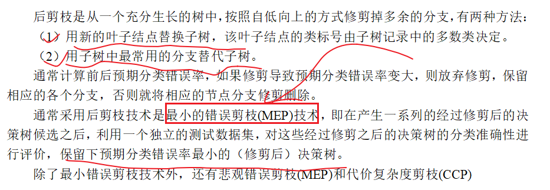
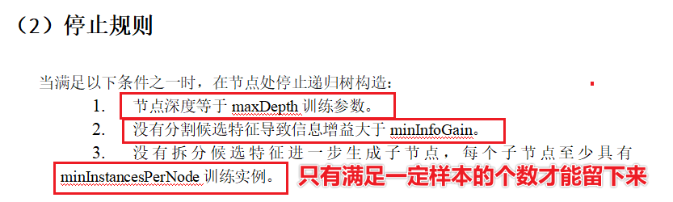

# 统计类标签和决策树算法

## 1-回顾

* 

## 2-重难点知识

* 支付方式标签的业务含义
* 支付方式标签的标签创建
* 支付方式标签的标签的代码实战
* 总结两种类型的标签
* 挖掘类标签分类
* 决策树引入
* 基于规则的建立决策树
* 决策树三要素
* 基于模型的建立决策树
* 信息熵-信息增益
* ID3算法
* SparkMllib整合ID3-C4.5-Cart树算法

## 3-支付方式标签的业务含义

* 支付方式指的是使用哪种支付方式更多一些
* 一个用户可以根据用户id和用户支付方式对数据进行分组
* 根据分组内的支付方式在进行排序
* 选择出排序为topk=1的支付方式给用户打上支付方式的标签
* 业务含义：通过支付方式标签利用其它场景推荐更加合适的支付方式

## 4-支付方式标签的标签创建

* 四级标签
* 
* 五级标签
* 
* 

## 5-支付方式标签的标签的代码实战

* 支付方式标签代码如何开发--步骤是如何的？

* 1-首先新建PayMent的Scala的Object，继承BaseModel，实现其中的getTagsId和compute方法

* 2-根据用户id和paymentcode进行分组聚合，统计出一个用户使用哪种支付方式的数量

  * grouyby("userid","payment")
  * agg(count("payment"))
  * **使用支付宝 1000次**
  * **使用微信     500次**

* 3-根据一个用户使用所有支付方式中选择使用量最多的支付方式

  * **使用支付宝 1000次**
  * **使用微信     500次**
  * row_number() over(partition by xxx order by xxx desc) 123
  * rank() over 113
  * dense rank() over 112 
  * ntile ()  平均分成几组

* 4-根据五级标签将tagsid和rule进行转化为map结构

* 5-整合Hbase和FIveDS进行标签匹配

* 6-得到newDF

* 7-返回newDF

* 代码

* ```scala
  package cn.itcast.up.statistics.gzstatices
  
  import cn.itcast.up.base.BaseModelPo7
  import org.apache.spark.sql.expressions.{UserDefinedFunction, Window}
  import org.apache.spark.sql.{DataFrame, Dataset, Row}
  
  /**
   * DESC:用户支付方式标签打法
   *1.根据用户id+支付方式进行分组并计数
   *2.使用开窗函数进行组内排序,取Top1(每个用户使用最多的付款方式)
   * 方式一:DSL风格开窗函数
   * 方式二:SQL风格开窗函数
   *3.将rankDF和fiveDS进行匹配
   *3.1将fiveDS转为map[支付方式,tagsId]
   *3.2将rankDF中的支付方式换成tagsId
   *4.得到newDF
   */
  object PaymentModel extends BaseModelPo7 {
    def main(args: Array[String]): Unit = {
      execute()
    }
  
    override def getId(): Long = 29
  
    override def compute(hbaseDF: DataFrame, fiveRuleDS: Dataset[Row]): DataFrame = {
      //增加环境准备
      import spark.implicits._
      import org.apache.spark.sql.functions._
      println("==========================1-fiveRuleDS========================")
      //fiveRuleDS.show()
      /*  +---+--------+
          | id|    rule|
          +---+--------+
          | 30|  alipay|
          | 31|   wxpay|
          | 32|chinapay|
          | 33|  kjtpay|
          | 34|     cod|
          | 35|   other|
          +---+--------+*/
      println("==========================2-hbaseDF========================")
      //hbaseDF.show()
      /* +---------+-----------+
       | memberId|paymentCode|
       +---------+-----------+
       | 13823431|     alipay|
       |  4035167|     alipay|*/
      //1.根据用户id+支付方式进行分组并计数
      println("==========================3-hbaseDF groupby========================")
      val hbaseDF2: DataFrame = hbaseDF
        .groupBy("memberId", "paymentCode")
        .agg(count('paymentCode).as("counts"))
      /*hbaseDF2.show()
      +--------+-----------+------+
      |memberId|paymentCode|counts|
      +--------+-----------+------+
      |13823481|     alipay|    96|
      | 4035297|     alipay|    80|
      |13823317|     kjtpay|    11|
      |13822857|     alipay|   100|
      | 4034541|     alipay|    96|*/
      //2.使用开窗函数进行组内排序,取Top1(每个用户使用最多的付款方式)
      println("==========================4-1-开窗函数进行组内排序,取Top1-方式1-DSL写法========================")
      //方式一:DSL风格开窗函数---Returns a new Dataset by adding a column
      val tempDF: DataFrame = hbaseDF2.withColumn("rn", row_number() over (Window.partitionBy("memberId").orderBy('counts.desc)))
      /*tempDF.show()
      +---------+-----------+------+---+
      | memberId|paymentCode|counts| rn|
      +---------+-----------+------+---+
      | 13822725|     alipay|    89|  1|
      | 13822725|        cod|    12|  2|
      | 13822725|     kjtpay|     9|  3|
      | 13822725|      wspay|     3|  4|
      | 13822725|   giftCard|     2|  5|*/
      val rankDF: Dataset[Row] = tempDF.where('rn === 1)
      /* tempDF2.show()
       +---------+-----------+------+---+
       | memberId|paymentCode|counts| rn|
       +---------+-----------+------+---+
       | 13822725|     alipay|    89|  1|
       | 13823083|     alipay|    94|  1|
       |138230919|     alipay|    98|  1|
       | 13823681|     alipay|    87|  1|
       |  4033473|     alipay|   113|  1|*/
      //方式二:SQL风格开窗函数
      println("==========================4-2-开窗函数进行组内排序,取Top1-方式2-SQL写法========================")
      hbaseDF2.createOrReplaceTempView("t_temp")
      val sql: String =
        """
          |select memberId,paymentCode,counts,row_number() over(partition by memberId order by counts desc) as rn
          |from t_temp
          |""".stripMargin
      val hbaseDF3: DataFrame = spark.sql(sql)
      //hbaseDF3.show()
      val rankDF2: Dataset[Row] = hbaseDF3.where('rn === 1)
      //tempDF3.show()
      //3.将rankDF和fiveDS进行匹配
      println("==========================5-将rankDF和fiveDS进行匹配========================")
      //3.1将fiveDS转为map[支付方式,tagsId]
      val fivetRuleMap: Map[String, Long] = fiveRuleDS.as[(Long, String)].map(row => {
        (row._2, row._1)
      }).collect().toMap
      //3.2将rankDF中的支付方式换成tagsId（RankDF需要和fiveRuleMap中的PayMentCode去进行匹配）
      val paymentToLabel: UserDefinedFunction = spark.udf.register("paymentToLabel", (paymentCode: String) => {
        //在Spark中存在的支付方式就是制定的取值，如rule=alipay，否则就给赋值为-1，-1就代表的是other
        var tagsid: Long = fivetRuleMap.getOrElse(paymentCode, -1)
        if (tagsid == -1) {
          tagsid = fivetRuleMap("other") //other--35
        }
        tagsid
      })
      println("==========================6-得到newDF========================")
      val newDF: DataFrame = rankDF.select('memberId.as("userid"), paymentToLabel('paymentCode).as("tagsid"))
      //4.得到newDF
      //newDF.show()
      //+---------+------+
      //|   userid|tagsid|
      //+---------+------+
      //| 13822725|    30|
      //| 13823083|    30|
      //|138230919|    30|
      newDF
    }
  }
  ```

* 总结
  * 用户支付方式-------6个支付方式
  * 标签定义
  * 标签创建
  * 标签开发

## 6-总结两种类型的标签
* 
* 
* 
* 
* 

* 要求：
* 着重的选型
  * 匹配类标签选择1个说清楚整明白即可
  * 统计类型标签选择1个说清楚即可

## 7-挖掘类标签分类

* 分类的决策树模型--监督学习

* USG模型
  * **用户购物性别模型**
  * tbl_order表，tbl_user表
  * User Shoping Gender 用户购物性别模型
  * 特征+标签列
    * 特征：用户和商品的基本信息
    * 标签列：符合购买男性商品的是用户购物性别就是男性，符合女性商品就是购物性别是女
    * 构建机器学习模型
  * 预测
    * 一个用户在一段时间内购买的男性商品的比例达到60%以上就是购物性别就是男生
  * 用途：
    * 推荐系统
* 聚类的模型-----非监督学习模型
* RFM模型
  * **客户价值模型**
  * **tbl_order表**
  * Recency 最近一次购买的时间
  * Frenquency 最近一段时间购买的频率
  * Money：最近一段时间消费的金额
  * 业务含义
    * 可以通过RFM模型刻画出用户购买能力
* RFE模型
  * **用户活跃度模型**
  * **tbl_logs表**
  * Recency 最近一次登入网站时间
  * Frencency最近一段时间登入网站的频率
  * E：和网站商品的交互次数
* PSM模型
  * **价格敏感度模型**
  * **tbl_goods商品**
  * **tbl_order订单表**
  * Price
  * Sensitive
  * Model
  * 根据价格计算公式进行聚类分析

## 8-决策树引入

* 

## 9-基于规则的建立决策树

* 

## 10- 决策树三要素

* 1-特征选择：基于规则选择，信息熵，信息增益，信息增益率，Gini系数
* 2-决策树生成：基于规则生成，ID3，C4.5算法。Cart树
* 3-决策树剪枝：基于规则，先剪枝和后剪枝

## 11-信息熵-信息增益

* 熵：物理上能量分布越均匀熵越大，能量分布越不均匀熵越小
* 信息熵：
  * 香浓从物理学中借鉴了熵引入在信息论中叫做信息熵，也称之为**香浓熵**
  * 信息熵，表征的信息的不纯度，、
    * 信息熵越大信息分布越均匀，信息不确定越大，信息纯度越低
    * 信息熵越小信息分布越不均匀，信息的不确定越小，信息确定性越大，信息纯度越高
  * **优先选择信息熵小的值对应特征**
  * 举例：足球世界杯所有的足球队取胜概率一致的结果越不确定
  * 
  * 为什么刚才对数的底数取2，这是因为对数取2的底数对应的就是信息的单位bit
  * 
* 如何根据信息熵选择特征
  * 优先选择信息熵小的值对应特征
* **信息熵数学表达？(了解)**
  * 
  * 记住：H(X)=-sum（pilog(pi)）
* 信息增益：信息增益在信息熵的基础上的改进
  * 信息增益=总体的信息熵-以一个节点作为分支节点的信息熵
  * 
  * 

## 12-ID3算法

* ID3算法详解
* 算法输入：数据集(样本+特征或属性)
* 算法输出：决策树
* 算法步骤：
  * 1-如果所有的属性都被处理完毕，直接返回
    * 如果有一些样本没有被划分，可以随机给一个样本比例较高的的标签值
  * 2-计算所有的特征的信息增益，选择信息增益最大的值作为分支节点或根节点，如果通过该特征能够将样本全部划分，直接结束
  * 3-从剩余的节点中选择次信息增益最大的值对应特征作为分支节点
  * 4-递归构建二叉树
    * 建议大家下来联系几个递归城西
    * 递归程序：汉诺塔问题，**阶层问题**，二叉树的递归创建
* 算法改进
* 算法举例
  * 
  * 
  * 如何设置决策树停止条件？
    * 1-树的深度
    * 2-树的叶子节点的个数
    * 3-树的分支节点个数
    * 4-树的叶子节点或分支节点含有样本个数
    * 5-树的信息的不纯度下降------------信息增益
    * 6-万能--------迭代次数

## 13-基于模型的建立决策树

* 了解第一个算法C4.5算法，ID3改进算法
* 
* 
* ID3算法有两个改进的算法
  * 1-C4.5算法
    * 改进的使用信息增益率
  * 2-Cart树算法
    * Gini系数

## 15-决策树剪枝

* 什么是剪枝？
  * 
* 为什么要剪枝？
  * 剪枝为了让决策树更加避免过拟合的出现
* 如何剪枝
  * 先剪枝：在决策树生长的过程中进行剪枝
    * 1-树的深度
    * 2-树的叶子节点的个数
    * 3-树的分支节点个数
    * 4-树的叶子节点或分支节点含有样本个数
    * 5-树的信息的不纯度下降------------信息增益
    * 6-万能--------迭代次数
    * 
  * 后剪枝：在决策树生长完成后进行剪枝
    * 
    * 
* 工作中使用哪种方法剪枝
  * 工作中直接使用先剪枝完成决策树的剪枝
  * 因为先剪枝更容易控制，更简单

## 16-购买数据集的ID3案例

* 总体的信息熵

* 
* 以年龄节点作为划分节点的信息熵
* 
* 年龄节点的信息增益
* 
* 选择信息增益较大的值对应特征，选年龄
* 
* 从剩余的节点中选择次信息增益较大的值对应的特征
  * 接下来重新计算其他节点的信息熵和信息增益
  * 再次去选择信息增益较大的值对应的特征
* 递归构建决策树
* 

## 17- SparkMllib整合ID3-C4.5-Cart树算法

* 决策树构建决策树
  * 决策树特征选择：规则方式选择，信息熵，信息增益，Gini
  * 决策树生成：ID3，C4,5，Cart
  * 决策参数剪枝：先剪枝和后剪枝
* ID3算法核心原理
  * 根据信息增益选择较大的信息增益值对应的特征作为根节点或分支节点
* C4.5就是在ID3基础上使用信息增益率改进了信息增益在一些特征取值较多的不足
* Cart树是可以做分类也可以回归的决策树，分类的标准是Gini系数
* 架构：
  * 基于netlib-java数值运算库之上Breeze的矩阵运算库
  * Breeze库之上有Vector的向量接口
  * 基于Vector之上有Matrices的矩阵接口
  * 各种算法应用
  * 各种评测算法性能---分类准确率咋样
* 
* 

### 17-0 参数详解-适合于SParkMllib

* SparkMllib的参数统计
  * 
  * 
  * 
  * 
  * 不纯度 impurity：用于在候选分割之间进行选择的杂质度量（如上所述）。此度量必须与algo参数匹配。
    * Gini
    * entropy

### 17-1 SparkMllib实战

* 数据集-Spark提供的额已经做出特征出的数据

* 

* ```scala
  package cn.itcast.DecisitonTree
  
  import org.apache.spark.mllib.regression.LabeledPoint
  import org.apache.spark.mllib.tree.DecisionTree
  import org.apache.spark.mllib.tree.model.DecisionTreeModel
  import org.apache.spark.mllib.util.MLUtils
  import org.apache.spark.rdd.RDD
  import org.apache.spark.{SparkConf, SparkContext}
  import org.apache.spark.sql.SparkSession
  
  /**
   * DESC:构建机器学习模型的流程
   * 1-准备Spark的环境
   * 2-读取libsvm的数据
   * 3-查看数据的基本信息
   * 4-特征工程
   * 5-超参数选择
   * 6-准备算法
   * 7-训练模型
   * 8-模型测试
   * 9-模型保存
   */
  object _01SparkMllibDtsModel {
    def main(args: Array[String]): Unit = {
      //1-准备Spark的环境
      val conf: SparkConf = new SparkConf().setAppName(this.getClass.getSimpleName.stripSuffix("$")).setMaster("local[*]")
      val spark: SparkSession = SparkSession.builder().config(conf).getOrCreate()
      val sc: SparkContext = spark.sparkContext
      sc.setLogLevel("WARN")
      //2-读取libsvm的数据
      val libsvmData: RDD[LabeledPoint] = MLUtils.loadLibSVMFile(sc, "D:\\BigData\\Workspace\\spark_learaning_2.11\\spark-study-gz-day01_2.11\\src\\main\\resources\\sample_libsvm_data.txt")
      //3-查看数据的基本信息
      libsvmData.foreach(println(_))
      //4-特征工程--无需做，该数据是sparkmllib官网提供的已经做好特征工程
      val array: Array[RDD[LabeledPoint]] = libsvmData.randomSplit(Array(0.8, 0.2), seed = 123L)
      val trainingSet: RDD[LabeledPoint] = array(0)
      val testSet: RDD[LabeledPoint] = array(1)
      //5-超参数选择--暂且不做
      //6-准备算法
      // input: RDD[LabeledPoint],
      //numClasses: Int,
      val numClasses = 2
      //    categoricalFeaturesInfo: Map[Int, Int],
      val categoricalFeaturesInfo = Map[Int, Int]()
      //impurity: String,
      val impurity = "entropy"
      //maxDepth: Int,
      val maxDepth = 5
      //maxBins: Int
      val maxBins = 32
      //7-训练模型
      val model: DecisionTreeModel = DecisionTree.trainClassifier(trainingSet, numClasses, categoricalFeaturesInfo, impurity, maxDepth, maxBins)
      //8-模型测试
      val y_trueAndy_pred: RDD[(Double, Double)] = testSet.map(row => {
        val y_pred: Double = model.predict(row.features)
        (row.label, y_pred)
      })
      val y_trueAndy_pred_train: RDD[(Double, Double)] = trainingSet.map(row => {
        val y_pred: Double = model.predict(row.features)
        (row.label, y_pred)
      })
      val test_accuracy: Double = y_trueAndy_pred.filter(r => r._1 == r._2).count().toDouble / y_trueAndy_pred.count()
      val train_accuracy: Double = y_trueAndy_pred_train.filter(r => r._1 == r._2).count().toDouble / y_trueAndy_pred_train.count()
      println("train_accuracy:", train_accuracy)
      println("test_accuracy:", test_accuracy)
      //9-模型保存
      //    model.save()
    }
  }
  ```

### 17-2 SparkMl实战[掌握]

* 代码

* ```scala
  package cn.itcast.DecisitonTree
  
  import org.apache.spark.mllib.regression.LabeledPoint
  import org.apache.spark.mllib.tree.DecisionTree
  import org.apache.spark.mllib.tree.model.DecisionTreeModel
  import org.apache.spark.mllib.util.MLUtils
  import org.apache.spark.rdd.RDD
  import org.apache.spark.{SparkConf, SparkContext}
  import org.apache.spark.sql.SparkSession
  
  /**
   * DESC:构建机器学习模型的流程
   * 1-准备Spark的环境
   * 2-读取libsvm的数据
   * 3-查看数据的基本信息
   * 4-特征工程
   * 5-超参数选择
   * 6-准备算法
   * 7-训练模型
   * 8-模型测试
   * 9-模型保存
   */
  object _01SparkMllibDtsModel {
    def main(args: Array[String]): Unit = {
      //1-准备Spark的环境
      val conf: SparkConf = new SparkConf().setAppName(this.getClass.getSimpleName.stripSuffix("$")).setMaster("local[*]")
      val spark: SparkSession = SparkSession.builder().config(conf).getOrCreate()
      val sc: SparkContext = spark.sparkContext
      sc.setLogLevel("WARN")
      //2-读取libsvm的数据
      val libsvmData: RDD[LabeledPoint] = MLUtils.loadLibSVMFile(sc, "D:\\BigData\\Workspace\\spark_learaning_2.11\\spark-study-gz-day01_2.11\\src\\main\\resources\\sample_libsvm_data.txt")
      //3-查看数据的基本信息
      libsvmData.foreach(println(_))
      //4-特征工程--无需做，该数据是sparkmllib官网提供的已经做好特征工程
      val array: Array[RDD[LabeledPoint]] = libsvmData.randomSplit(Array(0.8, 0.2), seed = 123L)
      val trainingSet: RDD[LabeledPoint] = array(0)
      val testSet: RDD[LabeledPoint] = array(1)
      //5-超参数选择--暂且不做
      //6-准备算法
      // input: RDD[LabeledPoint],
      //numClasses: Int,
      val numClasses = 2
      //    categoricalFeaturesInfo: Map[Int, Int],
      val categoricalFeaturesInfo = Map[Int, Int]()
      //impurity: String,
      val impurity = "entropy"
      //maxDepth: Int,
      val maxDepth = 5
      //maxBins: Int
      val maxBins = 32
      //7-训练模型
      val model: DecisionTreeModel = DecisionTree.trainClassifier(trainingSet, numClasses, categoricalFeaturesInfo, impurity, maxDepth, maxBins)
      //8-模型测试
      val y_trueAndy_pred: RDD[(Double, Double)] = testSet.map(row => {
        val y_pred: Double = model.predict(row.features)
        (row.label, y_pred)
      })
      val y_trueAndy_pred_train: RDD[(Double, Double)] = trainingSet.map(row => {
        val y_pred: Double = model.predict(row.features)
        (row.label, y_pred)
      })
      val test_accuracy: Double = y_trueAndy_pred.filter(r => r._1 == r._2).count().toDouble / y_trueAndy_pred.count()
      val train_accuracy: Double = y_trueAndy_pred_train.filter(r => r._1 == r._2).count().toDouble / y_trueAndy_pred_train.count()
      println("train_accuracy:", train_accuracy)
      println("test_accuracy:", test_accuracy)
      //9-模型保存
      //model.save()
    }
  }
  ```

* 

## 18-Iris的模板代码

* ```scala
  package cn.itcast.DecisitonTree
  
  import org.apache.spark.ml.classification.DecisionTreeClassifier
  import org.apache.spark.ml.evaluation.MulticlassClassificationEvaluator
  import org.apache.spark.ml.feature._
  import org.apache.spark.ml.{Pipeline, PipelineModel}
  import org.apache.spark.sql.functions._
  import org.apache.spark.sql.{DataFrame, Dataset, Row, SparkSession}
  
  /**
   * DESC:带有header的schema如何直接读取schema
   * 1-准备环境
   * 2-准备数据，读取数据
   * 3-数据基本信息的查看
   * 4-特征工程
   * 5-......
   */
  object _03IrisHeaderSparkSQLPipelineDtsModel {
    def main(args: Array[String]): Unit = {
      //1-准备环境
      val spark: SparkSession = SparkSession.builder().appName("_05IrisHeaderSparkSQLPipeline").master("local[*]").getOrCreate()
      spark.sparkContext.setLogLevel("WARN")
      import spark.implicits._
      //2-准备数据，读取数据
      val path = "D:\\BigData\\Workspace\\spark_learaning_2.11\\spark-study-gz-day01_2.11\\src\\main\\resources\\data\\iris.csv"
      val irisData: DataFrame = spark.read.format("csv").option("header", true).option("sep", ",").load(path)
      //.option("inferschema", true)
      //3-数据基本信息的查看
      irisData.printSchema()
      val featuresAndLabel: DataFrame = irisData.select($"sepal_length".cast("double"),
        col("sepal_width").cast("double"),
        column("petal_length").cast("double"),
        'petal_width.cast("double"),
        $"class")
      //featuresAndLabel.printSchema()
      val array: Array[Dataset[Row]] = featuresAndLabel.randomSplit(Array(0.8, 0.2), seed = 123L)
      val trainSet: Dataset[Row] = array(0)
      val testSet: Dataset[Row] = array(1)
      trainSet.printSchema()
      //4-特征工程
      //1-对于irisData数据需要使用StringIndexer方式进行转换
      val stringIndexer: StringIndexer = new StringIndexer().setInputCol("class").setOutputCol("classlabel")
      //2-实现对四个特征组合为特征向量
      val assembler: VectorAssembler = new VectorAssembler().setInputCols(Array("sepal_length", "sepal_width", "petal_length", "petal_width")).setOutputCol("features")
      //3-特征降维--pca主成分分析法，利用特征值和特征向量选择具有较高特征值对应的特征向量进行降维
      val pca: PCA = new PCA().setInputCol("features").setOutputCol("pcaFeatures").setK(3)
      //4-MinMacScaler
      val scaler: MinMaxScaler = new MinMaxScaler().setInputCol("pcaFeatures").setOutputCol("minmaxFeatures")
      //5-chiSqSelector
      //val chiSqSelector: ChiSqSelector = new ChiSqSelector().setLabelCol("classlabel").setFeaturesCol("minmaxFeatures").setNumTopFeatures(2).setOutputCol("chiSqSelectorFeatures")
      //6-决策树算法
      val classifier: DecisionTreeClassifier = new DecisionTreeClassifier().setFeaturesCol("features").setLabelCol("classlabel").setPredictionCol("prediction").setMaxDepth(5)
      //val pipeline: Pipeline = new Pipeline().setStages(Array(stringIndexer, assembler, pca, scaler, chiSqSelector,classifier))
      val pipeline: Pipeline = new Pipeline().setStages(Array(stringIndexer, assembler, pca, scaler, classifier))
      val pipelineModel: PipelineModel = pipeline.fit(trainSet)
      val y_train_pred: DataFrame = pipelineModel.transform(trainSet)
      val y_test_pred: DataFrame = pipelineModel.transform(testSet)
      //y_train_pred.show()
      val evaluator: MulticlassClassificationEvaluator = new MulticlassClassificationEvaluator()
        .setLabelCol("classlabel")
        .setPredictionCol("prediction")
        .setMetricName("accuracy")
      val y_train_accuracy: Double = evaluator.evaluate(y_train_pred)
      val y_test_accuracy: Double = evaluator.evaluate(y_test_pred)
      println("accuracy train", y_train_accuracy)
      println("accuracy test", y_test_accuracy)
      //    (accuracy train,0.991304347826087)
      //    (accuracy test,0.9428571428571428)
      //5-......
      spark.stop()
    }
  }
  ```

* 参考

## 19-总计

* 支付方式标签的业务含义
* 支付方式标签的标签创建
* 支付方式标签的标签的代码实战
* 总结两种类型的标签
* 挖掘类标签分类
* 决策树引入
* 基于规则的建立决策树
* 决策树三要素
* 基于模型的建立决策树
* 信息熵-信息增益
* ID3算法
* SparkMllib整合ID3-C4.5-Cart树算法