# 挖掘表——USG模型

## 1-回顾

## 2-重难点知识

* SparkMllib决策树模板代码
* 决策树算法如何进行超参数的选择？
* 集成学习
* Bagging算法
* 随机森林
* SparkMllib的随机森林算法实战
* USG模型
* USG模型优化

## 3-SparkMllib决策树模板代码

* 特征工程+模型训练+模型预测+模型校验

* 代码1：基础代码-瀑布模式

* ```scala
  package cn.itcast.DecisitonTree
  
  import org.apache.spark.SparkConf
  import org.apache.spark.ml.classification.{DecisionTreeClassificationModel, DecisionTreeClassifier}
  import org.apache.spark.ml.evaluation.MulticlassClassificationEvaluator
  import org.apache.spark.ml.feature.{StringIndexer, StringIndexerModel, VectorAssembler}
  import org.apache.spark.sql.{DataFrame, Dataset, Row, SparkSession}
  
  /**
   * DESC:构建机器学习模型步骤
   * 1-准备Spark环境
   * 2-读取数据集
   * 3-数据基本信息的查看
   * 4-特征工程
   * 5-超参数选择
   * 6-模型训练
   * 7-模型校验
   * 8-模型预测
   * 9-模型保存
   */
  object _04IrisTest {
  
    def main(args: Array[String]): Unit = {
      //1-准备Spark环境
      //1-准备环境
      val spark: SparkSession = {
        val sparkConf: SparkConf = new SparkConf()
          .setMaster("local[*]")
          .setAppName(this.getClass.getSimpleName.stripSuffix("$"))
          //设置序列化为：Kryo
          .set("spark.serializer", "org.apache.spark.serializer.KryoSerializer")
          //设置Shuffle分区数目
          .set("spark.sql.shuffle.partitions", "4")
          .set("spark.executor.memory", "512m")
        val spark: SparkSession = SparkSession.builder()
          .config(sparkConf)
          .getOrCreate()
        spark.sparkContext.setLogLevel("WARN")
        import spark.implicits._
        spark
      }
      //2-读取数据集
      val path = "D:\\BigData\\Workspace\\spark_learaning_2.11\\spark-study-gz-day01_2.11\\src\\main\\resources\\data\\iris.csv"
      val data: DataFrame = spark.read.format("csv")
        //Todo header是否将第一行的字段名自动识别
        .option("header", "true")
        //Todo Schema增加Header属性自动识别其中的schema
        .option("inferSchema", true)
        //Todo 可以指定分隔符
        .option("seq", ",")
        .load(path)
      //3-数据基本信息的查看
      data.printSchema()
      data.show(1)
      //4-特征工程
      val indexer: StringIndexer = new StringIndexer().setInputCol("class").setOutputCol("classlabel")
      val strModel: StringIndexerModel = indexer.fit(data)
      val strData: DataFrame = strModel.transform(data)
      val assembler: VectorAssembler = new VectorAssembler().setInputCols(Array("sepal_length", "sepal_width", "petal_length", "petal_width")).setOutputCol("features")
      val assData: DataFrame = assembler.transform(strData)
      val array: Array[Dataset[Row]] = assData.randomSplit(Array(0.8, 0.2), seed = 123L)
      val trainingSet: Dataset[Row] = array(0)
      val testSet: Dataset[Row] = array(1)
      //5-超参数选择
      //6-模型训练
      val classifier: DecisionTreeClassifier = new DecisionTreeClassifier()
        .setMaxDepth(5)
        .setImpurity("entropy")
        .setLabelCol("classlabel")
        .setFeaturesCol("features")
        .setPredictionCol("predict")
      val classificationModel: DecisionTreeClassificationModel = classifier.fit(trainingSet)
      val y_train_pred: DataFrame = classificationModel.transform(trainingSet)
      val y_test_pred: DataFrame = classificationModel.transform(testSet)
      //7-模型校验
      val evaluator: MulticlassClassificationEvaluator = new MulticlassClassificationEvaluator()
        .setMetricName("accuracy")
        .setPredictionCol("predict")
        .setLabelCol("classlabel")
      val y_train_accuracy: Double = evaluator.evaluate(y_train_pred)
      val y_test_accuracy: Double = evaluator.evaluate(y_test_pred)
      println("model in trainingset score is:", y_train_accuracy)
      println("model in testSet score is:", y_test_accuracy)
      //(model in trainingset score is:,0.991304347826087)
      //(model in testSet score is:,0.9428571428571428)
      //8-模型预测
      y_test_pred.show(10)
      //9-模型保存
      val pathValue = "D:\\BigData\\Workspace\\spark_learaning_2.11\\spark-study-gz-day01_2.11\\src\\main\\resources\\data\\dtcModel2\\"
      classificationModel.write.overwrite().save(pathValue)
      DecisionTreeClassificationModel.load(pathValue)
    }
  }
  ```

* 增加Pipeline

* ```scala
  package cn.itcast.DecisitonTree
  
  import org.apache.spark.SparkConf
  import org.apache.spark.ml.{Pipeline, PipelineModel}
  import org.apache.spark.ml.classification.{DecisionTreeClassificationModel, DecisionTreeClassifier}
  import org.apache.spark.ml.evaluation.MulticlassClassificationEvaluator
  import org.apache.spark.ml.feature.{StringIndexer, StringIndexerModel, VectorAssembler}
  import org.apache.spark.sql.{DataFrame, Dataset, Row, SparkSession}
  
  /**
   * DESC:构建机器学习模型步骤
   * 1-准备Spark环境
   * 2-读取数据集
   * 3-数据基本信息的查看
   * 4-特征工程
   * 5-超参数选择
   * 6-模型训练
   * 7-模型校验
   * 8-模型预测
   * 9-模型保存
   */
  object _06IrisTest {
  
    def main(args: Array[String]): Unit = {
      //1-准备Spark环境
      val predictCOl = "predict"
      val classlabelCol = "classlabel"
      val featuresCol = "features"
      //1-准备环境
      val spark: SparkSession = {
        val sparkConf: SparkConf = new SparkConf()
          .setMaster("local[*]")
          .setAppName(this.getClass.getSimpleName.stripSuffix("$"))
          //设置序列化为：Kryo
          .set("spark.serializer", "org.apache.spark.serializer.KryoSerializer")
          //设置Shuffle分区数目
          .set("spark.sql.shuffle.partitions", "4")
          .set("spark.executor.memory", "512m")
        val spark: SparkSession = SparkSession.builder()
          .config(sparkConf)
          .getOrCreate()
        spark.sparkContext.setLogLevel("WARN")
        spark
      }
      //2-读取数据集
      val path = "D:\\BigData\\Workspace\\spark_learaning_2.11\\spark-study-gz-day01_2.11\\src\\main\\resources\\data\\iris.csv"
      val data: DataFrame = spark.read.format("csv")
        //Todo header是否将第一行的字段名自动识别
        .option("header", "true")
        //Todo Schema增加Header属性自动识别其中的schema
        .option("inferSchema", true)
        //Todo 可以指定分隔符
        .option("seq", ",")
        .load(path)
      //3-数据基本信息的查看
      data.printSchema()
      data.show(1)
      //4-特征工程
      val array: Array[Dataset[Row]] = data.randomSplit(Array(0.8, 0.2), seed = 123L)
      val trainingSet: Dataset[Row] = array(0)
      val testSet: Dataset[Row] = array(1)
      val indexer: StringIndexer = new StringIndexer().setInputCol("class").setOutputCol(classlabelCol)
      val strModel: StringIndexerModel = indexer.fit(data)
      val assembler: VectorAssembler = new VectorAssembler().setInputCols(Array("sepal_length", "sepal_width", "petal_length", "petal_width")).setOutputCol(featuresCol)
  
      //5-超参数选择
      //6-模型训练
      val classifier: DecisionTreeClassifier = new DecisionTreeClassifier()
        .setMaxDepth(5)
        .setImpurity("entropy")
        .setLabelCol(classlabelCol)
        .setFeaturesCol(featuresCol)
        .setPredictionCol(predictCOl)
      val pipeline: Pipeline = new Pipeline().setStages(Array(indexer, assembler, classifier))
      val pipelineModel: PipelineModel = pipeline.fit(trainingSet)
      val y_train_pred: DataFrame = pipelineModel.transform(trainingSet)
      val y_test_pred: DataFrame = pipelineModel.transform(testSet)
      println("=============tree struct============")
      println(pipelineModel.stages(2).asInstanceOf[DecisionTreeClassificationModel].toDebugString)
      println("=============tree struct============")
      //7-模型校验
      val evaluator: MulticlassClassificationEvaluator = new MulticlassClassificationEvaluator()
        .setMetricName("accuracy")
        .setPredictionCol(predictCOl)
        .setLabelCol(classlabelCol)
      val y_train_accuracy: Double = evaluator.evaluate(y_train_pred)
      val y_test_accuracy: Double = evaluator.evaluate(y_test_pred)
      println("model in trainingset score is:", y_train_accuracy)
      println("model in testSet score is:", y_test_accuracy)
      //(model in trainingset score is:,0.991304347826087)
      //(model in testSet score is:,0.9428571428571428)
      //8-模型预测
      y_test_pred.show(10)
      //9-模型效果打印
  
    }
  }
  ```

* 增加网格搜索和交叉验证

* ```scala
  package cn.itcast.DecisitonTree
  
  import org.apache.spark.SparkConf
  import org.apache.spark.ml.classification.{DecisionTreeClassificationModel, DecisionTreeClassifier}
  import org.apache.spark.ml.evaluation.MulticlassClassificationEvaluator
  import org.apache.spark.ml.feature.{StringIndexer, StringIndexerModel, VectorAssembler}
  import org.apache.spark.ml.param.ParamMap
  import org.apache.spark.ml.tuning.{CrossValidator, CrossValidatorModel, ParamGridBuilder}
  import org.apache.spark.ml.{Pipeline, PipelineModel}
  import org.apache.spark.sql.{DataFrame, Dataset, Row, SparkSession}
  
  /**
   * DESC:构建机器学习模型步骤
   * 1-准备Spark环境
   * 2-读取数据集
   * 3-数据基本信息的查看
   * 4-特征工程
   * 5-超参数选择
   * 6-模型训练
   * 7-模型校验
   * 8-模型预测
   * 9-模型保存
   */
  object _07IrisCrossValidationTest {
  
    def main(args: Array[String]): Unit = {
      //1-准备Spark环境
      val predictCOl = "predict"
      val classlabelCol = "classlabel"
      val featuresCol = "features"
      //1-准备环境
      val spark: SparkSession = {
        val sparkConf: SparkConf = new SparkConf()
          .setMaster("local[*]")
          .setAppName(this.getClass.getSimpleName.stripSuffix("$"))
          //设置序列化为：Kryo
          .set("spark.serializer", "org.apache.spark.serializer.KryoSerializer")
          //设置Shuffle分区数目
          .set("spark.sql.shuffle.partitions", "4")
          .set("spark.executor.memory", "512m")
        val spark: SparkSession = SparkSession.builder()
          .config(sparkConf)
          .getOrCreate()
        spark.sparkContext.setLogLevel("WARN")
        spark
      }
      val (trainingSet: DataFrame, testSet: DataFrame) = LoadData(spark)
      val (evaluator: MulticlassClassificationEvaluator, crossModel: CrossValidatorModel) = model_create(predictCOl, classlabelCol, featuresCol, trainingSet)
      //8-模型预测
      model_predict(trainingSet, testSet, evaluator, crossModel)
      //9-模型效果打印
      println("=============tree struct============")
      println(crossModel.bestModel.asInstanceOf[PipelineModel].stages(2).asInstanceOf[DecisionTreeClassificationModel].toDebugString)
      println(crossModel.bestModel.asInstanceOf[PipelineModel].stages(2).extractParamMap()) //打印超参数
      println("=============tree struct============")
      //{
      //  dtc_2357cc88d864-cacheNodeIds: false,
      //  dtc_2357cc88d864-checkpointInterval: 10,
      //  dtc_2357cc88d864-featuresCol: features,
      //  dtc_2357cc88d864-impurity: gini,
      //  dtc_2357cc88d864-labelCol: classlabel,
      //  dtc_2357cc88d864-maxBins: 32,
      //  dtc_2357cc88d864-maxDepth: 6,
      //  dtc_2357cc88d864-maxMemoryInMB: 256,
      //  dtc_2357cc88d864-minInfoGain: 0.0,
      //  dtc_2357cc88d864-minInstancesPerNode: 1,
      //  dtc_2357cc88d864-predictionCol: predict,
      //  dtc_2357cc88d864-probabilityCol: probability,
      //  dtc_2357cc88d864-rawPredictionCol: rawPrediction,
      //  dtc_2357cc88d864-seed: 159147643
      //}
    }
  
    def model_create(predictCOl: String, classlabelCol: String, featuresCol: String, trainingSet: Dataset[Row]): (MulticlassClassificationEvaluator, CrossValidatorModel) = {
      //4-特征工程
      val indexer: StringIndexer = new StringIndexer().setInputCol("class").setOutputCol(classlabelCol)
      val assembler: VectorAssembler = new VectorAssembler().setInputCols(Array("sepal_length", "sepal_width", "petal_length", "petal_width")).setOutputCol(featuresCol)
      //6-模型训练
      val classifier: DecisionTreeClassifier = new DecisionTreeClassifier()
        .setMaxDepth(5)
        .setImpurity("entropy")
        .setLabelCol(classlabelCol)
        .setFeaturesCol(featuresCol)
        .setPredictionCol(predictCOl)
      val pipeline: Pipeline = new Pipeline().setStages(Array(indexer, assembler, classifier))
      //7-模型校验
      val evaluator: MulticlassClassificationEvaluator = new MulticlassClassificationEvaluator()
        .setMetricName("accuracy")
        .setPredictionCol(predictCOl)
        .setLabelCol(classlabelCol)
      val paramGridBuilder: Array[ParamMap] = new ParamGridBuilder()
        .addGrid(classifier.impurity, Array("gini", "entropy"))
        .addGrid(classifier.maxDepth, Array(3, 6, 9))
        .build()
      val crossValidator: CrossValidator = new CrossValidator()
        .setEvaluator(evaluator)
        .setEstimatorParamMaps(paramGridBuilder)
        .setEstimator(pipeline)
        .setNumFolds(3)
      //5-超参数选择
      val crossModel: CrossValidatorModel = crossValidator.fit(trainingSet)
      (evaluator, crossModel)
    }
  
    def model_predict(trainingSet: Dataset[Row], testSet: Dataset[Row], evaluator: MulticlassClassificationEvaluator, crossModel: CrossValidatorModel): Unit = {
      val y_train_pred: DataFrame = crossModel.bestModel.transform(trainingSet)
      val y_test_pred: DataFrame = crossModel.bestModel.transform(testSet)
      // (model in trainingset score is:,0.991304347826087)
      // (model in testSet score is:,0.9428571428571428)
      val y_train_accuracy: Double = evaluator.evaluate(y_train_pred)
      val y_test_accuracy: Double = evaluator.evaluate(y_test_pred)
      println("model in trainingset score is:", y_train_accuracy)
      println("model in testSet score is:", y_test_accuracy)
      //(model in trainingset score is:,0.991304347826087)
      //(model in testSet score is:,0.9428571428571428)
    }
  
    def LoadData(spark: SparkSession): (Dataset[Row], Dataset[Row]) = {
      //2-读取数据集
      val path = "D:\\BigData\\Workspace\\spark_learaning_2.11\\spark-study-gz-day01_2.11\\src\\main\\resources\\data\\iris.csv"
      val data: DataFrame = spark.read.format("csv")
        //Todo header是否将第一行的字段名自动识别
        .option("header", "true")
        //Todo Schema增加Header属性自动识别其中的schema
        .option("inferSchema", true)
        //Todo 可以指定分隔符
        .option("seq", ",")
        .load(path)
      //3-数据基本信息的查看
      data.printSchema()
      val array: Array[Dataset[Row]] = data.randomSplit(Array(0.8, 0.2), seed = 123L)
      val trainingSet: Dataset[Row] = array(0)
      val testSet: Dataset[Row] = array(1)
      (trainingSet, testSet)
    }
  }
  ```

* 整个基于决策树构建的过程搞定

## 4-决策树算法如何进行超参数的选择？

* 参考如下代码

* ```scala
  package cn.itcast.DecisitonTree
  
  import org.apache.spark.SparkConf
  import org.apache.spark.ml.classification.{DecisionTreeClassificationModel, DecisionTreeClassifier}
  import org.apache.spark.ml.evaluation.MulticlassClassificationEvaluator
  import org.apache.spark.ml.feature.{StringIndexer, StringIndexerModel, VectorAssembler}
  import org.apache.spark.ml.param.ParamMap
  import org.apache.spark.ml.tuning.{CrossValidator, CrossValidatorModel, ParamGridBuilder}
  import org.apache.spark.ml.{Pipeline, PipelineModel}
  import org.apache.spark.sql.{DataFrame, Dataset, Row, SparkSession}
  
  /**
   * DESC:构建机器学习模型步骤
   * 1-准备Spark环境
   * 2-读取数据集
   * 3-数据基本信息的查看
   * 4-特征工程
   * 5-超参数选择
   * 6-模型训练
   * 7-模型校验
   * 8-模型预测
   * 9-模型保存
   */
  object _07IrisCrossValidationTest {
  
    def main(args: Array[String]): Unit = {
      //1-准备Spark环境
      val predictCOl = "predict"
      val classlabelCol = "classlabel"
      val featuresCol = "features"
      //1-准备环境
      val spark: SparkSession = {
        val sparkConf: SparkConf = new SparkConf()
          .setMaster("local[*]")
          .setAppName(this.getClass.getSimpleName.stripSuffix("$"))
          //设置序列化为：Kryo
          .set("spark.serializer", "org.apache.spark.serializer.KryoSerializer")
          //设置Shuffle分区数目
          .set("spark.sql.shuffle.partitions", "4")
          .set("spark.executor.memory", "512m")
        val spark: SparkSession = SparkSession.builder()
          .config(sparkConf)
          .getOrCreate()
        spark.sparkContext.setLogLevel("WARN")
        spark
      }
      val (trainingSet: DataFrame, testSet: DataFrame) = LoadData(spark)
      val (evaluator: MulticlassClassificationEvaluator, crossModel: CrossValidatorModel) = model_create(predictCOl, classlabelCol, featuresCol, trainingSet)
      //8-模型预测
      model_predict(trainingSet, testSet, evaluator, crossModel)
      //9-模型效果打印
      println("=============tree struct============")
      println(crossModel.bestModel.asInstanceOf[PipelineModel].stages(2).asInstanceOf[DecisionTreeClassificationModel].toDebugString)
      println(crossModel.bestModel.asInstanceOf[PipelineModel].stages(2).extractParamMap()) //打印超参数
      println("=============tree struct============")
      //{
      //  dtc_2357cc88d864-cacheNodeIds: false,
      //  dtc_2357cc88d864-checkpointInterval: 10,
      //  dtc_2357cc88d864-featuresCol: features,
      //  dtc_2357cc88d864-impurity: gini,
      //  dtc_2357cc88d864-labelCol: classlabel,
      //  dtc_2357cc88d864-maxBins: 32,
      //  dtc_2357cc88d864-maxDepth: 6,
      //  dtc_2357cc88d864-maxMemoryInMB: 256,
      //  dtc_2357cc88d864-minInfoGain: 0.0,
      //  dtc_2357cc88d864-minInstancesPerNode: 1,
      //  dtc_2357cc88d864-predictionCol: predict,
      //  dtc_2357cc88d864-probabilityCol: probability,
      //  dtc_2357cc88d864-rawPredictionCol: rawPrediction,
      //  dtc_2357cc88d864-seed: 159147643
      //}
    }
  
    def model_create(predictCOl: String, classlabelCol: String, featuresCol: String, trainingSet: Dataset[Row]): (MulticlassClassificationEvaluator, CrossValidatorModel) = {
      //4-特征工程
      val indexer: StringIndexer = new StringIndexer().setInputCol("class").setOutputCol(classlabelCol)
      val assembler: VectorAssembler = new VectorAssembler().setInputCols(Array("sepal_length", "sepal_width", "petal_length", "petal_width")).setOutputCol(featuresCol)
      //6-模型训练
      val classifier: DecisionTreeClassifier = new DecisionTreeClassifier()
        .setMaxDepth(5)
        .setImpurity("entropy")
        .setLabelCol(classlabelCol)
        .setFeaturesCol(featuresCol)
        .setPredictionCol(predictCOl)
      val pipeline: Pipeline = new Pipeline().setStages(Array(indexer, assembler, classifier))
      //7-模型校验
      val evaluator: MulticlassClassificationEvaluator = new MulticlassClassificationEvaluator()
        .setMetricName("accuracy")
        .setPredictionCol(predictCOl)
        .setLabelCol(classlabelCol)
      val paramGridBuilder: Array[ParamMap] = new ParamGridBuilder()
        .addGrid(classifier.impurity, Array("gini", "entropy"))
        .addGrid(classifier.maxDepth, Array(3, 6, 9))
        .build()
      val crossValidator: CrossValidator = new CrossValidator()
        .setEvaluator(evaluator)
        .setEstimatorParamMaps(paramGridBuilder)
        .setEstimator(pipeline)
        .setNumFolds(3)
      //5-超参数选择
      val crossModel: CrossValidatorModel = crossValidator.fit(trainingSet)
      (evaluator, crossModel)
    }
  
    def model_predict(trainingSet: Dataset[Row], testSet: Dataset[Row], evaluator: MulticlassClassificationEvaluator, crossModel: CrossValidatorModel): Unit = {
      val y_train_pred: DataFrame = crossModel.bestModel.transform(trainingSet)
      val y_test_pred: DataFrame = crossModel.bestModel.transform(testSet)
      // (model in trainingset score is:,0.991304347826087)
      // (model in testSet score is:,0.9428571428571428)
      val y_train_accuracy: Double = evaluator.evaluate(y_train_pred)
      val y_test_accuracy: Double = evaluator.evaluate(y_test_pred)
      println("model in trainingset score is:", y_train_accuracy)
      println("model in testSet score is:", y_test_accuracy)
      //(model in trainingset score is:,0.991304347826087)
      //(model in testSet score is:,0.9428571428571428)
    }
  
    def LoadData(spark: SparkSession): (Dataset[Row], Dataset[Row]) = {
      //2-读取数据集
      val path = "D:\\BigData\\Workspace\\spark_learaning_2.11\\spark-study-gz-day01_2.11\\src\\main\\resources\\data\\iris.csv"
      val data: DataFrame = spark.read.format("csv")
        //Todo header是否将第一行的字段名自动识别
        .option("header", "true")
        //Todo Schema增加Header属性自动识别其中的schema
        .option("inferSchema", true)
        //Todo 可以指定分隔符
        .option("seq", ",")
        .load(path)
      //3-数据基本信息的查看
      data.printSchema()
      val array: Array[Dataset[Row]] = data.randomSplit(Array(0.8, 0.2), seed = 123L)
      val trainingSet: Dataset[Row] = array(0)
      val testSet: Dataset[Row] = array(1)
      (trainingSet, testSet)
    }
  }
  ```

* 思考：在模型预测的过程中出了准确率还有什么校验标准

* 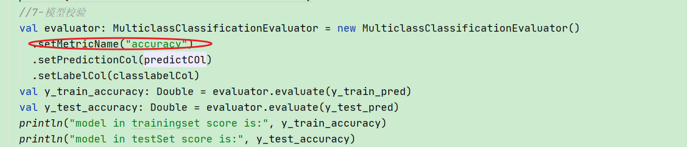

* 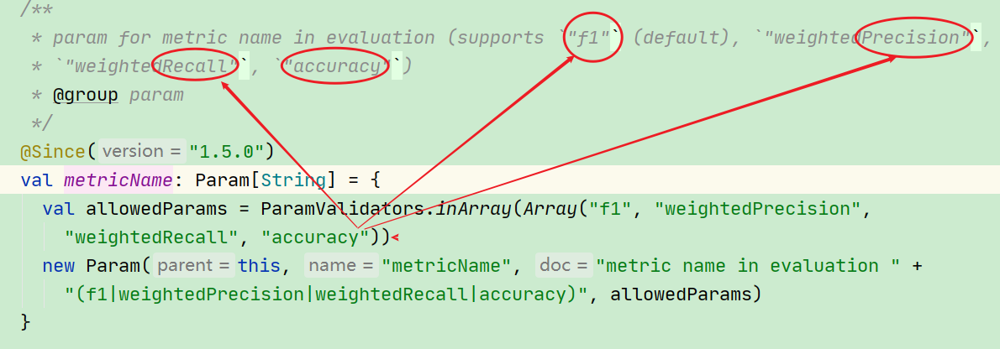

* 如何评价分类模型指标

* 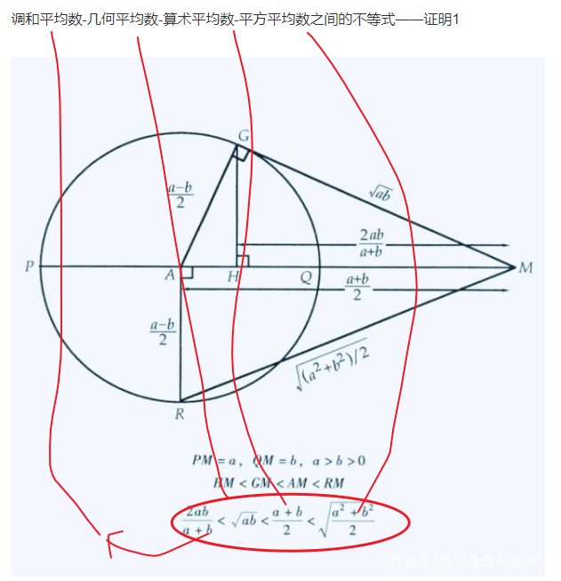

* 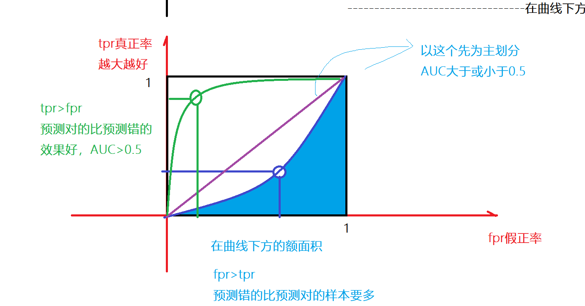

* 代码

* ```scala
  val evaluator: MulticlassClassificationEvaluator = new MulticlassClassificationEvaluator()
    .setMetricName("accuracy")
    .setPredictionCol("prediction")
    .setLabelCol("label")
  val accuracy_train: Double = evaluator.evaluate(y_pred_train)
  val accuracy_test: Double = evaluator.evaluate(y_pred_test)
  println("accuracy  train scroe is:", accuracy_train)
  println("accuracy  test scroe is:", accuracy_test)
  //(accuracy  train scroe is:,1.0)
  //(accuracy  test scroe is:,0.9090909090909091)
  println("====================auc======================")
  val evaluator1: BinaryClassificationEvaluator = new BinaryClassificationEvaluator()
    .setMetricName("areaUnderROC")
    .setRawPredictionCol("rawPrediction")
    .setLabelCol("label")
  val accuracy_train1: Double = evaluator1.evaluate(y_pred_train)
  ```

* 整体代码

* ```scala
  package cn.itcast.DecisitonTree
  
  import org.apache.spark.SparkConf
  import org.apache.spark.ml.classification.{DecisionTreeClassificationModel, DecisionTreeClassifier}
  import org.apache.spark.ml.evaluation.{BinaryClassificationEvaluator, MulticlassClassificationEvaluator}
  import org.apache.spark.sql.{DataFrame, Dataset, Row, SparkSession}
  
  /**
   * DESC:构建机器学习模型的流程
   * 1-准备Spark的环境
   * 2-读取libsvm的数据
   * 3-查看数据的基本信息
   * 4-特征工程
   * 5-超参数选择
   * 6-准备算法
   * 7-训练模型
   * 8-模型测试
   * 9-模型保存
   */
  object _08SparkMlDtsModel {
    def main(args: Array[String]): Unit = {
      //1-准备Spark的环境
      val conf: SparkConf = new SparkConf().setAppName(this.getClass.getSimpleName.stripSuffix("$")).setMaster("local[*]")
      val spark: SparkSession = SparkSession.builder().config(conf).getOrCreate()
      spark.sparkContext.setLogLevel("WARN")
      //2-读取libsvm的数据
      val libsvmData: DataFrame = spark.read.format("libsvm").load("D:\\BigData\\Workspace\\spark_learaning_2.11\\spark-study-gz-day01_2.11\\src\\main\\resources\\sample_libsvm_data.txt")
      //3-查看数据的基本信息
      libsvmData.printSchema() //label features
      //4-特征工程--无需做，该数据是sparkmllib官网提供的已经做好特征工程
      val array: Array[Dataset[Row]] = libsvmData.randomSplit(Array(0.8, 0.2), seed = 123L)
      val trainingSet = array(0)
      val testSet = array(1)
      //5-超参数选择--暂且不做
      //6-准备算法
      val classifier: DecisionTreeClassifier = new DecisionTreeClassifier()
        .setMaxDepth(5) //树的深度 16
        .setImpurity("entropy") //树的不纯度
        .setFeaturesCol("features") //特征
        .setLabelCol("label") //标签列
        .setPredictionCol("prediction") //预测列---用户自己制定
        .setRawPredictionCol("rawPrediction")
      //7-模型训练
      val classificationModel: DecisionTreeClassificationModel = classifier.fit(trainingSet)
      //8-模型预测
      val y_pred_train: DataFrame = classificationModel.transform(trainingSet)
      val y_pred_test: DataFrame = classificationModel.transform(testSet)
      val evaluator: MulticlassClassificationEvaluator = new MulticlassClassificationEvaluator()
        .setMetricName("accuracy")
        .setPredictionCol("prediction")
        .setLabelCol("label")
      val accuracy_train: Double = evaluator.evaluate(y_pred_train)
      val accuracy_test: Double = evaluator.evaluate(y_pred_test)
      println("accuracy  train scroe is:", accuracy_train)
      println("accuracy  test scroe is:", accuracy_test)
      //(accuracy  train scroe is:,1.0)
      //(accuracy  test scroe is:,0.9090909090909091)
      println("====================auc======================")
      val evaluator1: BinaryClassificationEvaluator = new BinaryClassificationEvaluator()
        .setMetricName("areaUnderROC")
        .setRawPredictionCol("rawPrediction")
        .setLabelCol("label")
      val accuracy_train1: Double = evaluator1.evaluate(y_pred_train)
      val accuracy_test1: Double = evaluator1.evaluate(y_pred_test)
      //    (accuracy  train scroe is:,1.0)
      //    (accuracy  test scroe is:,0.9504132231404958)
      println("accuracy  train scroe is:", accuracy_train1)
      println("accuracy  test scroe is:", accuracy_test1)
      //9-模型保存后直接预测
      val pathValue = "D:\\BigData\\Workspace\\spark_learaning_2.11\\spark-study-gz-day01_2.11\\src\\main\\resources\\dtcModel1"
      classificationModel.save(pathValue)
      DecisionTreeClassificationModel.load(pathValue).transform(testSet).show()
    }
  }
  ```

## 5-Cart树算法

* Cart树就是Classification and regression tree 分类和回归树
* 这里以分类为例：Gini系数
* Cart树
  * 1-Cart树和ID3的决策树有什么差别？
    * Cart树的决策树只能哟两个分支，二叉树
    * Cart树分类的指标是Gini系数
    * Cart树既可以做分类也可以做回归
  * 2-Cart树的构建过程是什么样子的？
  * 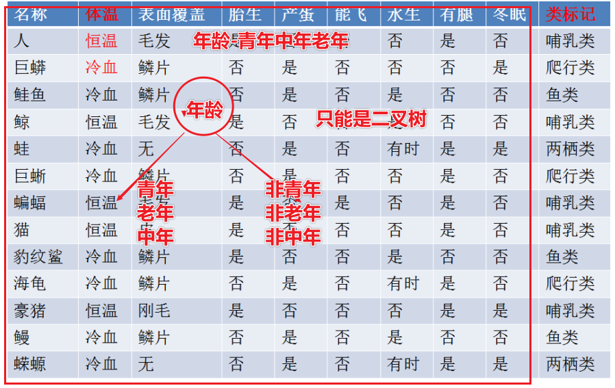
  * 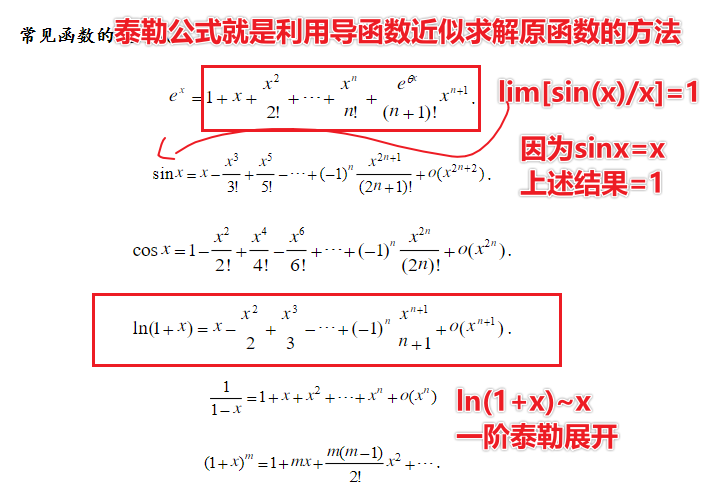
  * 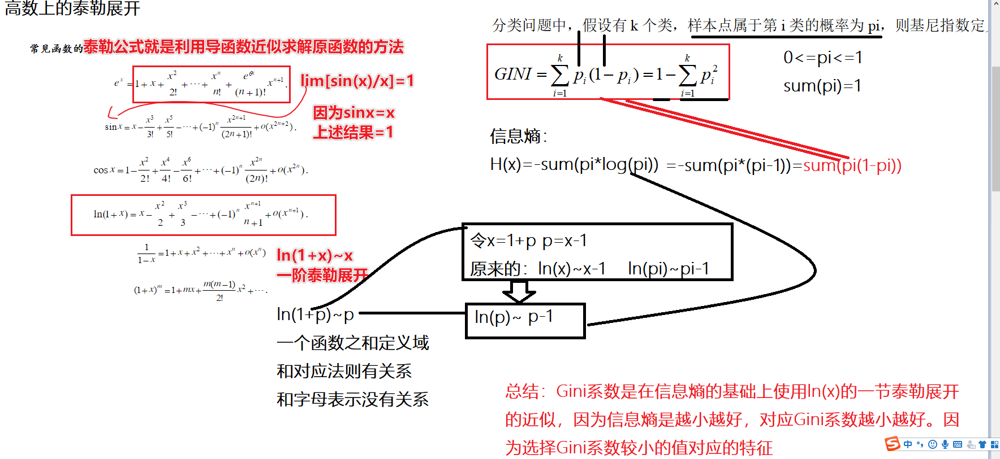
  * 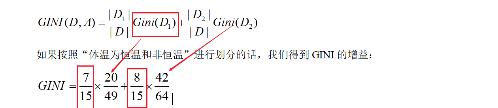
  * Cart树的分类算法原理
  * 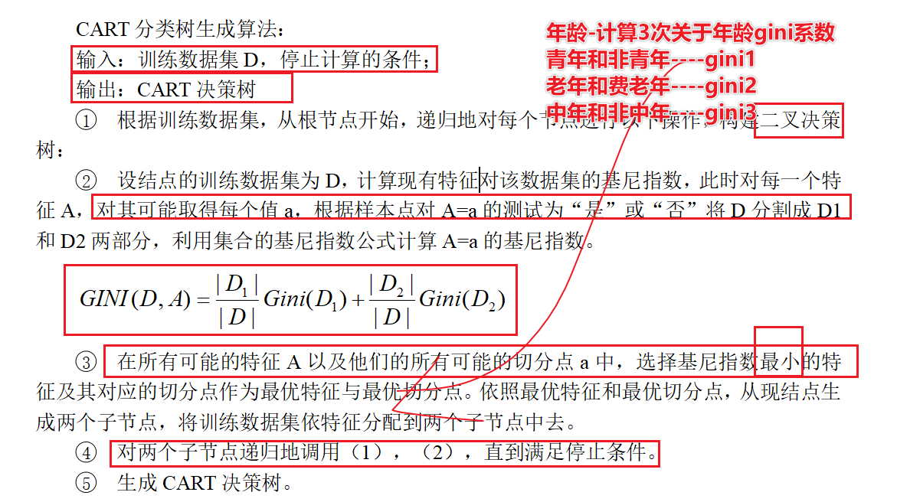
* 总结：
  * Cart树就是在原来的ID3或C4.5的基础上使用了
    * 二叉树
    * 分类的指标选择了Gini系数

## 5-集成学习

* 决策树算法容易产生过拟合的算法---集成学习
* 集成学习
  * 并行学习方式
    * A决策树---B决策树---C决策树--D决策树
    * **Bagiing算法**
    * **随机森林算法**
    * 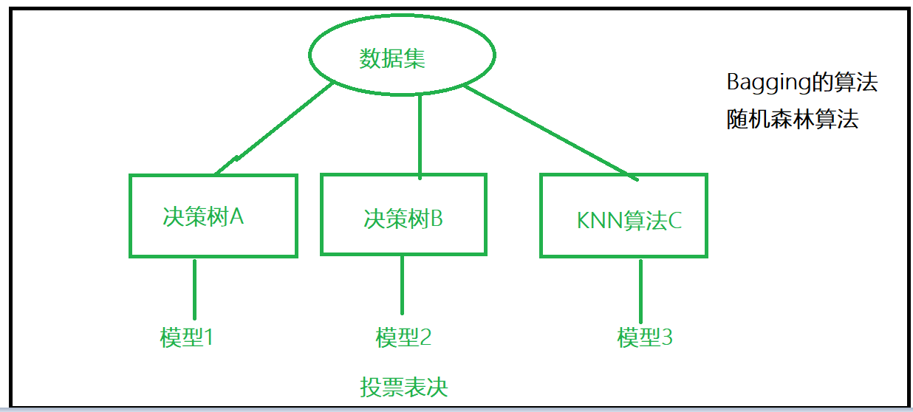
  * 串行学习方式
    * A决策树
    * B决策树
    * C决策树
    * GBDT算法
    * XGBoost算法
    * 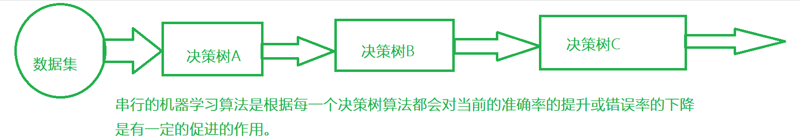

## 6-Bagging算法

* BootStrap采样---随机样本的采样
  * 目标是为了解决比如在决策树中因为一棵树学习到所有的数据的特征，造成过拟合
  * 仅仅选择一部分的样本做模型训练
* 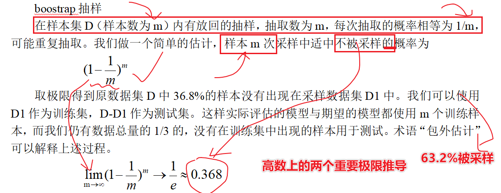
* 算法的原理--组合算法
  * 注意：这个Baaging算法并没有实质的东西，仅仅是将基础分类器组合为组合学习器
  * 算法步骤：
    * 1-算法首先对数据集采用BootSTrap的样本的抽样
    * 2-对于每一份样本的抽样使用基础分类器(决策树，Knn，LR等)组合为强分类器
    * 3-针对每一份数据集结合分类器得到分类模型根据少数服从多数的原则进行举手表决
    * 4-得到最终结果
* 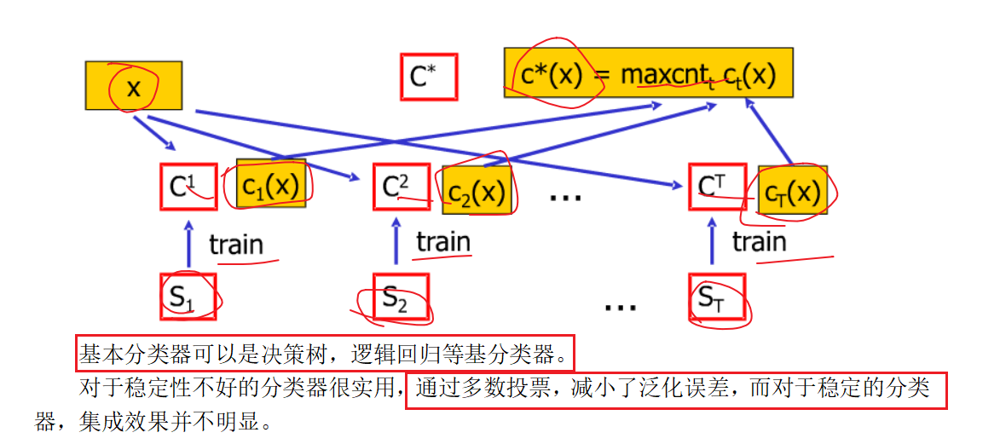
* 从偏差-方差分解角度看，**Bagging主要关注降低方差，因此他在不剪枝决策树、神经网络等易受样本扰动的学习器上效果更为明显。**
  * 模型偏差:模型的额预测值和真实值的差距就是偏差，肯定希望越小越好
  * 模型方差:模型的方差越大越容易过拟合，希望模型方差越小越好

## 7-随机森林

* **随机森林是在Bagging的基础上做了那些改变？**
  * Bagging算法是根据BootStrap的抽样得到数据自己在根据基分类器训练K个模型在投票表决
  * 随机森林
    * 森林：已经限定了我们的随机森林的算法一定是基于决策树的
    * 随机森林的随机性：
      * 随机性体现
        * 样本的随机：基于BootStrap 的采样
        * 特征的随机：针对特征随机选择就是特征随机
          * log2(d)
          * sqrt(d)
          * onethird(d)
    * **随机森林在Bagging算法基础上增加了一个随机的特征的随机，限定了基分类器是决策树**
* 随机森林对于模型偏差和方差的影响是如何？
  * 更好的能够降低模型的偏差和模型方差
* 随机森林算法步骤是如何？
  * 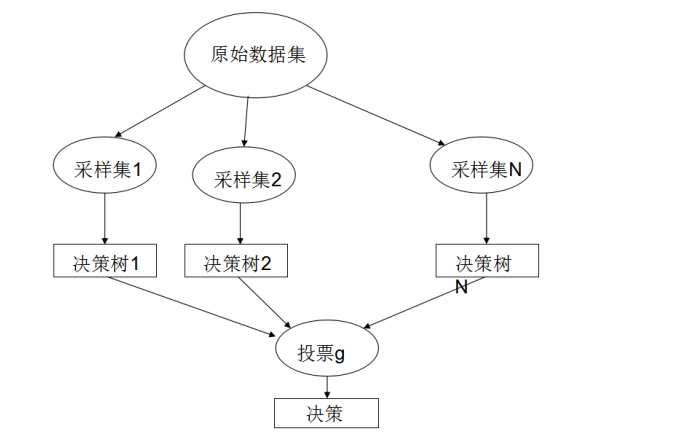
  * 随机森林算法是一个组合基分类器为组合分类器的算法，并没有太多的数学原理
  * 步骤
    * 1-从样本中按照有放回的抽样选择N个样本，(样本的抽样)
    * 2-从抽取完之后的样本中进一步抽取特征（log2d，sqrt）
    * 3-得到数据的子集后可以通过Entropy或Gini系数构建决策树
    * 4-可以使用是投票表决的方式选择出最后的结果

## 8-SparkMllib的随机森林算法实战

* 参数

* 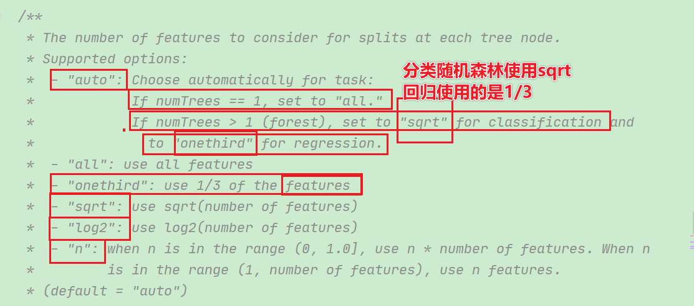

* 代码：

* ```scala
  package cn.itcast.DecisitonTree
  
  import org.apache.spark.SparkConf
  import org.apache.spark.ml.classification.{DecisionTreeClassificationModel, DecisionTreeClassifier, RandomForestClassificationModel, RandomForestClassifier}
  import org.apache.spark.ml.evaluation.MulticlassClassificationEvaluator
  import org.apache.spark.ml.feature.{StringIndexer, StringIndexerModel, VectorAssembler}
  import org.apache.spark.sql.{DataFrame, Dataset, Row, SparkSession}
  
  /**
   * DESC:构建机器学习模型步骤
   * 1-准备Spark环境
   * 2-读取数据集
   * 3-数据基本信息的查看
   * 4-特征工程
   * 5-超参数选择
   * 6-模型训练
   * 7-模型校验
   * 8-模型预测
   * 9-模型保存
   */
  object _09IrisTestRandomForest {
    def main(args: Array[String]): Unit = {
      //1-准备Spark环境
      //1-准备环境
      val spark: SparkSession = {
        val sparkConf: SparkConf = new SparkConf()
          .setMaster("local[*]")
          .setAppName(this.getClass.getSimpleName.stripSuffix("$"))
          //设置序列化为：Kryo
          .set("spark.serializer", "org.apache.spark.serializer.KryoSerializer")
          //设置Shuffle分区数目
          .set("spark.sql.shuffle.partitions", "4")
          .set("spark.executor.memory", "512m")
        val spark: SparkSession = SparkSession.builder()
          .config(sparkConf)
          .getOrCreate()
        spark.sparkContext.setLogLevel("WARN")
        spark
      }
      //2-读取数据集
      val path = "D:\\BigData\\Workspace\\spark_learaning_2.11\\spark-study-gz-day01_2.11\\src\\main\\resources\\data\\iris.csv"
      val data: DataFrame = spark.read.format("csv")
        //Todo header是否将第一行的字段名自动识别
        .option("header", "true")
        //Todo Schema增加Header属性自动识别其中的schema
        .option("inferSchema", true)
        //Todo 可以指定分隔符
        .option("seq", ",")
        .load(path)
      //3-数据基本信息的查看
      data.printSchema()
      data.show(1)
      //4-特征工程
      val indexer: StringIndexer = new StringIndexer().setInputCol("class").setOutputCol("classlabel")
      val strModel: StringIndexerModel = indexer.fit(data)
      val strData: DataFrame = strModel.transform(data)
      val assembler: VectorAssembler = new VectorAssembler().setInputCols(Array("sepal_length", "sepal_width", "petal_length", "petal_width")).setOutputCol("features")
      val assData: DataFrame = assembler.transform(strData)
      val array: Array[Dataset[Row]] = assData.randomSplit(Array(0.8, 0.2), seed = 123L)
      val trainingSet: Dataset[Row] = array(0)
      val testSet: Dataset[Row] = array(1)
      //5-超参数选择
      //6-模型训练
      val classifier: RandomForestClassifier = new RandomForestClassifier()
        .setFeaturesCol("features")
        .setLabelCol("classlabel")
        .setPredictionCol("predict")
        .setFeatureSubsetStrategy("sqrt")
        .setSubsamplingRate(0.8)
        .setImpurity("gini")
  
      val classificationModel: RandomForestClassificationModel = classifier.fit(trainingSet)
      val y_train_pred: DataFrame = classificationModel.transform(trainingSet)
      val y_test_pred: DataFrame = classificationModel.transform(testSet)
      //7-模型校验
      val evaluator: MulticlassClassificationEvaluator = new MulticlassClassificationEvaluator()
        .setMetricName("accuracy")
        .setPredictionCol("predict")
        .setLabelCol("classlabel")
      val y_train_accuracy: Double = evaluator.evaluate(y_train_pred)
      val y_test_accuracy: Double = evaluator.evaluate(y_test_pred)
      println("model in trainingset score is:", y_train_accuracy)
      println("model in testSet score is:", y_test_accuracy)
      //(model in trainingset score is:,0.9739130434782609)
      //(model in testSet score is:,0.9714285714285714)
      //8-模型预测
      y_test_pred.show(10)
    }
  }
  ```

## 9-USG模型

* 业务含义：

  * User Shopping Gender 用户购物性别模型
  * 对于实际业务的影响是比较大的，对于用户商品推荐使用USG模型可以针对用户购物行为得到购物的性别从而实现推荐
  * 选择的是挖掘类标签：
    * 这里希望通过对于人的特性和商品 的特征通过监督学习分类算法实现预测
    * 为什么选择决策树？
    * 一方是因为决策树比较简单，非常容易去分析数据
    * 二方面在技术选型的时候当时人员配置中对于算法的深入程度不太够，减少学习成本
    * 后期使用决策树改进算的称之为随进森林算法改进
  * 过程：
  * ·  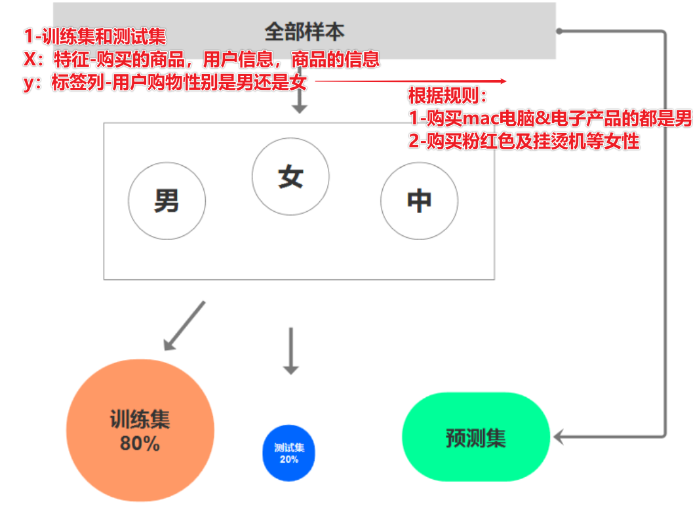
  * 模型评价标准
    * 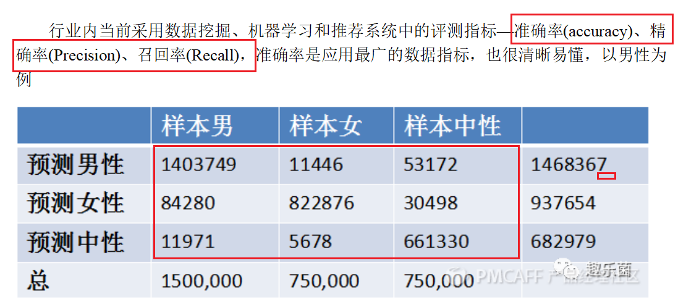
  * 总结：
    * 购物性别定义对于用户精准营销十分重要，疑难杂症，对症下药，才能出现更好的疗效。
    * 对于新手来说，初期一定是对模型性能及效果分析不是很熟练，可先用小数据量进行测试， 走通全流程 建表要规范，方便后期批量删除，因为建模是个反复的过程。
    * 根据各类参数的评估结果，以及人工经验选定的模型参数，建立模型。值得注意的是，决策树的深度不要过深，以防止过拟合的问题

* 标签创建

  * 四级标签
  * 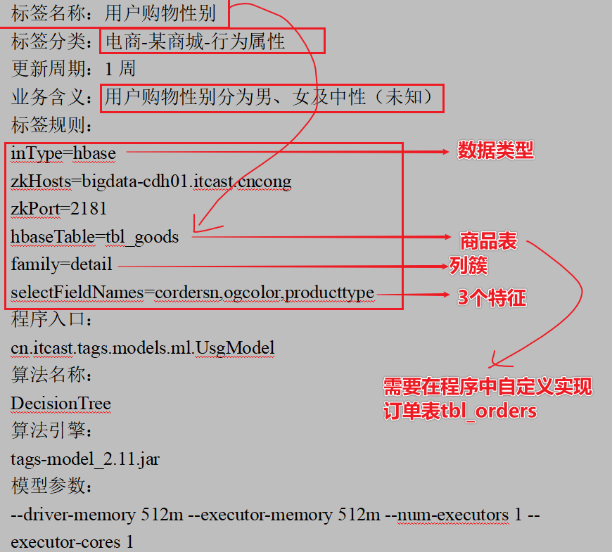
  * 五级标签
  * 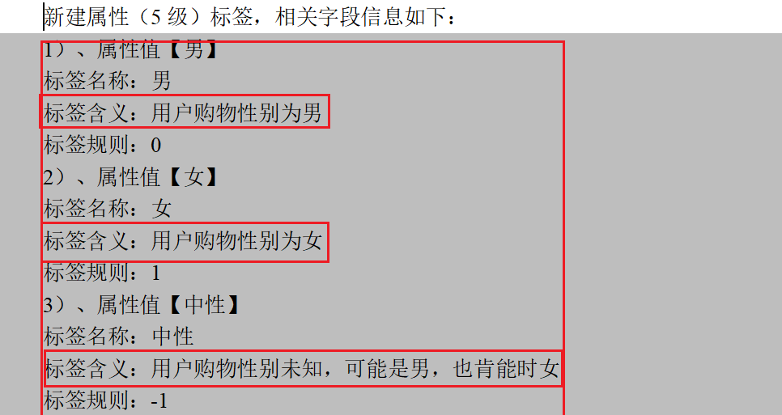

* 标签分析

  * **1-数据来源**

  * 商品表------cordersn-----ogcolor------producttype

  * ```
    3597241 column=detail:cordersn, timestamp=1575267957780,
    value=jd_14091818005983607
    3597241 column=detail:ogcolor, timestamp=1575267957780,
    value=\xE7\x99\xBD\x89\xB2
    3597241 column=detail:producttype, timestamp=1575267957780,
    value=\xE7xA4\xE7\xAE\xB1
    ```

  * 订单表------memberid-----ordersn

  * ```
    10 column=detail:memberid, timestamp=1575729720218, value=13823431
    10 column=detail:ordersn, timestamp=1575729720218,
    value=gome_792756751164275
    ```

  * 通过对两个表的分析得出，订单表的ordersn和商品表的cordesn主外键关系，合并数据表

  * 2-主函数编写

  * 继承BaseModel实现其中的getTagID=56和compute方法

  * 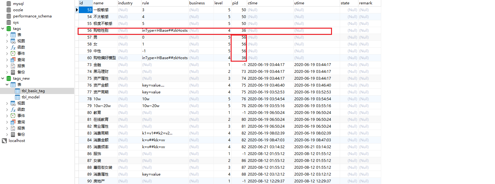

  * 3-订单表获取

  * spark和hbase自定义数据源

  * 4-特征和标签的形成

  * 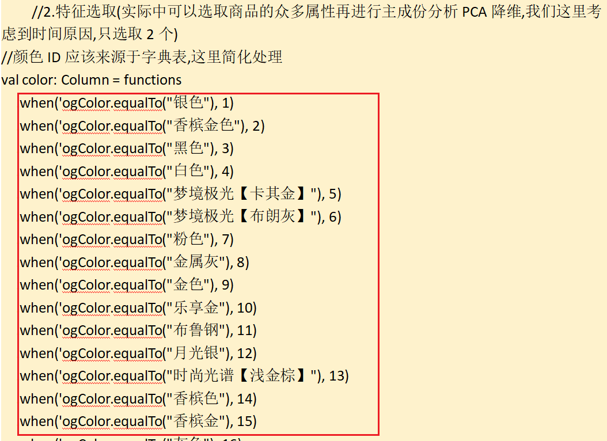

  * 标签列处理

  * 通过符合女性用户购买粉色商品或挂烫机都是标注为女性用户

  * 5-两个业务表的合并--订单表和商品表

  * 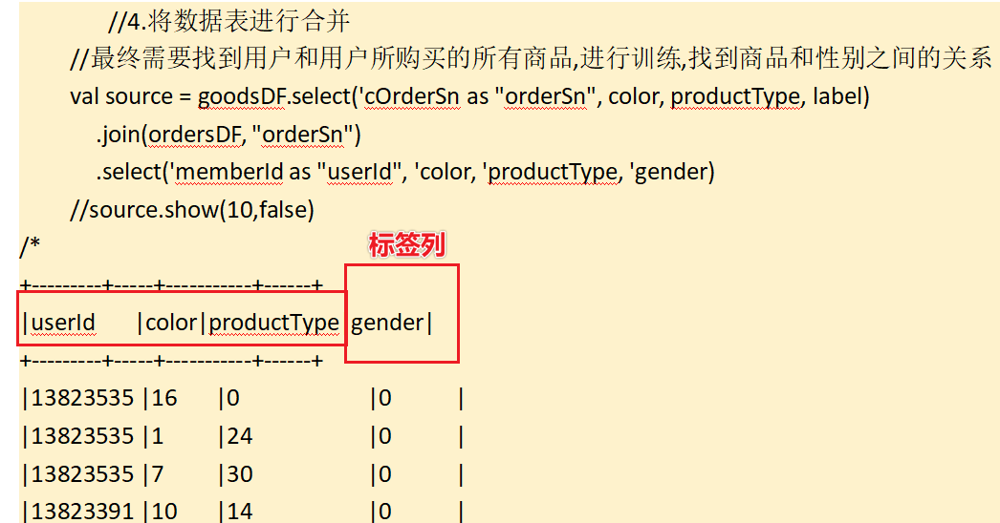

  * 6-特征工程

  * 7-算法选择及模型训练

  * 8-模型预测

  * 9-模型校验

  * 10-对预测的结果判断是男性用户和女性用户并统计

  * 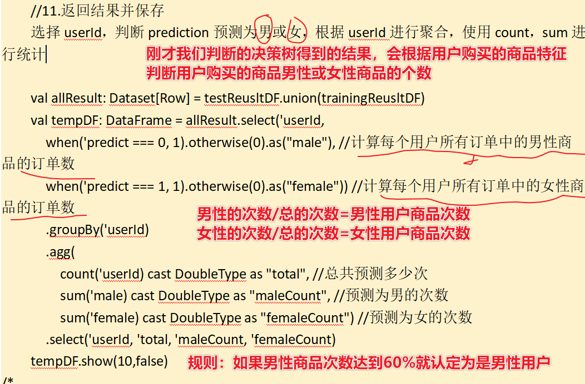

  * 11-结果

  * 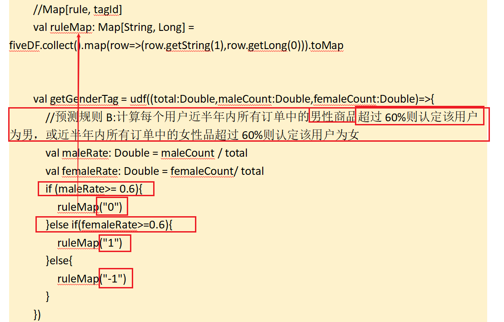

* 代码

  * 1-实现业务主类，继承BaseModel，实现getId和compute方法
  * 2-查看五级标签和业务Hbase的数据集
  * 3-自定义得到订单表orders数据
  * 4-处理商品表中的特征数据的数值化处理
  * 5-数据标注(目的：监督学习分类问题)
  * 6-订单表和商品表的合并
  * 7-特征工程
  * 8-算法选择和模型的训练
  * 9-模型预测
  * 10-模型校验
  * 11-根据既定的规则对业务数据判断用户购物性别
  * 12-转化五级标签为rule和tagsid
  * 13-使用udf函数将用户购物性别转化为tagsid
  * 14-返回newDF

* 代码

* ```scala
  package cn.itcast.up.ml.gzmltag
  
  import cn.itcast.up.base.BaseModelPo7
  import cn.itcast.up.bean.HBaseMeta
  import org.apache.spark.ml.classification.{DecisionTreeClassificationModel, DecisionTreeClassifier}
  import org.apache.spark.ml.evaluation.{BinaryClassificationEvaluator, MulticlassClassificationEvaluator}
  import org.apache.spark.ml.feature.{StringIndexer, StringIndexerModel, VectorAssembler}
  import org.apache.spark.sql.expressions.UserDefinedFunction
  import org.apache.spark.sql.types.DoubleType
  import org.apache.spark.sql.{Column, DataFrame, Dataset, Row, functions}
  
  /**
   * DESC:步骤
   * 1-实现业务主类，继承BaseModel，实现getId和compute方法
   * 2-查看五级标签和业务Hbase的数据集
   * 3-自定义得到订单表orders数据
   * 4-处理商品表中的特征数据的数值化处理
   * 5-数据标注(目的：监督学习分类问题)
   * 6-订单表和商品表的合并
   * 7-特征工程
   * 8-算法选择和模型的训练
   * 9-模型预测
   * 10-模型校验
   * 11-根据既定的规则对业务数据判断用户购物性别
   * 12-转化五级标签为rule和tagsid
   * 13-使用udf函数将用户购物性别转化为tagsid
   * 14-返回newDF
   */
  object USGModel extends BaseModelPo7 {
    def main(args: Array[String]): Unit = {
      execute()
    }
  
    override def getId(): Long = 56
  
    override def compute(hbaseDF: DataFrame, fiveRuleDS: Dataset[Row]): DataFrame = {
      //1-实现业务主类，继承BaseModel，实现getId和compute方法
      import spark.implicits._
      import org.apache.spark.sql.functions._
      //2-查看五级标签和业务Hbase的数据集
      println("========================1-fiveRuleDS=============================")
      //fiveRuleDS.show()
      //fiveRuleDS.printSchema()
      /*+---+----+
       | id|rule|
       +---+----+
       | 57|   0|
       | 58|   1|
       | 59|  -1|
       +---+----+
       root
       |-- id: long (nullable = false)
       |-- rule: string (nullable = true)*/
      println("========================2-HbaseDF=============================")
      //hbaseDF.show()
      //hbaseDF.printSchema()
      /* +--------------------+---------+-----------+
       |            cOrderSn|  ogColor|productType|
       +--------------------+---------+-----------+
       |jd_14091818005983607|       白色|         烤箱|
       |jd_14091317283357943|      香槟金|         冰吧|
       |jd_14092012560709235|     香槟金色|        净水机|*/
      //4-处理商品表中的特征数据的数值化处理
      val color: Column = functions
        .when('ogColor.equalTo("银色"), 1)
        .when('ogColor.equalTo("香槟金色"), 2)
        .when('ogColor.equalTo("黑色"), 3)
        .when('ogColor.equalTo("白色"), 4)
        .when('ogColor.equalTo("梦境极光【卡其金】"), 5)
        .when('ogColor.equalTo("梦境极光【布朗灰】"), 6)
        .when('ogColor.equalTo("粉色"), 7)
        .when('ogColor.equalTo("金属灰"), 8)
        .when('ogColor.equalTo("金色"), 9)
        .when('ogColor.equalTo("乐享金"), 10)
        .when('ogColor.equalTo("布鲁钢"), 11)
        .when('ogColor.equalTo("月光银"), 12)
        .when('ogColor.equalTo("时尚光谱【浅金棕】"), 13)
        .when('ogColor.equalTo("香槟色"), 14)
        .when('ogColor.equalTo("香槟金"), 15)
        .when('ogColor.equalTo("灰色"), 16)
        .when('ogColor.equalTo("樱花粉"), 17)
        .when('ogColor.equalTo("蓝色"), 18)
        .when('ogColor.equalTo("金属银"), 19)
        .when('ogColor.equalTo("玫瑰金"), 20)
        .otherwise(0)
        .alias("color")
      //类型ID应该来源于字典表,这里简化处理
      val productType: Column = functions
        .when('productType.equalTo("4K电视"), 9)
        .when('productType.equalTo("Haier/海尔冰箱"), 10)
        .when('productType.equalTo("Haier/海尔冰箱"), 11)
        .when('productType.equalTo("LED电视"), 12)
        .when('productType.equalTo("Leader/统帅冰箱"), 13)
        .when('productType.equalTo("冰吧"), 14)
        .when('productType.equalTo("冷柜"), 15)
        .when('productType.equalTo("净水机"), 16)
        .when('productType.equalTo("前置过滤器"), 17)
        .when('productType.equalTo("取暖电器"), 18)
        .when('productType.equalTo("吸尘器/除螨仪"), 19)
        .when('productType.equalTo("嵌入式厨电"), 20)
        .when('productType.equalTo("微波炉"), 21)
        .when('productType.equalTo("挂烫机"), 22)
        .when('productType.equalTo("料理机"), 23)
        .when('productType.equalTo("智能电视"), 24)
        .when('productType.equalTo("波轮洗衣机"), 25)
        .when('productType.equalTo("滤芯"), 26)
        .when('productType.equalTo("烟灶套系"), 27)
        .when('productType.equalTo("烤箱"), 28)
        .when('productType.equalTo("燃气灶"), 29)
        .when('productType.equalTo("燃气热水器"), 30)
        .when('productType.equalTo("电水壶/热水瓶"), 31)
        .when('productType.equalTo("电热水器"), 32)
        .when('productType.equalTo("电磁炉"), 33)
        .when('productType.equalTo("电风扇"), 34)
        .when('productType.equalTo("电饭煲"), 35)
        .when('productType.equalTo("破壁机"), 36)
        .when('productType.equalTo("空气净化器"), 37)
        .otherwise(0)
        .alias("productType")
      //5-数据标注(目的：监督学习分类问题)
      val label: Column = functions
        .when('ogColor.equalTo("樱花粉")
          .or('ogColor.equalTo("白色"))
          .or('ogColor.equalTo("香槟色"))
          .or('ogColor.equalTo("香槟金"))
          .or('productType.equalTo("料理机"))
          .or('productType.equalTo("挂烫机"))
          .or('productType.equalTo("吸尘器/除螨仪")), 1) //女
        .otherwise(0) //男
        .alias("gender") //决策树预测label
      val goodsDF: DataFrame = hbaseDF
      //3-自定义得到订单表orders数据
      println("========================3-ordersDF=============================")
      val ordersDF: DataFrame = spark.read.format("cn.itcast.up.tools.HBaseSource")
        .option("inType", "hbase")
        .option(HBaseMeta.ZKHOSTS, "bd001")
        .option(HBaseMeta.ZKPORT, "2181")
        .option(HBaseMeta.HBASETABLE, "tbl_orders")
        .option(HBaseMeta.FAMILY, "detail")
        .option(HBaseMeta.SELECTFIELDS, "memberId,orderSn")
        .load()
      //ordersDF.show()
      //+---------+-------------------+
      //| memberId|            orderSn|
      //+---------+-------------------+
      //| 13823431| ts_792756751164275|
      //|  4035167| D14090106121770839|
      //|  4035291| D14090112394810659|
      //6-订单表和商品表的合并
      println("========================4-ordersDF join goodsdf=============================")
      val tempDF: DataFrame = goodsDF
        .select('cOrderSn.as("orderSn"), color, productType, label)
        .join(ordersDF, "orderSn")
        .select('memberId.as("userid"), 'orderSn, 'color, 'productType, 'gender)
      /* tempDF.show()
       +---------+-------------------+-----+-----------+------+
       |   userid|            orderSn|color|productType|gender|
       +---------+-------------------+-----+-----------+------+
       | 13823535|    140902208539685|   16|          0|     0|
       | 13823535|    140902208539685|    1|         24|     0|
       | 13823535|    140902208539685|    7|         30|     0|
       | 13823391|    140904125531792|   10|         14|     0|
       tempDF.printSchema()*/
      /*root
      |-- userid: string (nullable = true)
      |-- orderSn: string (nullable = true)
      |-- color: integer (nullable = false)
      |-- productType: integer (nullable = false)
      |-- gender: integer (nullable = false)*/
      //7-特征工程
      println("========================5-features=============================")
      val indexer: StringIndexer = new StringIndexer().setInputCol("gender").setOutputCol("genderlabel")
      val stringIndexerModel: StringIndexerModel = indexer.fit(tempDF)
      val strDF: DataFrame = stringIndexerModel.transform(tempDF)
      val assembler: VectorAssembler = new VectorAssembler().setInputCols(Array("color", "productType")).setOutputCol("features")
      val vecDF: DataFrame = assembler.transform(strDF)
      val array: Array[Dataset[Row]] = vecDF.randomSplit(Array(0.8, 0.2), seed = 124L)
      val trainingSet: Dataset[Row] = array(0)
      val testSet: Dataset[Row] = array(1)
      //8-算法选择和模型的训练
      println("========================6-ml fit=============================")
      val classifier: DecisionTreeClassifier = new DecisionTreeClassifier()
        .setFeaturesCol("features")
        .setLabelCol("genderlabel")
        .setMaxDepth(5)
        .setImpurity("entropy")
        .setPredictionCol("prediction")
        .setRawPredictionCol("rawPrediction")
      val classificationModel: DecisionTreeClassificationModel = classifier.fit(trainingSet)
      //9-模型预测
      val y_train: DataFrame = classificationModel.transform(trainingSet)
      val y_test: DataFrame = classificationModel.transform(testSet)
      //y_train.show()
      //10-模型校验
      println("========================7-ml evalutor=============================")
      //Mulclass
      println("========================7-1 ml Mulevalutor=============================")
      val evaluator: MulticlassClassificationEvaluator = new MulticlassClassificationEvaluator()
        .setMetricName("accuracy")
        .setPredictionCol("prediction")
        .setLabelCol("genderlabel")
      val y_train_accuracy: Double = evaluator.evaluate(y_train)
      val y_test_accuracy: Double = evaluator.evaluate(y_test)
      println("model in trainset accuracy is:", y_train_accuracy)
      println("model in testset accuracy is:", y_test_accuracy)
      println("========================7-2 ml Binarryevalutor=============================")
      //AUC
      val evaluator1: BinaryClassificationEvaluator = new BinaryClassificationEvaluator()
        .setLabelCol("genderlabel")
        .setMetricName("areaUnderROC")
        .setRawPredictionCol("rawPrediction")
      val y_train_auc: Double = evaluator1.evaluate(y_train)
      val y_test_auc: Double = evaluator1.evaluate(y_test)
      println("model in trainset auc is:", y_train_auc)
      println("model in testset auc is:", y_test_auc)
      //========================7-1 ml Mulevalutor=============================
      //(model in trainset accuracy is:,0.9657989739692191)
      //(model in testset accuracy is:,0.9671504965622613)
      //========================7-2 ml Binarryevalutor=============================
      //(model in trainset auc is:,0.9950809905129756)
      //(model in testset auc is:,0.994698156404386)
      //11-根据既定的规则对业务数据判断用户购物性别
      println("========================8 maleCounts and femaleCounts=============================")
      //如果经过决策树的算法对于每个用户的每个订单都预测出是男性还是女性，需要统计在给定的预测数据中符合男性比例或女性比例的占比--规则0.8,0.6
      val allResult: Dataset[Row] = y_train.union(y_test)
      val tempDF2: DataFrame = allResult.select('userid,
        //这里prediction===0预测为女性，1代表的是计数加1
        when('prediction === 0, 1).otherwise(0).as("male"),
        when('prediction === 1, 1).otherwise(0).as("female"))
        .groupBy("userid")
        .agg(
          //如何计算男性比例，男性用户sum个数除以userid的个数
          //count这里值的是一个用户一共下了多少订单，以用户为一组的订单量的统计
          count('userid).cast(DoubleType).as("counts"),
          sum('male).cast(DoubleType).as("maleCounts"),
          sum('female).cast(DoubleType).as("femaleCounts")
        )
      /* tempDF2.show()
       tempDF2.printSchema()
       +---------+------+----------+------------+
       |   userid|counts|maleCounts|femaleCounts|
       +---------+------+----------+------------+
       |138230919|   5.0|       3.0|         2.0|
       |  4033473|  13.0|      12.0|         1.0|
       | 13822725|   7.0|       6.0|         1.0|
       | 13823083|  17.0|      13.0|         4.0|
       | 13823681|   3.0|       3.0|         0.0|*/
      println("========================9 maleCounts>0.6 男性=============================")
      //maleCounts/counts >0.6 male
      //femaleCounts/counts >0.6 female
      //需要解析5级标签
      //12-转化五级标签为rule和tagsid
      val fiveRuleMap: Map[String, Long] = fiveRuleDS.as[(Long, String)].map(row => {
        (row._2, row._1)
      }).collect().toMap
      //13-使用udf函数将用户购物性别转化为tagsid
      println("========================10 udf to tags=============================")
      val shoppinggGenderToLabel: UserDefinedFunction = spark.udf.register("shoppinggGenderToLabel", (counts: Double, maleCounts: Double, femaleCounts: Double) => {
        val maleRate: Double = maleCounts / counts
        val femaleRate: Double = femaleCounts / counts
        if (maleRate > 0.6) {
          fiveRuleMap("0")
        } else if (femaleRate > 0.6) {
          fiveRuleMap("1")
        } else {
          fiveRuleMap("-1")
        }
      })
      println("========================11 result=============================")
      val newDF: DataFrame = tempDF2.select('userid, shoppinggGenderToLabel('counts, 'maleCounts, 'femaleCounts).as("tagsid"))
      //14-返回newDF
      newDF.show()
      null
    }
  }
  ```

* 结果

* ```scala
  +---------+------+
  |   userid|tagsid|
  +---------+------+
  |138230919|    59|
  |  4033473|    57|
  | 13822725|    57|
  | 13823083|    57|
  | 13823681|    57|
  |  4034923|    57|
  |  4033575|    57|
  |  4033483|    59|
  |  4034191|    57|
  | 13823431|    59|
  | 13823153|    57|
  | 13822841|    57|
  |  4033348|    57|
  |  4034761|    57|
  |  4035131|    57|
  | 13823077|    58|
  |138230937|    57|
  | 13822847|    57|
  |138230911|    57|
  |        7|    59|
  +---------+------+
  ```

* 

## 10-USG模型优化

## 总结

* SparkMllib决策树模板代码
  * Iris鸢尾花案例
* 决策树算法如何进行超参数的选择？
  * 交叉验证和网格搜索
* 集成学习
  * 集成学习---串行和并行
  * 并行---Bagging和随机森林
* Bagging算法
  * BootStrap的自主采样，通过投票表决得到最终结果
* 随机森林
  * 在Bagging的基础上增加随机的特征随机，数据更加多样化，防止模型过拟合
* SparkMllib的随机森林算法实战
  * 重点注意的是两个部分
  * subFeaturesSubset
  * subSampleingSubset
  * setMaxDepth
  * setNumTree=20
* USG模型
  * 1-实现业务主类，继承BaseModel，实现getId和compute方法
  * 2-查看五级标签和业务Hbase的数据集
  * 3-自定义得到订单表orders数据
  * 4-处理商品表中的特征数据的数值化处理
  * 5-数据标注(目的：监督学习分类问题)
  * 6-订单表和商品表的合并
  * 7-特征工程
  * 8-算法选择和模型的训练
  * 9-模型预测
  * 10-模型校验
  * 11-根据既定的规则对业务数据判断用户购物性别
  * 12-转化五级标签为rule和tagsid
  * 13-使用udf函数将用户购物性别转化为tagsid
  * 14-返回newDF
* USG模型优化