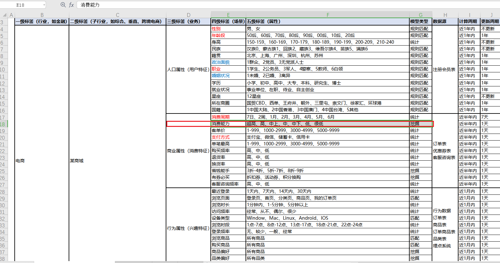
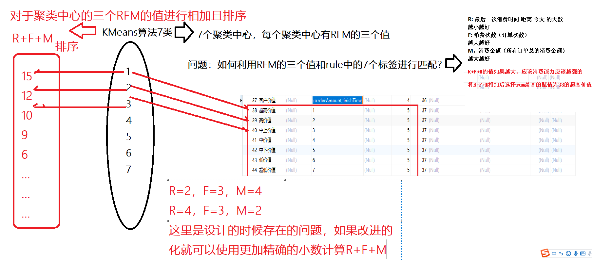

# RFM

## 1-回顾

## 2-重难点

* USG代码的理解及代码抽取
* USG代码优化(交叉验证和网格搜索)
* USG模型优化(使用随机森林优化方式)
* 聚类算法的引入
* KMeans算法
* KMeans算法的SparkMllib实战
* RFM的含义
* RFM的标签创建
* RFM标签分析
* RFM标签的代码

## 3-USG模型代码抽取

* 代码

* ```scala
  package cn.itcast.up.ml.gzmltag
  
  import cn.itcast.up.base.BaseModelPo7
  import cn.itcast.up.bean.HBaseMeta
  import org.apache.spark.ml.classification.{DecisionTreeClassificationModel, DecisionTreeClassifier}
  import org.apache.spark.ml.evaluation.{BinaryClassificationEvaluator, MulticlassClassificationEvaluator}
  import org.apache.spark.ml.feature.VectorAssembler
  import org.apache.spark.ml.param.ParamMap
  import org.apache.spark.ml.tuning.{CrossValidator, CrossValidatorModel, ParamGridBuilder}
  import org.apache.spark.ml.{Model, Pipeline, PipelineModel}
  import org.apache.spark.sql._
  import org.apache.spark.sql.expressions.UserDefinedFunction
  import org.apache.spark.sql.types.DoubleType
  import org.apache.spark.sql.functions._
  
  /**
   * DESC:步骤
   * 1-实现业务主类，继承BaseModel，实现getId和compute方法
   * 2-查看五级标签和业务Hbase的数据集
   * 3-自定义得到订单表orders数据
   * 4-处理商品表中的特征数据的数值化处理
   * 5-数据标注(目的：监督学习分类问题)
   * 6-订单表和商品表的合并
   * 7-特征工程
   * 8-算法选择和模型的训练
   * 9-模型预测
   * 10-模型校验
   * 11-根据既定的规则对业务数据判断用户购物性别
   * 12-转化五级标签为rule和tagsid
   * 13-使用udf函数将用户购物性别转化为tagsid
   * 14-返回newDF
   */
  object USGModel3PipelineCrossValidation extends BaseModelPo7 {
  
    import spark.implicits._
  
    def main(args: Array[String]): Unit = {
      execute()
    }
  
    override def getId(): Long = 56
  
    override def compute(hbaseDF: DataFrame, fiveRuleDS: Dataset[Row]): DataFrame = {
      //1-实现业务主类，继承BaseModel，实现getId和compute方法
      //2-查看五级标签和业务Hbase的数据集
      println("========================1-fiveRuleDS=============================")
      //fiveRuleDS.show()
      //fiveRuleDS.printSchema()
      println("========================2-HbaseDF=============================")
      //hbaseDF.show()
      //hbaseDF.printSchema()
      //4-处理商品表中的特征数据的数值化处理
      val color: Column = functions
        .when('ogColor.equalTo("银色"), 1)
        .when('ogColor.equalTo("香槟金色"), 2)
        .when('ogColor.equalTo("黑色"), 3)
        .when('ogColor.equalTo("白色"), 4)
        .when('ogColor.equalTo("梦境极光【卡其金】"), 5)
        .when('ogColor.equalTo("梦境极光【布朗灰】"), 6)
        .when('ogColor.equalTo("粉色"), 7)
        .when('ogColor.equalTo("金属灰"), 8)
        .when('ogColor.equalTo("金色"), 9)
        .when('ogColor.equalTo("乐享金"), 10)
        .when('ogColor.equalTo("布鲁钢"), 11)
        .when('ogColor.equalTo("月光银"), 12)
        .when('ogColor.equalTo("时尚光谱【浅金棕】"), 13)
        .when('ogColor.equalTo("香槟色"), 14)
        .when('ogColor.equalTo("香槟金"), 15)
        .when('ogColor.equalTo("灰色"), 16)
        .when('ogColor.equalTo("樱花粉"), 17)
        .when('ogColor.equalTo("蓝色"), 18)
        .when('ogColor.equalTo("金属银"), 19)
        .when('ogColor.equalTo("玫瑰金"), 20)
        .otherwise(0)
        .alias("color")
      //类型ID应该来源于字典表,这里简化处理
      val productType: Column = functions
        .when('productType.equalTo("4K电视"), 9)
        .when('productType.equalTo("Haier/海尔冰箱"), 10)
        .when('productType.equalTo("Haier/海尔冰箱"), 11)
        .when('productType.equalTo("LED电视"), 12)
        .when('productType.equalTo("Leader/统帅冰箱"), 13)
        .when('productType.equalTo("冰吧"), 14)
        .when('productType.equalTo("冷柜"), 15)
        .when('productType.equalTo("净水机"), 16)
        .when('productType.equalTo("前置过滤器"), 17)
        .when('productType.equalTo("取暖电器"), 18)
        .when('productType.equalTo("吸尘器/除螨仪"), 19)
        .when('productType.equalTo("嵌入式厨电"), 20)
        .when('productType.equalTo("微波炉"), 21)
        .when('productType.equalTo("挂烫机"), 22)
        .when('productType.equalTo("料理机"), 23)
        .when('productType.equalTo("智能电视"), 24)
        .when('productType.equalTo("波轮洗衣机"), 25)
        .when('productType.equalTo("滤芯"), 26)
        .when('productType.equalTo("烟灶套系"), 27)
        .when('productType.equalTo("烤箱"), 28)
        .when('productType.equalTo("燃气灶"), 29)
        .when('productType.equalTo("燃气热水器"), 30)
        .when('productType.equalTo("电水壶/热水瓶"), 31)
        .when('productType.equalTo("电热水器"), 32)
        .when('productType.equalTo("电磁炉"), 33)
        .when('productType.equalTo("电风扇"), 34)
        .when('productType.equalTo("电饭煲"), 35)
        .when('productType.equalTo("破壁机"), 36)
        .when('productType.equalTo("空气净化器"), 37)
        .otherwise(0)
        .alias("productType")
      //5-数据标注(目的：监督学习分类问题)
      val label: Column = functions
        .when('ogColor.equalTo("樱花粉")
          .or('ogColor.equalTo("白色"))
          .or('ogColor.equalTo("香槟色"))
          .or('ogColor.equalTo("香槟金"))
          .or('productType.equalTo("料理机"))
          .or('productType.equalTo("挂烫机"))
          .or('productType.equalTo("吸尘器/除螨仪")), 1) //女
        .otherwise(0) //男
        .alias("gender") //决策树预测label
      val goodsDF: DataFrame = hbaseDF
      //3-自定义得到订单表orders数据
      println("========================3-ordersDF=============================")
      val ordersDF: DataFrame = spark.read.format("cn.itcast.up.tools.HBaseSource")
        .option("inType", "hbase")
        .option(HBaseMeta.ZKHOSTS, "bd001")
        .option(HBaseMeta.ZKPORT, "2181")
        .option(HBaseMeta.HBASETABLE, "tbl_orders")
        .option(HBaseMeta.FAMILY, "detail")
        .option(HBaseMeta.SELECTFIELDS, "memberId,orderSn")
        .load()
      //6-订单表和商品表的合并
      println("========================4-ordersDF join goodsdf=============================")
      val tempDF: DataFrame = goodsDF
        .select('cOrderSn.as("orderSn"), color, productType, label)
        .join(ordersDF, "orderSn")
        .select('memberId.as("userid"), 'orderSn, 'color, 'productType, 'gender)
      println("========================5-特征工程=============================")
      //7-特征工程
      //数据集的切分
      val array: Array[Dataset[Row]] = tempDF.randomSplit(Array(0.8, 0.2), seed = 124L)
      val trainingSet: Dataset[Row] = array(0)
      val testSet: Dataset[Row] = array(1)
      //模型创建，得到最佳模型
      val model: PipelineModel = bestMdelCreate(trainingSet)
      //打印tree的结构
      //println(model.stages(1).asInstanceOf[DecisionTreeClassificationModel].toDebugString)
      //数据的预测
      val y_train: DataFrame = model.transform(trainingSet)
      val y_test: DataFrame = model.transform(testSet)
      //y_train.show()
      //y_test.show()
      //11-根据既定的规则对业务数据判断用户购物性别
      println("========================6 newDF=============================")
      //如果经过决策树的算法对于每个用户的每个订单都预测出是男性还是女性，需要统计在给定的预测数据中符合男性比例或女性比例的占比--规则0.8,0.6
      val allResult: Dataset[Row] = y_train.union(y_test)
      val newDF: DataFrame = newDFRecall(fiveRuleDS, allResult)
      newDF.show()
      null
    }
  
    def newDFRecall(fiveRuleDS: Dataset[Row], allResult: Dataset[Row]): DataFrame = {
      val tempDF2: DataFrame = allResult.select('userid,
        //这里prediction===0预测为女性，1代表的是计数加1
        when('prediction === 0, 1).otherwise(0).as("male"),
        when('prediction === 1, 1).otherwise(0).as("female"))
        .groupBy("userid")
        .agg(
          //如何计算男性比例，男性用户sum个数除以userid的个数
          //count这里值的是一个用户一共下了多少订单，以用户为一组的订单量的统计
          count('userid).cast(DoubleType).as("counts"),
          sum('male).cast(DoubleType).as("maleCounts"),
          sum('female).cast(DoubleType).as("femaleCounts")
        )
      /* tempDF2.show()
       tempDF2.printSchema()
       +---------+------+----------+------------+
       |   userid|counts|maleCounts|femaleCounts|
       +---------+------+----------+------------+
       |138230919|   5.0|       3.0|         2.0|
       |  4033473|  13.0|      12.0|         1.0|
       | 13822725|   7.0|       6.0|         1.0|
       | 13823083|  17.0|      13.0|         4.0|
       | 13823681|   3.0|       3.0|         0.0|*/
      println("========================9 maleCounts>0.6 男性=============================")
      //maleCounts/counts >0.6 male
      //femaleCounts/counts >0.6 female
      //需要解析5级标签
      //12-转化五级标签为rule和tagsid
      val fiveRuleMap: Map[String, Long] = fiveRuleDS.as[(Long, String)].map(row => {
        (row._2, row._1)
      }).collect().toMap
      //13-使用udf函数将用户购物性别转化为tagsid
      println("========================10 udf to tags=============================")
      val shoppinggGenderToLabel: UserDefinedFunction = spark.udf.register("shoppinggGenderToLabel", (counts: Double, maleCounts: Double, femaleCounts: Double) => {
        val maleRate: Double = maleCounts / counts
        val femaleRate: Double = femaleCounts / counts
        if (maleRate > 0.6) {
          fiveRuleMap("0")
        } else if (femaleRate > 0.6) {
          fiveRuleMap("1")
        } else {
          fiveRuleMap("-1")
        }
      })
      println("========================11 result=============================")
      val newDF: DataFrame = tempDF2.select('userid, shoppinggGenderToLabel('counts, 'maleCounts, 'femaleCounts).as("tagsid"))
      //14-返回newDF
      newDF
    }
  
    def bestMdelCreate(trainingSet: DataFrame): PipelineModel = {
      println("========================5-features=============================")
      //特征组合
      val assembler: VectorAssembler = new VectorAssembler().setInputCols(Array("color", "productType")).setOutputCol("features")
      //8-算法选择
      val classifier: DecisionTreeClassifier = new DecisionTreeClassifier()
        .setFeaturesCol("features")
        .setLabelCol("gender")
        .setMaxDepth(5)
        .setImpurity("entropy")
        .setPredictionCol("prediction")
        .setRawPredictionCol("rawPrediction")
      println("========================6-pipeline fit=============================")
      //8-pipline训练
      val pipeline: Pipeline = new Pipeline().setStages(Array(assembler, classifier))
      //10-模型校验
      println("========================7-ml evalutor=============================")
      println("========================7-2 ml Binarryevalutor=============================")
      //AUC
      val evaluator1: BinaryClassificationEvaluator = new BinaryClassificationEvaluator()
        .setLabelCol("gender")
        .setMetricName("areaUnderROC")
        .setRawPredictionCol("rawPrediction")
      //网格搜索
      val paramMaps: Array[ParamMap] = new ParamGridBuilder()
        .addGrid(classifier.impurity, Array("gini", "entropy"))
        .addGrid(classifier.maxDepth, Array(3, 5, 7)).build()
      //交叉验证
      val crossValidator: CrossValidator = new CrossValidator()
        .setNumFolds(3)
        .setEstimator(pipeline)
        .setEstimatorParamMaps(paramMaps) //这里的参数impurity=3个参数，maxdepth=2个参数，numfold=3则交叉验证，得到3*2*3=18次
        .setEvaluator(evaluator1)
      val crossValidatorModel: CrossValidatorModel = crossValidator.fit(trainingSet)
      //9-模型预测
      crossValidatorModel.bestModel.asInstanceOf[PipelineModel]
    }
  }
  ```

* 结果展示：

* ```scala
  +---------+------+
  |   userid|tagsid|
  +---------+------+
  |138230919|    59|
  |  4033473|    57|
  | 13822725|    57|
  | 13823083|    57|
  | 13823681|    57|
  |  4034923|    57|
  |  4033575|    57|
  |  4033483|    59|
  |  4034191|    57|
  | 13823431|    59|
  | 13823153|    57|
  | 13822841|    57|
  |  4033348|    57|
  |  4034761|    57|
  |  4035131|    57|
  | 13823077|    58|
  |138230937|    57|
  | 13822847|    57|
  |138230911|    57|
  |        7|    59|
  +---------+------+
  only showing top 20 rows
  ```

* 完整

## 4-USG模型优化(使用随机森林优化方式)

* 代码实战

* 只需要将决策树代码变更为随机森林模型

* ```scala
  package cn.itcast.up.ml.gzmltag
  
  import cn.itcast.up.base.BaseModelPo7
  import cn.itcast.up.bean.HBaseMeta
  import org.apache.spark.ml.classification.{DecisionTreeClassifier, RandomForestClassifier}
  import org.apache.spark.ml.evaluation.BinaryClassificationEvaluator
  import org.apache.spark.ml.feature.VectorAssembler
  import org.apache.spark.ml.param.ParamMap
  import org.apache.spark.ml.tuning.{CrossValidator, CrossValidatorModel, ParamGridBuilder}
  import org.apache.spark.ml.{Pipeline, PipelineModel}
  import org.apache.spark.sql._
  import org.apache.spark.sql.expressions.UserDefinedFunction
  import org.apache.spark.sql.functions._
  import org.apache.spark.sql.types.DoubleType
  
  /**
   * DESC:步骤
   * 1-实现业务主类，继承BaseModel，实现getId和compute方法
   * 2-查看五级标签和业务Hbase的数据集
   * 3-自定义得到订单表orders数据
   * 4-处理商品表中的特征数据的数值化处理
   * 5-数据标注(目的：监督学习分类问题)
   * 6-订单表和商品表的合并
   * 7-特征工程
   * 8-算法选择和模型的训练
   * 9-模型预测
   * 10-模型校验
   * 11-根据既定的规则对业务数据判断用户购物性别
   * 12-转化五级标签为rule和tagsid
   * 13-使用udf函数将用户购物性别转化为tagsid
   * 14-返回newDF
   */
  object USGModel4PipelineRandomForest extends BaseModelPo7 {
  
    import spark.implicits._
  
    def main(args: Array[String]): Unit = {
      execute()
    }
  
    override def getId(): Long = 56
  
    override def compute(hbaseDF: DataFrame, fiveRuleDS: Dataset[Row]): DataFrame = {
      //1-实现业务主类，继承BaseModel，实现getId和compute方法
      //2-查看五级标签和业务Hbase的数据集
      println("========================1-fiveRuleDS=============================")
      //fiveRuleDS.show()
      //fiveRuleDS.printSchema()
      println("========================2-HbaseDF=============================")
      //hbaseDF.show()
      //hbaseDF.printSchema()
      //4-处理商品表中的特征数据的数值化处理
      val color: Column = functions
        .when('ogColor.equalTo("银色"), 1)
        .when('ogColor.equalTo("香槟金色"), 2)
        .when('ogColor.equalTo("黑色"), 3)
        .when('ogColor.equalTo("白色"), 4)
        .when('ogColor.equalTo("梦境极光【卡其金】"), 5)
        .when('ogColor.equalTo("梦境极光【布朗灰】"), 6)
        .when('ogColor.equalTo("粉色"), 7)
        .when('ogColor.equalTo("金属灰"), 8)
        .when('ogColor.equalTo("金色"), 9)
        .when('ogColor.equalTo("乐享金"), 10)
        .when('ogColor.equalTo("布鲁钢"), 11)
        .when('ogColor.equalTo("月光银"), 12)
        .when('ogColor.equalTo("时尚光谱【浅金棕】"), 13)
        .when('ogColor.equalTo("香槟色"), 14)
        .when('ogColor.equalTo("香槟金"), 15)
        .when('ogColor.equalTo("灰色"), 16)
        .when('ogColor.equalTo("樱花粉"), 17)
        .when('ogColor.equalTo("蓝色"), 18)
        .when('ogColor.equalTo("金属银"), 19)
        .when('ogColor.equalTo("玫瑰金"), 20)
        .otherwise(0)
        .alias("color")
      //类型ID应该来源于字典表,这里简化处理
      val productType: Column = functions
        .when('productType.equalTo("4K电视"), 9)
        .when('productType.equalTo("Haier/海尔冰箱"), 10)
        .when('productType.equalTo("Haier/海尔冰箱"), 11)
        .when('productType.equalTo("LED电视"), 12)
        .when('productType.equalTo("Leader/统帅冰箱"), 13)
        .when('productType.equalTo("冰吧"), 14)
        .when('productType.equalTo("冷柜"), 15)
        .when('productType.equalTo("净水机"), 16)
        .when('productType.equalTo("前置过滤器"), 17)
        .when('productType.equalTo("取暖电器"), 18)
        .when('productType.equalTo("吸尘器/除螨仪"), 19)
        .when('productType.equalTo("嵌入式厨电"), 20)
        .when('productType.equalTo("微波炉"), 21)
        .when('productType.equalTo("挂烫机"), 22)
        .when('productType.equalTo("料理机"), 23)
        .when('productType.equalTo("智能电视"), 24)
        .when('productType.equalTo("波轮洗衣机"), 25)
        .when('productType.equalTo("滤芯"), 26)
        .when('productType.equalTo("烟灶套系"), 27)
        .when('productType.equalTo("烤箱"), 28)
        .when('productType.equalTo("燃气灶"), 29)
        .when('productType.equalTo("燃气热水器"), 30)
        .when('productType.equalTo("电水壶/热水瓶"), 31)
        .when('productType.equalTo("电热水器"), 32)
        .when('productType.equalTo("电磁炉"), 33)
        .when('productType.equalTo("电风扇"), 34)
        .when('productType.equalTo("电饭煲"), 35)
        .when('productType.equalTo("破壁机"), 36)
        .when('productType.equalTo("空气净化器"), 37)
        .otherwise(0)
        .alias("productType")
      //5-数据标注(目的：监督学习分类问题)
      val label: Column = functions
        .when('ogColor.equalTo("樱花粉")
          .or('ogColor.equalTo("白色"))
          .or('ogColor.equalTo("香槟色"))
          .or('ogColor.equalTo("香槟金"))
          .or('productType.equalTo("料理机"))
          .or('productType.equalTo("挂烫机"))
          .or('productType.equalTo("吸尘器/除螨仪")), 1) //女
        .otherwise(0) //男
        .alias("gender") //决策树预测label
      val goodsDF: DataFrame = hbaseDF
      //3-自定义得到订单表orders数据
      println("========================3-ordersDF=============================")
      val ordersDF: DataFrame = spark.read.format("cn.itcast.up.tools.HBaseSource")
        .option("inType", "hbase")
        .option(HBaseMeta.ZKHOSTS, "bd001")
        .option(HBaseMeta.ZKPORT, "2181")
        .option(HBaseMeta.HBASETABLE, "tbl_orders")
        .option(HBaseMeta.FAMILY, "detail")
        .option(HBaseMeta.SELECTFIELDS, "memberId,orderSn")
        .load()
      //6-订单表和商品表的合并
      println("========================4-ordersDF join goodsdf=============================")
      val tempDF: DataFrame = goodsDF
        .select('cOrderSn.as("orderSn"), color, productType, label)
        .join(ordersDF, "orderSn")
        .select('memberId.as("userid"), 'orderSn, 'color, 'productType, 'gender)
      println("========================5-特征工程=============================")
      //7-特征工程
      //数据集的切分
      val array: Array[Dataset[Row]] = tempDF.randomSplit(Array(0.8, 0.2), seed = 124L)
      val trainingSet: Dataset[Row] = array(0)
      val testSet: Dataset[Row] = array(1)
      //模型创建，得到最佳模型
      val model: PipelineModel = bestMdelCreate(trainingSet)
      // model.stages(1).extractParamMap()
      //打印tree的结构
      //println(model.stages(1).asInstanceOf[DecisionTreeClassificationModel].toDebugString)
      //数据的预测
      val y_train: DataFrame = model.transform(trainingSet)
      val y_test: DataFrame = model.transform(testSet)
      //y_train.show()
      //y_test.show()
      //11-根据既定的规则对业务数据判断用户购物性别
      println("========================6 newDF=============================")
      //如果经过决策树的算法对于每个用户的每个订单都预测出是男性还是女性，需要统计在给定的预测数据中符合男性比例或女性比例的占比--规则0.8,0.6
      val allResult: Dataset[Row] = y_train.union(y_test)
      val newDF: DataFrame = newDFRecall(fiveRuleDS, allResult)
      newDF.show()
      null
    }
  
    def newDFRecall(fiveRuleDS: Dataset[Row], allResult: Dataset[Row]): DataFrame = {
      val tempDF2: DataFrame = allResult.select('userid,
        //这里prediction===0预测为女性，1代表的是计数加1
        when('prediction === 0, 1).otherwise(0).as("male"),
        when('prediction === 1, 1).otherwise(0).as("female"))
        .groupBy("userid")
        .agg(
          //如何计算男性比例，男性用户sum个数除以userid的个数
          //count这里值的是一个用户一共下了多少订单，以用户为一组的订单量的统计
          count('userid).cast(DoubleType).as("counts"),
          sum('male).cast(DoubleType).as("maleCounts"),
          sum('female).cast(DoubleType).as("femaleCounts")
        )
      /* tempDF2.show()
       tempDF2.printSchema()
       +---------+------+----------+------------+
       |   userid|counts|maleCounts|femaleCounts|
       +---------+------+----------+------------+
       |138230919|   5.0|       3.0|         2.0|
       |  4033473|  13.0|      12.0|         1.0|
       | 13822725|   7.0|       6.0|         1.0|
       | 13823083|  17.0|      13.0|         4.0|
       | 13823681|   3.0|       3.0|         0.0|*/
      println("========================9 maleCounts>0.6 男性=============================")
      //maleCounts/counts >0.6 male
      //femaleCounts/counts >0.6 female
      //需要解析5级标签
      //12-转化五级标签为rule和tagsid
      val fiveRuleMap: Map[String, Long] = fiveRuleDS.as[(Long, String)].map(row => {
        (row._2, row._1)
      }).collect().toMap
      //13-使用udf函数将用户购物性别转化为tagsid
      println("========================10 udf to tags=============================")
      val shoppinggGenderToLabel: UserDefinedFunction = spark.udf.register("shoppinggGenderToLabel", (counts: Double, maleCounts: Double, femaleCounts: Double) => {
        val maleRate: Double = maleCounts / counts
        val femaleRate: Double = femaleCounts / counts
        if (maleRate > 0.6) {
          fiveRuleMap("0")
        } else if (femaleRate > 0.6) {
          fiveRuleMap("1")
        } else {
          fiveRuleMap("-1")
        }
      })
      println("========================11 result=============================")
      val newDF: DataFrame = tempDF2.select('userid, shoppinggGenderToLabel('counts, 'maleCounts, 'femaleCounts).as("tagsid"))
      //14-返回newDF
      newDF
    }
  
    def bestMdelCreate(trainingSet: DataFrame): PipelineModel = {
      println("========================5-features=============================")
      //特征组合
      val assembler: VectorAssembler = new VectorAssembler().setInputCols(Array("color", "productType")).setOutputCol("features")
      //8-算法选择
      val classifier: RandomForestClassifier = new RandomForestClassifier()
        .setFeaturesCol("features")
        .setLabelCol("gender")
        .setMaxDepth(5)
        .setNumTrees(20)
        .setSubsamplingRate(0.8)
        .setFeatureSubsetStrategy("auto")
        .setImpurity("entropy")
        .setPredictionCol("prediction")
        .setRawPredictionCol("rawPrediction")
      println("========================6-pipeline fit=============================")
      //8-pipline训练
      val pipeline: Pipeline = new Pipeline().setStages(Array(assembler, classifier))
      //10-模型校验
      println("========================7-ml evalutor=============================")
      println("========================7-2 ml Binarryevalutor=============================")
      //AUC
      val evaluator1: BinaryClassificationEvaluator = new BinaryClassificationEvaluator()
        .setLabelCol("gender")
        .setMetricName("areaUnderROC")
        .setRawPredictionCol("rawPrediction")
      //网格搜索
      val paramMaps: Array[ParamMap] = new ParamGridBuilder()
        .addGrid(classifier.impurity, Array("gini", "entropy"))
        .addGrid(classifier.maxDepth, Array(3, 5, 7))
        .addGrid(classifier.numTrees, Array(10, 20, 30))
        .build()
      //交叉验证
      val crossValidator: CrossValidator = new CrossValidator()
        .setNumFolds(3)
        .setEstimator(pipeline)
        .setEstimatorParamMaps(paramMaps) //这里的参数impurity=3个参数，maxdepth=2个参数，numfold=3则交叉验证，得到3*2*3=18次
        .setEvaluator(evaluator1)
      val crossValidatorModel: CrossValidatorModel = crossValidator.fit(trainingSet)
      //9-模型预测
      crossValidatorModel.bestModel.asInstanceOf[PipelineModel]
    }
  }
  ```

## 5-聚类算法的引入

* 聚类算法实质上就是利用相似度将相似样本聚集在同一组或同一簇中
* 
* 聚类的核心要素：
  * **1-相似度度量---距离度量**
  * 
  * 
  * 
  * 在聚类KMeans算法中基于欧式空间，因此是使用的是欧式距离
  * **2-到底聚集成几类**

## 6-KMeans算法

### 6-1算法详解

* K是什么意思

  * 聚成K类
  * 聚成K个聚类中心
  * 

* Means是什么意思

  * 聚类中心是通过均值进行迭代的

* KMean是什么意思

* kMeasn算法的思想

  * KMean算法通过指定K个聚类中心，通过计算所有的样本点到达聚类中心的距离将样本划分到不同的组或不同簇的过程，聚类中心会通过均值迭代计算

* KMeans算法步骤

  * 
  * 1-随机初始化K个聚类中心
  * 2-对于任意的一个样本，求解该样本到达聚类中心的距离
  * 3-根据距离将相似样本划分到同一个组或同一个簇中
  * 4-进一步迭代聚类中心
  * 5-对已有的样本通过迭代计算到新的聚类中心的聚类，迭代更新
  * 6-直到聚类中心不在改变为止(所有点不在移动)
  * 
  * 1-指定图上的蓝色和红色的叉号作为随机初始化的聚类中心
  * 2-计算所有的样本点到达新的聚类中心的距离
  * 3-根据距离将所有的样本点进行分类
  * 4-重新计算分类后的组内的所有样本的均值，作为新的聚类中心
  * 5-计算其他样本点到达新的聚类中心的距离，在根据距离进行归类
  * 6-重新计算分类后的组内的所有样本的均值，作为新的聚类中心
  * .........

* KMeans算法改进

  * 均值的问题：因为均值的问题会将聚类中心的额选择会受到异常值点的影响，从而计算距离的时候会出现较大的偏差，如果对于数据差异较大的时候建议使用中位数，引申出K中位数算法
  * 初始值的选择：一般是随机选择的初始值
    * 
    *  KMeans++算法正是解决聚类初始点选择的问题
    * 
  * K值的随机选择的问题？---需要依赖于聚类算法的评价标准
    * 也就是KMenas并不想监督学习一开始就知道有几个聚类中心，计算样本点到达聚类中心的距离
    * 如何选择K值？
    * **方法：肘部法**
  * KMeans算法的数据集应该一定数据分布
    * 单维度的高斯分布(正太分布)
    * 如果是多个维度的高斯分布或正态分布，就需要使用GMM高斯混合模型
    * 

* KMeans算法问题

* * 初始值的选择

  * K值的随机选择的问题？
  * 均值Means计算聚类中心问题？
  * KMeans算法的数据集应该一定数据分布

### 6-2算法举例

* 案例
* 
* 
* 
* 
* 
* 
* 
* 
* KMeans算法的原理
* 1-KMeans的K指的是有几个聚类中心，Means指的是均值迭代聚类中心
* 2-随机指定K个聚类中心
* 3-计算所有样本点到达聚类中心的距离
* 4-根据距离的远近将样本进行分组或分簇
* 5-重新根据均值迭代计算聚类中心
* 6-直到聚类中心不在改变停止迭代

### 6-3KMeans算法的评价标准

* 
* 证明：使得SSE最小的中心是均值
* 
* 完毕
* K值的选择使用肘部法
* 
* 轮廓系数
* 
* 在代码中API：越靠近1效果越好

## 7-KMeans算法的SparkMllib实战

* KMeans算法总结

* 1-KMeans算法评价标准

  * WSSSE组内误差平方和-----K值的选择使用肘部法
  * 轮廓系数-----取值范围[-1,1]之间

* 2-KMeans算法

  * 费监督学习的聚类算法
  * 根据样本的相似度或不相似度对样本进行分组或分簇的过程
  * 算法细节：
    * **K---K个聚类中心**
    * **Means--聚类中心的迭代求解方式**
    * **直到聚类中心不再改变就停止**

* 3-SparkMllib实战方法

* 参数

* 

* 

* SparkMllib代码

  * ```scala
    package cn.itcast.KMeans
    
    import org.apache.spark.SparkContext
    import org.apache.spark.mllib.clustering.{KMeans, KMeansModel}
    import org.apache.spark.mllib.linalg
    import org.apache.spark.mllib.regression.LabeledPoint
    import org.apache.spark.mllib.util.MLUtils
    import org.apache.spark.rdd.RDD
    import org.apache.spark.sql.SparkSession
    
    /**
     * DESC:利用SparkMllib的API实现聚类算法
     */
    object _01KMeansLibsvm {
      def main(args: Array[String]): Unit = {
        val spark: SparkSession = SparkSession
          .builder()
          .appName("_01KMeansLibsvm")
          .master("local[*]").getOrCreate()
        val sc: SparkContext = spark.sparkContext
        sc.setLogLevel("WARN")
    
        val data: RDD[LabeledPoint] = MLUtils.loadLibSVMFile(sc, "D:\\BigData\\Workspace\\spark_learaning_2.11\\spark-study-gz-day01_2.11\\src\\main\\resources\\data\\sample_kmeans_data.txt")
        /*k: Int,
        maxIterations: Int,
        runs: Int*/
        val valueData: RDD[linalg.Vector] = data.map(row => {
          row.features
        })
        val model: KMeansModel = KMeans.train(valueData, 2, 10)
        println(" model.clusterCenters")
        model.clusterCenters.foreach(println(_))
        //[9.099999999999998,9.099999999999998,9.099999999999998]
        //[0.1,0.1,0.1]
        val cost: Double = model.computeCost(valueData)
        println("cost:", cost) //(cost:,0.11999999999994547)
      }
    }
    ```

* SparkMl代码

  * ```scala
    package cn.itcast.KMeans
    
    import org.apache.spark.SparkContext
    import org.apache.spark.ml.clustering.{KMeans, KMeansModel}
    import org.apache.spark.sql.{DataFrame, SparkSession}
    
    /**
     * DESC:利用SparkMllib的API实现聚类算法
     */
    object _02KMeansLibsvmSparkSQL {
      def main(args: Array[String]): Unit = {
        val spark: SparkSession = SparkSession
          .builder()
          .appName("_02KMeansLibsvmSparkSQL")
          .master("local[*]").getOrCreate()
        val sc: SparkContext = spark.sparkContext
        sc.setLogLevel("WARN")
        val datapath = "D:\\BigData\\Workspace\\spark_learaning_2.11\\spark-study-gz-day01_2.11\\src\\main\\resources\\data\\sample_kmeans_data.txt"
        val libsvmData: DataFrame = spark.read.format("libsvm").load(datapath)
        //features,label
        //root
        //|-- label: double (nullable = true)
        //|-- features: vector (nullable = true)
        //libsvmData.printSchema()
        val means: KMeans = new KMeans()
          .setK(2)
          .setInitMode("k-means||")
          .setFeaturesCol("features")
          .setPredictionCol("prediction")
          .setMaxIter(100)
        //.setTol(0.01) //指定聚类的阈值
        val model: KMeansModel = means.fit(libsvmData)
        val wssse: Double = model.computeCost(libsvmData)
        println("WSSSE value is:", wssse)
        println("聚类中心")
        model.clusterCenters.foreach(println(_))
       /* (WSSSE value is:,0.11999999999994547)
        聚类中心
          [0.1,0.1,0.1]
          [9.1,9.1,9.1]*/
      }
    }
    ```

* 基于药品数据的聚类分析

* ```scala
  package cn.itcast.KMeans
  
  import org.apache.spark.SparkContext
  import org.apache.spark.ml.clustering.{KMeans, KMeansModel}
  import org.apache.spark.ml.feature.VectorAssembler
  import org.apache.spark.sql.{DataFrame, SparkSession}
  
  /**
   * DESC:利用SparkMllib的API实现聚类算法
   */
  object _03KMeansMedium {
    def main(args: Array[String]): Unit = {
      val spark: SparkSession = SparkSession
        .builder()
        .appName("_02KMeansLibsvmSparkSQL")
        .master("local[*]").getOrCreate()
      val sc: SparkContext = spark.sparkContext
      sc.setLogLevel("WARN")
      val datapath = "D:\\BigData\\Workspace\\spark_learaning_2.11\\spark-study-gz-day01_2.11\\src\\main\\resources\\data\\mediumml.txt"
      val mediumData: DataFrame = spark.read.format("csv")
        .option("header", true)
        .option("inferSchema", true)
        .option("sep", ",")
        .load(datapath)
      //特征工程--weight,ph
      val assembler: VectorAssembler = new VectorAssembler().setInputCols(Array("weight", "ph")).setOutputCol("features")
      val vecDF: DataFrame = assembler.transform(mediumData)
  
      val means: KMeans = new KMeans()
        .setK(2)
        .setInitMode("k-means||")
        .setFeaturesCol("features")
        .setPredictionCol("prediction")
        .setMaxIter(100)
      //.setTol(0.01) //指定聚类的阈值
      val model: KMeansModel = means.fit(vecDF)
      val wssse: Double = model.computeCost(vecDF)
      println("WSSSE value is:", wssse)
      println("聚类中心")
      model.clusterCenters.foreach(println(_))
     /* (WSSSE value is:,1.5)
      聚类中心
        [1.5,1.0]
        [4.5,3.5]*/
    }
  }
  ```

### 6-4Iris鸢尾花案例

* 150样本，4个特征

* 使用MinMaxScaler对数据进行标准化操作

* ```scala
  package cn.itcast.KMeans
  
  import org.apache.spark.SparkContext
  import org.apache.spark.ml.clustering.{KMeans, KMeansModel}
  import org.apache.spark.ml.feature.{MinMaxScaler, MinMaxScalerModel, StringIndexer, StringIndexerModel, VectorAssembler}
  import org.apache.spark.sql.{DataFrame, SparkSession}
  
  /**
   * DESC:利用SparkMllib的API实现聚类算法
   */
  object _04KMeansIrisTest {
    def main(args: Array[String]): Unit = {
      val spark: SparkSession = SparkSession
        .builder()
        .appName("_02KMeansLibsvmSparkSQL")
        .master("local[*]").getOrCreate()
      val sc: SparkContext = spark.sparkContext
      sc.setLogLevel("WARN")
      val datapath = "D:\\BigData\\Workspace\\spark_learaning_2.11\\spark-study-gz-day01_2.11\\src\\main\\resources\\data\\iris.csv"
      val mediumData: DataFrame = spark.read.format("csv")
        .option("header", true)
        .option("inferSchema", true)
        .option("sep", ",")
        .load(datapath)
      //特征工程--sepal_length,sepal_width,petal_length,petal_width,class
      val assembler: VectorAssembler = new VectorAssembler().setInputCols(Array("sepal_length", "sepal_width", "petal_length", "petal_width")).setOutputCol("features")
      val vecDF: DataFrame = assembler.transform(mediumData)
  
      val scaler: MinMaxScaler = new MinMaxScaler().setInputCol("features").setOutputCol("minmaxFeatures")
      val scalerModel: MinMaxScalerModel = scaler.fit(vecDF)
      val scalerDF: DataFrame = scalerModel.transform(vecDF)
  
      val means: KMeans = new KMeans()
        .setK(3)
        .setInitMode("k-means||")
        .setFeaturesCol("minmaxFeatures")
        .setPredictionCol("prediction")
  
      val model: KMeansModel = means.fit(scalerDF)
      val wssse: Double = model.computeCost(scalerDF)
      println("WSSSE value is:", wssse)
      //(WSSSE value is:,7.138647703985387)
      println("聚类中心")
      model.clusterCenters.foreach(println(_))
      /* (W(WSSSE value is:,78.94506582597637)
       聚类中心
        [0.4120370370370371,0.27690972222222227,0.5589689265536721,0.5208333333333334]
  [0.19611111111111118,0.5908333333333332,0.07864406779661014,0.05999999999999999]
  [0.6677350427350428,0.4431089743589743,0.7571707953063885,0.7820512820512819]*/
    }
  }
  ```

* 构建的是肘部法选择K值

* ```scala
  package cn.itcast.KMeans
  
  import org.apache.spark.SparkContext
  import org.apache.spark.ml.clustering.{KMeans, KMeansModel}
  import org.apache.spark.ml.feature.{MinMaxScaler, MinMaxScalerModel, VectorAssembler}
  import org.apache.spark.sql.{DataFrame, SparkSession}
  
  /**
   * DESC:利用SparkMllib的API实现聚类算法
   */
  object _05KMeansIrisTestKSelect {
    def main(args: Array[String]): Unit = {
      val spark: SparkSession = SparkSession
        .builder()
        .appName("_05KMeansIrisTestKSelect")
        .master("local[*]").getOrCreate()
      val sc: SparkContext = spark.sparkContext
      sc.setLogLevel("WARN")
      val datapath = "D:\\BigData\\Workspace\\spark_learaning_2.11\\spark-study-gz-day01_2.11\\src\\main\\resources\\data\\iris.csv"
      val mediumData: DataFrame = spark.read.format("csv")
        .option("header", true)
        .option("inferSchema", true)
        .option("sep", ",")
        .load(datapath)
      //特征工程--sepal_length,sepal_width,petal_length,petal_width,class
      val assembler: VectorAssembler = new VectorAssembler().setInputCols(Array("sepal_length", "sepal_width", "petal_length", "petal_width")).setOutputCol("features")
      val vecDF: DataFrame = assembler.transform(mediumData)
  
      val scaler: MinMaxScaler = new MinMaxScaler().setInputCol("features").setOutputCol("minmaxFeatures")
      val scalerModel: MinMaxScalerModel = scaler.fit(vecDF)
      val scalerDF: DataFrame = scalerModel.transform(vecDF)
  
      val K: Array[Int] = Array(2, 3, 4, 5, 6)
      K.foreach(ks => {
        val means: KMeans = new KMeans()
          .setK(ks)
          .setInitMode("k-means||")
          .setFeaturesCol("minmaxFeatures")
          .setPredictionCol("prediction")
  
        val model: KMeansModel = means.fit(scalerDF)
        println("聚类中心")
        model.clusterCenters.foreach(println(_))
        val Wssse: Double = model.computeCost(scalerDF)
        println("Ks value is:", ks, "WSSSE value is:", Wssse)
      })
      /* (Ks value is:,2,WSSSE value is:,12.143688281579735)
       (Ks value is:,3,WSSSE value is:,7.138647703985387) ======= choose
       (Ks value is:,4,WSSSE value is:,6.176997209659233)
       (Ks value is:,5,WSSSE value is:,4.999716015487795)
       (Ks value is:,6,WSSSE value is:,4.819942803154158)*/
    }
  }
  ```

## 8-RFM的含义

* Recency最近一次时间距离今天的天数

* Frequency频率(一定时间内购买的)

* Monetory钱(一定时间段内的购买的频率)

* 

* 

* 首先对所有用户的最近一次消费时间R/总共消费次数F/总共消费M金额进行统计

  再进行归一化(运营/产品提供的打分规则)

  再使用算法进行聚类(K-Means)

  根据聚类结果给用户打Tag(标签)

* RFM的具体的概念进行细化分析

## 9-RFM的标签创建

* 1-3级标签创建
  * 电商-么电商-商业属性
  * 
* 4级标签创建
  * inType=HBase##zkHosts=192.168.10.20##zkPort=2181##hbaseTable=tbl_orders##family=detail##selectFields=memberId,orderSn,orderAmount,finishTime
  * 
  * 四级标签SPark任务
  * 
* 5级标签创建
  * 
  * 

## 10-RFM标签分析

* 标签分析的思路

* 

* 1-继承BaseModel实现其中的compute和getIagId方法

* 2-在compute中执行计算，得到RFM的值

* ```
  10 column=detail:memberid, timestamp=1574240145469, value=13823431
  10 column=detail:ordersn, timestamp=1574240145469,value=gome_792756751164275
  10 column=detail:orderamount, timestamp=1574240145469,value=2479.45
  10 column=detail:finishtime, timestamp=1574240145469,value=1564415022
  ```

* 3-R的值就指得是构建用户最近一次消费的时间距离今天的天数

* 4-F的值就是值的是用户最近一段时间的购买的频率

* 5-M的值就是用户最近一次消费的金额

* 6-对于RFM的值根据RFM的数据归一化的思路对数据进行规则匹配形成无量纲的数据类型

* ```
  R: 1-3天=5分，4-6天=4分，7-9天=3分，10-15天=2分，大于16天=1分
  F: ≥200=5分，150-199=4分，100-149=3分，50-99=2分，1-49=1分
  M: ≥20w=5分，10-19w=4分，5-9w=3分，1-4w=2分，<1w=1分
  ```

* 7-使用特征工程进行

* 8-训练聚类的KMeans算法模型

* 9-模型预测

* 10-模型校验

* 11-模型优化

* 得到聚类中心，对聚类中心进行家和在排序

* 12-将模型预测的结果需要和五级标签进行对应

* 13-自定义UDF实现一个用户价值预测值对应的一个tagsid标签

* 14-返回newDF

## 11-RFM标签的代码

* 代码

* ```scala
  package cn.itcast.up.ml.gzmltag
  
  import cn.itcast.up.base.BaseModelPo7
  import org.apache.spark.ml.clustering.{KMeans, KMeansModel}
  import org.apache.spark.ml.feature.VectorAssembler
  import org.apache.spark.rdd.RDD
  import org.apache.spark.sql.expressions.UserDefinedFunction
  import org.apache.spark.sql.{Column, DataFrame, Dataset, Row, functions}
  
  import scala.collection.immutable
  
  /**
   * DESC:
   */
  object RFMModel extends BaseModelPo7 {
    def main(args: Array[String]): Unit = {
      execute()
    }
  
    override def getId(): Long = 37
  
    override def compute(hbaseDF: DataFrame, fiveRuleDS: Dataset[Row]): DataFrame = {
      import spark.implicits._
      import org.apache.spark.sql.functions._
      //1-继承BaseModel实现其中的compute和getIagId方法
      println("======================================1-FiveDS==============================")
      //fiveRuleDS.show()
      //fiveRuleDS.printSchema()
      /* +---+----+
       | id|rule|
       +---+----+
       | 38|   1|
       | 39|   2|
       | 40|   3|
       | 41|   4|
       | 42|   5|
       | 43|   6|
       | 44|   7|
       +---+----+
       root
       |-- id: long (nullable = false)
       |-- rule: string (nullable = true)*/
      println("======================================2-HbaseDF==============================")
      //hbaseDF.show()
      //hbaseDF.printSchema()
      /* +---------+-------------------+-----------+----------+
       | memberId|            orderSn|orderAmount|finishTime|
       +---------+-------------------+-----------+----------+
       | 13823431| ts_792756751164275|    2479.45|1564415022|
       |  4035167| D14090106121770839|    2449.00|1565687310|
       |  4035291| D14090112394810659|    1099.42|1564681801|*/
      /* root
       |-- memberId: string (nullable = true)
       |-- orderSn: string (nullable = true)
       |-- orderAmount: string (nullable = true)
       |-- finishTime: string (nullable = true)*/
      //2-在compute中执行计算，得到RFM的值
      println("======================================3-在compute中执行计算RFM==============================")
      //0.定义常量字符串,避免后续拼写错误
      val recencyStr = "recency"
      val frequencyStr = "frequency"
      val monetaryStr = "monetary"
      val featureStr = "feature"
      val predictStr = "predict"
      //3-R的值就指得是构建用户最近一次消费的时间距离今天的天数
      //4-F的值就是值的是用户最近一段时间的购买的频率
      //5-M的值就是用户最近一次消费的金额
      //current_date--- Returns the current date at the start of query evaluation.
      //from_unixtime---"yyyy-MM-dd HH:mm:ss"
      val tempDF: DataFrame = hbaseDF
        .groupBy("memberId")
        .agg(
          datediff(date_sub(current_date(), 365), from_unixtime(max('finishTime))).as(recencyStr),
          count('orderSn).as(frequencyStr),
          sum('orderAmount).as(monetaryStr)
        )
      //tempDF.show()
      println("======================================4-RFM去量纲操作==============================")
      //6-对于RFM的值根据RFM的数据归一化的思路对数据进行规则匹配形成无量纲的数据类型
      //R:1-3天=5分，4-6天=4分，7-9天=3分，10-15天=2分，大于16天=1分
      val recencyColumnStr: Column = functions
        .when(col(recencyStr) >= 1 && col(recencyStr) <= 3, 5)
        .when(col(recencyStr) >= 4 && col(recencyStr) <= 6, 4)
        .when(col(recencyStr) >= 7 && col(recencyStr) <= 9, 3)
        .when(col(recencyStr) >= 10 && col(recencyStr) <= 15, 2)
        .when(col(recencyStr) >= 16, 1)
        .as(recencyStr)
      //F: ≥200=5分，150-199=4分，100-149=3分，50-99=2分，1-49=1分
      val frequencyScoreStr: Column = functions.when(col(frequencyStr) >= 200, 5)
        .when((col(frequencyStr) >= 150) && (col(frequencyStr) <= 199), 4)
        .when((col(frequencyStr) >= 100) && (col(frequencyStr) <= 149), 3)
        .when((col(frequencyStr) >= 50) && (col(frequencyStr) <= 99), 2)
        .when((col(frequencyStr) >= 1) && (col(frequencyStr) <= 49), 1)
        .as(frequencyStr)
      //M: ≥20w=5分，10-19w=4分，5-9w=3分，1-4w=2分，<1w=1分
      val monetaryScoreStr: Column = functions.when(col(monetaryStr) >= 200000, 5)
        .when(col(monetaryStr).between(100000, 199999), 4)
        .when(col(monetaryStr).between(50000, 99999), 3)
        .when(col(monetaryStr).between(10000, 49999), 2)
        .when(col(monetaryStr) <= 9999, 1)
        .as(monetaryStr)
      val tempDF2: DataFrame = tempDF.select('memberId.as("userid"), recencyColumnStr, frequencyScoreStr, monetaryScoreStr)
      //tempDF2.show()
      //tempDF2.printSchema()
      /* +---------+-------+---------+--------+
       |   userid|recency|frequency|monetary|
       +---------+-------+---------+--------+
       | 13822725|      1|        3|       4|
       | 13823083|      1|        3|       5|
       |138230919|      1|        3|       5|
       | 13823681|      1|        3|       4|
       |  4033473|      1|        3|       5|
       root
      |-- userid: string (nullable = true)
      |-- recency: integer (nullable = true)
      |-- frequency: integer (nullable = true)
      |-- monetary: integer (nullable = true)
       */
      println("======================================5-RFM聚类分析==============================")
      //7-使用特征工程进行
      val assembler: VectorAssembler = new VectorAssembler().setInputCols(Array(recencyStr, frequencyStr, monetaryStr)).setOutputCol(featureStr)
      val assDF: DataFrame = assembler.transform(tempDF2)
      //8-训练聚类的KMeans算法模型
      val means: KMeans = new KMeans()
        .setK(7)
        .setPredictionCol(predictStr)
        .setFeaturesCol(featureStr)
        .setInitMode("k-means||")
      //9-模型预测
      val meansModel: KMeansModel = means.fit(assDF)
      //10-模型校验
      val allDF: DataFrame = meansModel.transform(assDF)
      //println("RFM的Cluster Centers")
      //meansModel.clusterCenters.foreach(println(_))
      /*[1.0,3.0,5.0]
        [1.0,3.0,4.0]
        [1.0,1.0,3.0]
        [1.0,1.0,2.0]
        [1.0,4.038461538461538,5.0]
        [1.0,1.0,1.0]
        [1.0,1.8888888888888888,4.222222222222222]*/
      //println("WSSSE:", meansModel.computeCost(allDF))//(WSSSE:,3.405982905982995)
      //11-模型优化
      //得到聚类中心，对聚类中心进行家和在排序
      //12-将模型预测的结果需要和五级标签进行对应
      println("======================================6-RFM聚类中心求和和排序==============================")
      val CLusterIndecies: immutable.Seq[(Int, Double)] = meansModel.clusterCenters.indices.map(i => (i, meansModel.clusterCenters(i).toArray.sum))
      //CLusterIndecies.foreach(println(_))
      /* (0,9.0)
        (1,8.0)
        (2,5.0)
        (3,4.0)
        (4,10.038461538461538)
        (5,3.0)
        (6,7.111111111111111)*/
      //排序
      val sortIndexedAndRFM: immutable.Seq[(Int, Double)] = CLusterIndecies.sortBy(_._2).reverse
      //sortIndexedAndRFM.foreach(println(_))
      /*(4,10.038461538461538)
      (0,9.0)
      (1,8.0)
      (6,7.111111111111111)
      (2,5.0)
      (3,4.0)
      (5,3.0)
      +---+----+
      | id|rule|
     +---+----+
      | 38|   1|
      | 39|   2|
      | 40|   3|
      | 41|   4|
      | 42|   5|
      | 43|   6|
      | 44|   7|
      +---+----+*/
      val fiveRuleDSTuple: Dataset[(Long, String)] = fiveRuleDS.as[(Long, String)]
      val sortIndexAndRFMDS: Dataset[(Int, Double)] = sortIndexedAndRFM.toDS()
      //将两个DS使用rdd的repartiton方法，将分区调整为为1个分区，在一个分区中使用zip拉链操作将两个DS的数据整合为一个规则数据
      //RDD[((Int, Double), (Long, String))]
      val predictAndTagsId: RDD[((Int, Double), (Long, String))] = sortIndexAndRFMDS.rdd.repartition(1).zip(fiveRuleDSTuple.rdd.repartition(1))
      //predictAndTagsId.foreach(println(_))
      /*((4,10.038461538461538),(38,1))
      ((0,9.0),(39,2))
      ((1,8.0),(40,3))
      ((6,7.111111111111111),(41,4))
      ((2,5.0),(42,5))
      ((3,4.0),(43,6))
      ((5,3.0),(44,7))*/
      val predictLabelAndTagsId: RDD[(Int, Long)] = predictAndTagsId.map(row => {
        (row._1._1, row._2._1)
      })
      /* (4,38)  使用kmeans算法预测的聚类中心是低4类，就给你打上38的标签，对应的就是超高价值
       (0,39)
       (1,40)
       (6,41)
       (2,42)
       (3,43)
       (5,44)*/
      //predictLabelAndTagsId.foreach(println(_))
      val predictLabelAndTagsIdMap: collection.Map[Int, Long] = predictLabelAndTagsId.collectAsMap()
      predictLabelAndTagsIdMap.foreach(println(_))
      //13-自定义UDF实现一个用户价值预测值对应的一个tagsid标签
      val predictToTagid: UserDefinedFunction = spark.udf.register("predictToTagid", (predict: Int) => {
        predictLabelAndTagsIdMap(predict)
      })
      val newDF: DataFrame = allDF.select('userid, predictToTagid('predict).as("tagsid"))
      //14-返回newDF
      newDF.show()
      /*  +---------+------+
        |   userid|tagsid|
        +---------+------+
        | 13822725|    40|
          | 13823083|    39|
          |138230919|    39|
          | 13823681|    40|
          |  4033473|    39|*/
      null
    }
  }
  ```

## 总结

* USG代码的理解及代码抽取

* USG代码优化(交叉验证和网格搜索)

* USG模型优化(使用随机森林优化方式)

* 聚类算法的引入

* KMeans算法

  * K个聚类中心
  * Means均值迭代聚类中心
  * 根据初始的聚类中心不断迭代直到聚类中心不再改变

* KMeans算法的SparkMllib实战

  * setK
  * setInitMode
  * setMaxIter

* RFM的含义

  * 用户价制度模型
  * 通过KMenas聚类算法分成7类
  * 注意：这个7类可以通过业务要求给定也可以通过肘部法确定K=7的时候WSSSE的数据更加合理

* RFM的标签创建

* RFM标签分析

  * 1-继承BaseModel实现其中的compute和getIagId方法

  * 2-在compute中执行计算，得到RFM的值

  * ```
    10 column=detail:memberid, timestamp=1574240145469, value=13823431
    10 column=detail:ordersn, timestamp=1574240145469,value=gome_792756751164275
    10 column=detail:orderamount, timestamp=1574240145469,value=2479.45
    10 column=detail:finishtime, timestamp=1574240145469,value=1564415022
    ```

  * 3-R的值就指得是构建用户最近一次消费的时间距离今天的天数

  * 4-F的值就是值的是用户最近一段时间的购买的频率

  * 5-M的值就是用户最近一次消费的金额

  * 6-对于RFM的值根据RFM的数据归一化的思路对数据进行规则匹配形成无量纲的数据类型

  * ```
    R: 1-3天=5分，4-6天=4分，7-9天=3分，10-15天=2分，大于16天=1分
    F: ≥200=5分，150-199=4分，100-149=3分，50-99=2分，1-49=1分
    M: ≥20w=5分，10-19w=4分，5-9w=3分，1-4w=2分，<1w=1分
    ```

  * 7-使用特征工程进行

  * 8-训练聚类的KMeans算法模型

  * 9-模型预测

  * 10-模型校验

  * 11-模型优化

  * 得到聚类中心，对聚类中心进行家和在排序

  * 12-将模型预测的结果需要和五级标签进行对应

  * 13-自定义UDF实现一个用户价值预测值对应的一个tagsid标签

  * 14-返回newDF

* RFM标签的代码

