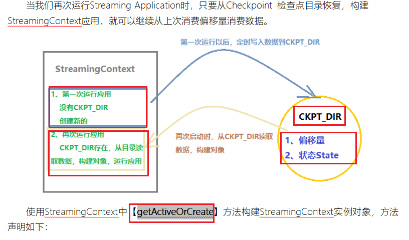
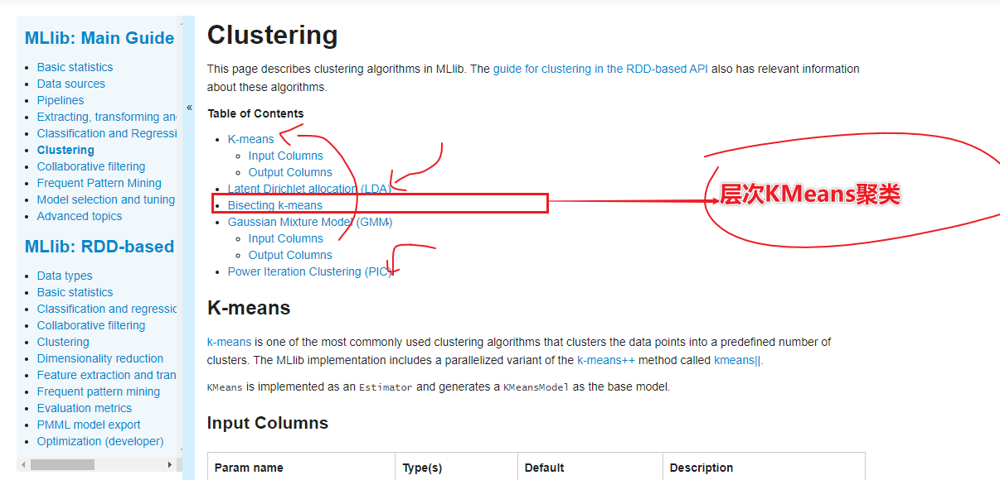
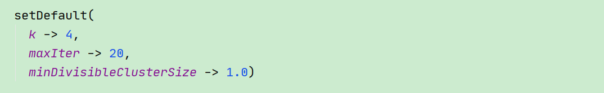

## RFE模型

* https://cloud.tencent.com/developer/article/1663055
* 新特性--处理flink的反压和barrier耦合

## 1-回顾

* SparkStreaming

* 

* 

* 

* Flink

* [Apache Flink 中文社区网站](https://link.zhihu.com/?target=http%3A//zh.ververica.com)**：**[zh.ververica.com](https://link.zhihu.com/?target=http%3A//zh.ververica.com)

* 

* StreamGraph：是根据用户通过 Stream API 编写的代码生成的最初的图。用来表示程序的拓扑结构。
   JobGraph：StreamGraph经过优化后生成了 JobGraph，提交给 JobManager 的数据结构。主要的优化为，将多个符合条件的节点 chain 在一起作为一个节点，这样可以减少数据在节点之间流动所需要的序列化/反序列化/传输消耗。
   ExecutionGraph：JobManager 根据 JobGraph 生成ExecutionGraph。ExecutionGraph是JobGraph的并行化版本，是调度层最核心的数据结构。
   物理执行图：JobManager 根据 ExecutionGraph 对 Job 进行调度后，在各个TaskManager 上部署 Task 后形成的“图”，并不是一个具体的数据结构。

* StreamGraph是对用户逻辑的映射。JobGraph在此基础上进行了一些优化，比如把一部分操
   作串成chain以提高效率。ExecutionGraph是为了调度存在的，加入了并行处理的概念。而在
   此基础上真正执行的是Task及其相关结构。

* 这里对一些名词进行简单的解释。

  - StreamGraph：根据用户通过 Stream API 编写的代码生成的最初的图。
  - StreamNode：用来代表 operator 的类，并具有所有相关的属性，如并发度、入边和出边等。
  - StreamEdge：表示连接两个StreamNode的边。
  - JobGraph：StreamGraph经过优化后生成了 JobGraph，提交给 JobManager 的数据结构。
  - JobVertex：经过优化后符合条件的多个StreamNode可能会chain在一起生成一个JobVertex，即一个* * JobVertex包含一个或多个operator，JobVertex的输入是JobEdge，输出是IntermediateDataSet。
  - IntermediateDataSet：表示JobVertex的输出，即经过operator处理产生的数据集。producer是JobVertex，consumer是JobEdge。
  - JobEdge：代表了job graph中的一条数据传输通道。source 是 IntermediateDataSet，target 是 JobVertex。即数据通过JobEdge由IntermediateDataSet传递给目标JobVertex。
  - ExecutionGraph：JobManager 根据 JobGraph 生成ExecutionGraph。ExecutionGraph是JobGraph的并行化版本，是调度层最核心的数据结构。
  - ExecutionJobVertex：和JobGraph中的JobVertex一一对应。每一个ExecutionJobVertex都有和并发度一样多的 ExecutionVertex。
  - ExecutionVertex：表示ExecutionJobVertex的其中一个并发子任务，输入是ExecutionEdge，输出是IntermediateResultPartition。
  - IntermediateResult：和JobGraph中的IntermediateDataSet一一对应。一个IntermediateResult包含多个IntermediateResultPartition，其个数等于该operator的并发度。
     IntermediateResultPartition：表示ExecutionVertex的一个输出分区，producer是ExecutionVertex，consumer是若干个ExecutionEdge。
  - ExecutionEdge：表示ExecutionVertex的输入，source是IntermediateResultPartition，target是ExecutionVertex。source和target都只能是一个。
  - Execution：是执行一个 ExecutionVertex 的一次尝试。当发生故障或者数据需要重算的情况下 ExecutionVertex 可能会有多个 ExecutionAttemptID。一个 Execution 通过 ExecutionAttemptID 来唯一标识。JM和TM之间关于 task 的部署和 task status 的更新都是通过 ExecutionAttemptID 来确定消息接受者。
  - 物理执行图：JobManager 根据 ExecutionGraph 对 Job 进行调度后，在各个TaskManager 上部署 Task 后形成的“图”，并不是一个具体的数据结构。
  - Task：Execution被调度后在分配的 TaskManager 中启动对应的 Task。Task 包裹了具有用户执行逻辑的 operator。
  - ResultPartition：代表由一个Task的生成的数据，和ExecutionGraph中的IntermediateResultPartition一一对应。
  - ResultSubpartition：是ResultPartition的一个子分区。每个ResultPartition包含多个ResultSubpartition，其数目要由下游消费 Task 数和 DistributionPattern 来决定。
  - InputGate：代表Task的输入封装，和JobGraph中JobEdge一一对应。每个InputGate消费了一个或多个的ResultPartition。
  - InputChannel：每个InputGate会包含一个以上的InputChannel，和ExecutionGraph中的ExecutionEdge一一对应，也和ResultSubpartition一对一地相连，即一个InputChannel接收一个ResultSubpartition的输出。

* checkpoint

  * Barrier

    * Flink的checkpoint机制原理来自“Chandy-Lamport algorithm”算法，通过checkpoint频率时间定时发送barrier消息。 (分布式快照算)

    * 

    * barrier从Source Task处生成，一直流到Sink Task，期间所有的Task只要碰到barrier，就会触发自身进行快照; 通过保存每个task的快照，即保存整个流的即时时状态。
    
  *   Barrier Align

      * 

      * 当一个opeator有多个输入流的时候，checkpoint barrier n 会进行对齐，就是已到达的会先缓存到buffer里等待其他未到达的，一旦所有流都到达，则会向下游广播，exactly-once 就是利用这一特性实现的，at least once 因为不会进行对齐，就会导致有的数据被重复处理.

      *  Exactly Once时必须barrier对齐，如果barrier不对齐就变成了At Least Once；

  * 3 checkpoint过程。

    - 1、JobManager端的 CheckPointCoordinator向 所有SourceTask发送CheckPointTrigger，Source Task会在数据流中安插CheckPoint barrier
    - 2、当task收到所有的barrier后，向自己的下游继续传递barrier，然后自身执行快照，并将自己的状态异步写入到持久化存储中。增量CheckPoint只是把最新的一部分更新写入到 外部存储；为了下游尽快做CheckPoint，所以会先发送barrier到下游，自身再同步进行快照
    - 3、当task完成备份后，会将备份数据的地址（state handle）通知给JobManager的CheckPointCoordinator；
      如果CheckPoint的持续时长超过 了CheckPoint设定的超时时间，CheckPointCoordinator 还没有收集完所有的 State Handle，CheckPointCoordinator就会认为本次CheckPoint失败，会把这次CheckPoint产生的所有 状态数据全部删除。
    - 4、 最后 CheckPoint Coordinator 会把整个 StateHandle 封装成 completed CheckPoint Meta，写入到hdfs。

  * 4 checkpoint存储方式。

    4.1 RocksDB实现增量checkpoint

    state backend中提供了一种RocksDb存储checkpoint ,它是Flink提供的唯一可以实现增量checkpoint的方法。原理是每次生成checkpoint是会生成sst文件（不会再修改了），会和之前的文件进行对比，每次上传新增的sst文件即可,大概就是这样

    4.2 全量checkpoint
      默认情况下是保存在Jm的内存中，由于可能会比较大，可以存在状态后端中，生成中建议放hdfs.

* 两阶段提交

    * 
    * 1-C先将prepare请求写入本地日志，然后发送一个prepare的请求给P
    * 2-P收到prepare请求后，开始执行事务，如果执行成功返回一个Yes或OK状态给C，否则返回No，并将状态存到本地日志。
    * 3-C收到P返回的状态，如果每个P的状态都是Yes，则开始执行事务Commit操作，发Commit请求给每个P，P收到Commit请求后各自执行Commit事务操作。如果至少一个P的状态为No，则会执行Abort操作，发Abort请求给每个P，P收到Abort请求后各自执行Abort事务操作。
      注：C或P把发送或接收到的消息先写到日志里，主要是为了故障后恢复用，类似WAL
    
* Flink如何保证状态的？SParkStreaming如何进行状态管理？

    * SParkStreaming
        * 
* Flink
    * 从容错和消息处理的语义上(at least once, exactly once)，Flink引入了state和checkpoint
      * 保存state的数据结构
    
        ValueState<T>:即类型为T的单值状态。这个状态与对应的key绑定，是最简单的状态了。它可以通过update方法更新状态值，通过value()方法获取状态值
    
        ListState<T>:即key上的状态值为一个列表。可以通过add方法往列表中附加值；也可以通过get()方法返回一个Iterable<T>来遍历状态值
    
        ReducingState<T>:这种状态通过用户传入的reduceFunction，每次调用add方法添加值的时候，会调用reduceFunction，最后合并到一个单一的状态值
    
        MapState<UK, UV>:即状态值为一个map。用户通过put或putAll方法添加元素

## 2-重难点知识

* 层次聚类算法-了解
* 层次KMeans聚类的SparkMllib实战
* 改进RFM的模型持久化
* 改进RFM的模型的K值选择
* 改进RFM的层次聚类的算法优化
* RFE模型业务知识
* RFE模型标签创建
* RFE模型的标签分析
* RFE模型的标签代码实战
* PSM...

## 3-层次聚类算法-了解[面试需要了解]

* 聚类算法分类：

  * 1-基于原型聚类

    * Kmeans
    * GMM

  * 2-基于密度的聚类--了解

    * 只要样本的密度大于一个设定的阈值，则将该样本添加到最近的簇中。
    * 
    * DBSCAN
    * 
    * 
    * 适用场景：基于地理位置信息的聚类中使用效果很好。

  * 3-基于层次聚类--了解

    * 凝聚

    * 分裂

    * 

    * 

    * 

    * 步骤如下：

      1）计算得到所有样本间的距离矩阵

      2）将每个数据点看作是一个单独的簇

      3）基于最不相似（距离最远）样本的距离，合并两个最接近的簇

      4）更新相似矩阵（样本间相似矩阵）

      5）重复2到4，直到所有样本都合并到一个簇为止

## 4-层次KMeans聚类的SparkMllib实战

* 

* 将k均值平分是一种使用除法（或“自上而下”）方法的层次聚类：所有观测值都在一个聚类中开始，并且随着一个人向下移动，递归执行拆分。

* Bisecting K-means can often be much faster than regular K-means, but it will generally produce a different clustering.

  `BisectingKMeans` is implemented as an `Estimator` and generates a `BisectingKMeansModel` as the base model.

  

  

  

  http://glaros.dtc.umn.edu/gkhome/node/157

* 代码参考

* ```scala
  import org.apache.spark.ml.clustering.BisectingKMeans
  import org.apache.spark.ml.evaluation.ClusteringEvaluator
  
  // Loads data.
  val dataset = spark.read.format("libsvm").load("data/mllib/sample_kmeans_data.txt")
  
  // Trains a bisecting k-means model.
  val bkm = new BisectingKMeans().setK(2).setSeed(1)
  val model = bkm.fit(dataset)
  
  // Make predictions
  val predictions = model.transform(dataset)
  
  // Evaluate clustering by computing Silhouette score
  val evaluator = new ClusteringEvaluator()
  
  val silhouette = evaluator.evaluate(predictions)
  println(s"Silhouette with squared euclidean distance = $silhouette")
  
  // Shows the result.
  println("Cluster Centers: ")
  val centers = model.clusterCenters
  centers.foreach(println)
  ```

* 

* iris的代码

* ```scala
  package cn.itcast.KMeans
  
  import org.apache.spark.SparkContext
  import org.apache.spark.ml.clustering.{BisectingKMeans, BisectingKMeansModel, KMeans, KMeansModel}
  import org.apache.spark.ml.feature.{MinMaxScaler, MinMaxScalerModel, VectorAssembler}
  import org.apache.spark.sql.{DataFrame, SparkSession}
  
  /**
   * DESC:利用SparkMllib的API实现聚类算法
   */
  object _06BisectingKMeansTest {
    def main(args: Array[String]): Unit = {
      val spark: SparkSession = SparkSession
        .builder()
        .appName("_02KMeansLibsvmSparkSQL")
        .master("local[*]").getOrCreate()
      val sc: SparkContext = spark.sparkContext
      sc.setLogLevel("WARN")
      val datapath = "D:\\BigData\\Workspace\\spark_learaning_2.11\\spark-study-gz-day01_2.11\\src\\main\\resources\\data\\iris.csv"
      val mediumData: DataFrame = spark.read.format("csv")
        .option("header", true)
        .option("inferSchema", true)
        .option("sep", ",")
        .load(datapath)
      //特征工程--sepal_length,sepal_width,petal_length,petal_width,class
      val assembler: VectorAssembler = new VectorAssembler().setInputCols(Array("sepal_length", "sepal_width", "petal_length", "petal_width")).setOutputCol("features")
      val vecDF: DataFrame = assembler.transform(mediumData)
  
      val scaler: MinMaxScaler = new MinMaxScaler().setInputCol("features").setOutputCol("minmaxFeatures")
      val scalerModel: MinMaxScalerModel = scaler.fit(vecDF)
      val scalerDF: DataFrame = scalerModel.transform(vecDF)
  
      val means: BisectingKMeans = new BisectingKMeans()
        .setK(3)
        .setFeaturesCol("minmaxFeatures")
        .setMaxIter(100)
        .setPredictionCol("prediction")
        .setSeed(123L)
  
      val model: BisectingKMeansModel = means.fit(scalerDF)
      val wssse: Double = model.computeCost(scalerDF)
      println("WSSSE value is:", wssse)
      //(WSSSE value is:,7.138647703985387)
      println("聚类中心")
      model.clusterCenters.foreach(println(_))
      /* (WSSSE value is:,6.9981140048267605)
  聚类中心
  [0.19611111111111118,0.5908333333333332,0.07864406779661014,0.05999999999999999]
  [0.44125683060109294,0.3073770491803279,0.5757154765212558,0.5491803278688525]
  [0.7072649572649572,0.450854700854701,0.797044763146458,0.8247863247863247]
  */
    }
  }
  ```

## 5-改进RFM的模型持久化[重点掌握]

* 一个模型训练好以后需要将模型持久化

* 下次模型预测直接预测即可，不需要进行重新训练

* 放入hdfs中

* 

* 

* 

* 代码：

* ```scala
  package cn.itcast.up.ml.gzmltag
  
  import cn.itcast.up.base.BaseModelPo7
  import cn.itcast.up.common.HDFSUtils
  import org.apache.spark.ml.clustering.{KMeans, KMeansModel}
  import org.apache.spark.ml.feature.VectorAssembler
  import org.apache.spark.rdd.RDD
  import org.apache.spark.sql.expressions.UserDefinedFunction
  import org.apache.spark.sql._
  
  import scala.collection.immutable
  
  /**
   * DESC:
   */
  object RFMModelSaveHdfs extends BaseModelPo7 {
    def main(args: Array[String]): Unit = {
      execute()
    }
  
    override def getId(): Long = 37
  
    override def compute(hbaseDF: DataFrame, fiveRuleDS: Dataset[Row]): DataFrame = {
      import org.apache.spark.sql.functions._
      import spark.implicits._
      //1-继承BaseModel实现其中的compute和getIagId方法
      println("======================================1-FiveDS==============================")
      //fiveRuleDS.show()
      //fiveRuleDS.printSchema()
      /* +---+----+
       | id|rule|
       +---+----+
       | 38|   1|
       | 39|   2|
       | 40|   3|
       | 41|   4|
       | 42|   5|
       | 43|   6|
       | 44|   7|
       +---+----+
       root
       |-- id: long (nullable = false)
       |-- rule: string (nullable = true)*/
      println("======================================2-HbaseDF==============================")
      //hbaseDF.show()
      //hbaseDF.printSchema()
      /* +---------+-------------------+-----------+----------+
       | memberId|            orderSn|orderAmount|finishTime|
       +---------+-------------------+-----------+----------+
       | 13823431| ts_792756751164275|    2479.45|1564415022|
       |  4035167| D14090106121770839|    2449.00|1565687310|
       |  4035291| D14090112394810659|    1099.42|1564681801|*/
      /* root
       |-- memberId: string (nullable = true)
       |-- orderSn: string (nullable = true)
       |-- orderAmount: string (nullable = true)
       |-- finishTime: string (nullable = true)*/
      //2-在compute中执行计算，得到RFM的值
      println("======================================3-在compute中执行计算RFM==============================")
      //0.定义常量字符串,避免后续拼写错误
      val recencyStr = "recency"
      val frequencyStr = "frequency"
      val monetaryStr = "monetary"
      val featureStr = "feature"
      val predictStr = "predict"
      //3-R的值就指得是构建用户最近一次消费的时间距离今天的天数
      //4-F的值就是值的是用户最近一段时间的购买的频率
      //5-M的值就是用户最近一次消费的金额
      //current_date--- Returns the current date at the start of query evaluation.
      //from_unixtime---"yyyy-MM-dd HH:mm:ss"
      val tempDF: DataFrame = hbaseDF
        .groupBy("memberId")
        .agg(
          datediff(date_sub(current_date(), 365), from_unixtime(max('finishTime))).as(recencyStr),
          count('orderSn).as(frequencyStr),
          sum('orderAmount).as(monetaryStr)
        )
      //tempDF.show()
      println("======================================4-RFM去量纲操作==============================")
      //6-对于RFM的值根据RFM的数据归一化的思路对数据进行规则匹配形成无量纲的数据类型
      //R:1-3天=5分，4-6天=4分，7-9天=3分，10-15天=2分，大于16天=1分
      val recencyColumnStr: Column = functions
        .when(col(recencyStr) >= 1 && col(recencyStr) <= 3, 5)
        .when(col(recencyStr) >= 4 && col(recencyStr) <= 6, 4)
        .when(col(recencyStr) >= 7 && col(recencyStr) <= 9, 3)
        .when(col(recencyStr) >= 10 && col(recencyStr) <= 15, 2)
        .when(col(recencyStr) >= 16, 1)
        .as(recencyStr)
      //F: ≥200=5分，150-199=4分，100-149=3分，50-99=2分，1-49=1分
      val frequencyScoreStr: Column = functions.when(col(frequencyStr) >= 200, 5)
        .when((col(frequencyStr) >= 150) && (col(frequencyStr) <= 199), 4)
        .when((col(frequencyStr) >= 100) && (col(frequencyStr) <= 149), 3)
        .when((col(frequencyStr) >= 50) && (col(frequencyStr) <= 99), 2)
        .when((col(frequencyStr) >= 1) && (col(frequencyStr) <= 49), 1)
        .as(frequencyStr)
      //M: ≥20w=5分，10-19w=4分，5-9w=3分，1-4w=2分，<1w=1分
      val monetaryScoreStr: Column = functions.when(col(monetaryStr) >= 200000, 5)
        .when(col(monetaryStr).between(100000, 199999), 4)
        .when(col(monetaryStr).between(50000, 99999), 3)
        .when(col(monetaryStr).between(10000, 49999), 2)
        .when(col(monetaryStr) <= 9999, 1)
        .as(monetaryStr)
      val tempDF2: DataFrame = tempDF.select('memberId.as("userid"), recencyColumnStr, frequencyScoreStr, monetaryScoreStr)
      //tempDF2.show()
      //tempDF2.printSchema()
      /* +---------+-------+---------+--------+
       |   userid|recency|frequency|monetary|
       +---------+-------+---------+--------+
       | 13822725|      1|        3|       4|
       | 13823083|      1|        3|       5|
       |138230919|      1|        3|       5|
       | 13823681|      1|        3|       4|
       |  4033473|      1|        3|       5|
       root
      |-- userid: string (nullable = true)
      |-- recency: integer (nullable = true)
      |-- frequency: integer (nullable = true)
      |-- monetary: integer (nullable = true)
       */
      println("======================================5-RFM聚类分析==============================")
      //7-使用特征工程进行
      val assembler: VectorAssembler = new VectorAssembler().setInputCols(Array(recencyStr, frequencyStr, monetaryStr)).setOutputCol(featureStr)
      val assDF: DataFrame = assembler.transform(tempDF2)
      val path = "/model/RFMGZ01"
      var model: KMeansModel = null;
      if (HDFSUtils.getInstance().exists(path)) {
        println("model path exists,please load model:")
        model = KMeansModel.load(path)
      } else {
        println("model path not  exists,please fit model:")
        //8-训练聚类的KMeans算法模型
        val means: KMeans = new KMeans()
          .setK(7)
          .setPredictionCol(predictStr)
          .setFeaturesCol(featureStr)
          .setInitMode("k-means||")
        //9-模型预测
        model = means.fit(assDF)
        model.save(path)
      }
  
  
      //10-模型校验
      val allDF: DataFrame = model.transform(assDF)
      //println("RFM的Cluster Centers")
      //meansModel.clusterCenters.foreach(println(_))
      /*[1.0,3.0,5.0]
        [1.0,3.0,4.0]
        [1.0,1.0,3.0]
        [1.0,1.0,2.0]
        [1.0,4.038461538461538,5.0]
        [1.0,1.0,1.0]
        [1.0,1.8888888888888888,4.222222222222222]*/
      //println("WSSSE:", meansModel.computeCost(allDF))//(WSSSE:,3.405982905982995)
      //11-模型优化
      //得到聚类中心，对聚类中心进行家和在排序
      //12-将模型预测的结果需要和五级标签进行对应
      println("======================================6-RFM聚类中心求和和排序==============================")
      val CLusterIndecies: immutable.Seq[(Int, Double)] = model.clusterCenters.indices.map(i => (i, model.clusterCenters(i).toArray.sum))
      //CLusterIndecies.foreach(println(_))
      /* (0,9.0)
        (1,8.0)
        (2,5.0)
        (3,4.0)
        (4,10.038461538461538)
        (5,3.0)
        (6,7.111111111111111)*/
      //排序
      val sortIndexedAndRFM: immutable.Seq[(Int, Double)] = CLusterIndecies.sortBy(_._2).reverse
      //sortIndexedAndRFM.foreach(println(_))
      /*(4,10.038461538461538)
      (0,9.0)
      (1,8.0)
      (6,7.111111111111111)
      (2,5.0)
      (3,4.0)
      (5,3.0)
      +---+----+
      | id|rule|
     +---+----+
      | 38|   1|
      | 39|   2|
      | 40|   3|
      | 41|   4|
      | 42|   5|
      | 43|   6|
      | 44|   7|
      +---+----+*/
      val fiveRuleDSTuple: Dataset[(Long, String)] = fiveRuleDS.as[(Long, String)]
      val sortIndexAndRFMDS: Dataset[(Int, Double)] = sortIndexedAndRFM.toDS()
      //将两个DS使用rdd的repartiton方法，将分区调整为为1个分区，在一个分区中使用zip拉链操作将两个DS的数据整合为一个规则数据
      //RDD[((Int, Double), (Long, String))]
      val predictAndTagsId: RDD[((Int, Double), (Long, String))] = sortIndexAndRFMDS.rdd.repartition(1).zip(fiveRuleDSTuple.rdd.repartition(1))
      //predictAndTagsId.foreach(println(_))
      /*((4,10.038461538461538),(38,1))
      ((0,9.0),(39,2))
      ((1,8.0),(40,3))
      ((6,7.111111111111111),(41,4))
      ((2,5.0),(42,5))
      ((3,4.0),(43,6))
      ((5,3.0),(44,7))*/
      val predictLabelAndTagsId: RDD[(Int, Long)] = predictAndTagsId.map(row => {
        (row._1._1, row._2._1)
      })
      /* (4,38)  使用kmeans算法预测的聚类中心是低4类，就给你打上38的标签，对应的就是超高价值
       (0,39)
       (1,40)
       (6,41)
       (2,42)
       (3,43)
       (5,44)*/
      //predictLabelAndTagsId.foreach(println(_))
      val predictLabelAndTagsIdMap: collection.Map[Int, Long] = predictLabelAndTagsId.collectAsMap()
      predictLabelAndTagsIdMap.foreach(println(_))
      //13-自定义UDF实现一个用户价值预测值对应的一个tagsid标签
      val predictToTagid: UserDefinedFunction = spark.udf.register("predictToTagid", (predict: Int) => {
        predictLabelAndTagsIdMap(predict)
      })
      val newDF: DataFrame = allDF.select('userid, predictToTagid('predict).as("tagsid"))
      //14-返回newDF
      newDF.show()
      /*  +---------+------+
        |   userid|tagsid|
        +---------+------+
        | 13822725|    40|
          | 13823083|    39|
          |138230919|    39|
          | 13823681|    40|
          |  4033473|    39|*/
      null
    }
  }
  ```

* 总结：
  
  * 需要对模型进行保存在预测

## 6-改进RFM的模型的K值选择[重点掌握]

* K值选择叫做---肘部法

* ```scala
  package cn.itcast.up.ml.gzmltag
  
  import cn.itcast.up.base.BaseModelPo7
  import cn.itcast.up.common.HDFSUtils
  import org.apache.spark.ml.clustering.{KMeans, KMeansModel}
  import org.apache.spark.ml.feature.VectorAssembler
  import org.apache.spark.rdd.RDD
  import org.apache.spark.sql._
  import org.apache.spark.sql.expressions.UserDefinedFunction
  
  import scala.collection.immutable
  
  /**
   * DESC:
   */
  object RFMModelSaveHdfsKSelect extends BaseModelPo7 {
    def main(args: Array[String]): Unit = {
      execute()
    }
  
    override def getId(): Long = 37
  
    override def compute(hbaseDF: DataFrame, fiveRuleDS: Dataset[Row]): DataFrame = {
      import org.apache.spark.sql.functions._
      import spark.implicits._
      //1-继承BaseModel实现其中的compute和getIagId方法
      println("======================================1-FiveDS==============================")
      //fiveRuleDS.show()
      //fiveRuleDS.printSchema()
      /* +---+----+
       | id|rule|
       +---+----+
       | 38|   1|
       | 39|   2|
       | 40|   3|
       | 41|   4|
       | 42|   5|
       | 43|   6|
       | 44|   7|
       +---+----+
       root
       |-- id: long (nullable = false)
       |-- rule: string (nullable = true)*/
      println("======================================2-HbaseDF==============================")
      //hbaseDF.show()
      //hbaseDF.printSchema()
      /* +---------+-------------------+-----------+----------+
       | memberId|            orderSn|orderAmount|finishTime|
       +---------+-------------------+-----------+----------+
       | 13823431| ts_792756751164275|    2479.45|1564415022|
       |  4035167| D14090106121770839|    2449.00|1565687310|
       |  4035291| D14090112394810659|    1099.42|1564681801|*/
      /* root
       |-- memberId: string (nullable = true)
       |-- orderSn: string (nullable = true)
       |-- orderAmount: string (nullable = true)
       |-- finishTime: string (nullable = true)*/
      //2-在compute中执行计算，得到RFM的值
      println("======================================3-在compute中执行计算RFM==============================")
      //0.定义常量字符串,避免后续拼写错误
      val recencyStr = "recency"
      val frequencyStr = "frequency"
      val monetaryStr = "monetary"
      val featureStr = "feature"
      val predictStr = "predict"
      //3-R的值就指得是构建用户最近一次消费的时间距离今天的天数
      //4-F的值就是值的是用户最近一段时间的购买的频率
      //5-M的值就是用户最近一次消费的金额
      //current_date--- Returns the current date at the start of query evaluation.
      //from_unixtime---"yyyy-MM-dd HH:mm:ss"
      val tempDF: DataFrame = hbaseDF
        .groupBy("memberId")
        .agg(
          datediff(date_sub(current_date(), 365), from_unixtime(max('finishTime))).as(recencyStr),
          count('orderSn).as(frequencyStr),
          sum('orderAmount).as(monetaryStr)
        )
      //tempDF.show()
      println("======================================4-RFM去量纲操作==============================")
      //6-对于RFM的值根据RFM的数据归一化的思路对数据进行规则匹配形成无量纲的数据类型
      //R:1-3天=5分，4-6天=4分，7-9天=3分，10-15天=2分，大于16天=1分
      val recencyColumnStr: Column = functions
        .when(col(recencyStr) >= 1 && col(recencyStr) <= 3, 5)
        .when(col(recencyStr) >= 4 && col(recencyStr) <= 6, 4)
        .when(col(recencyStr) >= 7 && col(recencyStr) <= 9, 3)
        .when(col(recencyStr) >= 10 && col(recencyStr) <= 15, 2)
        .when(col(recencyStr) >= 16, 1)
        .as(recencyStr)
      //F: ≥200=5分，150-199=4分，100-149=3分，50-99=2分，1-49=1分
      val frequencyScoreStr: Column = functions.when(col(frequencyStr) >= 200, 5)
        .when((col(frequencyStr) >= 150) && (col(frequencyStr) <= 199), 4)
        .when((col(frequencyStr) >= 100) && (col(frequencyStr) <= 149), 3)
        .when((col(frequencyStr) >= 50) && (col(frequencyStr) <= 99), 2)
        .when((col(frequencyStr) >= 1) && (col(frequencyStr) <= 49), 1)
        .as(frequencyStr)
      //M: ≥20w=5分，10-19w=4分，5-9w=3分，1-4w=2分，<1w=1分
      val monetaryScoreStr: Column = functions.when(col(monetaryStr) >= 200000, 5)
        .when(col(monetaryStr).between(100000, 199999), 4)
        .when(col(monetaryStr).between(50000, 99999), 3)
        .when(col(monetaryStr).between(10000, 49999), 2)
        .when(col(monetaryStr) <= 9999, 1)
        .as(monetaryStr)
      val tempDF2: DataFrame = tempDF.select('memberId.as("userid"), recencyColumnStr, frequencyScoreStr, monetaryScoreStr)
      //tempDF2.show()
      //tempDF2.printSchema()
      /* +---------+-------+---------+--------+
       |   userid|recency|frequency|monetary|
       +---------+-------+---------+--------+
       | 13822725|      1|        3|       4|
       | 13823083|      1|        3|       5|
       |138230919|      1|        3|       5|
       | 13823681|      1|        3|       4|
       |  4033473|      1|        3|       5|
       root
      |-- userid: string (nullable = true)
      |-- recency: integer (nullable = true)
      |-- frequency: integer (nullable = true)
      |-- monetary: integer (nullable = true)
       */
      println("======================================5-RFM聚类分析==============================")
      //7-使用特征工程进行
      val assembler: VectorAssembler = new VectorAssembler().setInputCols(Array(recencyStr, frequencyStr, monetaryStr)).setOutputCol(featureStr)
      val assDF: DataFrame = assembler.transform(tempDF2)
  
      val ks: Array[Int] = Array(5, 6, 7, 8, 9)
      ks.foreach(kvs => {
        val means: KMeans = new KMeans()
          .setK(kvs)
          .setPredictionCol(predictStr)
          .setFeaturesCol(featureStr)
          .setInitMode("k-means||")
        //9-模型预测
        val model: KMeansModel = means.fit(assDF)
        val wssse: Double = model.computeCost(assDF)
        println("ks value is:", kvs, "wssse value is:", wssse)
      })
      //(ks value is:,[I@52a8f789,wssse value is:,15.57279568408211)
      //(ks value is:,[I@52a8f789,wssse value is:,12.715652826939262)
      //(ks value is:,[I@52a8f789,wssse value is:,3.405982905982995)
      //(ks value is:,[I@52a8f789,wssse value is:,2.444444444444443)
      //(ks value is:,[I@52a8f789,wssse value is:,0.5)
      null
    }
  }
  ```

* 在RFM-RFE-PSM的模型中
  * K值的获取都是通过肘部法获取的，不是说WSSS越小越好
  * K的值获取到变化的最快的范围之后
  * 使用当前的K值去训练KMean算法模型得到最佳的模型保存到HDFS中

* 技术选型的时候使用基于层次聚类和基于面密度聚类选型

* Spark中实现了基于层次聚类，没有是基于密度聚类

* 基于密度聚类更加适合于地理位置信息的聚类，这里选择基于层次聚类

* `BisectingKMeans` 

* ```scala
  package cn.itcast.up.ml.gzmltag
  
  import cn.itcast.up.base.BaseModelPo7
  import cn.itcast.up.common.HDFSUtils
  import org.apache.spark.ml.clustering.{BisectingKMeans, BisectingKMeansModel, KMeans, KMeansModel}
  import org.apache.spark.ml.feature.VectorAssembler
  import org.apache.spark.rdd.RDD
  import org.apache.spark.sql._
  import org.apache.spark.sql.expressions.UserDefinedFunction
  
  import scala.collection.immutable
  
  /**
   * DESC:
   */
  object RFMModelBisectingKMeansSaveHdfs extends BaseModelPo7 {
    def main(args: Array[String]): Unit = {
      execute()
    }
  
    override def getId(): Long = 37
  
    override def compute(hbaseDF: DataFrame, fiveRuleDS: Dataset[Row]): DataFrame = {
      import org.apache.spark.sql.functions._
      import spark.implicits._
      //1-继承BaseModel实现其中的compute和getIagId方法
      println("======================================1-FiveDS==============================")
      //fiveRuleDS.show()
      //fiveRuleDS.printSchema()
      /* +---+----+
       | id|rule|
       +---+----+
       | 38|   1|
       | 39|   2|
       | 40|   3|
       | 41|   4|
       | 42|   5|
       | 43|   6|
       | 44|   7|
       +---+----+
       root
       |-- id: long (nullable = false)
       |-- rule: string (nullable = true)*/
      println("======================================2-HbaseDF==============================")
      //hbaseDF.show()
      //hbaseDF.printSchema()
      /* +---------+-------------------+-----------+----------+
       | memberId|            orderSn|orderAmount|finishTime|
       +---------+-------------------+-----------+----------+
       | 13823431| ts_792756751164275|    2479.45|1564415022|
       |  4035167| D14090106121770839|    2449.00|1565687310|
       |  4035291| D14090112394810659|    1099.42|1564681801|*/
      /* root
       |-- memberId: string (nullable = true)
       |-- orderSn: string (nullable = true)
       |-- orderAmount: string (nullable = true)
       |-- finishTime: string (nullable = true)*/
      //2-在compute中执行计算，得到RFM的值
      println("======================================3-在compute中执行计算RFM==============================")
      //0.定义常量字符串,避免后续拼写错误
      val recencyStr = "recency"
      val frequencyStr = "frequency"
      val monetaryStr = "monetary"
      val featureStr = "feature"
      val predictStr = "predict"
      //3-R的值就指得是构建用户最近一次消费的时间距离今天的天数
      //4-F的值就是值的是用户最近一段时间的购买的频率
      //5-M的值就是用户最近一次消费的金额
      //current_date--- Returns the current date at the start of query evaluation.
      //from_unixtime---"yyyy-MM-dd HH:mm:ss"
      val tempDF: DataFrame = hbaseDF
        .groupBy("memberId")
        .agg(
          datediff(date_sub(current_date(), 365), from_unixtime(max('finishTime))).as(recencyStr),
          count('orderSn).as(frequencyStr),
          sum('orderAmount).as(monetaryStr)
        )
      //tempDF.show()
      println("======================================4-RFM去量纲操作==============================")
      //6-对于RFM的值根据RFM的数据归一化的思路对数据进行规则匹配形成无量纲的数据类型
      //R:1-3天=5分，4-6天=4分，7-9天=3分，10-15天=2分，大于16天=1分
      val recencyColumnStr: Column = functions
        .when(col(recencyStr) >= 1 && col(recencyStr) <= 3, 5)
        .when(col(recencyStr) >= 4 && col(recencyStr) <= 6, 4)
        .when(col(recencyStr) >= 7 && col(recencyStr) <= 9, 3)
        .when(col(recencyStr) >= 10 && col(recencyStr) <= 15, 2)
        .when(col(recencyStr) >= 16, 1)
        .as(recencyStr)
      //F: ≥200=5分，150-199=4分，100-149=3分，50-99=2分，1-49=1分
      val frequencyScoreStr: Column = functions.when(col(frequencyStr) >= 200, 5)
        .when((col(frequencyStr) >= 150) && (col(frequencyStr) <= 199), 4)
        .when((col(frequencyStr) >= 100) && (col(frequencyStr) <= 149), 3)
        .when((col(frequencyStr) >= 50) && (col(frequencyStr) <= 99), 2)
        .when((col(frequencyStr) >= 1) && (col(frequencyStr) <= 49), 1)
        .as(frequencyStr)
      //M: ≥20w=5分，10-19w=4分，5-9w=3分，1-4w=2分，<1w=1分
      val monetaryScoreStr: Column = functions.when(col(monetaryStr) >= 200000, 5)
        .when(col(monetaryStr).between(100000, 199999), 4)
        .when(col(monetaryStr).between(50000, 99999), 3)
        .when(col(monetaryStr).between(10000, 49999), 2)
        .when(col(monetaryStr) <= 9999, 1)
        .as(monetaryStr)
      val tempDF2: DataFrame = tempDF.select('memberId.as("userid"), recencyColumnStr, frequencyScoreStr, monetaryScoreStr)
      //tempDF2.show()
      //tempDF2.printSchema()
      /* +---------+-------+---------+--------+
       |   userid|recency|frequency|monetary|
       +---------+-------+---------+--------+
       | 13822725|      1|        3|       4|
       | 13823083|      1|        3|       5|
       |138230919|      1|        3|       5|
       | 13823681|      1|        3|       4|
       |  4033473|      1|        3|       5|
       root
      |-- userid: string (nullable = true)
      |-- recency: integer (nullable = true)
      |-- frequency: integer (nullable = true)
      |-- monetary: integer (nullable = true)
       */
      println("======================================5-RFM聚类分析==============================")
      //7-使用特征工程进行
      val assembler: VectorAssembler = new VectorAssembler().setInputCols(Array(recencyStr, frequencyStr, monetaryStr)).setOutputCol(featureStr)
      val assDF: DataFrame = assembler.transform(tempDF2)
      val path = "/model/RFMGZ01Bisecting"
      var model: BisectingKMeansModel = null;
      if (HDFSUtils.getInstance().exists(path)) {
        println("model path exists,please load model:")
        model = BisectingKMeansModel.load(path)
      } else {
        println("model path not  exists,please fit model:")
        //8-训练聚类的KMeans算法模型
        val means: BisectingKMeans = new BisectingKMeans()
          .setK(7)
          .setPredictionCol(predictStr)
          .setFeaturesCol(featureStr)
        //9-模型预测
        model = means.fit(assDF)
        model.save(path)
      }
  
  
      //10-模型校验
      val allDF: DataFrame = model.transform(assDF)
      //println("RFM的Cluster Centers")
      //meansModel.clusterCenters.foreach(println(_))
      /*[1.0,3.0,5.0]
        [1.0,3.0,4.0]
        [1.0,1.0,3.0]
        [1.0,1.0,2.0]
        [1.0,4.038461538461538,5.0]
        [1.0,1.0,1.0]
        [1.0,1.8888888888888888,4.222222222222222]*/
      //println("WSSSE:", meansModel.computeCost(allDF))//(WSSSE:,3.405982905982995)
      //11-模型优化
      //得到聚类中心，对聚类中心进行家和在排序
      //12-将模型预测的结果需要和五级标签进行对应
      println("======================================6-RFM聚类中心求和和排序==============================")
      val CLusterIndecies: immutable.Seq[(Int, Double)] = model.clusterCenters.indices.map(i => (i, model.clusterCenters(i).toArray.sum))
      //CLusterIndecies.foreach(println(_))
      /* (0,9.0)
        (1,8.0)
        (2,5.0)
        (3,4.0)
        (4,10.038461538461538)
        (5,3.0)
        (6,7.111111111111111)*/
      //排序
      val sortIndexedAndRFM: immutable.Seq[(Int, Double)] = CLusterIndecies.sortBy(_._2).reverse
      //sortIndexedAndRFM.foreach(println(_))
      /*(4,10.038461538461538)
      (0,9.0)
      (1,8.0)
      (6,7.111111111111111)
      (2,5.0)
      (3,4.0)
      (5,3.0)
      +---+----+
      | id|rule|
     +---+----+
      | 38|   1|
      | 39|   2|
      | 40|   3|
      | 41|   4|
      | 42|   5|
      | 43|   6|
      | 44|   7|
      +---+----+*/
      val fiveRuleDSTuple: Dataset[(Long, String)] = fiveRuleDS.as[(Long, String)]
      val sortIndexAndRFMDS: Dataset[(Int, Double)] = sortIndexedAndRFM.toDS()
      //将两个DS使用rdd的repartiton方法，将分区调整为为1个分区，在一个分区中使用zip拉链操作将两个DS的数据整合为一个规则数据
      //RDD[((Int, Double), (Long, String))]
      val predictAndTagsId: RDD[((Int, Double), (Long, String))] = sortIndexAndRFMDS.rdd.repartition(1).zip(fiveRuleDSTuple.rdd.repartition(1))
      //predictAndTagsId.foreach(println(_))
      /*((4,10.038461538461538),(38,1))
      ((0,9.0),(39,2))
      ((1,8.0),(40,3))
      ((6,7.111111111111111),(41,4))
      ((2,5.0),(42,5))
      ((3,4.0),(43,6))
      ((5,3.0),(44,7))*/
      val predictLabelAndTagsId: RDD[(Int, Long)] = predictAndTagsId.map(row => {
        (row._1._1, row._2._1)
      })
      /* (4,38)  使用kmeans算法预测的聚类中心是低4类，就给你打上38的标签，对应的就是超高价值
       (0,39)
       (1,40)
       (6,41)
       (2,42)
       (3,43)
       (5,44)*/
      //predictLabelAndTagsId.foreach(println(_))
      val predictLabelAndTagsIdMap: collection.Map[Int, Long] = predictLabelAndTagsId.collectAsMap()
      predictLabelAndTagsIdMap.foreach(println(_))
      //13-自定义UDF实现一个用户价值预测值对应的一个tagsid标签
      val predictToTagid: UserDefinedFunction = spark.udf.register("predictToTagid", (predict: Int) => {
        predictLabelAndTagsIdMap(predict)
      })
      val newDF: DataFrame = allDF.select('userid, predictToTagid('predict).as("tagsid"))
      //14-返回newDF
      newDF.show()
      /*  +---------+------+
        |   userid|tagsid|
        +---------+------+
        | 13822725|    40|
          | 13823083|    39|
          |138230919|    39|
          | 13823681|    40|
          |  4033473|    39|*/
      null
    }
  }
  ```

* 优化
* 1-可以使用MinMaxSclaer
  
  * 可以对量纲不同点业务可以进行划归到-1到1间
* 2-可以迭代求解K值
  
  * 肘部法
* 3-其他的参数也可以通过循环的方式求解
  * **//** ***\**TODO\**\******\**：模型调优方式三：同时调整算法超参数\**\*** ***\**->k\**\******\**和迭代次数\**\******\**
    \**\******\*val\**** ks: Array[Int] = **Array**(2, 3, 4)
    ***\*val\**** iters: Array[Int] = **Array**(2, 3, 4)
    ks.foreach(
     cluster => {
      iters.foreach(
       iter => {
        ***\*val\**** kmeans: KMeans = ***\*new\**** KMeans().setFeaturesCol(featureStr).setPredictionCol(***\*"predictions"\****)
         .setK(cluster).setMaxIter(iter)
        ***\*val\**** kmeanModel: KMeansModel = kmeans.fit(vecDF)
        **//   \* 5-****预测分析****
    **    ***\*val\**** testResult: DataFrame = kmeanModel.transform(vecDF)
        **println**(***\*"wssse\*******\*，\*******\*when cluster="\****, cluster,iter, kmeanModel.computeCost(testResult)) **//(wssse,2.5189564869286865)****
    **    **println**(kmeanModel.clusterCenters.mkString(***\*","\****))
       }
      )
* 4-使用算法方面的额优化
  * 层次KMeans聚类
    * 更加快速求解聚类中心，从而实现分类
    * 采用的从上而下的分裂的思路

## 8-RFE模型业务知识

* RFE模型--------------------------客户活跃度模型----------------tbl_logs日志表

* 业务含义：

  * RFE
  * R---------Recency最近一次上网站的时间
  * F---------Frequency最近一段时间的访问频率
  * E--------和系统的交互次数

* 实际含义

  * 比如：

    \- 6忠诚	（1天内访问2次及以上，每次访问页面不重复）

    \- 5活跃	（2天内访问至少1次）

    \- 4回流	（3天内访问至少1次）

    \- 3新增	（注册并访问）

    \- 2不活跃	（7天内未访问）

    \- 1流失	（7天以上无访问）

* 更详细的业务含义

  * 1、流失用户：有一段时间没有再打开产品，那么我们就视为流失用户，根据产品的属性，可以按30天，60天，90天等划分。

    2、不活跃用户：有一段时间没有打开产品，为了和流失区分开来，需要选择无交集的时间范围。比如**流失用户是60天以上没打开产品**，**那么不活跃则是0～60天没打开。**

    3、回流用户：有一段时间没用产品，之后突然回来再次使用，则称为回流用户。回流用户是活跃用户，且是由流失用户或不活跃用户唤回而来。

    4、活跃用户：一段时间内打开过产品。

    5、忠诚用户：也可以叫超级活跃用户，长期持续使用产品，比如连续四周，或者一个月内15天等。

* RFE模型可以说是RFM模型的变体。 RFE模型基于**用户的普通行为（非转化或交易行为）产生**，它跟RFM类似都是使用三个维度做价值评估。

## 9-RFE模型标签创建

* RFE模型的标签创建、
* 四级标签
* 
* 五级标签
* 
* 标签规则定义的数据库中的4级标签
* 
* 
* RFE模型标签含义

## 10-RFE模型的标签分析

* 1-继承BaseModel类实现其中的getTagsID和compute方法

* 2-在compute方法中得到HbaseDF的logs表数据和fiveDS的五级标签数据

* ```
  1 column=detail:global_user_id, timestamp=1574240607242,value=424
  1 column=detail:loc_url, timestamp=1574240607242,
  value=http://m.eshop.com/m obile/coupon/getCoupons.html?couponsId=3377
  1 column=detail:log_time, timestamp=1574240607242, value=2019-08-13 03:03:55
  ```

* 3-得到R的值和F的值和F的值--------根据R和F和E的定义决定

* 4-通过业务规则定义对R的值、F的值和E的值进行数据的归一化

* ```
  计算R值：
  最近一次访问时间，距离今天的天数 - max -> datediff
  计算F值：
  所有访问浏览量（PV） - count
  计算E值：
  所有访问页面量（不包含重复访问页面）（UV） - count distinct
  R:0-15天=5分，16-30天=4分，31-45天=3分，46-60天=2分，大于61天=1分
  F:≥400=5分，300-399=4分，200-299=3分，100-199=2分，≤99=1分
  E:≥250=5分，200-249=4分，150-199=3分，149-50=2分，≤49=1分
  ```

* 5-形成特征，并实现特征工程

* 6-特征工程通过VectorAssemble方法实现

* 7-准备算法

* 8-算法的模型训练

* 9-模型的保存并校验

* 10-得到聚类中心的第几个聚类中心和聚类中心R+F+E的值的排序

* 11-处理五级标签和排序后的RFE聚类中心进行选择predict和tagsid的值

* 12-自定义udf函数将处理完的数据转化为tagsid

* 13-返回newDF

* /*

  **45 用户活跃度**-----------四级标签

  46 非常活跃 1

  47 活跃 2

  48 不活跃 3

  49 非常不活跃 4

  */

## 11- RFE模型的标签代码实战

* 代码

* ```scala
  package cn.itcast.up.ml.gzmltag
  
  import cn.itcast.up.base.BaseModelPo7
  import cn.itcast.up.common.HDFSUtils
  import org.apache.spark.ml.clustering.{KMeans, KMeansModel}
  import org.apache.spark.ml.feature.VectorAssembler
  import org.apache.spark.rdd.RDD
  import org.apache.spark.sql.expressions.UserDefinedFunction
  import org.apache.spark.sql.{Column, DataFrame, Dataset, Row, functions}
  
  import scala.collection.immutable
  
  /**
   * DESC:RFE模型
   * 1-继承BaseModel类实现其中的getTagsID和compute方法
   * 2-在compute方法中得到HbaseDF的logs表数据和fiveDS的五级标签数据
   * 3-得到R的值和F的值和F的值--------根据R和F和E的定义决定
   * 4-通过业务规则定义对R的值、F的值和E的值进行数据的归一化
   * R:0-15天=5分，16-30天=4分，31-45天=3分，46-60天=2分，大于61天=1分
   * F:≥400=5分，300-399=4分，200-299=3分，100-199=2分，≤99=1分
   * E:≥250=5分，200-249=4分，150-199=3分，149-50=2分，≤49=1分
   * 5-形成特征，并实现特征工程
   * 6-特征工程通过VectorAssemble方法实现
   * 7-准备算法
   * 8-算法的模型训练
   * 9-模型的保存并校验
   * 10-得到聚类中心的第几个聚类中心和聚类中心R+F+E的值的排序
   * 11-处理五级标签和排序后的RFE聚类中心进行选择predict和tagsid的值
   * 12-自定义udf函数将处理完的数据转化为tagsid
   * 13-返回newDF
   * 45 用户活跃度**-----------四级标签
   * 46 非常活跃 1
   * 47 活跃 2
   * 8 不活跃 3
   * 49 非常不活跃 4
   */
  
  object RFEModel extends BaseModelPo7 {
    def main(args: Array[String]): Unit = {
      execute()
    }
  
    override def getId(): Long = 45
  
    override def compute(hbaseDF: DataFrame, fiveRuleDS: Dataset[Row]): DataFrame = {
      import spark.implicits._
      import org.apache.spark.sql.functions._
      //1-继承BaseModel类实现其中的getTagsID和compute方法
      //0.定义常量字符串,避免后续拼写错误
      val recencyStr = "recency"
      val frequencyStr = "frequency"
      val engagementsStr = "engagements"
      val featureStr = "feature"
      val scaleFeatureStr = "scaleFeature"
      val predictStr = "predict"
      //2-在compute方法中得到HbaseDF的logs表数据和fiveDS的五级标签数据
      println("=====================1-fiveRuleDS====================")
      //fiveRuleDS.show()
      //fiveRuleDS.printSchema()
      /* +---+----+
       | id|rule|
       +---+----+
       | 46|   1|
       | 47|   2|
       | 48|   3|
       | 49|   4|
       +---+----+
       root
       |-- id: long (nullable = false)
       |-- rule: string (nullable = true)*/
      println("=====================2-hbaseDF====================")
      //hbaseDF.show()
      //hbaseDF.printSchema()
      /*
       +--------------+--------------------+-------------------+
       |global_user_id|             loc_url|           log_time|
       +--------------+--------------------+-------------------+
       |           424|http://m.eshop.co...|2019-08-13 03:03:55|
       |           619|http://m.eshop.co...|2019-07-29 15:07:41|
       root
       |-- global_user_id: string (nullable = true)
       |-- loc_url: string (nullable = true)
       |-- log_time: string (nullable = true)
      */
  
      //3-得到R的值和F的值和F的值--------根据R和F和E的定义决定
      println("=====================3-计算R的值-F的值-M的值====================")
      //4-通过业务规则定义对R的值、F的值和E的值进行数据的归一化
      val tempDF: DataFrame = hbaseDF
        .groupBy("global_user_id")
        .agg(
          datediff(date_sub(current_date(), 365), max('log_time)) as recencyStr, //R
          count('loc_url) as frequencyStr, //F
          countDistinct('loc_url) as engagementsStr //E
        ) //这里的时间直接处理无需使用form_unixtime
      //tempDF.show()
      //tempDF.printSchema()
      /*  +--------------+-------+---------+-----------+
          |global_user_id|recency|frequency|engagements|
          +--------------+-------+---------+-----------+
          |           296|     33|      380|        227|
          |           467|     33|      405|        267
          root
          |-- global_user_id: string (nullable = true)
          |-- recency: integer (nullable = true)
          |-- frequency: long (nullable = false)
          |-- engagements: long (nullable = false)*/
      println("=====================4-将RFM的值归一化处理====================")
      //R:0-15天=5分，16-30天=4分，31-45天=3分，46-60天=2分，大于61天=1分
      //  F:≥400=5分，300-399=4分，200-299=3分，100-199=2分，≤99=1分
      //  E:≥250=5分，200-249=4分，150-199=3分，149-50=2分，≤49=1分
      val recencyScoreColumn: Column = functions
        .when(col(recencyStr).between(0, 15), 5)
        .when(col(recencyStr).between(16, 30), 4)
        .when(col(recencyStr).between(31, 45), 3)
        .when(col(recencyStr).between(46, 60), 2)
        .when(col(recencyStr) >= 61, 1)
        .as(recencyStr)
      val frequencyScoreColumn: Column = when(col(frequencyStr).geq(400), 5)
        .when(col(frequencyStr).between(300, 399), 4)
        .when(col(frequencyStr).between(200, 299), 3)
        .when(col(frequencyStr).between(100, 199), 2)
        .when(col(frequencyStr).leq(99), 1)
        .as(frequencyStr)
  
      val engagementsScoreColumn: Column = when(col(engagementsStr).geq(250), 5)
        .when(col(engagementsStr).between(200, 249), 4)
        .when(col(engagementsStr).between(150, 199), 3)
        .when(col(engagementsStr).between(50, 149), 2)
        .when(col(engagementsStr).leq(49), 1)
        .as(engagementsStr)
      val tempDF2: Dataset[Row] = tempDF
        .select('global_user_id.as("userid"), recencyScoreColumn, frequencyScoreColumn, engagementsScoreColumn)
        .where('userid.isNotNull && col(recencyStr).isNotNull && col(frequencyStr).isNotNull && col(engagementsStr).isNotNull)
      //tempDF2.show()
      //tempDF2.printSchema()
      /*
      +------+-------+---------+-----------+
       |userid|recency|frequency|engagements|
       +------+-------+---------+-----------+
       |   296|      3|        4|          4|
         root
       |-- userid: string (nullable = true)
       |-- recency: integer (nullable = true)
       |-- frequency: integer (nullable = true)
       |-- engagements: integer (nullable = true)*/
      //5-形成特征，并实现特征工程
      println("=====================5-特征工程====================")
      //6-特征工程通过VectorAssemble方法实现
      val assembler: VectorAssembler = new VectorAssembler().setInputCols(Array(recencyStr, frequencyStr, engagementsStr)).setOutputCol(featureStr)
      val assDF: DataFrame = assembler.transform(tempDF2)
      //7-准备算法
      val path = "/model/RFEGZ01Model"
      var model: KMeansModel = null
      if (HDFSUtils.getInstance().exists(path)) {
        println("model exists,please use it...........")
        model = KMeansModel.load(path)
      } else {
        println("model not exists,please fit it...........")
        val means: KMeans = new KMeans()
          .setK(4)
          .setFeaturesCol(featureStr)
          .setPredictionCol(predictStr)
        //8-算法的模型训练
        model = means.fit(assDF)
        model.save(path)
      }
      //9-模型的保存并校验
      println("=====================6-模型校验和预测====================")
      val allDF: DataFrame = model.transform(assDF)
      //println("WSSSE reusult is:", model.computeCost(assDF)) //(WSSSE reusult is:,0.0)
      //println("=====================model.clusterCenters====================")
      //model.clusterCenters.foreach(println(_))
      //10-得到聚类中心的第几个聚类中心和聚类中心R+F+E的值的排序
      println("=====================7-聚类中心与五级标签整合====================")
      val indexAndRFE: immutable.IndexedSeq[(Int, Double)] = model.clusterCenters.indices.map(i => (i, model.clusterCenters(i).toArray.sum))
      //println("=====================聚类中心的下标 聚类中心下标的取值的sum之和====================")
      //indexAndRFE.foreach(println(_))
      /*(0,13.0)
      (1,11.0)
      (2,12.0)
      (3,12.0)*/
      val SortedindexAndRFE: immutable.IndexedSeq[(Int, Double)] = indexAndRFE.sortBy(_._2).reverse
      //（聚类中心的下标 聚类中心下标的取值的sum之和）
      //11-处理五级标签和排序后的RFE聚类中心进行选择predict和tagsid的值
      val fiveRuleDS1: Dataset[(Long, String)] = fiveRuleDS.as[(Long, String)]
      val IndexAndRFERDD: RDD[((Int, Double), (Long, String))] = SortedindexAndRFE.toDS().rdd.repartition(1).zip(fiveRuleDS1.rdd.repartition(1))
      //（聚类中心的下标 聚类中心下标的取值的sum之和, tagsid,rule）
      /* println("=====================IndexAndRFERDD====================")
          IndexAndRFERDD.foreach(println(_))
          ((0,13.0),(46,1))
          ((3,12.0),(47,2))
          ((2,12.0),(48,3))
          ((1,11.0),(49,4))*/
      //得到预测值
      val predictAndTagsid: collection.Map[Int, Long] = IndexAndRFERDD.map(row => {
        (row._1._1, row._2._1)
      }).collectAsMap()
      //12-自定义udf函数将处理完的数据转化为tagsid
      println("=====================8-自定义UDF函数实现转化预测====================")
      val predictToTagsID: UserDefinedFunction = spark.udf.register("predictToTagsID", (predict: Int) => {
        predictAndTagsid(predict)
      })
      //13-返回newDF
      println("=====================9-返回newDF====================")
      val newDF: DataFrame = allDF.select('userid, predictToTagsID('predict).as("tagsid"))
      newDF.show()
      //45 用户活跃度**-----------四级标签
      //46 非常活跃 1
      //47 活跃 2
      //48 不活跃 3
      //49 非常不活跃 4
      null
  
    }
  }
  ```

* 增加K值的选择
* 
* 增加层次聚类
* 

## 12- PSM...

* PSM模型就是通过结合综合调查和价格的分布得出用户更加适合的价值敏感度度量

* P----Price

* S----Sencive敏感度

* M-----Measurement

* PSM模型（Price Sensitivity Measurement），即价格敏感度模型，是当前价格测试模型

  中的一个常用模型，其特点为所有价格测试过程完全基于被访者的自然反应，没有任何竞争对手甚至自身产品的任何信息。***\*通过该模型，可以得到产品的最优价格和合理的价格间。\****

* 

## 13-PSM模型标签创建及物理含义

* PSM是价格敏感度模型
* 四级标签
* 
* 五级标签
* 
* 
* 

* 这里的具体的额关于金额的计算公式是什么？
* 

## 14-PSM模型分析步骤

* 1-继承BaseMOdel实现其中getTagsId和compute方法

* 2-实现compute方法，获取其中的hbaseDF(tbl_orders)，和fiveDS

* ```
  10 column=detail:memberid, timestamp=1574240145469, value=13823431
  10 column=detail:ordersn, timestamp=1574240145469,
  value=gome_792756751164275
  10 column=detail:orderamount, timestamp=1574240145469,
  value=2479.45
  10 column=detail:couponcodevalue, timestamp=1574240145469,
  value=0.00
  ```

* 

* 3-首先根据句PSM的计算公式得PSMScore**的值**

* ```
  ra: receivableAmount 应收金额
  da: discountAmount 优惠金额
  pa: practicalAmount 实收金额
  tdon 优惠订单数
  ton 总订单总数
  ada 平均优惠金额
  ara 平均每单应收
  tda 优惠总金额
  tra 应收总金额
  tdonr 优惠订单占比(优惠订单数 / 订单总数)
  adar 平均优惠金额占比(平均优惠金额 / 平均每单应收金额)
  tdar 优惠总金额占比(优惠总金额 / 订单总金额)
  psm = 优惠订单占比 + 平均优惠金额占比 + 优惠总金额占比
  psmScore = tdonr + adar + tdar
  ```

* 

* 4-将该psm的值特征工程

* 5-准备KMeans算法

* 6-训练模型

* 7-模型预测

* 8-模型校验

* 9-模型的聚类中心加和排序后和五级标签进行映射得到predict和tafsid

* 10-根据UDF函数得到tagsid

* 11-返回newDF

## 15-PSM模型代码1

* PSM的数学计算公式

* ```scala
  package cn.itcast.up.ml.gzmltag
  
  import cn.itcast.up.base.BaseModelPo7
  import org.apache.spark.sql.{Column, DataFrame, Dataset, Row, functions}
  
  /**
   * DESC:
   */
  object PSModel extends BaseModelPo7 {
    def main(args: Array[String]): Unit = {
      execute()
    }
  
    override def getId(): Long = 50
  
    override def compute(hbaseDF: DataFrame, fiveRuleDS: Dataset[Row]): DataFrame = {
      //* 1-继承BaseMOdel实现其中getTagsId和compute方法
      import spark.implicits._
      import org.apache.spark.sql.functions._
      //* 2-实现compute方法，获取其中的hbaseDF(tbl_orders)，和fiveDS
      println("================================1-HbaseDF=============================")
      //hbaseDF.show()
      /* +---------+-------------------+-----------+---------------+
       | memberId|            orderSn|orderAmount|couponCodeValue|
       +---------+-------------------+-----------+---------------+
       | 13823431| ts_792756751164275|    2479.45|           0.00|
       |  4035167| D14090106121770839|    2449.00|           0.00|
       |  4035291| D14090112394810659|    1099.42|           0.00|
       |  4035041| fx_787749561729045|    1999.00|           0.00|*/
      //hbaseDF.printSchema()
      /* root
       |-- memberId: string (nullable = true)
       |-- orderSn: string (nullable = true)
       |-- orderAmount: string (nullable = true)
       |-- couponCodeValue: string (nullable = true)*/
      println("================================2-fiveRuleDS=============================")
      //fiveRuleDS.show()
      /* +---+----+
         | id|rule|
         +---+----+
         | 51|   1|
         | 52|   2|
         | 53|   3|
         | 54|   4|
         | 55|   5|
         +---+----+*/
      //fiveRuleDS.printSchema()
      //root
      //|-- id: long (nullable = false)
      //|-- rule: string (nullable = true)
      //* 3-首先根据句PSM的计算公式得PSMScore**的值
      //  ra: receivableAmount应收金额---------orderAmount+couponCodeValue
      val raColumn: Column = ('orderAmount + 'couponCodeValue) as "ra"
      //  da: discountAmount优惠金额-----------couponCodeValue
      val daColumn: Column = 'couponCodeValue as "da"
      //  pa: practicalAmount实收金额----------orderAmount
      val paColumn: Column = 'orderAmount as "pa"
      //  tdon 优惠订单数=优惠订单数=1有优惠+0没有优惠+0没有优惠+1有优惠
      //这里需要对于非0值的就是标记为state状态为1，如果state=0说明没有优惠
      val state: Column = functions
        .when('couponCodeValue =!= 0.0D, 1) //不等于
        .when('couponCodeValue === 0.0d, 0)
        .as("state")
      //这里需要注意的是sum中的额state需要是colum类型的
      val tdon: Column = sum('state) as "tdon"
      //  ton 总订单总数=总订单总数=count(无论出现0还是出现1，都记为一次)
      val ton: Column = count('state) as "ton"
      //  tda 优惠总金额=优惠总金额==>da表示优惠金额
      //  tra 应收总金额=应收总金额==>ra表示应收金额
      //tda 优惠总金额==>da表示优惠金额
      val tda: Column = sum('da) as "tda"
      //tra 应收总金额==>ra表示应收金额
      val tra: Column = sum('ra) as "tra"
      //  ada 平均优惠金额=平均优惠金额 === ('tda优惠总金额 / 'tdon优惠订单数)
      //  ara 平均每单应收=平均每单应收 === ('tra应收总金额 / 'ton总订单总数)
  
      //1-tdonr 优惠订单占比(优惠订单数 / 订单总数)
      //2-adar 平均优惠金额占比(平均优惠金额 / 平均每单应收金额)
      //3-tdar 优惠总金额占比(优惠总金额 / 订单总金额)
      //psm = 优惠订单占比 + 平均优惠金额占比 + 优惠总金额占比
      //psmScore = tdonr + adar + tdar
      val tempDF: DataFrame = hbaseDF
        .select('memberId, raColumn, daColumn, paColumn, state)
        .groupBy("memberId")
        .agg(tdon, ton, tda, tra)
      //tempDF.show()
      println("==================")
      val tempDF2: DataFrame = tempDF
        .select('memberId.as("userid"), (('tdon / 'ton) + ('tda / 'tdon) / ('tra / 'ton) + ('tda / 'tra)).as("psmScore"))
        .where('psmScore.isNotNull)
      tempDF2.show()
      /*+---------+-------------------+
       |   userid|           psmScore|
       +---------+-------------------+
       |  4033473|0.11686252330855691|
       | 13822725|0.16774328728519597|
       | 13823681|0.13753522440350205|
       |138230919| 0.1303734438365045|*/
      //* 4-将该psm的值特征工程
      //* 5-准备KMeans算法
      //* 6-训练模型
      //* 7-模型预测
      //* 8-模型校验
      //* 9-模型的聚类中心加和排序后和五级标签进行映射得到predict和tafsid
      //* 10-根据UDF函数得到tagsid
      //* 11-返回newDF
      null
    }
  }
  ```

* 


## 总结

* 层次聚类算法-了解
* 层次KMeans聚类的SparkMllib实战
* 改进RFM的模型持久化
* 改进RFM的模型的K值选择
* 改进RFM的层次聚类的算法优化
* RFE模型业务知识
* RFE模型标签创建
* RFE模型的标签分析
* RFE模型的标签代码实战
* PSM...