# 挖掘类标签PSM

## 1-回顾

## 2-重难点知识

* **PSM实战**
* **PSM优化**
* **画像架构整理梳理**
* ALS算法了解
* ALS算法代码流程(了解)
* 面试题的解释

## 3-PSM的代码实战

* 代码实战

* ```scala
  package cn.itcast.up.ml.gzmltag
  
  import cn.itcast.up.base.BaseModelPo7
  import cn.itcast.up.common.HDFSUtils
  import org.apache.spark.ml.clustering.{BisectingKMeans, BisectingKMeansModel}
  import org.apache.spark.ml.feature.VectorAssembler
  import org.apache.spark.sql.expressions.UserDefinedFunction
  import org.apache.spark.sql.{Column, DataFrame, Dataset, Row, functions}
  
  import scala.collection.immutable
  
  /**
   * DESC:
   */
  object PSModel extends BaseModelPo7 {
    def main(args: Array[String]): Unit = {
      execute()
    }
  
    override def getId(): Long = 50
  
    override def compute(hbaseDF: DataFrame, fiveRuleDS: Dataset[Row]): DataFrame = {
      //* 1-继承BaseMOdel实现其中getTagsId和compute方法
      import spark.implicits._
      import org.apache.spark.sql.functions._
      //0.定义常量
      // psmScore = tdonr + adar + tdar
      val psmScoreStr: String = "psm"
      val featureStr: String = "feature"
      val predictStr: String = "predict"
      //* 2-实现compute方法，获取其中的hbaseDF(tbl_orders)，和fiveDS
      println("================================1-HbaseDF=============================")
      //hbaseDF.show()
      /* +---------+-------------------+-----------+---------------+
       | memberId|            orderSn|orderAmount|couponCodeValue|
       +---------+-------------------+-----------+---------------+
       | 13823431| ts_792756751164275|    2479.45|           0.00|
       |  4035167| D14090106121770839|    2449.00|           0.00|
       |  4035291| D14090112394810659|    1099.42|           0.00|
       |  4035041| fx_787749561729045|    1999.00|           0.00|*/
      //hbaseDF.printSchema()
      /* root
       |-- memberId: string (nullable = true)
       |-- orderSn: string (nullable = true)
       |-- orderAmount: string (nullable = true)
       |-- couponCodeValue: string (nullable = true)*/
      println("================================2-fiveRuleDS=============================")
      //fiveRuleDS.show()
      /* +---+----+
         | id|rule|
         +---+----+
         | 51|   1|
         | 52|   2|
         | 53|   3|
         | 54|   4|
         | 55|   5|
         +---+----+*/
      //fiveRuleDS.printSchema()
      //root
      //|-- id: long (nullable = false)
      //|-- rule: string (nullable = true)
      //* 3-首先根据句PSM的计算公式得PSMScore**的值
      println("================================3-PSMScore=============================")
      //  ra: receivableAmount应收金额---------orderAmount+couponCodeValue
      val raColumn: Column = ('orderAmount + 'couponCodeValue) as "ra"
      //  da: discountAmount优惠金额-----------couponCodeValue
      val daColumn: Column = 'couponCodeValue as "da"
      //  pa: practicalAmount实收金额----------orderAmount
      val paColumn: Column = 'orderAmount as "pa"
      //  tdon 优惠订单数=优惠订单数=1有优惠+0没有优惠+0没有优惠+1有优惠
      //这里需要对于非0值的就是标记为state状态为1，如果state=0说明没有优惠
      val state: Column = functions
        .when('couponCodeValue =!= 0.0D, 1) //不等于
        .when('couponCodeValue === 0.0d, 0)
        .as("state")
      //这里需要注意的是sum中的额state需要是colum类型的
      val tdon: Column = sum('state) as "tdon"
      //  ton 总订单总数=总订单总数=count(无论出现0还是出现1，都记为一次)
      val ton: Column = count('state) as "ton"
      //  tda 优惠总金额=优惠总金额==>da表示优惠金额
      //  tra 应收总金额=应收总金额==>ra表示应收金额
      //tda 优惠总金额==>da表示优惠金额
      val tda: Column = sum('da) as "tda"
      //tra 应收总金额==>ra表示应收金额
      val tra: Column = sum('ra) as "tra"
      //  ada 平均优惠金额=平均优惠金额 === ('tda优惠总金额 / 'tdon优惠订单数)
      //  ara 平均每单应收=平均每单应收 === ('tra应收总金额 / 'ton总订单总数)
  
      //1-tdonr 优惠订单占比(优惠订单数 / 订单总数)
      //2-adar 平均优惠金额占比(平均优惠金额 / 平均每单应收金额)
      //3-tdar 优惠总金额占比(优惠总金额 / 订单总金额)
      //psm = 优惠订单占比 + 平均优惠金额占比 + 优惠总金额占比
      //psmScore = tdonr + adar + tdar
      val tempDF: DataFrame = hbaseDF
        .select('memberId, raColumn, daColumn, paColumn, state)
        .groupBy("memberId")
        .agg(tdon, ton, tda, tra)
      //tempDF.show()
      val tempDF2: DataFrame = tempDF
        .select('memberId.as("userid"), (('tdon / 'ton) + ('tda / 'tdon) / ('tra / 'ton) + ('tda / 'tra)).as("psmScore"))
        .where('psmScore.isNotNull)
      //tempDF2.show()
      /*+---------+-------------------+
       |   userid|           psmScore|
       +---------+-------------------+
       |  4033473|0.11686252330855691|
       | 13822725|0.16774328728519597|
       | 13823681|0.13753522440350205|
       |138230919| 0.1303734438365045|*/
      //* 4-将该psm的值特征工程
      println("================================4-PSM特征工程=============================")
      val assembler: VectorAssembler = new VectorAssembler().setInputCols(Array("psmScore")).setOutputCol(featureStr)
      val assDF: DataFrame = assembler.transform(tempDF2)
      //* 5-准备KMeans算法
      println("================================5-模型训练=============================")
      val path = "/model/PSMGZ7Model/"
      var model: BisectingKMeansModel = null
      //首先判断当前的HDFS中的模型是否存在，如果是存在的就将模型直接读取，否则需要fit训练模型在读取
      //* 6-训练模型
      if (HDFSUtils.getInstance().exists(path)) {
        println("model exists......please load it")
        model = BisectingKMeansModel.load(path)
      } else {
        println("model not exists......please fit it")
        val means: BisectingKMeans = new BisectingKMeans()
          .setK(5)
          .setFeaturesCol(featureStr)
          .setPredictionCol(predictStr)
          .setMaxIter(100)
        model = means.fit(assDF)
        model.save(path)
      }
      //* 7-模型预测
      println("================================6-PSM模型预测=============================")
      val allDF: DataFrame = model.transform(assDF)
      //allDF.show()
      //* 8-模型校验
      //println("WSSSE value isL:", model.computeCost(assDF)) //(WSSSE value isL:,0.34469954037379597)
      //* 9-模型的聚类中心加和排序后和五级标签进行映射得到predict和tagsid
      //9-1首先将model的结果按照聚类的结果首先进行得到聚类中心，在得到聚类中心排序后的结果
      val indexAndPSM: immutable.IndexedSeq[(Int, Double)] = model.clusterCenters.indices.map(index => (index, model.clusterCenters(index).toArray.sum))
      /*  (0,0.0906453737909524)
        (1,0.12944282075519764)
        (2,0.15985609687612432)
        (3,0.2832143168536461)
        (4,0.5563226557645843)*/
      val sortedindexAndPSM: immutable.IndexedSeq[(Int, Double)] = indexAndPSM.sortBy(_._2).reverse
      //sortedindexAndPSM.foreach(println(_))
      /* (4,0.5563226557645843)
          (3,0.2832143168536461)
          (2,0.15985609687612432)
          (1,0.12944282075519764)
          (0,0.0906453737909524)*/
      //9-2和五级标签对应
      val fiveDS: Dataset[(Long, String)] = fiveRuleDS.as[(Long, String)]
      //四个参数对应的是：predict，psm的和的排序，tagsid，rule
      val indexAndFiveRule: collection.Map[(Int, Double), (Long, String)] = sortedindexAndPSM.toDS().rdd.repartition(1).zip(fiveDS.rdd.repartition(1)).collectAsMap()
      //indexAndFiveRule.foreach(println(_))
      //9-3选择predictid和tagsid
      val indexAndFiveRuleMap: collection.Map[Int, Long] = indexAndFiveRule.map(row => {
        (row._1._1, row._2._1)
      })
      //indexAndFiveRuleMap.foreach(println(_))
      //* 10-根据UDF函数得到tagsid
      val psmLabelToTagsId: UserDefinedFunction = spark.udf.register("psmLabelToTagsId", (predict: Int) => {
        indexAndFiveRuleMap(predict)
      })
      val newDF: DataFrame = allDF.select('userid, psmLabelToTagsId('predict) as ("tagsid"))
      //* 11-返回newDF
      newDF
    }
  }
  ```

## 4-PSM优化

* PSM的模型保存在加载---已经完成

* PSM的K值的选择--肘部法

  * K值的选择是根据业务数据结合KMeans算法利用肘部法得到的最佳的K值
  * 而不是业务说多少就是多少

* 代码

* ```scala
  package cn.itcast.up.ml.gzmltag
  
  import cn.itcast.up.base.BaseModelPo7
  import cn.itcast.up.common.HDFSUtils
  import org.apache.spark.ml.clustering.{BisectingKMeans, BisectingKMeansModel}
  import org.apache.spark.ml.feature.VectorAssembler
  import org.apache.spark.sql.expressions.UserDefinedFunction
  import org.apache.spark.sql._
  
  import scala.collection.immutable
  
  /**
   * DESC:
   */
  object PSModelKSelect extends BaseModelPo7 {
    def main(args: Array[String]): Unit = {
      execute()
    }
  
    override def getId(): Long = 50
  
    override def compute(hbaseDF: DataFrame, fiveRuleDS: Dataset[Row]): DataFrame = {
      //* 1-继承BaseMOdel实现其中getTagsId和compute方法
      import org.apache.spark.sql.functions._
      import spark.implicits._
      //0.定义常量
      // psmScore = tdonr + adar + tdar
      val psmScoreStr: String = "psm"
      val featureStr: String = "feature"
      val predictStr: String = "predict"
      //* 2-实现compute方法，获取其中的hbaseDF(tbl_orders)，和fiveDS
      println("================================1-HbaseDF=============================")
      //hbaseDF.show()
      /* +---------+-------------------+-----------+---------------+
       | memberId|            orderSn|orderAmount|couponCodeValue|
       +---------+-------------------+-----------+---------------+
       | 13823431| ts_792756751164275|    2479.45|           0.00|
       |  4035167| D14090106121770839|    2449.00|           0.00|
       |  4035291| D14090112394810659|    1099.42|           0.00|
       |  4035041| fx_787749561729045|    1999.00|           0.00|*/
      //hbaseDF.printSchema()
      /* root
       |-- memberId: string (nullable = true)
       |-- orderSn: string (nullable = true)
       |-- orderAmount: string (nullable = true)
       |-- couponCodeValue: string (nullable = true)*/
      println("================================2-fiveRuleDS=============================")
      //fiveRuleDS.show()
      /* +---+----+
         | id|rule|
         +---+----+
         | 51|   1|
         | 52|   2|
         | 53|   3|
         | 54|   4|
         | 55|   5|
         +---+----+*/
      //fiveRuleDS.printSchema()
      //root
      //|-- id: long (nullable = false)
      //|-- rule: string (nullable = true)
      //* 3-首先根据句PSM的计算公式得PSMScore**的值
      println("================================3-PSMScore=============================")
      //  ra: receivableAmount应收金额---------orderAmount+couponCodeValue
      val raColumn: Column = ('orderAmount + 'couponCodeValue) as "ra"
      //  da: discountAmount优惠金额-----------couponCodeValue
      val daColumn: Column = 'couponCodeValue as "da"
      //  pa: practicalAmount实收金额----------orderAmount
      val paColumn: Column = 'orderAmount as "pa"
      //  tdon 优惠订单数=优惠订单数=1有优惠+0没有优惠+0没有优惠+1有优惠
      //这里需要对于非0值的就是标记为state状态为1，如果state=0说明没有优惠
      val state: Column = functions
        .when('couponCodeValue =!= 0.0D, 1) //不等于
        .when('couponCodeValue === 0.0d, 0)
        .as("state")
      //这里需要注意的是sum中的额state需要是colum类型的
      val tdon: Column = sum('state) as "tdon"
      //  ton 总订单总数=总订单总数=count(无论出现0还是出现1，都记为一次)
      val ton: Column = count('state) as "ton"
      //  tda 优惠总金额=优惠总金额==>da表示优惠金额
      //  tra 应收总金额=应收总金额==>ra表示应收金额
      //tda 优惠总金额==>da表示优惠金额
      val tda: Column = sum('da) as "tda"
      //tra 应收总金额==>ra表示应收金额
      val tra: Column = sum('ra) as "tra"
      //  ada 平均优惠金额=平均优惠金额 === ('tda优惠总金额 / 'tdon优惠订单数)
      //  ara 平均每单应收=平均每单应收 === ('tra应收总金额 / 'ton总订单总数)
  
      //1-tdonr 优惠订单占比(优惠订单数 / 订单总数)
      //2-adar 平均优惠金额占比(平均优惠金额 / 平均每单应收金额)
      //3-tdar 优惠总金额占比(优惠总金额 / 订单总金额)
      //psm = 优惠订单占比 + 平均优惠金额占比 + 优惠总金额占比
      //psmScore = tdonr + adar + tdar
      val tempDF: DataFrame = hbaseDF
        .select('memberId, raColumn, daColumn, paColumn, state)
        .groupBy("memberId")
        .agg(tdon, ton, tda, tra)
      //tempDF.show()
      val tempDF2: DataFrame = tempDF
        .select('memberId.as("userid"), (('tdon / 'ton) + ('tda / 'tdon) / ('tra / 'ton) + ('tda / 'tra)).as("psmScore"))
        .where('psmScore.isNotNull)
      //tempDF2.show()
      /*+---------+-------------------+
       |   userid|           psmScore|
       +---------+-------------------+
       |  4033473|0.11686252330855691|
       | 13822725|0.16774328728519597|
       | 13823681|0.13753522440350205|
       |138230919| 0.1303734438365045|*/
      //* 4-将该psm的值特征工程
      println("================================4-PSM特征工程=============================")
      val assembler: VectorAssembler = new VectorAssembler().setInputCols(Array("psmScore")).setOutputCol(featureStr)
      val assDF: DataFrame = assembler.transform(tempDF2)
      //* 5-准备KMeans算法
      println("================================5-模型训练=============================")
      val path = "/model/PSMGZ7Model/"
      var model: BisectingKMeansModel = null
      //首先判断当前的HDFS中的模型是否存在，如果是存在的就将模型直接读取，否则需要fit训练模型在读取
      //* 6-训练模型
      val ks: Array[Int] = Array(3, 4, 5, 6, 7, 8)
      ks.foreach(k => {
        val means: BisectingKMeans = new BisectingKMeans()
          .setK(k)
          .setFeaturesCol(featureStr)
          .setPredictionCol(predictStr)
        model = means.fit(assDF)
        val wssse: Double = model.computeCost(assDF)
        println("k value is:", k, "wssse value is:", wssse)
      })
      //(k value is:,3,wssse value is:,0.8336213416856408)
      //(k value is:,4,wssse value is:,0.4387428222478599)
      //(k value is:,5,wssse value is:,0.3446995403737963)
      //这里的k值在业务选择的时候最合适的还是k=4，也就是可以利用业务知识分为
      null
    }
  }
  ```

* 利用多次foreach循环迭代计算maxiter迭代基础和k值的迭代

## 5-用户画像项目整合

* 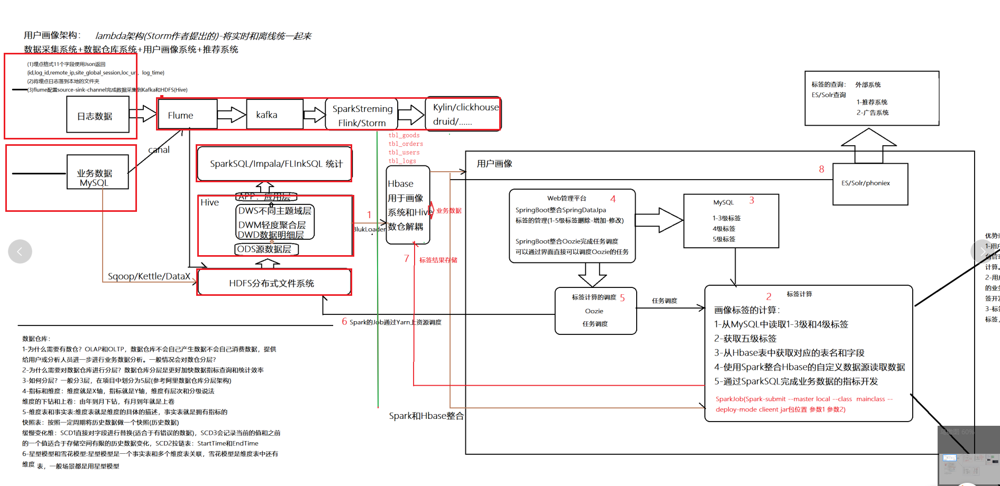
* 规则匹配类标签
* 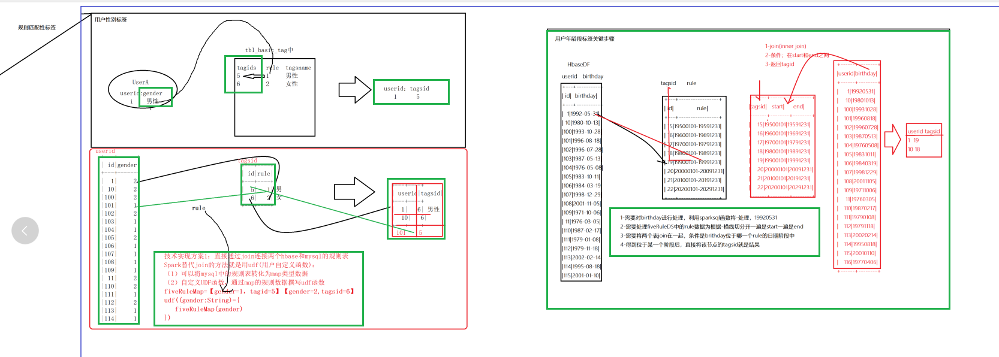
* 统计类标签
* 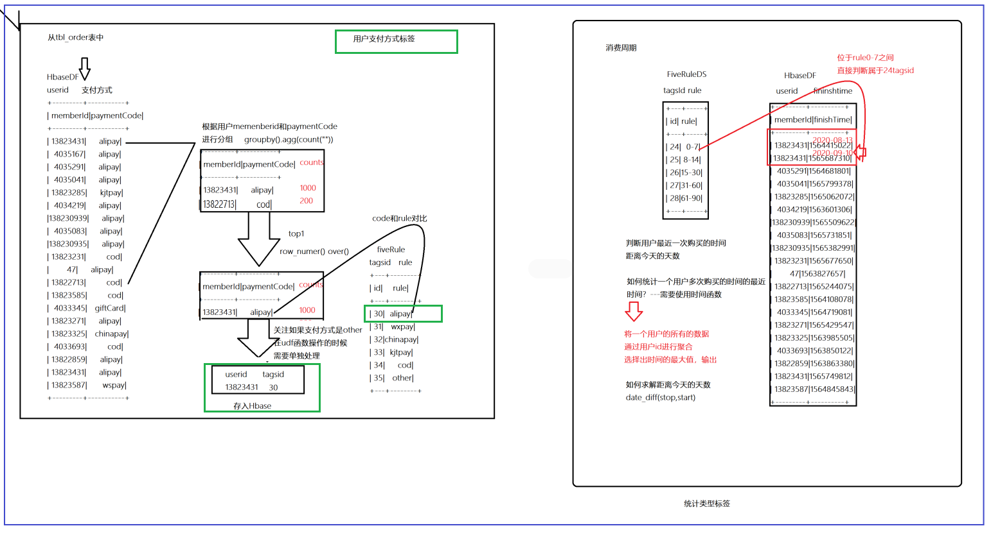
* 挖掘类标签
* 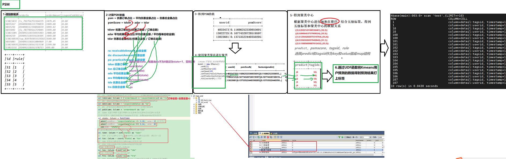

## 6-ALS初步(推荐算法)

* 一个用户利用一个算法推荐一个商品，如果一个商品被推荐的得分较高应该推荐
* **userid，itemid，rating**
* 隐式反馈：没有明确的评分但是有点击、浏览、收藏等评分
* 显示反馈：有一定的评分，五星好评
* 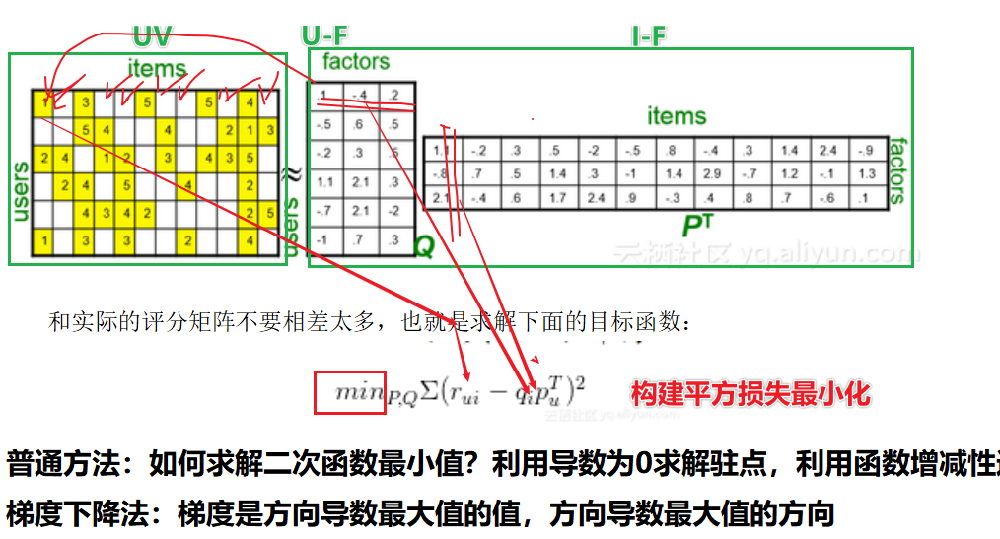
* 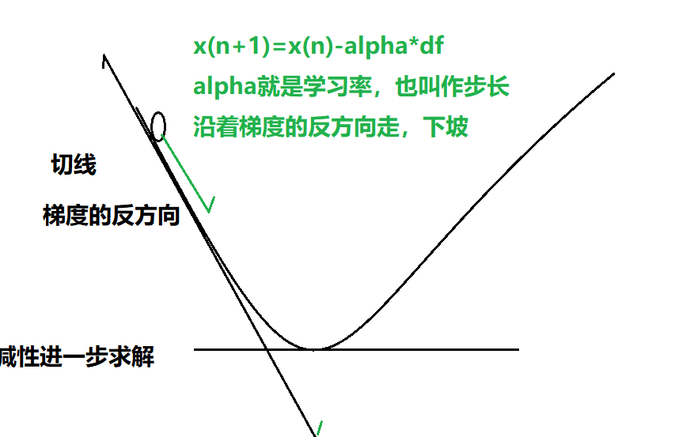
* 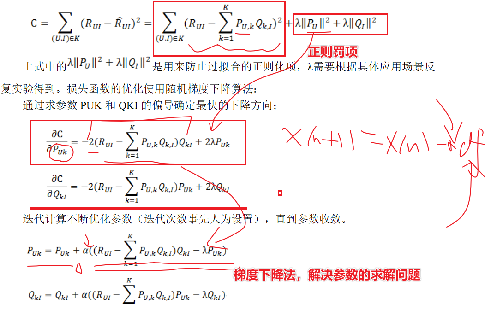
* ALS算法是在LFM的基础上做了改进--使用交替最小二乘法求解参数最优解
  * 最小二乘法
    * 求解平方损失函数的最优解的过程就称之为最小二乘法(高二的回归方程中解决)
    * 思路：先对变量进行求解导数，利用导数为0求解驻点，利用驻点求解损失函数，直到损失函数最小
  * 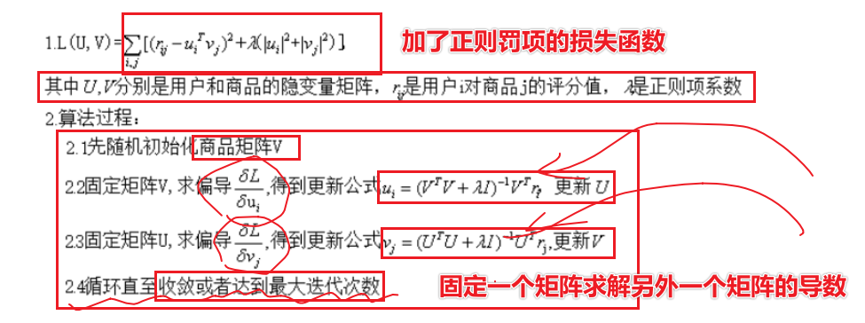
  * ALS算法核心步骤就是：
    * 通过固定一个矩阵求解关于另外一个矩阵的导数
    * UV=U-Factor和V-Factor矩阵
    * 固定U矩阵，求解关于V矩阵的导数，利用UV和原来的rating平方损失计算
    * 如果损失函数能够达到较低的值就停止计算
    * 否则继续固定U求解关于V的导数，liyongUV和原来的rating平方损失计算
  * 更详细步骤
    * 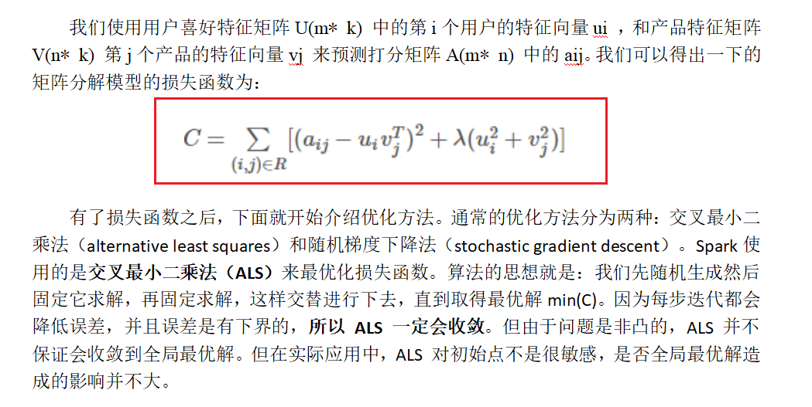
    * 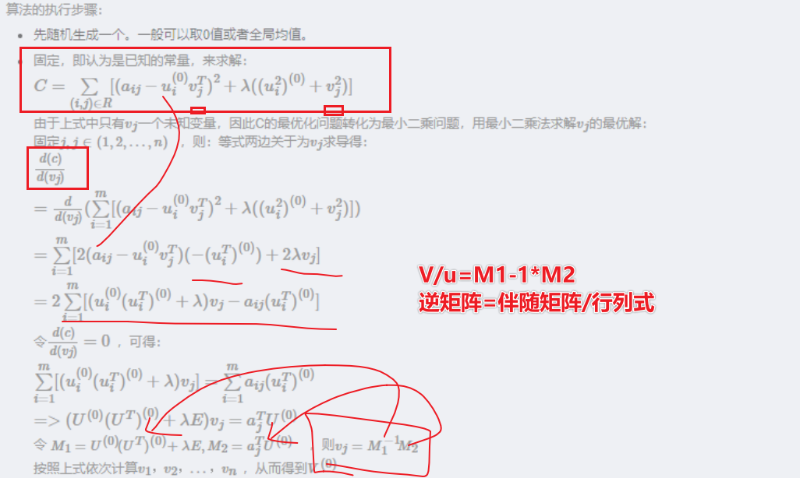
  * **记住：ALS就是固定U矩阵求解关于V矩阵的导数在使用平方损失拟合，固定V矩阵求解U矩阵导数求解平方损失拟合**

## 7-SparkMllib如何实现ALS算法原理及实战

* SparkMllib的ALS算法

* ALS交替最小二乘法&参数-超参数

* 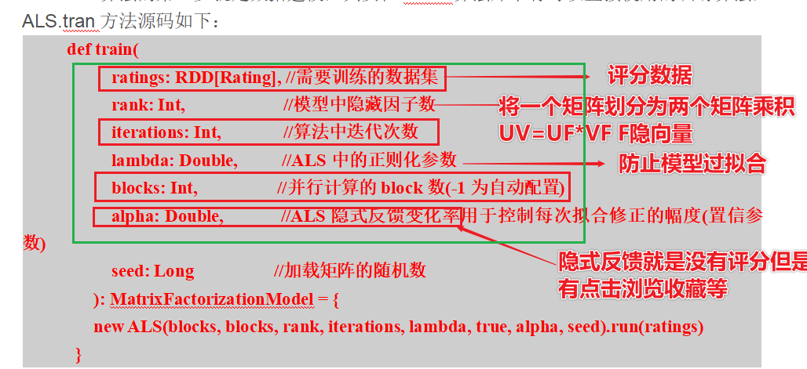

* 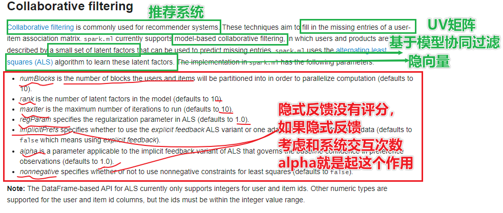

* 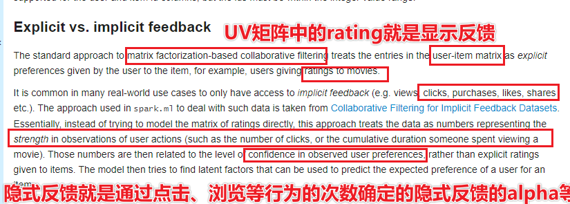

* 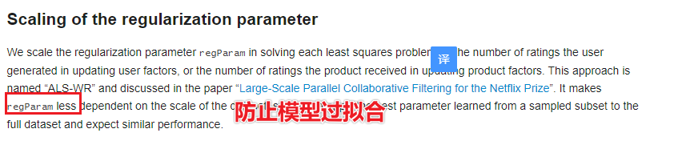

* 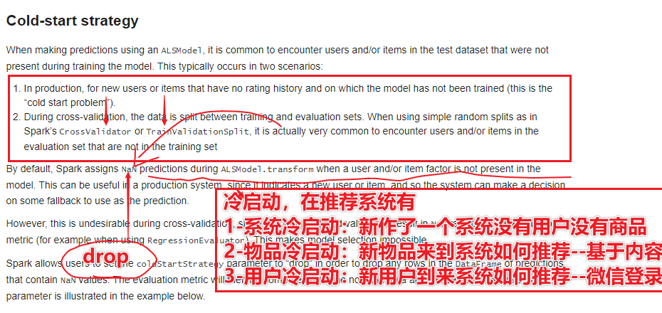

* 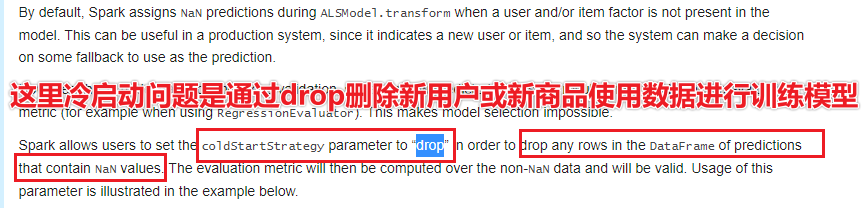

* ```scala
  package cn.itcast.Recommend
  
  import org.apache.spark.ml.evaluation.RegressionEvaluator
  import org.apache.spark.ml.recommendation.{ALS, ALSModel}
  import org.apache.spark.rdd.RDD
  import org.apache.spark.sql.{DataFrame, Dataset, Row, SparkSession}
  import org.apache.spark.{SparkConf, SparkContext}
  
  /**
   * DESC:ALS算法预测过程
   * 1-准备Spark的环境
   * 2-读取数据
   * 3-查看数据的基本类型
   * 4-特征工程
   * 5-模型训练
   * 6-模型预测
   * 7-模型校验
   * 8-模型保存
   */
  case class RatingTest(userid: Double, itemid: Double, ranting: Double)
  
  object ALSModel {
    def main(args: Array[String]): Unit = {
      //1-准备Spark的环境
      val conf: SparkConf = new SparkConf().setAppName(this.getClass.getSimpleName.stripSuffix("$")).setMaster("local[*]")
      val spark: SparkSession = SparkSession.builder().config(conf).getOrCreate()
      val sc: SparkContext = spark.sparkContext
      sc.setLogLevel("WARN")
      import spark.implicits._
      //2-读取数据
      val path = "D:\\BigData\\Workspace\\spark_learaning_2.11\\spark-study-gz-day01_2.11\\src\\main\\resources\\data\\sample_movielens_data.txt"
      val dataInfo: RDD[Array[String]] = sc.textFile(path).map(_.split("::"))
      val ratingDF: DataFrame = dataInfo.map(rating => RatingTest(rating(0).toDouble, rating(1).toDouble, rating(2).toDouble)).toDF()
      //3-查看数据的基本类型
      ratingDF.show()
      ratingDF.printSchema()
      //root
      //|-- userid: double (nullable = false)
      //|-- itemid: double (nullable = false)
      //|-- ranting: double (nullable = false)
      //4-特征工程
      val array: Array[Dataset[Row]] = ratingDF.randomSplit(Array(0.7, 0.3), seed = 123L)
      val trainingSet: Dataset[Row] = array(0)
      val testSet: Dataset[Row] = array(1)
      //5-模型训练
      val als: ALS = new ALS()
        .setUserCol("userid")
        .setItemCol("itemid")
        .setRatingCol("ranting")
        .setRank(100)
        .setRegParam(0.001)//设置防止模型过拟合的参数，正则阿法向
          //setImplicitPrefs(true)
          //setAlpha(0.01)
        .setColdStartStrategy("drop")
        .setPredictionCol("prediction")
      val model: ALSModel = als.fit(trainingSet)
      //6-模型预测
      val y_pred_train: DataFrame = model.transform(trainingSet)
      val y_pred_test: DataFrame = model.transform(testSet)
      y_pred_train.show()
      //7-模型校验
      val evaluator: RegressionEvaluator = new RegressionEvaluator().setMetricName("r2").setLabelCol("ranting").setPredictionCol("prediction")
      val r2_train: Double = evaluator.evaluate(y_pred_train)
      val r2_test: Double = evaluator.evaluate(y_pred_test)
      println("model in train r2 score is【0,1】", r2_train)
      println("model in test r2 score is【0,1】", r2_test)
      //8-模型保存
      //    model.save()
    }
  }
  ```

* 结果

* ```scala
  +------+------+-------+----------+
  |userid|itemid|ranting|prediction|
  +------+------+-------+----------+
  |  26.0|  31.0|    1.0|0.99720234|
  |  12.0|  31.0|    4.0| 3.9962132|
  |  13.0|  31.0|    1.0| 0.9990707|
  |   5.0|  31.0|    1.0|0.99860287|
  |   4.0|  31.0|    1.0|0.99925864|
  |   8.0|  31.0|    3.0| 2.9989629|
  |   7.0|  31.0|    3.0|  2.996284|
  |  25.0|  31.0|    2.0| 1.9982595|
  |  24.0|  31.0|    1.0| 1.0010235|
  |  29.0|  31.0|    1.0| 0.9997276|
  |  14.0|  31.0|    3.0|  2.997733|
  |  18.0|  31.0|    1.0| 1.0005124|
  |  28.0|  85.0|    1.0| 0.9999805|
  |  26.0|  85.0|    1.0| 1.0009707|
  |  12.0|  85.0|    1.0| 0.9987558|
  |   1.0|  85.0|    3.0| 2.9983764|
  |   6.0|  85.0|    3.0| 3.0013342|
  |  16.0|  85.0|    5.0|  4.996045|
  |  20.0|  85.0|    2.0| 1.9983408|
  |   4.0|  85.0|    1.0| 0.9989586|
  +------+------+-------+----------+
  only showing top 20 rows
  
  (model in train r2 score is【0,1】,0.9999949139795586)
  (model in test r2 score is【0,1】,-1.978495894496867)
  ```

* 结束

* 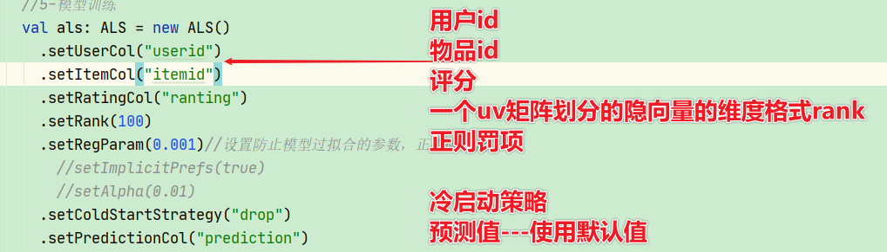

* 补充最小二乘法

* 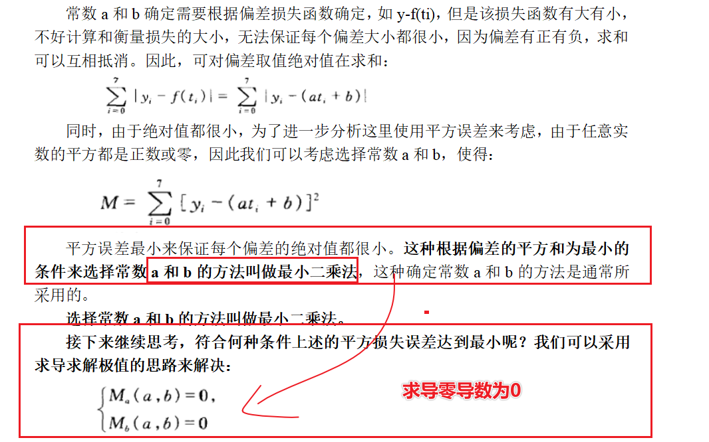

## 8-用户购物偏好模型(推荐)

### 8-1标签含义

* 通过用户对商品的评价评分等给用户打上喜欢某种商品的标签
* userid-itemid(评分如何)
* hbase中就是userid和itemid的组合
* 利用用户和商品的数据，数据源来源与tbl_logs表中访问那个url中
* 四级和五级标签的是如何的
* 四级标签：用户购物偏好模型
* 五级标签：用户的购物偏好为：喜欢什么样的商品，商品的列表
* 如何使用技术实现？
  * 这里使用Spark结合Hbase自定义数据源将四级标签和五级标签
  * 将业务数据得到之后进行标签的打法
  * 利用ALS的算法，将一个用户打上合适的标签tagsid
* 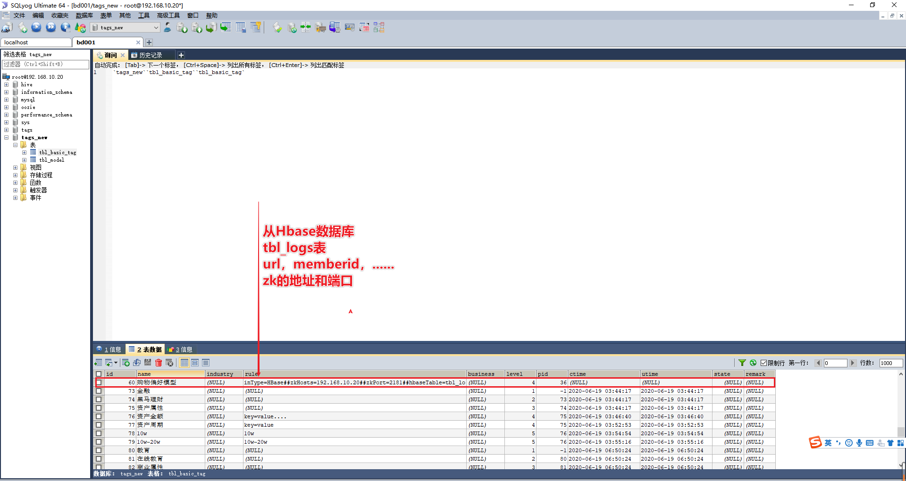
* 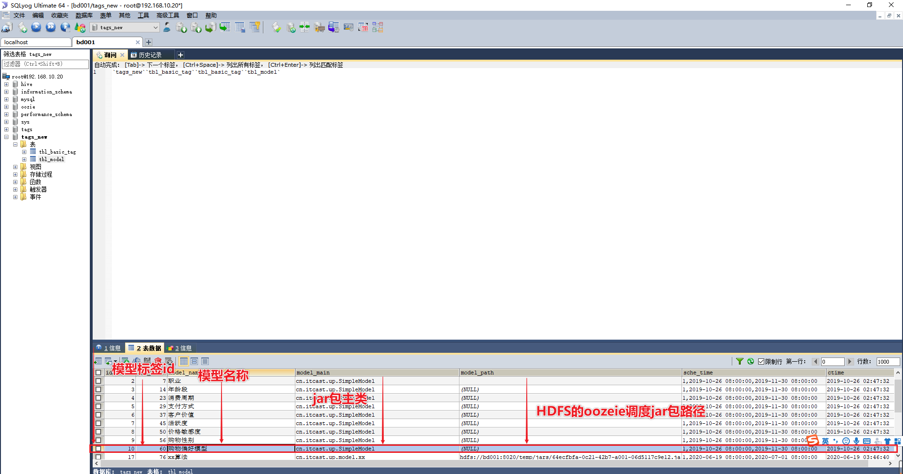

### 8-2标签创建

* 购物偏好标签创建
* 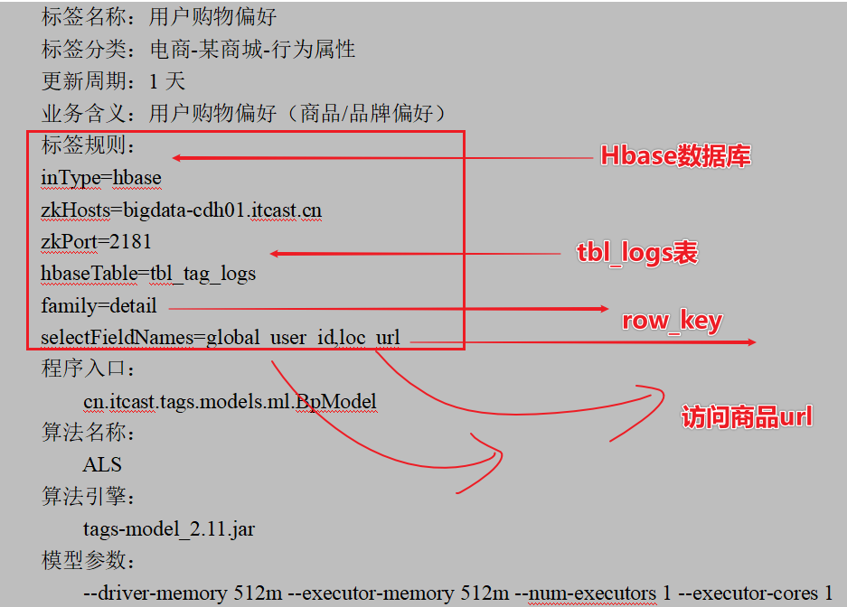
* userid-itemid-rating
* 目前只有两个字段：userid，url
* **如何去利用url求解有哪些itemid和rating？**
  * 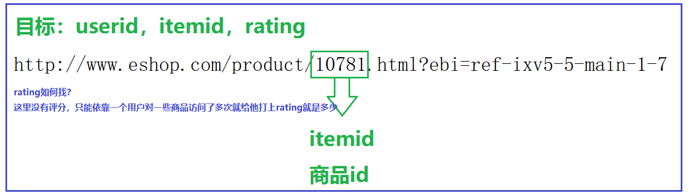
* **ALS算法给定必要的参数训练模型给出结果**

### 8-3标签分析

* 1-继承BaseModel实现其中的compute方法和getTagIds

* 2-得到HabseDF(tbl_logs数据的userid和url两个数据)，fiveDS

* 3-实现compute中从tbl_logs的url中得到itemid

* 4-根据一个用户访问的一个商品出现的次数统计rating得分

* 5-具备了userid-itemid-rating的三个参数，

* 6-调用ALS的算法，结合用户的提供userid=itemid=rating预测用户对物品的评分

* 7-model.transform得到预测值之后需要使用五级标签对应

* ```
  model.recommendForAllUsers(5)/
  ```

* 8-得到的结果**usrrid-productIds(产品的列表)**

* ```
  //|28    |[[92,4.9979935], [12,4.9969754], [81,4.9952865], [2,4.002075], [82,3.9997685]]  |
  ```

  **userid,prodcutsIds**

  **28 92,12,81,2,82**

* 9-保存hbase中

* 注意：当前的算法中是没有五级标签的，为什么，因为这里是一个用户会得到推荐商品的所有的商品的列表，不需要制定五级标签

### 8-4标签代码

* 代码

* ```scala
  package cn.itcast.up.ml.gzmltag
  
  import cn.itcast.up.base.BaseModelPo7
  import cn.itcast.up.common.HDFSUtils
  import org.apache.spark.ml.evaluation.RegressionEvaluator
  import org.apache.spark.ml.recommendation.{ALS, ALSModel}
  import org.apache.spark.sql.expressions.UserDefinedFunction
  import org.apache.spark.sql.types.DoubleType
  import org.apache.spark.sql.{DataFrame, Dataset, Row}
  
  /**
   * DESC:
   * 1-继承BaseModel实现其中的compute方法和getTagIds
   * 2-得到HabseDF(tbl_logs数据的userid和url两个数据)，fiveDS
   * 3-实现compute中从tbl_logs的url中得到itemid
   * 4-根据一个用户访问的一个商品出现的次数统计rating得分
   * 5-具备了userid-itemid-rating的三个参数，
   * 6-调用ALS的算法，结合用户的提供userid=itemid=rating预测用户对物品的评分
   * 7-model.transform得到预测值之后需要使用五级标签对应
   * del.recommendForAllUsers(5)/
   * 8-得到的结果**usrrid-productIds(产品的列表)**
   * 28    |[[92,4.9979935], [12,4.9969754], [81,4.9952865], [2,4.0020]]
   * userid,prodcutsIds**
   * 9-保存hbase中
   * 注意：当前的算法中是没有五级标签的，为什么，因为这里是一个用户会得到推荐商品的所有的商品的列表，不需要制定五级标签
   */
  object BPModel extends BaseModelPo7 {
    def main(args: Array[String]): Unit = {
      execute()
    }
  
    override def getId(): Long = 60
  
    override def compute(hbaseDF: DataFrame, fiveRuleDS: Dataset[Row]): DataFrame = {
      import spark.implicits._
      import org.apache.spark.sql.functions._
      // 1-继承BaseModel实现其中的compute方法和getTagIds
      println("==================1-habseDF===================")
      // hbaseDF.show(false)
      //+--------------+------------------------------------------------------------------------------------------------------------------------------+-------------------+
      //|global_user_id|loc_url                                                                                                                       |log_time           |
      //+--------------+------------------------------------------------------------------------------------------------------------------------------+-------------------+
      //|424           |http://www.eshop.com/product/11013.html?ebi=ref-se-1-1                                                                |2019-08-13 03:03:55|
      println("==================2-没有五级标签-只需要将数据以userid和items写入即可===================")
      //fiveRuleDS.show()
      //+---+----+
      //| id|rule|
      //+---+----+
      //+---+----+
      // 2-得到HabseDF(tbl_logs数据的userid和url两个数据)，fiveDS
      println("==================3-计算itemid===================")
      // 使用Spark那个函数可以将11013的productid选择出来
      val urlToItemId: UserDefinedFunction = spark.udf.register("urlToItemId", (url: String) => {
        var itemid: String = null
        if (url.contains("/product/") && url.contains(".html")) {
          ///product/11013.html
          //Returns the index within this string of the first occurrence of the specified substring.
          val start: Int = url.indexOf("/product/")
          val end: Int = url.indexOf(".html")
          if (end > start) {
            itemid = url.substring(start + 9, end)
          }
        }
        itemid
      })
      //注意这的 urlToItemId('loc_url)必须是hbasedf中存在的schema
      // 3-实现compute中从tbl_logs的url中得到itemid
      val tempDF: DataFrame = hbaseDF.select('global_user_id.as("userid"), urlToItemId('loc_url).as("itemid"))
        .filter('itemid.isNotNull)
      //tempDF.show()
      //tempDF.printSchema()
      //+------+------+
      //|userid|itemid|
      //+------+------+
      //|    81| 11013|
      //|   767| 11813|
      //|   302|  5353|
      //|   370|  9221|
      //|   405|  4167|
      // 4-根据一个用户访问的一个商品出现的次数统计rating得分
      println("==================4-计算rating===================")
      val tempDF2: DataFrame = tempDF
        .groupBy("userid", "itemid")
        .agg(count("itemid").as("rating"))
      //tempDF2.show()
      //tempDF2.printSchema()
      //|userid|itemid|rating|
      // +------+------+-------------+
      //|   533| 11455|            1|
      //|   322| 11949|            1|
      //|   258|  7467|            1|
      //|   558| 10937|            1|
      //|   555| 10333|            1|
      //'root
      //|-- userid: string (nullable = true)
      //|-- itemid: string (nullable = true)
      //|-- rating: long (nullable = false)'
      val tempDF3: DataFrame = tempDF2.select('userid.cast(DoubleType), 'itemid.cast("double"), 'rating.cast("double"))
      // 5-具备了userid-itemid-rating的三个参数，
      println("==================5-得到userid,itemid,rating的非空值===================")
      val tempDF4: Dataset[Row] = tempDF3.select('userid, 'itemid, 'rating)
        .where('userid.isNotNull && 'itemid.isNotNull && 'rating.isNotNull)
      //tempDF4.show()
      val array: Array[Dataset[Row]] = tempDF4.randomSplit(Array(0.8, 0.2), seed = 124L)
      val trainingSet: Dataset[Row] = array(0)
      val testSet: Dataset[Row] = array(1)
      // 6-调用ALS的算法，结合用户的提供userid=itemid=rating预测用户对物品的评分
      println("==================6-准备算法===================")
      val path = "/model/BPModelScore"
      var model: ALSModel = null
      if (HDFSUtils.getInstance().exists(path)) {
        println("model exists ,please load it............")
        model = ALSModel.load(path)
      } else {
        println("model not exists ,please fit it............")
        val als: ALS = new ALS()
          .setRank(10)
          .setRegParam(0.001)
          .setUserCol("userid")
          .setItemCol("itemid")
          .setRatingCol("rating")
          .setColdStartStrategy("drop")
          .setPredictionCol("prediction")
        //.setMaxIter(100)
        model = als.fit(trainingSet)
        model.save(path)
      }
      // 7-model.transform得到预测值之后需要使用五级标签对应
      println("==================7-模型预测===================")
      val y_pred_train: DataFrame = model.transform(trainingSet)
      val y_pred_test: DataFrame = model.transform(testSet)
      val evaluator: RegressionEvaluator = new RegressionEvaluator()
        .setMetricName("r2")
        .setLabelCol("rating")
        .setPredictionCol("prediction")
      val r2_training: Double = evaluator.evaluate(y_pred_train)
      val r2_test: Double = evaluator.evaluate(y_pred_test)
      //println("r2 score in trainingSet score is:", r2_training)
      //println("r2 score in testSet score is:", r2_test)
      //==================7-模型预测===================
      //(r2 score in trainingSet score is:,0.7279236635027212)
      //(r2 score in testSet score is:,-0.6222111012579528)
      println("==================8-模型推荐===================")
      //odel.recommendForAllUsers(5)/
      val allDF: DataFrame = model.recommendForAllUsers(5)
      /*allDF.show(false)
      allDF.printSchema()
      array (nullable = true)
      |    |-- element: struct (containsNull = true)
      |    |    |-- itemid: integer (nullable = true)
      |    |    |-- rating: float (nullable = true)*/
      // 8-得到的结果**usrrid-productIds(产品的列表)**
      println("==================9-模型推荐结果整合===================")
      // userid itemmid rating
      // |28|[[92,4.9979935], [12,4.9969754], [81,4.9952865], [2,4.002075], [82,3.9997685]]  |
      //userid,prodcutsIds
      //[(用户id,Array[(商品id,预测评分)])]
      val newDF = allDF.as[(Int, Array[(Int, Double)])].map(row => {
        val userid: Int = row._1
        val itemsid: Array[Int] = row._2.map(_._1)
        val itemidStr: String = itemsid.mkString(",")//这一步的意思是将array转化为string类型，因为只有string类型才能存储到自定义hbase的test表中
        (userid, itemidStr)
      }).toDF("userid", "tagsid")
      newDF.show()
      newDF.printSchema()
      /*+------+--------------------+
        |userId|              tagsId|
        +------+--------------------+
        |   471|[4492, 6603, 9371...|
        root
        |-- userId: integer (nullable = false)
        |-- tagsId: array (nullable = true)
        |    |-- element: integer (containsNull = false)*/
      //allDF.select('userid,recommendationsToLabel('recommendations).as("tagsid"))
      // 9-保存hbase中
      //newDF
      // 注意：当前的算法中是没有五级标签的，为什么，因为这里是一个用户会得到推荐商品的所有的商品的列表，不需要制定五级标签
      null
    }
  }
  ```

* 结果

* 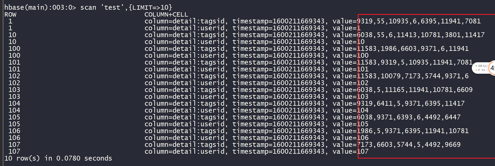

* 1-整理数据为userid-tagsid和rating评分数据

* 2-使用als算法训练回归模型

* 3-使用regreesionEvaluator校验

* 4-使用recommendAllUsers进行推荐

* 5-需要对推荐的结果进行转化，首先获取array在转化为string类型

* 6-存储在Hbase中

## 9-总结

**重点比较reduceByKey和groupByKey:**

**相同点：**
1,都作用于 RDD[K,V]
2，都是根据key来分组聚合
3， 默认，分区的数量都是不变的，但是都可以通过参数来指定分区数量

**不同点：**
1， groupByKey默认没有聚合函数，得到的返回值类型是RDD[ k,Iterable[V]]
2， reduceByKey 必须传聚合函数 得到的返回值类型 RDD[(K,聚合后的V)]
3， groupByKey().map() = reduceByKey

**最重要的区别：**
reduceByKey 会进行分区内聚合，然后再进行网络传输
groupByKey 不会进行局部聚合

**结论：**
如果这两个算子，都可以使用， **优先使用reduceByKey**

* **PSM实战**

  * 价格敏感度模型

* **PSM优化**

  * 可以将已经训练好的模型进行存储
  * 在进行预测

* **画像架构整理梳理**

* ALS算法了解

  * 交替最小二乘法
  * 最小二乘法--解决回归问题的方法

* ALS算法代码流程(了解)

  * 1-继承BaseModel实现其中的compute方法和getTagIds

  * 2-得到HabseDF(tbl_logs数据的userid和url两个数据)，fiveDS

  * 3-实现compute中从tbl_logs的url中得到itemid

  * 4-根据一个用户访问的一个商品出现的次数统计rating得分

  * 5-具备了userid-itemid-rating的三个参数，

  * 6-调用ALS的算法，结合用户的提供userid=itemid=rating预测用户对物品的评分

  * 7-model.transform得到预测值之后需要使用五级标签对应

  * ```
    model.recommendForAllUsers(5)/
    ```

  * 8-得到的结果**usrrid-productIds(产品的列表)**

  * ```
    //|28    |[[92,4.9979935], [12,4.9969754], [81,4.9952865], [2,4.002075], [82,3.9997685]]  |
    ```

    **userid,prodcutsIds**

    **28 92,12,81,2,82**

  * 9-保存hbase中

* 面试题的解释